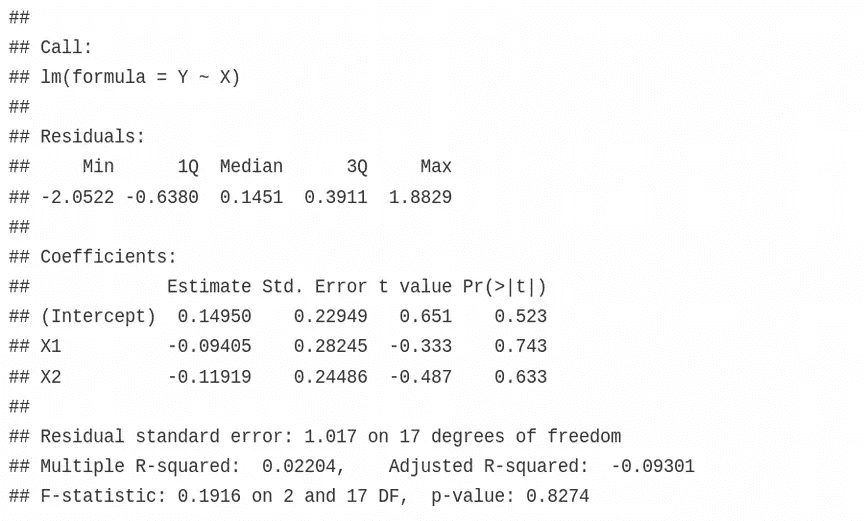
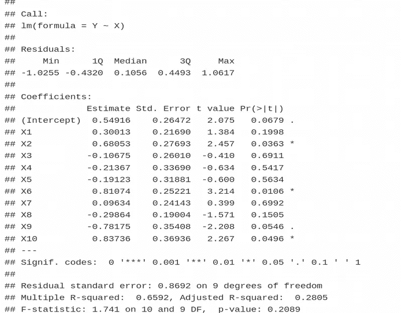
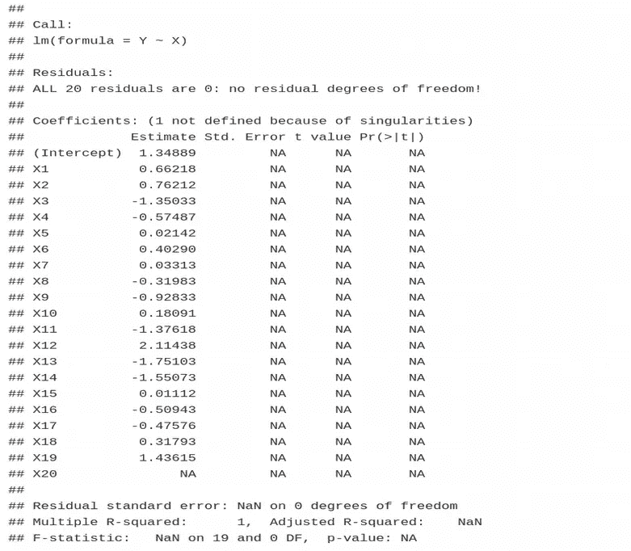
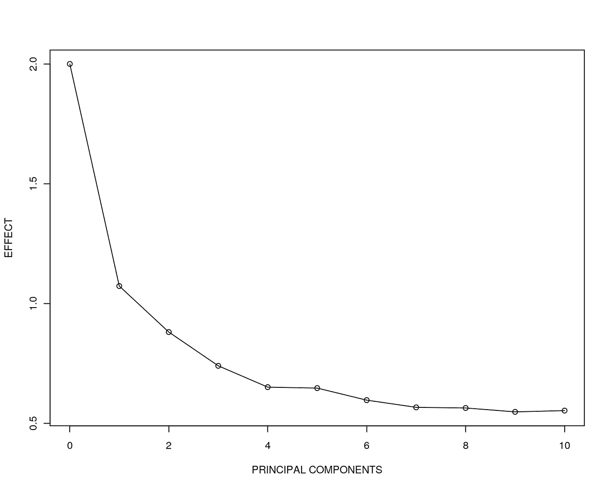
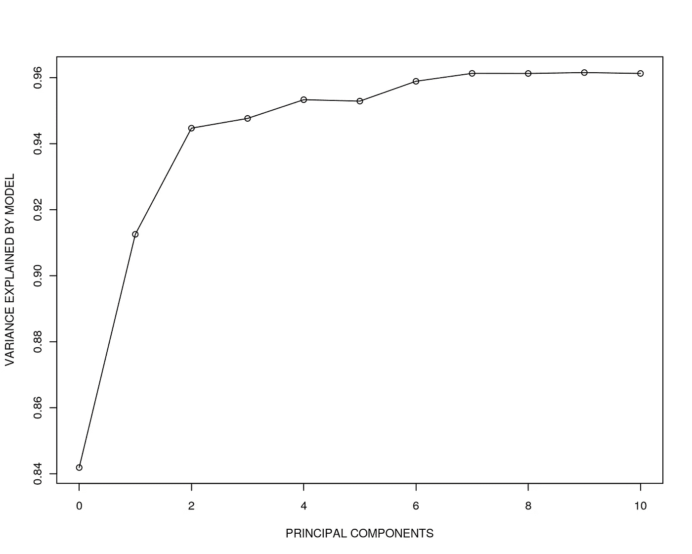
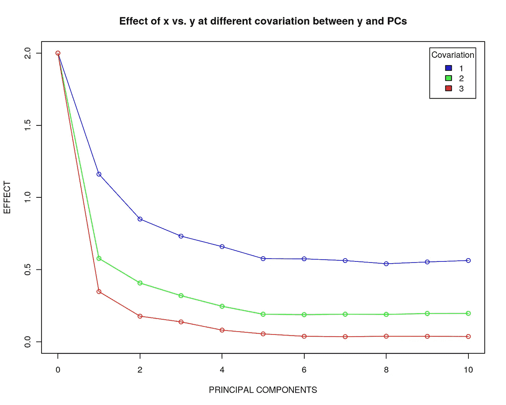

# 高维空间中没有真正的效果

> 原文：<https://towardsdatascience.com/no-true-effects-in-high-dimensions-1f56360182cd?source=collection_archive---------10----------------------->

## [生命科学的数理统计和机器学习](https://towardsdatascience.com/tagged/stats-ml-life-sciences)

## 我们能相信从高维数据中得到的结果吗？

[Image source](https://gateway.newton.ac.uk/event/tgmw46)

这是 [**生命科学的数理统计与机器学习**](https://towardsdatascience.com/tagged/stats-ml-life-sciences?source=post_page---------------------------) 栏目的第五篇文章。在本专栏中，我将介绍我们在[生命科学](https://en.wikipedia.org/wiki/List_of_life_sciences)中面临的数据和分析挑战，如**生物医学、生物信息学、细胞生物学、遗传学、进化生物学**等。也许主要的分析挑战是处理**高维数据**，对这一事实的不当解释可能会导致错误的结论，这对医疗保健中的患者安全尤其有害。

在这篇文章中，我将展示当增加数据的维度时，分析模型如何不能重建变量之间的真实关系。

# 高维多变量分析

考虑一个简单的线性模型 **Y ~ X** ，其中 Y 是**响应**，X 是解释变量(**预测值**)。Y 可以是**表型向量**，例如 n 个个体/样本中每一个的疾病状态(患病/健康)，而 X 是具有 **n 个样本**和 **p 个特征/维度的矩阵。**为简单起见，X 和 Y 均取自正态分布。假设低维情况 n > > p:

结果看起来不错，Y 和 X 变量不像预期的那样相关，因为它们来自正态分布。只要 n > p，数学工作没有问题。现在让我们增加特征/维度 p 的数量，看看会发生什么。

发生了什么事？我们可以看到，X 中的一些特征，即 X2、X6、X9、X10，开始与 Y 显著相关**。看看调整后的 R 平方，它是 X 解释的 Y 方差的分数，**我们现在解释 Y 方差的 28%** ，尽管 **Y 和 X 不应该相关**，因为它们是从正态分布中独立采样的。好了，如果特征数 p 等于样本数 n，会发生什么？**

有意思！当 **p = n** 时，r 拒绝计算多元线性模型，尽管我们只有 20 维。我们在这里观察到的效果被称为**过拟合**，这可以被认为是 [**维度诅咒**](https://en.wikipedia.org/wiki/Curse_of_dimensionality) 的一种表现形式。过度拟合意味着我们不能使用我们想要的那么多的拟合参数，而是应该基于一些附加的标准来选择它们的**最佳数量**，例如[**【AIC】**](https://en.wikipedia.org/wiki/Akaike_information_criterion)【阿卡科信息标准】，或者执行**交叉验证**，因为预测器的数量实质上是多元线性模型的**超参数**。

所以我们对 R 抛出了一个“奇点”误差，对于仅仅 20 个维度来说，事实上我们通常有**数万个****(**[**RNA seq**](https://en.wikipedia.org/wiki/RNA-Seq)**)****甚至数百万个** **(** [**基因组学**](https://en.wikipedia.org/wiki/DNA_sequencing) **，****甲基化** **)** 个维度在这是生命科学中多变量分析的主要障碍，也是为什么**单变量特征选择** **(** [**关联研究**](https://en.wikipedia.org/wiki/Genome-wide_association_study) **、差异基因表达、差异甲基化)**通常优于多变量特征选择的一个原因，尽管后者的预测能力更高。典型生物设置**n<p**的另一个结果是，必须用套索/脊/弹性网预选信息特征，并进行降维。

# 对协变量进行调整隐藏了真实的影响

现在想象 X 不是一个矩阵而是一个向量，例如一个[基因型](https://en.wikipedia.org/wiki/Genotype)的向量，所以我们正在进行一项关联研究，表型 Y 与基因型 X。我经常观察到试图解释可能**混淆**这种关联的其他因素(**协变量**)。事实上，如果个体来自不同的人类群体，如非洲人、欧洲人、亚洲人，这种异质性可以解释表型 Y 中的显著百分比变异，而我们感兴趣的是由基因型解释的表型变异**，换句话说，群体异质性是一个**混杂因素**，应在模型 Y~X 中进行调整。通常，对所有可用的遗传变异体进行**主成分分析(PCA)** ，并选择少量 PC 作为关联的协变量:Y~X + PC1 +在这种情况下，协变量的数量是根据常识任意选择的，而在这里，我想证明这个数量对于恢复表现型与基因型关联的真实效果可能是至关重要的。**

让我们模拟 X 和 Y 之间的一个线性关系: **Y=2*X +噪声**。假设我们有一个线性模型 Y~X，让我们针对逐渐增加的与 Y 稍微相关的 PCs 数量来调整这个模型，即 PC1=0.9*Y，PC2=0.8*Y 等等。：

我们在此观察到，当添加与 Y 相关的 PCs 时，Y 和 X 之间关联的真实效应 2 变得越来越难以恢复。尽管我们仍有 n>p，但当添加 10 个 PCs 时，恢复的效应约为 0.5，这与真实效应 2 相差甚远。此外，我们观察到调整后的 R 平方(**方差解释**)几乎达到 1，这意味着我们通过仅包括 10 个协变量来解释 Y **中的所有方差。**

在上面的代码中，请注意(1-i/10)前面的系数 1。我们称之为 Y 和 PCs 之间的**协变系数**。我们刚刚看到，对于协变=1 的情况，真实效应 2 可能被错误地计算为 0.5。如果我们增加 Y 和 PCs 之间的协变，即协变=2 和 3，现在会发生什么？

我们观察到，Y 与协变量 PCs 越相关，就越难重建真实的效果。当协变=3 时，重构的效应基本上是**零**，这意味着 Y 和 X 之间没有关联，尽管**我们已经将该效应模拟为 2** 。因此，尽管**可以从生物学角度**调整 covarites 的线性模型，但这应该**谨慎执行**，因为由于维数灾难，数学可能无法忍受。

# 摘要

在本文中，我们已经了解到，由于维数灾难，当特征/维度的数量接近样本的数量时,**多元分析会爆炸。此外，进行关联研究时，您应该特别注意线性模型调整的协变量的数量。**过多的协变量可能会** **模糊真实效果**并使其无法重建。**

在下面的评论中让我知道生命科学中的哪些分析对你来说似乎特别神秘，我会在这个专栏中尝试回答它们。在媒体[尼古拉·奥斯科尔科夫](https://medium.com/u/8570b484f56c?source=post_page-----1f56360182cd--------------------------------)关注我，在 Twitter @尼古拉·奥斯科尔科夫关注我，在 [Linkedin](http://linkedin.com/in/nikolay-oskolkov-abb321186?source=post_page---------------------------) 关注我。下次我们将比较**单变量与多变量特征选择**，敬请关注。