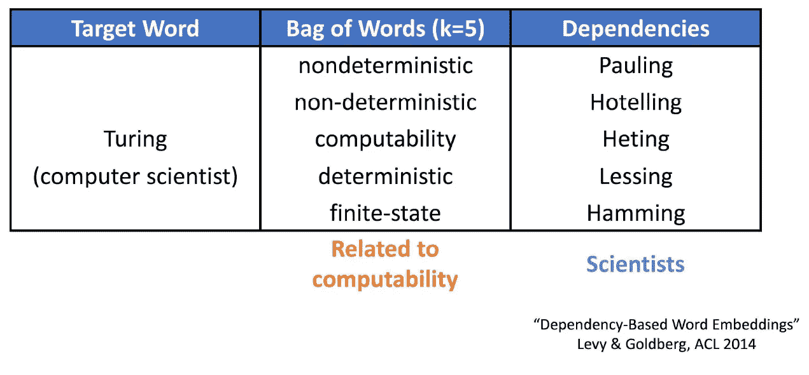
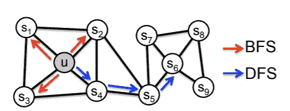

# Node2Vec —图节点嵌入方法

> 原文：<https://towardsdatascience.com/node2vec-graph-embedding-method-f306ac87004e?source=collection_archive---------9----------------------->

***简介***

图形是用连接来表示信息的常见数据结构。例如，蛋白质-蛋白质相互作用，其中节点表示蛋白质，边表示一对蛋白质之间的生物相互作用。另一个例子是脸书网络，其中节点是用户，边是用户之间的连接。

如果我们想使用深度学习方法对那些图表进行预测，我们需要一种方法将它们转换成实数的 *d* 维向量。因此，我们使用图嵌入，这是一种低维表示，有助于更好地概括输入数据。

在 Node2Vec [1]中，我们的目标是保持节点的网络邻域，因此我们的目标是找到作为实向量的图的表示，其中邻域之间具有小的欧几里德距离，同时表示节点结构。

Graph Embedding — Representation Learning on Networks, snap.stanford.edu/proj/embeddings-www

***Word2Vec***

为了理解 Node2Vec 的概念，我们首先需要了解 Word2Vec 是如何工作的。有几种方法可以产生单词嵌入，它是单词的浓缩表示。在 Word2Vec SGNS- skip-gram(上下文表示)负采样(训练方法)中，我们基于单词预测上下文。我们希望在上下文中有正确单词的概率高，而在上下文中有随机单词的概率低。例如:

(The，baby，is，**微笑**，at，her，mom)——我们会给预测上下文“baby _ _，at，her，mom”
(The，baby，is，**飞翔**，at，her，mom)——我们会给预测上下文“baby _ _，at，her，mom”

我们如何构建元组作为算法的输入？
这是一个非常重要的问题。我们构造学习嵌入的样本的方式影响嵌入空间。例如使用目标词周围的小窗口的实词(CBOW)将强调主题的相似性[2]。其中，使用通过依存边缘连接到目标单词的内容单词将强调单词功能之间的相似性。

functional vs topical similarities [2]

如果我们把句子看作图表，节点就是单词，边定义了我们如何在单词之间行走。在第一种情况下，我们假设一个句子是一个有向图，其中每个节点(单词)通过边连接到它的右边邻居。在第二种情况下，我们使用依赖解析器来创建定义边的有向图。

dependency parser from spaCy package

***Node2Vec***

现在让我们回到 Node2Vec，我们想找到一种方法来创建这些元组。同样，我们构建元组的方式会影响图的嵌入。我们的目标是保存邻域和结构，因此我们需要一种兼容的方式来探索图形。我们使用二阶随机游走来采样在 BFS 和 DPS 之间、在探索邻居和探索其他邻居之间、在微观和宏观之间权衡的图。

BFS vs DFS [1]

通过使用超参数 p 和 q 来计算非规格化跃迁概率来实现折衷。
p —回报率
q —探索率
假设我们从 *t* 走到 *v* 现在我们需要决定探索哪个节点 *x_i* 。我们计算 *t* 和可能的 *x_i* 节点之间的边数。
如果距离为零(意味着它是 *t* 本身)，我们将原始边权重乘以 1/p。
如果距离为 1，我们保留原始边权重。
如果距离为 2，我们将边权重乘以 1/q。
我们稍后将编辑后的边权重归一化以获得概率值。

请注意，低 p / q 导致高回报概率/勘探概率。

Node2Vec [1]

比如[1]，看 Les Misérables 网络，节点是人物，边代表人物之间的合作。当使用 p= 1 和 q= 0.5 时，我们允许高度探索，并且我们得到基于它们所属的社区组织的聚类(同质性)。当使用 p = 1 和 q = 2 时，我们不鼓励探索，我们根据结构相似性组织聚类。

homophily (top) and structural similarity (bottom) [1]

***结论***

总而言之，图嵌入是有用的。Node2Vec 定义了一种智能的方式来探索图形，从而在表示中体现了同质性和结构等价性。探索允许为经典的 SGNS 算法创建样本，这创建了有用的图嵌入。

***参考文献***

[1] Grover & Leskovec，node2vec:网络的可扩展特征学习
[2] Levy & Goldberg，基于依存关系的单词嵌入