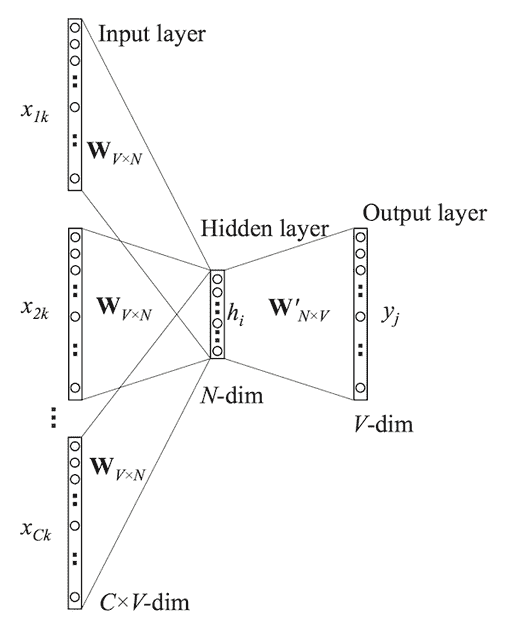
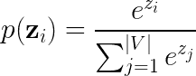
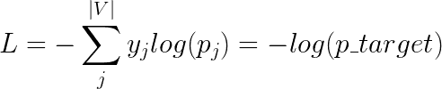
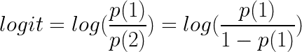
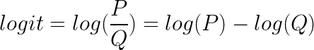
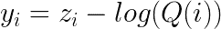
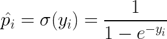
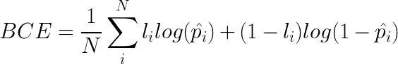

# 噪声对比估计

> 原文：<https://towardsdatascience.com/noise-contrastive-estimation-246446ea9aba?source=collection_archive---------12----------------------->

## 温和的介绍

*本文原载于*[*blog.zakjost.com*](https://blog.zakjost.com/post/nce-intro/)

# 介绍

我最近致力于理解噪声对比估计(NCE)，这是一个艰难的旅程。这篇文章的目的是让其他人更容易通过不太正式，并通过实现的细节工作。在深入了解它如何工作的细节之前，让我们先谈谈它要解决的问题。

# 背景

假设你想学习单词的矢量嵌入来帮助完成自然语言任务。著名的 [word2vec](https://en.wikipedia.org/wiki/Word2vec) 方法做了一些聪明的事情:

1.  以一句话开始:“快速的棕色狐狸跳”
2.  使用一个横跨句子的滑动窗口来创建`(context, target)`对，其中目标是中心词，上下文是周围的词:`([the, brown], quick)`、`([quick, fox], brown)`、`([brown, jumps], fox)`…等等。
3.  使用[查找嵌入层](https://www.tensorflow.org/guide/embedding)将上下文单词转换为向量，并对其进行平均，以获得代表完整上下文的单个输入向量。
4.  使用上下文向量作为具有 Softmax 变换的全连接神经网络层的输入。这导致在给定当前上下文的情况下，你的整个词汇表中的每个单词成为正确目标的概率。
5.  最小化交叉熵损失，其中`label = 1`用于正确的目标单词，而`label = 0`用于所有其他单词。

通过这样做，网络学习单词在句子中出现频率的统计数据。因为嵌入查找表的权重是可学习的，所以它倾向于在嵌入空间中将相似的单词比不相似的单词放得更近。酷毙了。

但是让我们考虑一下上面第 4 步中的计算。你的网络的密集层有一个大小为`(embedding_dim, vocab_dim)`的权重矩阵，它将上下文嵌入转换成数字，帮助你预测每个词汇单词的概率*。这需要两个步骤:1)从密集层的输出中获取每个单词的值(我们将这些值称为 *z_i* ，其中 *i* 索引词汇表中的特定单词)，然后 2)通过使用 Softmax 变换将这些值转换为概率:*

注意，分母需要一个超过整个词汇表大小的总和。如果你有一个巨大的词汇表，那么通过对每个词汇表单词的输出求和来标准化每个训练样本就变得昂贵而缓慢。

在步骤 5 中，我们计算交叉熵损失:

即使损失函数被表示为整个词汇表的总和，唯一非零的项是标签 *y = 1* 的地方；即对应于实际目标单词的术语。问题是每个 *p_i* 项都被同一个分母除尽，而这个分母本身就是整个词汇表的总和。这使得我们的损失函数依赖于网络中的每个输出，这意味着每个网络参数将具有非零梯度，因此需要针对每个训练示例进行更新。

***There has to be a better way!***

## 负采样

解决这个问题的一个想法是:不要把分母中每个不正确词汇的概率相加，只挑选几个。这些被选择的非目标单词被称为*负样本*。所以:按照上面相同的步骤，但是在步骤 4 中，只对目标单词和其他单词的随机样本进行预测，并假设它代表整个词汇。

这显然*不是*给定的正确规范化，因为你没有对绝大多数词汇求和，但这是一个近似值，结果证明效果很好。它还有一个额外的优点，就是你不需要更新每个词汇单词的权重，这可能有数百万个参数，而只需要更新目标单词和负样本的权重。由于这种概率仅使用目标词和几个负样本而不是整个词汇表进行标准化，因此涉及的变量要少得多。因此，渐变/更新的数量从|embed|*|V|到|embed| * |samples + 1|不等。这在直觉上也很有意义。我们真的应该为每个可用句子的每个片段使用/更新单词“zebra”的参数吗？

# 噪声对比估计

NCE 在实现上非常类似于负抽样，但是它增加了一些理论上的牙齿。让我们首先讨论他们是如何构建问题的，然后再讨论实现的调整。

## 通过比较学习

在负采样中，我们用 1 标记真正的目标词，用 0 标记不正确的目标词的随机样本。这有点像训练一个模型来预测，“其中哪些是真实的，哪些是噪声？”NCE 使用逻辑回归模型来直接回答这个问题。

回想一下，LogReg 对输入来自一个类而不是另一个类的对数优势比进行建模:

我们想要一个类来自于*真实*字分布 ***P*** 而不是*噪声*分布 ***Q*** 的对数概率:

这将我们试图了解的数据分布与参考噪声分布进行比较，因此得名*噪声对比*估计。我们不知道真正的分布 ***P*** ，但是我们可以随意指定 ***Q*** 为我们想要的。 ***Q*** 分布是我们用来生成负样本的。例如，也许我们以相等的概率对所有词汇进行采样，或者考虑到一个词在训练数据中的稀有程度。关键是:这取决于我们，这使得计算*log(****Q****)*部分非常简单。

非常清楚地说，我认为值得再看一次 word2vec 网络，并思考如何使用 ***Q*** :

我们使用一个上下文向量作为密集层的输入。但是我们没有计算词汇表中每个单词的输出，而是做了以下事情:从我们指定的分布中随机抽取单词: ***Q*** 。然后只计算真实目标单词和我们从噪声分布中随机采样的单词的网络输出值。如果我们随机抽取 5 个样本，那么我们将只评估 6 个输出(样本+目标)的网络，而忽略其余的词汇表。

现在，由于我们定义了决定我们如何抽取负样本的噪声分布，我们可以根据该分布分析计算任何特定单词的概率， ***Q*** 。例如，如果我们定义“单词-1”的概率为 10%，而“单词-2”的概率为 90%，并且我们碰巧抽取了“单词-1”的样本，那么***Q***= 0.10；它只是对我们定义的分布的引用。这样我们就可以得到 log( ***Q*** )中的一部分

那么 ***P*** 呢？

这就是我们使用神经网络的目的——在给定的上下文中预测 ***P*** 。然后，我们使用网络输出和分析计算的 ***Q*** 来计算上面的 logit 方程。通过将此视为正常的逻辑回归任务来训练网络，其中目标词用 1 标记，而阴性样本都用 0 标记。

使用这个框架，我们将学习数据概率分布*的*无监督*任务转化为*有监督* LogReg 问题，在这个问题中，我们仅仅通过指示一个单词是真正的目标还是来自噪声分布来发明标签。通过学习一个模型来分辨真实的东西和我们发明的一个东西的区别， ***Q*** ，它就学会了理解真实的东西。非常聪明的框架。*

## *履行*

*现在我们知道了我们想要创建一个逻辑回归模型来预测真实数据相对于噪声分布的对数概率，让我们描述一下我们需要如何改变 word2vec 实现。步骤 1-3 是相同的:我们创建相同的`(context, target)`对，并对上下文单词的嵌入进行平均以获得一个上下文向量。*

*   *在步骤 4 中，您做与负采样相同的事情:使用上下文嵌入向量作为神经网络的输入，然后收集目标单词的输出和来自噪声分布的随机样本 *k* 负样本， ***Q*** 。*
*   *对于网络输出的每一个选中的单词， *z_i* ，减去 log( ***Q*** ):*

**

*   *不要使用 Softmax 转换，而是应用 sigmoid 转换，如在逻辑回归中。这是因为我们试图建立对数模型。*

**

*   *用`label=1`标记正确的目标词，用`label=0`标记阴性样本。*
*   *将这些用作逻辑回归的训练样本，并最小化二元交叉熵损失:*

**

*这里， *N = k + 1* (负样本数加上目标字)， *l_i* 是目标或负样本的标签， *p_i-* hats 是如上定义的 sigmoid 的输出。*

*与负采样的唯一实际实现差异是添加了一个校正，它考虑了单词被采样的概率，然后将其转换为逻辑回归/二进制分类任务。通过使用我们的网络输出 ***P*** 并最小化二元交叉熵，我们的网络学习 ***P*** 。*

**注意:在这种形式中，网络在技术上并不输出标准化的值——没有什么固有地强制输出总和为 1。添加显式规范化需要对整个词汇表求和，这违背了整个目的。最初的论文建议每个输入上下文的归一化常数是一个可学习的参数，并且这被证明是有效的。然而，* [*已经表明*](https://www.cs.toronto.edu/~amnih/papers/ncelm.pdf) *令人惊讶的是，仅仅假设网络输出归一化值给出了等效的性能，并且网络学习到大部分是自归一化的，因为这是最优解。**

# *结论*

*噪声对比估计是一种通过与我们定义的噪声分布进行比较来学习数据分布的方法。这允许我们将无监督的问题转换为有监督的逻辑回归问题。它的实现类似于负采样，这是一种近似机制，旨在通过对整个词汇表求和来降低标准化网络输出的计算成本。nce 和负抽样在实现上的主要区别在于，在 NCE，样本来自噪声分布的概率被明确地考虑，并且问题被转换为特定样本来自真实数据分布而不是噪声分布的对数优势比的正式估计。*

**最初发表于*[*https://blog.zakjost.com*](https://blog.zakjost.com/post/nce-intro/)*。**

# *资源*

*   *[原 NCE 论文](http://proceedings.mlr.press/v9/gutmann10a/gutmann10a.pdf)*
*   *用于学习单词嵌入的 [NCE 的改编](http://papers.nips.cc/paper/5165-learning-word-embeddings-efficiently-with-noise-contrastive-estimation.pdf)*
*   *总结 NCE 理论的一套有用的笔记*
*   *TensorFlow 的[候选采样参考](https://www.tensorflow.org/extras/candidate_sampling.pdf)，总结了不同采样技术之间的异同，如负采样和 nce*
*   *对 word2vec 的深入探究。[第 1 部分](http://mccormickml.com/2016/04/19/word2vec-tutorial-the-skip-gram-model/)有基础知识，[第 2 部分](http://mccormickml.com/2017/01/11/word2vec-tutorial-part-2-negative-sampling/)涉及负抽样和其他改进。*