# 非线性回归:基础扩展、多项式和样条

> 原文：<https://towardsdatascience.com/non-linear-regression-basis-expansion-polynomials-splines-2d7adb2cc226?source=collection_archive---------6----------------------->

## 如何用多项式和样条捕捉非线性关系？

本文基于优秀的 Hastie，t .，Tibshirani，r .，& Friedman，J. H. (2009)的一章。统计学习的要素:数据挖掘、推理和预测。第二版。纽约:斯普林格。

# 基础扩展

用于[分类](/linear-classifiers-an-overview-e121135bd3bb)和[回归](/a-comparison-of-shrinkage-and-selection-methods-for-linear-regression-ee4dd3a71f16)的流行线性模型将预期目标表达为特征的线性函数。这种近似是方便的，有时也是必要的。方便，因为线性模型很容易解释，而且是必要的，因为对于稀缺的数据，线性模型可能是我们能够在不过度拟合的情况下拟合的全部。然而，真正的基础函数通常不是线性的。因此，在模型中捕捉这种非线性可能会产生更多的预测和解释能力。一类建模方法通过用一些变换增加输入特征𝑋，然后在线性模型中使用变换后的特征来解决这个问题。这种模型采取以下形式

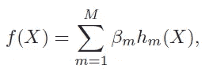

在*x*T7 中称为**线性基展开，其中 *hm* 是𝑋.的第 m 个变换这种方法的美妙之处在于，一旦确定了基函数ℎ，模型在这些新的转换变量中就是线性的，并且拟合与基本线性模型一样简单。**

一些广泛使用的基函数有:

*   ℎ𝑚(𝑋) = 𝑋𝑚，它恢复了原来的线性模型；
*   ℎ𝑚(𝑋) = 𝑋 j 或ℎ𝑚(𝑋) = 𝑋𝑗𝑋𝑘，这允许用多项式项增加输入以实现高阶泰勒展开；
*   ℎ𝑚(𝑋) = 𝑙𝑜𝑔(𝑋𝑗)、𝑠𝑞𝑟𝑡(𝑋𝑗)等，其允许其他非线性变换；
*   ℎ𝑚(𝑋) = 𝐼(𝐿𝑚 < 𝑋𝑘 < 𝑈𝑚), which is an indicator for the region of 𝑋𝑘. By breaking the range of 𝑋𝑘 into a set of non-overlapping regions we obtain a model with piecewise-linear contributions of 𝑋𝑘.

# Piecewise Polynomials

A **分段多项式函数**是通过将𝑋的定义域划分为连续的区间，并在每个区间内用单独的多项式来表示函数而得到的。下面相当长的 Python 代码块将一些简单的分段多项式拟合到模拟数据中，并将它们很好地绘制出来。请注意，大部分代码是用于绘图的。

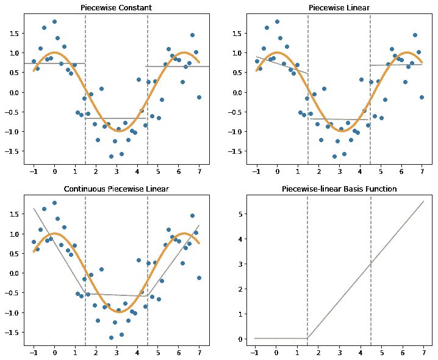

左上面板显示了具有三个基函数的分段常数函数:

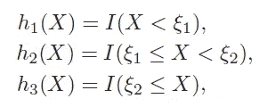

结𝜀1 和𝜀2 分别等于 1.5 和 4.5。分段常数拟合归结为每个区域的𝑌平均值。

右上面板显示了分段线性拟合。除了前面的三个基本函数，这一个还需要另外三个，每个区域一个，以通常的线性回归方式添加𝑋和𝑌之间的关系:

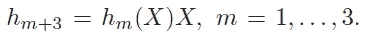

注意，结果是，在每个区域中，𝑌被建模为其在该区域中的平均值加上𝑋的影响乘以其系数 *β* 。要了解这一点，只需将六个基函数ℎ代入本文开头的基展开式即可！

分段线性模型的一个问题是它在节点处是不连续的。这是不希望的，因为我们希望模型为每个输入 *X* 产生一个唯一的输出 *Y* 。当𝑓( *X* 不连续时，情况并非如此，因为在节点处没有唯一的输出！因此，在大多数情况下，人们更喜欢有一个连续的模型，比如左下方面板中的模型。它可以通过在基函数中加入适当的约束来加强节点处的连续性而获得:

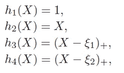

其中𝑡+表示阳性部分。作为一个例子，右下面板显示了基函数ℎ3。

# 回归样条

分段多项式，即使是那些在节点处连续的多项式，也往往不是光滑的:它们会迅速改变节点处的斜率。为了防止这种情况并增加它们的平滑度，增加局部多项式的阶数并要求纽结两侧的前两个导数相同就足够了。连续且具有连续一阶和二阶导数的函数称为**三次样条**，可用以下基函数表示:

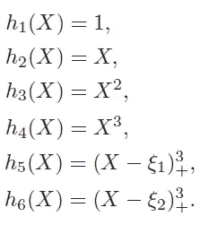

下面的代码块将这个三次样条拟合到之前模拟的数据中。

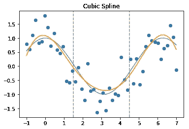

上面的三次样条似乎很适合这些数据。然而，使用这种技术有一个危险:三次样条的行为在边界附近往往是不稳定的，即超出𝑋.的观测值为了平滑边界附近的函数，可以使用一种特殊的样条，称为**自然样条**。

自然三次样条增加了额外的约束，即函数在边界节点之外是线性的。对于这种相当粗糙的近似，边界附近的偏差将是一个代价，但假设边界附近是线性的，无论如何，我们的信息较少，这通常被认为是合理的。

带有𝐾节点的自然三次样条由𝐾基函数表示如下:

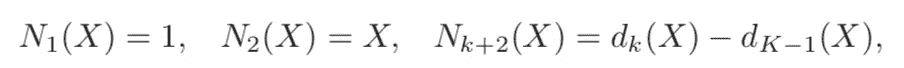

在哪里

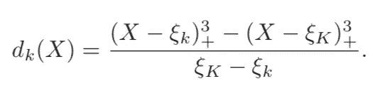

现在，让我们采用三次和自然样条来模拟工资和年龄之间的关系，这可以合理地预期为非线性——样条的完美用例。对于这个实际的例子，我们将使用 *statsmodels* 包来装配花键，使用 *patsy* 来定义公式。数据改编自 T. Hastie 等人的《统计学习导论》。

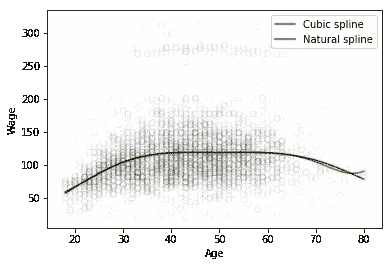

两条样条曲线看起来相似，但是请注意，与三次样条曲线相比，自然样条曲线在图的右边缘是线性稳定的！现在让我们看看另一种获得样条的方法。

# 平滑样条

到目前为止讨论的所有方法都要求我们选择结的数量和位置。**平滑样条**是一种通过使用一组最大节点来避免节点选择问题的方法。在这种方法中，拟合曲线的复杂性不是由节点控制的，而是由正则化控制的。

人们可以认为平滑样条函数是从所有可能的函数中选择一个𝑓(𝑋函数，该函数具有两个最小化损失残差平方和(RSS)的连续导数。实际上，𝑓(𝑋)几乎总是被选为三次函数。

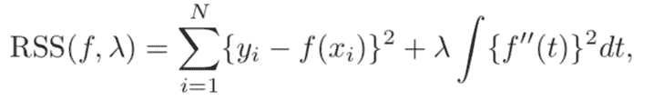

上面 RSS 公式中的第一项衡量与数据的接近程度，而第二项惩罚函数的曲率。两者之间的权衡由正则化参数 *λ* 控制:

*   当 *λ* = 0，𝑓(𝑋)可以通过任何任意复杂的函数对数据进行插值，这几乎肯定会导致过拟合；
*   当 *λ* = ∞，第二项占优势，𝑓(𝑋)是简单的线性拟合，因为根本不容许曲率。

将正则化参数设置在这两个极端之间的某个位置将有望产生一个很好地拟合数据但不会过度拟合的模型。

让我们用平滑样条来拟合工资年龄数据。我们将为此使用 *csaps* 包，它定义的正则化惩罚略有不同:它接受 0 到 1 之间的值，其中 0 是直线，1 是自然三次样条插值。软件包还要求我们在拟合模型之前准备好数据。对于每个𝑋.，它只能处理一个𝑌值因此，我们将按年龄分组，并使用中位数计算工资总额。

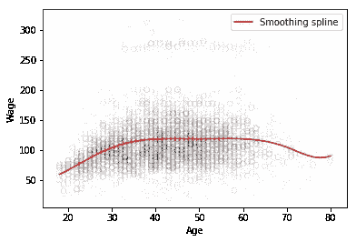

# 参数选择

定义回归样条的参数包括样条的阶数以及节点的数量和位置。有时关于被建模的关系的领域知识可以提供一些关于结应该放置在哪里的指示。对于平滑样条，必须选择平滑参数。在实践中，对于所有类型的样条，参数可以通过交叉验证进行调整，或者根据残差图的分析进行设置，这取决于建模的目标。

# 总结和结论

1.  **多项式和样条函数**允许对非线性关系进行建模，比线性模型具有更强的预测和解释能力。他们通过对输入要素进行一些变换，然后在线性模型中使用变换后的要素来实现这一点。
2.  **分段多项式**通过将输入特征域划分为连续的区间，并在每个区间中拟合一个单独的多项式来获得。它们可以被迫在节点处连续，但它们往往不是平滑的。
3.  **三次样条**是对分段多项式光滑性问题的一种回答。它们通过要求节点两侧的前两个导数相同来确保节点处的光滑性。然而，它们也有自己的缺点:三次样条的行为在输入的观察值之外往往是不稳定的。
4.  **自然样条**增加了额外的约束，即函数在边界节点以外是线性的，这使得它在那些区域更加可靠。
5.  **平滑样条**通过平衡模型与数据的接近度和拟合曲线的复杂性之间的平衡获得:正则化参数惩罚可能导致过度拟合的过于复杂的函数。
6.  回归(三次和自然)样条曲线的参数包括结的数量和位置。对于平滑样条，需要选择正则化参数。参数选择可以基于领域知识、交叉验证或残差属性。

本文中的所有例子都以单变量样条为特色:只有一个输入变量。在实践中，人们通常希望在模型中包含多个预测值。不用担心:所有讨论的方法都自然地延伸到多元情况。例如，检查 [*csaps*](https://pypi.org/project/csaps/) 包中的*multivariatecubismoothingspline*类。

对于熟悉 R 语言的读者来说，最后一句话是:在样条建模方面，R 比 Python 提供了更多。查看 [*样条*](https://www.rdocumentation.org/packages/splines) 包中的 *bs()* 函数(顺便说一下，这是 Python 的 *statsmodels* 在幕后模仿的)和[*mgcv*](https://www.rdocumentation.org/packages/mgcv/versions/1.8-29)*包*。**

**

*感谢阅读！我希望你已经学到了对你的项目有益的东西🚀*

*如果你喜欢这篇文章，试试我的其他文章。不能选择？从这些中选择一个:*

* [## 线性回归中收缩法和选择法的比较

### 详细介绍 7 种流行的收缩和选择方法。

towardsdatascience.com](/a-comparison-of-shrinkage-and-selection-methods-for-linear-regression-ee4dd3a71f16)  [## 增强你对助推的把握

### 揭秘著名的竞赛获奖算法。

towardsdatascience.com](/boost-your-grasp-on-boosting-acf239694b1)  [## 插补的不确定性

### 你在预测中考虑到它了吗？

towardsdatascience.com](/uncertainty-from-imputation-8dbb34a19612) 

# 来源

1.  Hastie，Tibshirani，r .，，j . h . Friedman(2009 年)。统计学习的要素:数据挖掘、推理和预测。第二版。纽约:斯普林格。
2.  [https://pypi.org/project/csaps/](https://pypi.org/project/csaps/)*