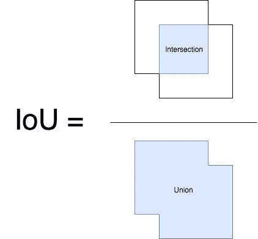
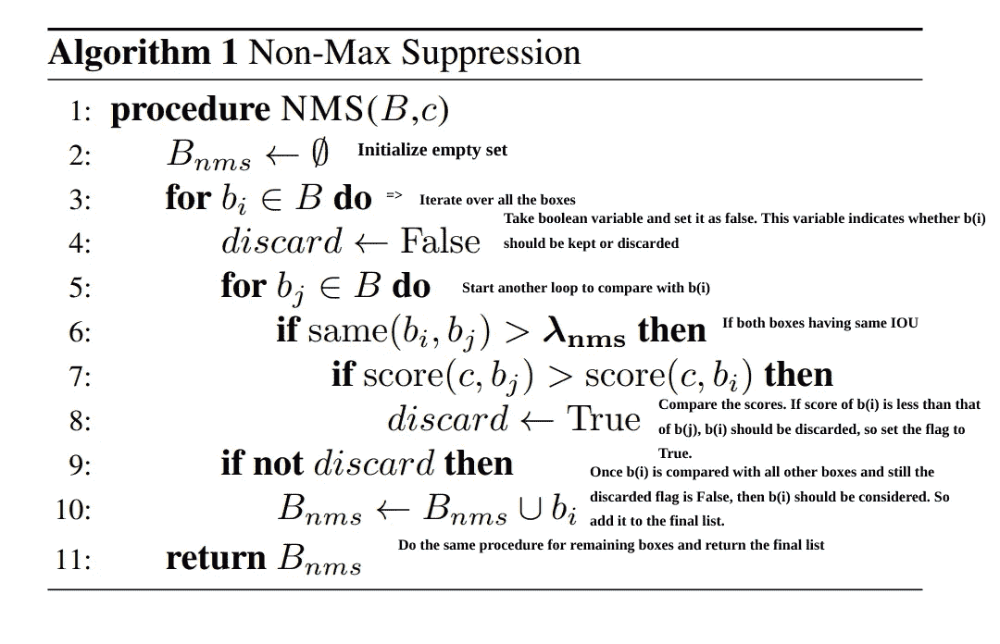
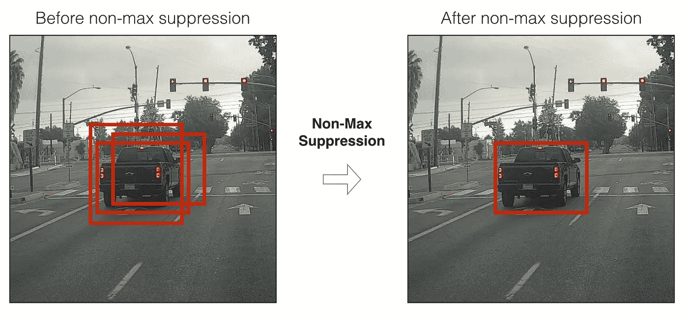
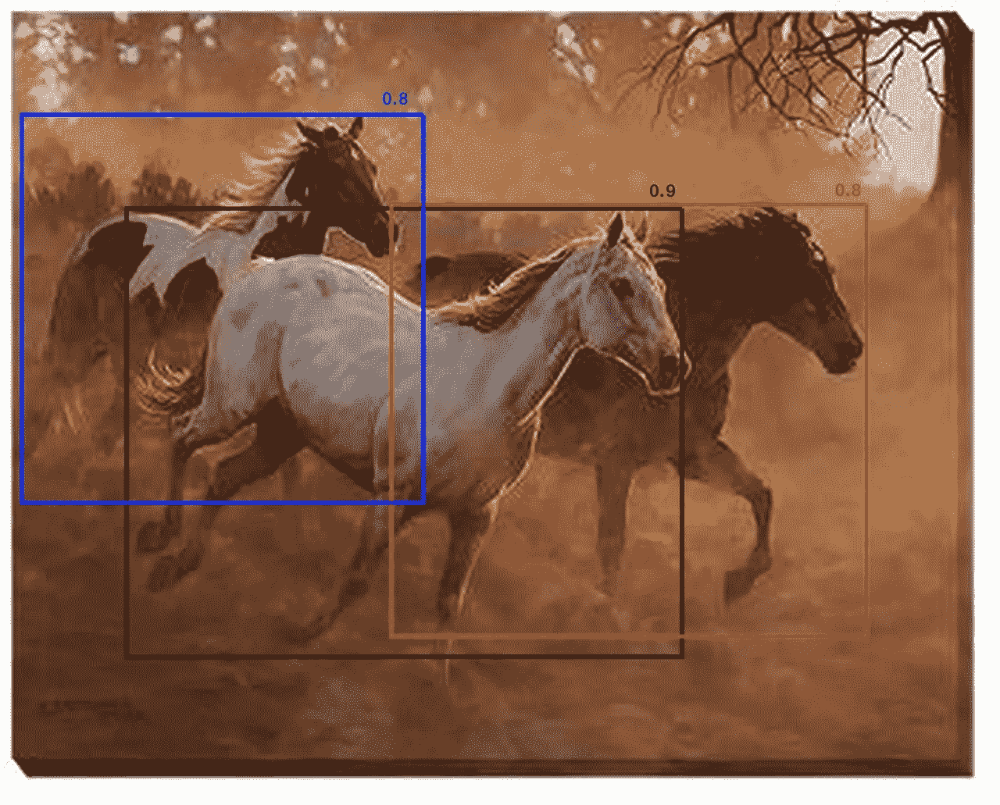
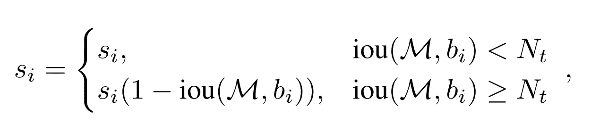
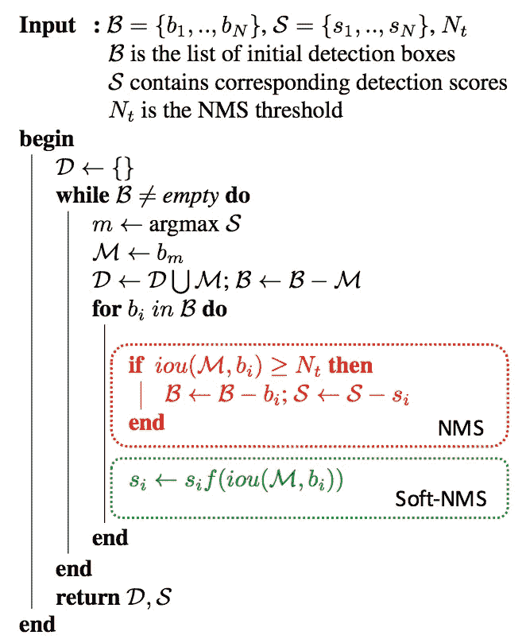

# 非最大抑制(NMS)

> 原文：<https://towardsdatascience.com/non-maximum-suppression-nms-93ce178e177c?source=collection_archive---------2----------------------->

## 一种过滤物体探测器预测的技术。

典型的对象检测流水线具有一个用于生成分类建议的[组件](/region-proposal-network-a-detailed-view-1305c7875853)。提议只不过是感兴趣对象的候选区域。大多数方法在特征图上采用滑动窗口，并根据在该窗口中计算的特征来分配前景/背景分数。邻域窗口在某种程度上具有相似的分数，并且被认为是候选区域。这导致了数百个提议。由于建议生成方法应该具有高召回率，所以我们在这一阶段保持宽松的约束。然而，通过分类网络处理这么多建议是很麻烦的。这就产生了一种基于某种标准(我们很快就会看到)过滤建议的技术，称为非最大抑制。

**NMS:**

**输入:**建议框 B 的列表，对应的置信度得分 S 和重叠阈值 n

**输出:**过滤后的建议列表

**算法:**

1.  选择具有最高置信度得分的提议，将其从 B 中移除，并将其添加到最终提议列表 D 中(最初 D 为空)。
2.  现在，将该提议与所有提议进行比较，计算该提议与所有其他提议的 IOU(交集/并集)。如果 IOU 大于阈值 N，则从 b 中删除该建议。
3.  再次从 B 中的剩余提议中取出置信度最高的提议，并将其从 B 中移除，然后将其添加到 d 中。
4.  再次用 B 中的所有建议计算该建议的 IOU，并排除 IOU 高于阈值的方框。
5.  重复这个过程，直到 b 中不再有建议。

IOU 计算实际上用于衡量两个方案之间的重叠部分。

Intersection over Union

下面是 NMS 的伪代码。为了更好地理解它，我添加了一些评论。

Non-Max Suppression Algorithm

现在如果你观察上面的算法，整个过滤过程依赖于单个阈值。因此，阈值的选择是模型性能的关键。然而，设置这个阈值是棘手的。让我们看看这个场景。

假设重叠阈值 N 是 0.5。如果有一个建议的 IOU 为 0.51，并且具有良好的置信度得分，则该框将被移除，即使其置信度高于许多其他 IOU 较少的框。正因为如此，如果有两个物体并排，其中一个就会被消除。具有 0.49 IOU 的提议仍然被保留，即使其置信度非常低。当然，这是任何基于阈值的技术的已知问题。现在我们该如何处理？下面是这种情况的一个例子。仅保留 0.9 的建议，其他建议将被删除。这降低了模型的精度。

处理这种情况的简单而有效的方法是使用软 NMS。思路很简单——**“不是完全剔除 IOU 高、可信度高的提案，而是降低与 IOU 值成正比的提案的可信度”**。现在让我们把这个想法应用到上面的例子中。不是完全删除得分为 0.8 的建议，而是保留这些建议，但降低其得分，如下图所示。

Soft-NMS

正如我前面提到的，两份建议书的 0.4 分都是根据借据价值计算的。分数计算如下

si — score of proposal i, bi — box corresponding to proposal i, M — box corresponding to maximum confidence, Nt — IOU threshold

因此，这只是 NMS 算法实现中的一行变化，它在很大程度上提高了精度。下图显示了两种算法(NMS 和软 NMS)，这是我从软 NMS 论文。

这些技术对于过滤单个模型的预测很有效，如果您有来自多个模型的预测呢？加权盒融合是一种结合目标检测模型预测的新方法。查看我的文章以了解更多信息。

 [## 加权盒融合

### 一种组合来自集合目标检测模型的盒子的方法

towardsdatascience.com](/weighted-boxes-fusion-86fad2c6be16) 

我在下面的参考资料中给出了 NMS 和软 NMS 实现的 github 链接。这就是这篇文章的全部内容，非常感谢你和我在一起。

**参考文献:**

1.  【https://arxiv.org/pdf/1704.04503.pdf 
2.  [https://github . com/rbgirshick/fast-rcnn/blob/master/lib/utils/NMS . py](https://github.com/rbgirshick/fast-rcnn/blob/master/lib/utils/nms.py)
3.  [https://github.com/bharatsingh430/soft-nms](https://github.com/bharatsingh430/soft-nms)
4.  [https://github.com/DocF/Soft-NMS](https://github.com/DocF/Soft-NMS)—Python 实现。

[订阅 FOCUS](https://master-ml.ck.page/0b50556bfa)——我的每周简讯，获取人工智能的最新更新和最新进展，以及来自机器学习媒体的精选故事。