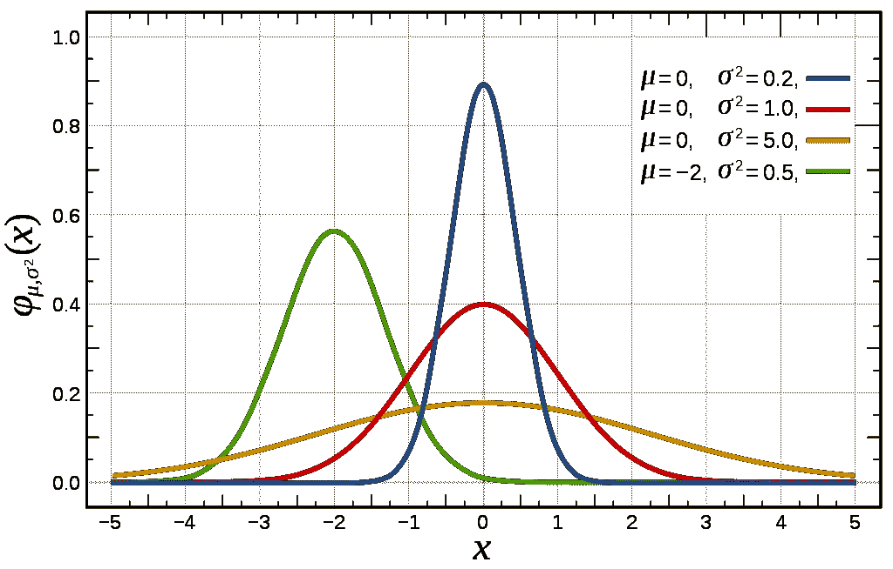
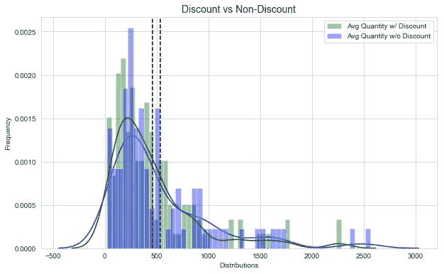
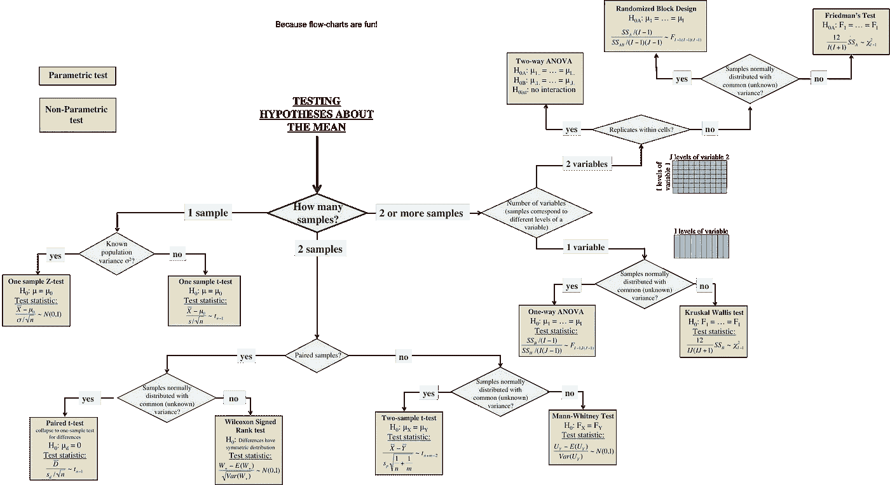

# 假设检验中的非参数检验

> 原文：<https://towardsdatascience.com/non-parametric-tests-in-hypothesis-testing-138d585c3548?source=collection_archive---------7----------------------->

## KS 测试、曼-惠特尼 U 测试、KW 测试等等

z 检验，学生 T 检验，配对 T 检验，ANOVA，MANOVA？实际上，它们都属于**参数统计**家族，该家族假设样本数据来自可以通过概率分布充分建模的人群，该概率分布具有一组固定的参数(平均值、标准偏差)，也称为**正态分布**。



Normal Distribution

**参数测试通常假设三件事:**

*   病例的独立性:样本是独立的观察值
*   正态性:样本数据来自正态分布(或者至少是对称)
*   方差齐性:样本数据来自具有相同方差的总体

然而，在现实生活中，这些假设几乎无法满足。非参数检验的假设要宽松得多，它们要么是无分布的，要么是有指定的分布，但分布的参数未指定。

## 我们什么时候使用非参数测试？

在我最近的项目中，我比较了有折扣和没有折扣时消费者购买调味品的平均数量。显然这两个样本分布不是参数分布。这是否意味着我不能使用参数测试？



**不一定。**

别忘了**中心极限定理！样本**看起来不对称并不一定意味着总体不是正态分布的。中心极限定理表明**如果样本量足够大，任何独立随机变量的均值的抽样分布将是正态或接近正态的**。多大才算够大？通常，当总体分布大致呈钟形时，样本量至少为 30 是安全的。

## 正态性检验

如果样本量很小(小于 30)，第一步总是检验总体的正态性。 [Kolmogorov-Smirnov 检验(KS 检验)](https://en.wikipedia.org/wiki/Kolmogorov%E2%80%93Smirnov_test)可用于此！Kolmogorov–Smirnov 统计量量化了样本的经验分布函数和参考分布的累积分布函数之间的距离，或者两个样本的经验分布函数之间的距离。


KS 检验的无效假设是样本取自参考分布。在 Python 中，使用 Scipy 库非常容易。

```
import scipy.stats as statst, pvalue = stats.kstest(sample, 'norm')
```

假设你的阿尔法水平是 0.05。如果 p 值大于 0.05，这意味着您不能拒绝空值。你可以说样本来自正态分布，置信水平为 95%。

## 方差相等性检验

如果你的样本足够大，检验方差的相等性(homoscedasticity)实际上更重要。Levene 的测试就是为此而设计的。Levene 检验可用于评估两组或多组变量的方差相等性。Levene 检验的无效假设是样本取自方差相同的总体。如果观察到显著的结果，应该转换到像韦尔奇的 T 检验或其他非参数检验。

python 代码如下:

```
import scipy.stats as statst, pvalue = stats.levene(sample1, sample2, ..., center = 'mean')
```

请注意,“中心”可以是平均值、中间值或修整值。

# 常用的非参数检验

## Kolmogorov-Smirnov 检验(2 个样本的 KS 检验)

这是对两个独立样本取自同一连续分布的零假设的双边检验。如果 K-S 统计量很小或者 p 值很高，那么我们不能拒绝两个样本的分布相同的假设。

```
import scipy.stats as statst, pvalue = stats.ks_2samp(sample1, sample2) 
```

## 曼-惠特尼 U 检验(2 样本 t 检验的非参数版本)

当因变量不是正态分布时，Mann-Whitney U 检验通常用于比较两个独立组之间的差异。它通常被认为是独立 t 检验的非参数替代方法。Mann-Whitney U 的零假设是从具有相同分布的总体中选择两个独立的样本。

```
import scipy.stats as statst, pvalue = stats.mannwhitneyu(sample1,sample2, alternative=None) 
```

## 克鲁萨尔-沃利斯 H 检验(KW 检验——单向方差分析的非参数版本)

Krusal-Wallis H-test 检验所有组的人口中位数相等的零假设。它是方差分析的非参数版本。一个显著的 Kruskal-Wallis 检验表明，至少一个样本[随机支配](https://en.wikipedia.org/wiki/Stochastic_dominance)另一个样本。测试并不确定这种随机优势发生在哪里，也不确定有多少对群体获得随机优势。因此，需要在组之间进行事后比较，以确定哪些组是不同的。

```
import scipy.stats as statst, pvalue = stats.kruskal(sample1, sample2, ...，) 
```

作为一个总结，在选择任何测试方法之前，总是要确保你有一个坚实而清晰的假设陈述，说明你是在测试均值还是分布。

然后，确保您的样本数据和总体符合您将要进行的测试的假设。**正态性和方差**是需要考虑的事情。然后如果你最终得到的是非参数测试，玩得开心，正确解读！下面的流程图在选择最佳测试时非常方便。

**享受测试！**



Hypothesis Tests Flow Chart