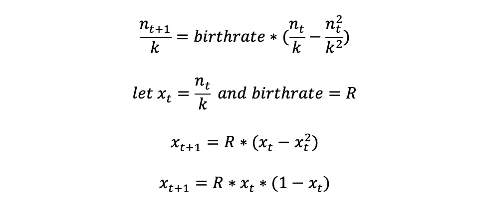
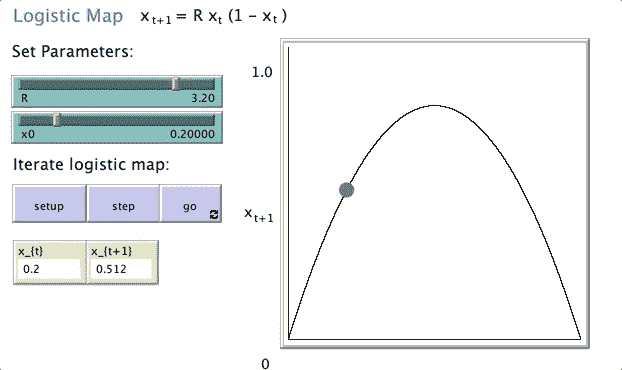
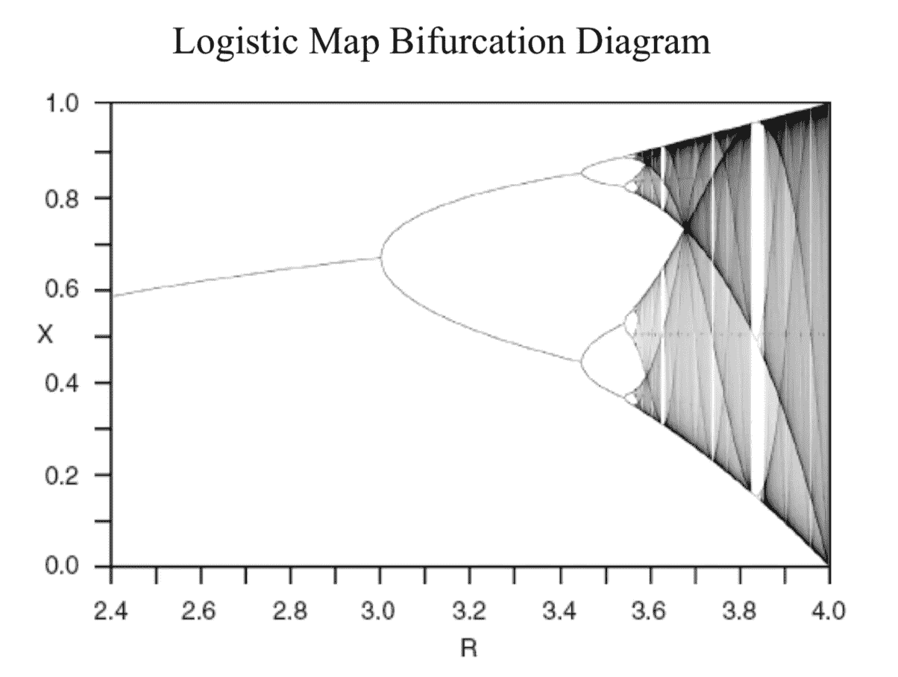
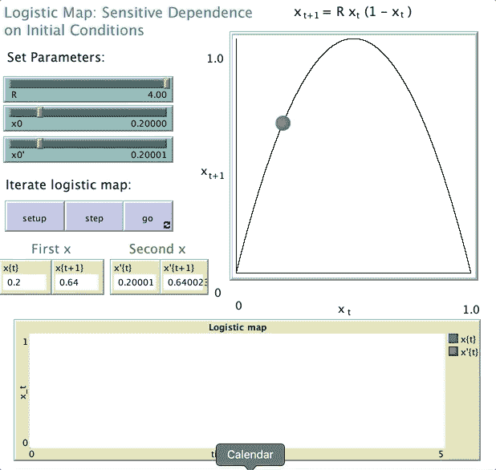
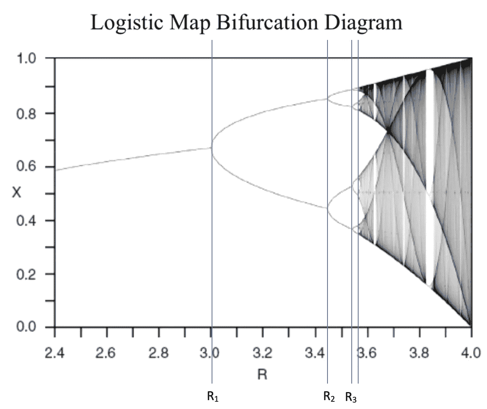

# 非线性动力学和混沌

> 原文：<https://towardsdatascience.com/nonlinear-dynamics-and-chaos-14b20a41c19a?source=collection_archive---------20----------------------->

这篇文章是我最近从圣达菲研究所的在线课程中学到的非线性动力学和混沌理论的总结。所有的材料都归研究所所有。

 [## 复杂性浏览器

### 关于课程:在本课程中，你将学习科学家用来理解复杂系统的工具。的…

www.complexityexplorer.org](https://www.complexityexplorer.org/courses/97-introduction-to-complexity) 

动力学是数学的一个分支，研究系统如何随时间变化。直到 18 世纪，人们都相信，只要知道*“所有使自然运动的力量，以及组成自然的所有项目的所有位置”*(那个人被称为拉普拉斯恶魔)，未来就可以被完美地预测。

现在，假设我们相信世界是完全确定的，那么这个陈述是有意义的。问题是在现实中，测量值(例如力和位置)通常是近似值。我们当时没有意识到的是，即使一个人知道所有变量的值，一个稍微不准确的近似值可能会导致完全不同的未来。这相当令人沮丧，因为它表明，在现实中，即使我们可以建立一个类似拉普拉斯恶魔的超级计算机，为了让它对未来做出任何有意义的预测，所有变量的值都必须完美地获得；一点偏差都不允许。这种*“初始条件的小差异在最终现象中产生非常大的差异”*(庞加莱)的现象是用混沌理论来研究的。

在下一节中，我们将探索一个简单的动态系统，并展示它如何产生混沌。

# 人口模型

假设一个地方的人口增长可以用下面的等式来模拟。在时间 t+1 的人口数 n(t+1)等于在时间 t 的当前人口数 n(t)减去死亡率，用 n(t) /k 表示，或者一个地方相对于最大允许人口数 k 的人口过剩程度，乘以新生儿出生率。

通过一些代数运算，我们可以把它转换成一个三变量的方程。

关于 x(t)和 x(t+1)的最后一个方程是迭代方程的典型例子。为了更直观地了解这个等式意味着什么，我们将用三张图来分析它。所有这些模拟都是用 [netlogo](https://ccl.northwestern.edu/netlogo/) 完成的。课程中也提供了代码。

## x(t)与 x(t+1)

该图表(或地图)绘制了当前状态 x(t)与下一个状态 x(t+1)的关系。我们可以看到图表上显示了一个单峰地图(这基本上是一个 R*x{t}*(1-x{t})的图)。随着时间的推移，我们追踪这个点的行程，我们可以看到它在 x 等于 0.64 之前振荡了一段时间。

然而，如果我们将参数 R 的值设置为其他值，比如 3，这种行为就会改变。该点永远在两个位置之间振荡。它仍然稳定下来，虽然不是在一个静态的位置，而是两个可能的值。

## t 对 x(t)

对于上面的每个逻辑图，我们还可以看到点的位置是如何随时间变化的，即通过绘制时间 t 对 x(t)的曲线。

R = 2.82

对于第一个逻辑图(R = 2.82)，我们看到 x 的值最终稳定为单一值。这就是为什么我们看到前面图表中的蓝点在一段时间后停止移动。

R = 3.2

同时，对于第二个逻辑图(R = 3.2)，我们看到 x 最终在两个值之间振荡，这解释了为什么之前图表中的蓝点永远在两个位置之间移动。

## r 对 x

请记住，从 x(t) vs x(t+1)图表中可以看出，R 的值决定了动态如何随时间收敛。在这一节中，我们将绘制 R 与系统稳定下来的稳定点数的关系图(也称为吸引子)。

我们可以看到，对于 R = 2.82，只有一个吸引子(大约 0.64 到 0.65)，而对于 R =3.2，观察到两个吸引子。注意，随着 R 的增加，吸引子的数量有增加的趋势。在某一点上(当 R 约为 3.569946……)，吸引子的数量达到无穷大(见图中深色阴影区域)。此时，系统振荡幅度很大，几乎没有显示任何模式。这一点也被称为混沌的开始。

## 混乱

当吸引子的数量巨大时，从不同条件出发的两个点不会收敛到同一个稳定点。这与例如当 R = 2.82 时不同，在 R = 2.82 时，无论初始点是什么，系统最终都将收敛到相同的吸引子。

在混沌开始时，有时一个稍微不同的初始点会导致非常不同的结果。例如，请参见下面的模拟。

两个点，一个从 0.20000 开始，另一个从 0.20001 结束，当 R = 4 时，轨迹完全不同(参考分叉图，我们看到这导致了巨大数量的吸引子)。

## 混沌的普遍性

现在研究人员开始询问一个混沌系统是否完全混沌。似乎可以从这种系统中观察到一些模式。

例如，科学家发现所有单峰/单峰地图都有一个共同的费根鲍姆常数。这是通过将分支点(也称为分叉)之间的电流间隙与下一个电流间隙之比得出的。

Lines marking all bifurcations

Feigenbaum Constant

对此的解释是，每次分叉发生的速度大约是前一次的 4.6692016 倍。这一发现让我们看到了“混沌中有秩序”的希望。

# 摘要

在这篇文章中，我们通过剖析一个人口增长模型简要分析了非线性动力学和混沌。这是圣达菲学院提供的复杂系统课程的一部分。