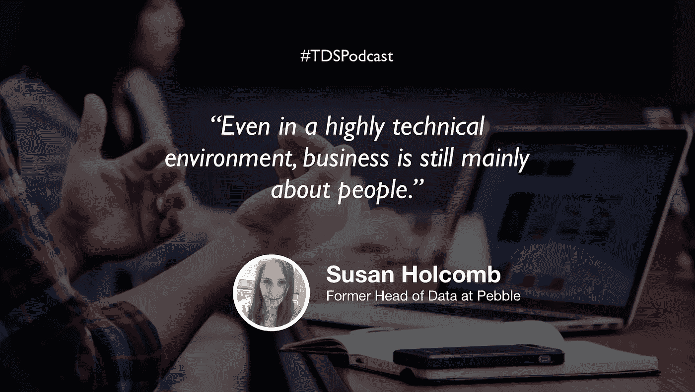

# 数据科学家的非技术性职业技能

> 原文：<https://towardsdatascience.com/nontechnical-career-skills-for-data-scientists-b420d592aba6?source=collection_archive---------26----------------------->

## [苹果](https://podcasts.apple.com/ca/podcast/towards-data-science/id1470952338?mt=2) | [谷歌](https://www.google.com/podcasts?feed=aHR0cHM6Ly9hbmNob3IuZm0vcy8zNmI0ODQ0L3BvZGNhc3QvcnNz) | [SPOTIFY](https://open.spotify.com/show/63diy2DtpHzQfeNVxAPZgU) | [其他](https://anchor.fm/towardsdatascience) | [剪辑](https://www.youtube.com/watch?v=1RJtPBAe7oI&feature=youtu.be)

## 苏珊·霍尔科姆在 [TDS 播客](https://medium.com/towards-data-science/podcast/home)

*编者按:这是迈向数据科学播客“攀登数据科学阶梯”系列的第三集，由 Jeremie Harris、Edouard Harris 和 Russell Pollari 主持。他们一起经营一家名为*[*sharpes minds*](http://sharpestminds.com)*的数据科学导师创业公司。可以听下面的播客:*

很容易将数据科学视为一门技术学科，但在实践中，事情并不真的是这样。如果你要成为一名成功的数据科学家*，人们*将需要相信你能增加价值以便雇佣你，*人们*将需要相信你的宠物项目以便在你的公司内部认可它，*人们*将需要根据你从数据中得出的见解做出决策。

虽然很容易忘记人的因素，但如果你想爬上数据科学的阶梯，获得第一份工作或你追求的晋升，管理它是你可以发展的最有用的技能之一。这就是为什么我们采访了世界上第一家智能手表公司 Pebble 的前数据主管 Susan Holcomb。

当 Pebble 第一次聘用她时，苏珊刚刚从物理学研究生院毕业，从未领导过团队，也没有与初创公司高管打过交道。随着公司的发展，她必须想办法让 Pebble 的领导层支持她努力推动公司朝着更加数据驱动的方向发展，同时她还必须第一次管理一个数据科学家团队。在我们的谈话中，Susan 讲述了她从这个过程中学到的很多东西:

*   重要的是要考虑你的个性与你的目标角色有多契合。如果你想在早期创业公司工作，那很好——但不要指望能整天摆弄模型和优化 AUC 分数。越早进入公司的舞台，你就越需要扮演一个多面手的角色。这通常意味着同时担任分析师、数据科学家和数据工程师。
*   数据科学家是问题解决者，而不是算法生成者。苏珊加入 Pebble 后不久，她注意到自己的数据中有一个异常:似乎许多用户都是在带着智能手表睡觉的。她主动在办公室里做了一项民意调查，果然，结果是 10%的人都是这么做的。这种见解导致了一套强大的睡眠跟踪和健康监测功能，远远领先于他们的时代。其中大多数没有使用像神经网络这样的复杂算法，甚至没有决策树；他们是简单的基于规则的系统，但他们做到了。这个故事的寓意是:优秀的数据科学家不会过度设计花哨的算法——他们能快速发现数据趋势，并利用它们解决明显的业务问题。
*   大多数人都不擅长向他人寻求推荐或技术帮助。他们最终在 LinkedIn 上给人们发信息，却没有给他们提供价值(例如，“我想知道你是否可以把我介绍给你网络中的一些人……”)，或者在招聘人员找工作时向他们发送数百封自我服务、复制/粘贴的电子邮件。值得花时间研究你联系的人，并在你的信息中向他们展示你已经做到了。猜测他们的问题可能是什么(例如，“我在看你的网站，注意到你的产品推荐并不像他们应该的那样具体……”)，并在询问你想要什么之前提供解决方案(“我有一些关于你可以改进的方法的想法……”)。

不幸的是，数据科学家经常忽视该行业的商业和个人现实，但与 Susan 的交谈明确了一件事:当你允许自己以更人性化的视角看待该领域时，数据科学中的个人成长(和职业发展)会变得容易得多。

## [TDS 播客—剪辑](https://www.youtube.com/watch?v=1RJtPBAe7oI&feature=youtu.be)

如果你在推特上，随时欢迎和我联系 [@jeremiecharris](https://twitter.com/jeremiecharris) ！