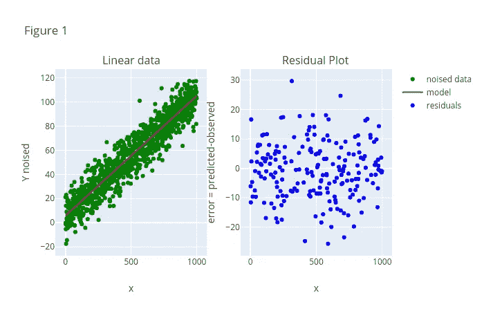
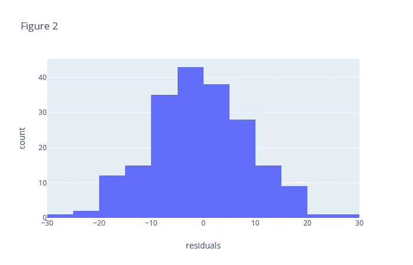
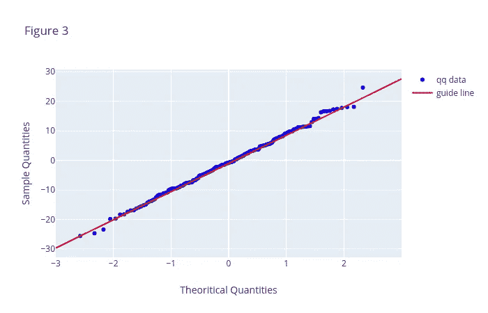
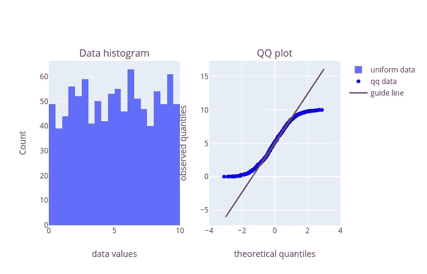
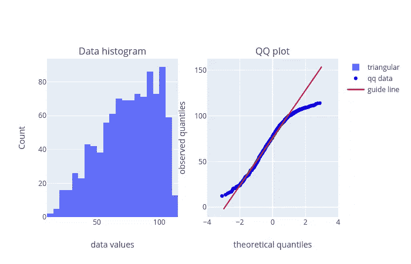
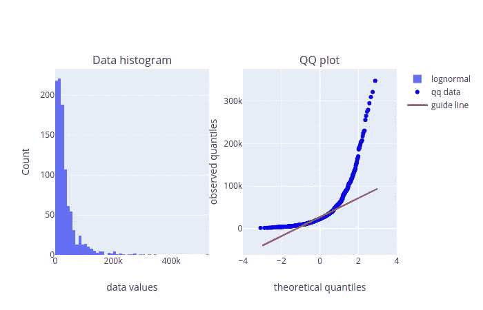
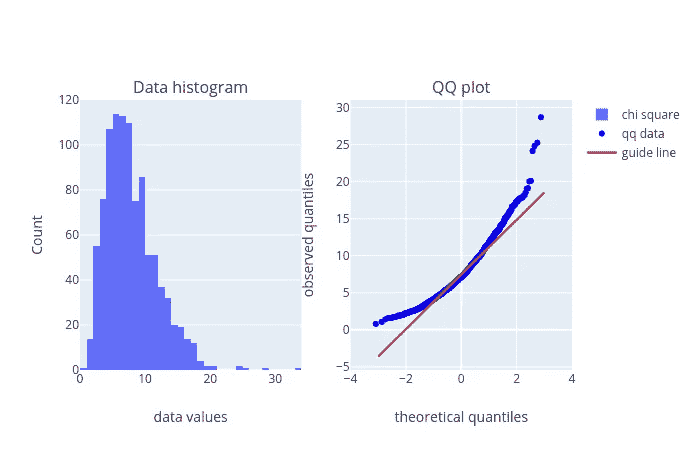

# 正态性检验:图解方法

> 原文：<https://towardsdatascience.com/normality-testing-the-graphical-way-20902abd8543?source=collection_archive---------32----------------------->

*下面的要点提供了全部代码*

在处理回归问题时，有一些特定的假设是适用的。以线性回归为例，我们有以下假设-

1)我们在自变量和目标变量之间有一个线性关系。
2)我们的数据是同方差的
3)残差具有正态分布
4)最小多重共线性

本笔记的主题是第三点:我们如何知道线性回归模型的残差是正态分布的？这就引出了一个更普遍的问题。给定一个数据集，我们能说数据是正态分布的吗？这似乎是一个相当小的问题，只需绘制数据的直方图，看看它是否像正态分布。直方图可能具有欺骗性，它取决于您选择的箱数，而箱数又取决于可用数据点的数量。

幸运的是，我们可以使用某些工具来确定一个数据集是否来自正态分布。

在这本笔记本中，我们将介绍两种图形工具:
1)图形方式:直方图
2)图形方式:分位数-分位数(qq)图

用于确定数据是否来自正态分布的检验称为正态性检验。

在我们进入之前，让我们设置一个问题。我们生成一个数据集并建立一个线性回归问题。我们给它拟合一个模型，得到残差。

```
# # generate data and visualize it
np.random.seed(1)
x = np.arange(0,1000)
noise = np.random.normal(0,10,1000)
slope = 0.1
b = 5.0y = (slope*x)+b 
y_noised = y+noise# test train split 
x_train, x_test, y_train, y_test = train_test_split(x,y_noised, test_size=0.2, random_state=1)x_train_shape = x_train.shape[0]
y_train_shape = y_train.shape[0]x_train_reshaped = x_train.reshape(x_train_shape, 1)
y_train_reshaped = y_train.reshape(y_train_shape, 1)x_test_shape = x_test.shape[0]
x_test_reshaped = x_test.reshape(x_test_shape, 1)# fitting the model in sklearn 
lr = LinearRegression()
lr.fit(x_train_reshaped, y_train_reshaped)pred_slope = lr.coef_
pred_b = lr.intercept_
y_pred= lr.predict(x_test_reshaped)
residuals = y_test — y_pred.reshape(y_pred.shape[0],)# fitting the model line to the data 
model_line = (pred_slope*x)+pred_b
model_line_reshaped = model_line.reshape(model_line.shape[1])fig = make_subplots(rows=1, cols=2,subplot_titles=[“Linear data”, “Residual Plot”])fig.add_trace(go.Scatter(x=x,y=y_noised, mode=’markers’, marker={‘color’:’green’}, name=”noised data”), row=1, col=1)
fig.add_trace(go.Scatter(x=x, y=model_line_reshaped, mode=’lines’, marker={‘color’:’red’}, name=’model’), row=1, col=1)
fig.add_trace(go.Scatter(x=x_test, y=residuals, mode=’markers’, marker={‘color’:’blue’}, name=’residuals’), row=1, col=2)fig.update_xaxes(title_text=”x” ,row=1, col=1)
fig.update_xaxes(title_text=”x”, row=1, col=2)
fig.update_yaxes(title_text=”Y noised”, row=1, col=1)
fig.update_yaxes(title_text=”error = predicted-observed” , row=1, col=2)
fig.update_layout(title_text=”Figure 1")iplot(fig)
```



# **直方图的问题**

图 1 右边的图是残差图。残差是实际值(图 1 左侧图中的绿点)和预测值(红线)之间的差值。线性回归的假设之一是残差来自正态分布，另一种说法是直方图类似正态分布。请看下面的图 2。直方图具有单峰，在面元-5 到 0 周围有 20 个面元，并在两侧下降。但是，我们能说这个直方图代表的是正态分布吗？也许吧。当我们改变箱的大小时，我们的结论变得更加模糊，因为没有简单的方法来说明正态分布的峰值在哪里。这使得我们很难判断哪种箱大小适合解释分布。

直方图是说明数据来自正态分布的一种图形方式，但直方图可能具有欺骗性，因为改变条柱的数量会改变分布的形状，这可能会导致一些混淆。我们需要一种更好的方法来识别数据是否来自正态分布。这就是分位数-分位数图的用处。

```
residual_df = pd.DataFrame(data=residuals,columns=[“residuals”])# callback function for the slider**def** change_bins(number_bins):
 return px.histogram(residual_df, x=”residuals”, nbins=int(number_bins), title=”Figure 2")slider_obj = widgets.FloatSlider(value=20, min=10, max=100,step=5, description=”Num of bins”, continuous_update=False)
interact(change_bins, number_bins=slider_obj);
```



# **使用 Plotly 的简单分位数-分位数图**

使用直方图的替代方法是使用分位数-分位数图。分位数-分位数图(qq 图)是一种散点图，其中我们绘制数据集值与从数据集确定的分位数的正态分布值。qq 图的 y 坐标是数据集值，x 坐标是正态分布的值。

为了生成分位数-分位数图的数据，我们必须定义需要正态分布值的分位数，所以首先我们写-

```
num_divisions = residuals.shape[0]+1
quantiles = np.arange(1,residuals.shape[0])/num_divisions 
```

num_divisions 告诉我们在正态分布中我们需要多少个除法。如果你运行上面的代码，你会看到分位数是-

```
[0.00497512, 0.00995025, 0.01492537, 0.0199005 …]
```

所以如果一个数据集中有*n*个数据点，我们需要把正态分布分成*n+1*个区域，从正态分布得到*n*。

例如，在我们的案例中，数据集中有 200 个点，因此我们需要在正态分布中有 201 个分区。一旦我们有了分位数值，我们就将它们插入 ppf 函数。这是累积分布的倒数，它给出了给定分位数值的正态分布的 z 得分。

我们输入到 ppf 函数中的分位数值只不过是正态曲线下面积与 1 的比值。

```
 qq_x_data = sps.norm.ppf(quantiles) 
```

这些值是 qq 图的 x 值，我们通过对残差排序得到 y 值

```
qq_y_data = np.sort(residuals) 
```

接下来，我们需要获取绘制参考线的数据。为此，我们需要两点来确定直线的斜率和 y 轴截距。为此，我们将采用克里夫兰在可视化数据方面的建议[[1]([https://dl.acm.org/citation.cfm?id=529269](https://dl.acm.org/citation.cfm?id=529269))]。
第一个和第三个四分位数的 x 值将来自正态分布。y 值将来自我们的有序数据集。因此我们写道-

```
# guide line data
line_x0 = sps.norm.ppf(0.25)
line_x1 = sps.norm.ppf(0.75)line_y0 = np.quantile(residuals, 0.25)
line_y1 = np.quantile(residuals, 0.75)
```

用这两点我们组成一条线-

```
slope = (line_y1-line_y0)/(line_x1-line_x0)
line_intercept = line_y1 — (slope*line_x1)x_range_line = np.arange(-3,3,0.001)
y_values_line = (slope*x_range_line) + line_intercept
```

注意:不要对 qq 图上的点拟合回归线，这将不会满足线性回归的假设(想想吧！为什么？)

现在我们有了 qq 图和参考线的数据，我们将使用 plotly 来绘制它们。

```
fig = go.Figure()fig.add_trace(go.Scatter(x=qq_x_data,
 y=qq_y_data,
 mode=’markers’,
 marker={‘color’:’blue’},
 name=”qq data”))
fig.add_trace(go.Scatter(x=x_range_line,
 y=y_values_line,
 mode=’lines’,
 marker={‘color’:’red’},
 name=”guide line”))fig[‘layout’].update(title=’Figure 3',
 xaxis={
 ‘title’: ‘Theoritical Quantities’,
 ‘zeroline’: True
 },
 yaxis={
 ‘title’: ‘Sample Quantities’
 },
 showlegend=True,
 )iplot(fig)
```



看一个 qq 图的方法是看有多少点落在参考线上。如果大多数点落在这条线上，那么我们假设数据代表正态分布。如果大多数点不遵循这一趋势，那么我们可以说数据不具有正常趋势。通常在这种情况下，我们应该尝试其他的正态性检验，如安德森-达林检验、KS 检验等，以确保数据不是正态的。我们将在下一个笔记本中深入研究，看看如何结合和解释正态性的图形和假设检验。

从该图中可以得出的主要结论是，qq 图是解读数据集是否遵循正态分布的简单图形方式。

# 分位数-各种分布数据的分位数图

在本节中，我们将研究来自不同分布类型的数据，并展示如何使用 qq 图将它们与正态分布进行比较。

假设我们有一个服从均匀分布的数据集。那么 qq 剧情看起来就不一样了。

```
uniform_data = np.random.uniform(0,10,1000)num_divisions = uniform_data.shape[0]+1
quantiles = np.arange(1,uniform_data.shape[0])/num_divisions# scatter data 
qq_uniform_x = sps.norm.ppf(quantiles)
qq_uniform_y = np.sort(uniform_data)line_y0 = np.quantile(uniform_data, 0.25)
line_y1 = np.quantile(uniform_data, 0.75)slope = (line_y1-line_y0)/(line_x1-line_x0)
line_intercept = line_y1 — (slope*line_x1)# points to plot the line 
x_uniform = np.arange(-3,3,0.001)
y_uniform = (slope*x_range_line) + line_interceptfig = make_subplots(rows=1, cols=2,subplot_titles=[“Data histogram”, “QQ plot”])fig.add_trace(go.Histogram(x=uniform_data,
 name=”uniform data”),
 row=1,
 col=1)
fig.add_trace(go.Scatter(x=qq_uniform_x,
 y=qq_uniform_y,
 mode=’markers’,
 marker={‘color’:’blue’},
 name=”qq data”),
 row=1,
 col=2)
fig.add_trace(go.Scatter(x=x_uniform,
 y=y_uniform,
 mode=’lines’,
 marker={‘color’:’red’},
 name=”guide line”),
 row=1,
 col=2)fig.update_xaxes(title_text=”data values”, row=1, col=1)
fig.update_xaxes(title_text=”theoretical quantiles”, range=[-4,4], row=1, col=2)
fig.update_yaxes(title_text=”Count”, row=1, col=1)
fig.update_yaxes(title_text=”observed quantiles” , row=1, col=2)iplot(fig)
```



您可以看到分散点呈 s 形曲线，许多点不在参考线上。这是一个好迹象，表明观察到的数据不是来自正态分布。在直方图中也可以看到同样的情况。

事实上，我们可以对许多其他分布类型这样做。这是一个比较残差数据和多重分布的图表。为此，我们将使用 ipython 小部件将多个情节浓缩成 plotly。

在分布函数中探讨分布的参数，以生成不同形状的数据分布。例如，更改对数正态分布的平均值和标准差，以查看直方图和 qq 图会发生什么变化。这将有助于您查看不同类型的数据及其 qq 图。

```
def get_qqdata(observed_data):
 np.random.seed(0)
 num_divisions = observed_data.shape[0]+1
 quantiles = np.arange(1,observed_data.shape[0])/num_divisions# scatter data 
 qq_x = sps.norm.ppf(quantiles)
 qq_y = np.sort(observed_data)line_y0 = np.quantile(observed_data, 0.25)
 line_y1 = np.quantile(observed_data, 0.75)slope = (line_y1-line_y0)/(line_x1-line_x0)
 line_intercept = line_y1 — (slope*line_x1)# points to plot the line 
 x_line = np.arange(-3,3,0.001)
 y_line = (slope*x_range_line) + line_interceptqq_data = {‘qqx’: qq_x, ‘qqy’:qq_y, ‘linex’: x_line, ‘liney’:y_line}

 return qq_datadef dist_qqplot(dist_data, dist_name) :
 qq_data = get_qqdata(dist_data)fig = make_subplots(rows=1, cols=2,subplot_titles=[“Data histogram”, “QQ plot”])
 fig.add_trace(go.Histogram(x=dist_data, name=dist_name), row=1, col=1)
 fig.update_xaxes(title_text=”data values” ,row=1, col=1)
 fig.add_trace(go.Scatter(x=qq_data[“qqx”] , y=qq_data[“qqy”], mode=’markers’, marker={‘color’:’blue’}, name=”qq data”), row=1,col=2)
 fig.add_trace(go.Scatter(x=qq_data[“linex”], y=qq_data[“liney”], mode=’lines’, marker={‘color’:’red’}, name=”guide line”), row=1,col=2)fig.update_xaxes(title_text=”theoretical quantiles”, range=[-4,4], row=1, col=2)
 fig.update_yaxes(title_text=”Count”, row=1, col=1)
 fig.update_yaxes(title_text=”observed quantiles” , row=1, col=2)

 return iplot(fig)def distributions(dist): 

 # change parameter values here to see how the qq plot can change
 selected_data ={“triangular”: np.random.triangular(10,100,115,1000),
 ‘lognormal’: np.random.lognormal(10,1,1000),
 ‘chi square’: np.random.chisquare(8,1000)}

 return dist_qqplot(selected_data[dist], dist )toggle_obj = widgets.ToggleButtons(description=”Distribution:”, options=[“triangular”,”lognormal”, “chi square”])
interact(distributions, dist=toggle_obj);
```



Histogram and qq plot for a triangular distribution with right value = 10, mode = 100, left = 115 with 1000 samples.



Histogram and qq plot for a lognormal distribution with a mean = 10 and std dev = 1\. 1000 samples were generated



Histogram and qq plot for a chi-square distribution with degree of freedom = 8 and 1000 samples are generated