# 标准化与规范化—定量分析

> 原文：<https://towardsdatascience.com/normalization-vs-standardization-quantitative-analysis-a91e8a79cebf?source=collection_archive---------0----------------------->

## 停止使用 Sklearn 的 StandardScaler 作为默认的特征缩放方法可以让你的精度提高 7%**,即使你的超参数已经调好了！**

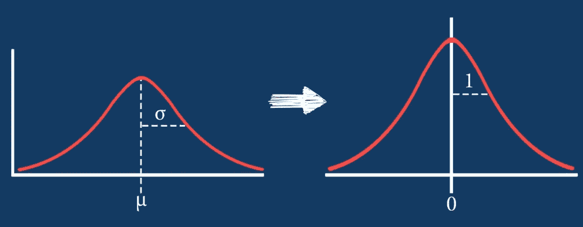

[https://365datascience.com/standardization/](https://365datascience.com/standardization/)

每个 ML 从业者都知道特征缩放是一个重要的问题(在这里阅读更多)。

讨论最多的两种缩放方法是规范化和标准化。 ***正常化*** 通常意味着将值重新调整到[0，1]的范围内。 ***标准化*** 通常意味着重新调整数据，使平均值为 0，标准差为 1(单位方差)。

在这篇博客中，我进行了一些实验，并希望回答如下问题:

1.  我们应该总是缩放我们的特征吗？
2.  有没有单一的最佳缩放技术？
3.  不同的缩放技术如何影响不同的分类器？
4.  我们应该考虑缩放技术作为我们模型的一个重要的超参数吗？

我将分析在多个实验设置中对特征应用不同缩放方法的实验结果。

# 竞赛表格

*   0.我们为什么在这里？
*   1.现成的分类器
*   2.分类器+缩放
*   3.分类器+缩放+ PCA
*   4.分类器+缩放+ PCA +超参数调整
*   5.更多的数据集:
*   — 5.1 澳大利亚的降雨数据集
*   — 5.2 银行营销数据集
*   — 5.3 收入分类数据集
*   — 5.4 收入分类数据集
*   结论

# 0.我们为什么在这里？

首先，我试图理解规范化和标准化之间的区别。因此，我遇到了 Sebastian Raschka 写的这个优秀的博客，它提供了满足我好奇心的数学背景。如果您不熟悉规范化或标准化概念，请花 5 分钟时间阅读本博客。
著名的 Hinton [在这里](https://www.youtube.com/watch?v=Xjtu1L7RwVM&list=PLoRl3Ht4JOcdU872GhiYWf6jwrk_SNhz9&index=26)也对处理使用梯度下降方法(如神经网络)训练的分类器时缩放特征的需要做了很好的解释。

好吧，我们抓了些数学，就这样？不完全是。当我检查流行的 ML 库 Sklearn 时，我看到有许多不同的缩放方法。有一个伟大的形象化的[不同的定标器对有异常值的数据的影响](https://scikit-learn.org/stable/auto_examples/preprocessing/plot_all_scaling.html#sphx-glr-auto-examples-preprocessing-plot-all-scaling-py)。但他们没有显示它如何影响不同分类器的分类任务。

我看到很多 ML pipelines 教程使用 StandardScaler(通常称为 Z-score 标准化)或 MinMaxScaler(通常称为 min-max 归一化)来缩放特征。为什么没有人使用其他缩放技术进行分类？有没有可能 StandardScaler 或者 MinMaxScaler 是最好的缩放方法？
我在教程中没有看到任何关于为什么或何时使用它们的解释，所以我想通过运行一些实验来研究这些技术的性能。**这就是这款笔记本的全部内容**

# 项目详情

像许多数据科学项目一样，让我们读取一些数据，并用几个现成的分类器进行实验。

## 资料组

[声纳](https://www.kaggle.com/adx891/sonar-data-set)数据集。它包含 208 行和 60 个特征列。这是一项分类任务，以区分从金属圆柱体反弹的声纳信号和从大致圆柱形的岩石反弹的信号。

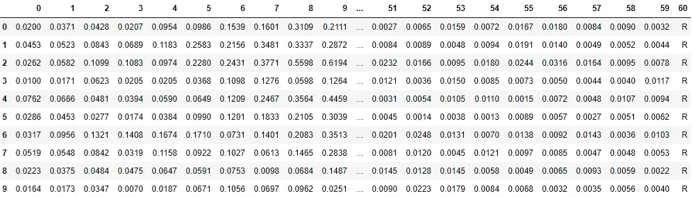

这是一个平衡的数据集:

```
sonar[60].value_counts() # 60 is the label column nameM    111
R     97
```

该数据集中的所有要素都在 0 到 1 之间，**但是**不能保证 1 是每个要素中的最大值或 0 是最小值。

我选择这个数据集是因为，一方面，它很小，所以我可以很快地进行实验。另一方面，这是一个困难的问题，没有一个分类器达到接近 100%的准确率，所以我们可以比较有意义的结果。

在最后一节中，我们将尝试更多的数据集。

**代码**

作为预处理步骤，我已经计算了所有的结果(这需要一些时间)。所以我们只加载结果文件并使用它。

产生结果的代码可以在我的 GitHub 中找到:
[https://GitHub . com/shaygeller/Normalization _ vs _ standardization . git](https://github.com/shaygeller/Normalization_vs_Standardization.git)

我从 Sklearn 中挑选了一些最流行的分类模型，表示为:

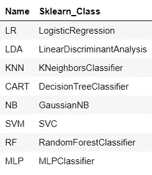

(MLP 是多层感知器，一种神经网络)

我使用的定标器表示为:

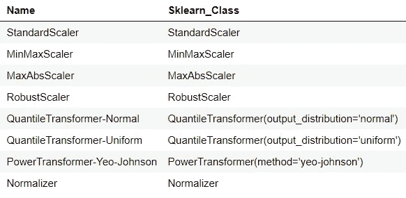

*不要混淆 Normalizer，上面列表中的最后一个缩放器和我之前讨论的最小-最大归一化技术。最小-最大归一化是列表中的第二个，命名为 MinMaxScaler。Sklearn 的规格化器类将样本分别规格化为单位范数。它不是基于列的，而是基于行的标准化技术。

# 实验详情:

*   当需要再现性时，使用相同的种子。
*   我随机将数据分成 80%-20%的训练测试集。
*   所有结果都是来自**训练集**的 10 倍随机交叉验证分割的准确度分数。
*   我在这里不讨论测试集的结果。通常，测试集应该保持隐藏，并且我们关于分类器的所有结论应该仅来自交叉验证分数。
*   在第 4 部分中，我执行了嵌套交叉验证。一个内部交叉验证使用 5 个随机分割进行超参数调整，另一个外部 CV 使用 10 个随机分割使用最佳参数获得模型得分。同样在这一部分中，所有数据仅取自训练集。一张图胜过千言万语:

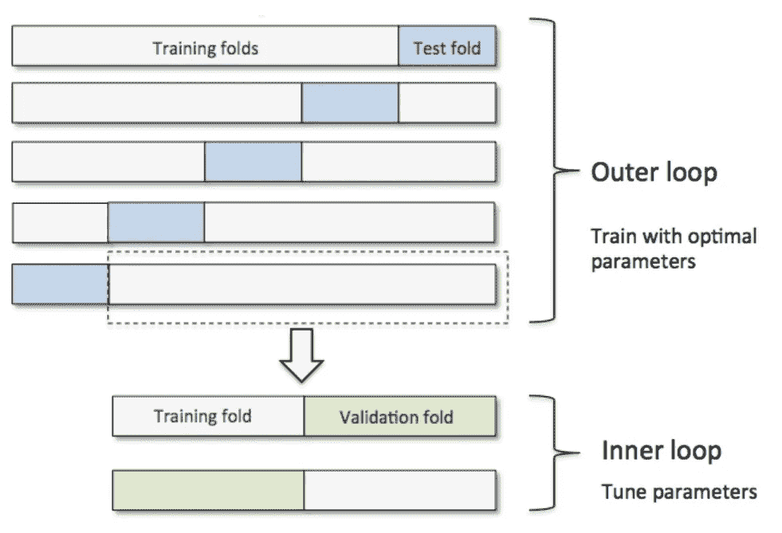

[https://sebastianraschka.com/faq/docs/evaluate-a-model.html](https://sebastianraschka.com/faq/docs/evaluate-a-model.html)

# 让我们阅读结果文件

```
import os
import pandas as pdresults_file = "sonar_results.csv"
results_df = pd.read_csv(os.path.join("..","data","processed",results_file)).dropna().round(3)
results_df
```

# 1.现成的分类器

```
**import** operatorresults_df.loc[operator.and_(results_df["Classifier_Name"].str.startswith("_"), **~**results_df["Classifier_Name"].str.endswith("PCA"))].dropna()
```


不错的结果。通过查看 CV_mean 列，我们可以看到目前 MLP 领先。SVM 表现最差。

标准差也差不多，所以主要可以通过平均分来判断。以下所有结果将是 10 倍交叉验证随机分裂的平均分数。

现在，让我们看看不同的缩放方法如何改变每个分类器的分数

# 2.分类器+缩放

```
import operator
temp = results_df.loc[~results_df["Classifier_Name"].str.endswith("PCA")].dropna()
temp["model"] = results_df["Classifier_Name"].apply(lambda sen: sen.split("_")[1])
temp["scaler"] = results_df["Classifier_Name"].apply(lambda sen: sen.split("_")[0])def df_style(val):
    return 'font-weight: 800'pivot_t = pd.pivot_table(temp, values='CV_mean', index=["scaler"], columns=['model'], aggfunc=np.sum)
pivot_t_bold = pivot_t.style.applymap(df_style,
                      subset=pd.IndexSlice[pivot_t["CART"].idxmax(),"CART"])
for col in list(pivot_t):
    pivot_t_bold = pivot_t_bold.applymap(df_style,
                      subset=pd.IndexSlice[pivot_t[col].idxmax(),col])
pivot_t_bold
```

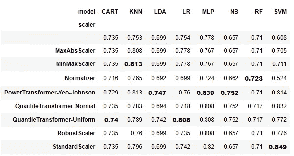

第一行，没有索引名称的一行，是没有应用任何缩放方法的算法。

```
import operatorcols_max_vals = {}
cols_max_row_names = {}
for col in list(pivot_t):
    row_name = pivot_t[col].idxmax()
    cell_val = pivot_t[col].max()
    cols_max_vals[col] = cell_val
    cols_max_row_names[col] = row_name

sorted_cols_max_vals = sorted(cols_max_vals.items(), key=lambda kv: kv[1], reverse=True)print("Best classifiers sorted:\n")
counter = 1
for model, score in sorted_cols_max_vals:
    print(str(counter) + ". " + model + " + " +cols_max_row_names[model] + " : " +str(score))
    counter +=1
```

每个模型的最佳分类器:

1.SVM +标准缩放器:0.849
2。MLP +电源变压器-Yeo-Johnson : 0.839
3。KNN + MinMaxScaler : 0.813
4。LR +量化转换器-统一:0.808
5。n b+ power transformer-Yeo-Johnson:0.752
6。LDA+power transformer-Yeo-Johnson:0.747
7。手推车+量化器-制服:0.74
8。射频+归一化因子:0.723

# 让我们分析结果

1.  **没有一个单一的缩放方法可以统治所有的人。**
2.  我们可以看到缩放改善了结果。SVM、MLP、KNN 和 NB 从不同的扩展方法中得到了显著的提升。
3.  请注意，NB、RF、LDA、CART 不受某些缩放方法的影响。这当然与每个分类器的工作方式有关。树不受缩放的影响，因为分割标准首先对每个要素的值进行排序，然后计算分割的基尼\熵。一些缩放方法保持这种顺序，因此准确度分数没有变化。
    NB 不受影响，因为模型的先验由每个类中的计数决定，而不是由实际值决定。线性判别分析(LDA)使用类之间的变化来找到它的系数(检查[这个](https://www.youtube.com/watch?v=azXCzI57Yfc)，所以缩放也无关紧要。
4.  一些缩放方法，如 QuantileTransformer-Uniform，不保留每个特征中值的确切顺序，因此即使在上述分类器中分数也会发生变化，而这些分类器对其他缩放方法是不可知的。

# 3.分类器+缩放+PCA

我们知道一些众所周知的 ML 方法如 PCA 可以从缩放中获益([博客](https://sebastianraschka.com/Articles/2014_about_feature_scaling.html))。让我们尝试将 PCA(n_components=4)添加到管道中，并分析结果。

```
import operator
temp = results_df.copy()
temp["model"] = results_df["Classifier_Name"].apply(lambda sen: sen.split("_")[1])
temp["scaler"] = results_df["Classifier_Name"].apply(lambda sen: sen.split("_")[0])def df_style(val):
    return 'font-weight: 800'pivot_t = pd.pivot_table(temp, values='CV_mean', index=["scaler"], columns=['model'], aggfunc=np.sum)
pivot_t_bold = pivot_t.style.applymap(df_style,
                      subset=pd.IndexSlice[pivot_t["CART"].idxmax(),"CART"])
for col in list(pivot_t):
    pivot_t_bold = pivot_t_bold.applymap(df_style,
                      subset=pd.IndexSlice[pivot_t[col].idxmax(),col])
pivot_t_bold
```

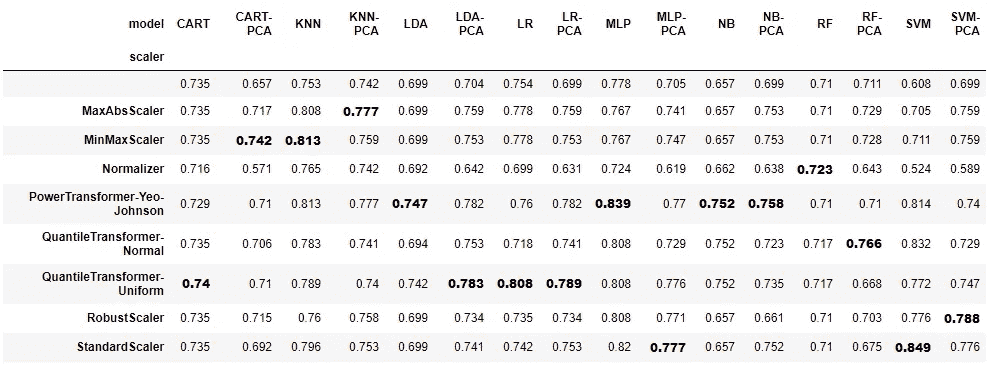

# 让我们分析结果

1.  大多数时候缩放方法使用 PCA 改进模型，**但是**没有具体的缩放方法负责。
    我们再来看“QuantileTransformer-Uniform”，这个方法得分最高的占大多数。
    在 LDA-PCA 中，它将结果从 0.704 提高到 0.783(准确度提高了 8%！)，但在 RF-PCA 中却让事情变得更糟，从 0.711 降到 0.668(准确率下降 4.35%！)
    另一方面，使用带有“QuantileTransformer-Normal”的 RF-PCA，将精度提高到 0.766(精度跃升 5%！)
2.  我们可以看到，PCA 只是提高了 LDA 和 RF，所以 PCA 不是一个神奇的解决方案。
    没事。我们没有超调 n_components 参数，即使我们这样做了，PCA 也不能保证改善预测。
3.  我们可以看到，StandardScaler 和 MinMaxScaler 仅在 16 个案例中的 4 个案例中取得最佳成绩。所以我们应该仔细考虑选择什么样的缩放方法，即使是默认的缩放方法。

**我们可以得出结论，尽管 PCA 是一种受益于缩放的已知成分，但没有一种缩放方法总能改善我们的结果，其中一些方法甚至会造成伤害(带标准缩放器的 RF-PCA)。**

**数据集在这里也是一个重要因素。为了更好地理解缩放方法对 PCA 的影响，我们应该对更多样化的数据集进行实验(类别不平衡、不同尺度的特征以及具有数值和分类特征的数据集)。我在第 5 节做这个分析。**

# 4.分类器+缩放+PCA+超参数调整

对于给定的分类器，不同的缩放方法之间的准确度分数有很大的差异。人们可以假设，当超参数被调整时，缩放技术之间的差异将是微小的，我们可以使用 StandardScaler 或 MinMaxScaler，就像在网络上的许多分类管道教程中使用的那样。让我们检查一下！

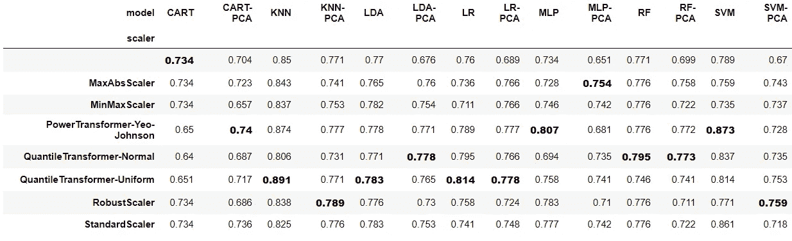

第一，NB 不在这里，那是因为 NB 没有参数可以调。

我们可以看到，与上一步的结果相比，几乎所有的算法都受益于超参数调整。一个有趣的例外是 MLP，结果更糟。这可能是因为神经网络很容易过度拟合数据(特别是当参数的数量远大于训练样本的数量时)，我们没有仔细地提前停止以避免它，也没有应用任何正则化。

然而，即使调整了超参数，使用不同缩放方法的结果之间仍然存在很大差异。如果我们将不同的缩放技术与广泛使用的标准缩放技术进行比较，当使用其他技术时，我们可以**获得高达 7%的精度提升** (KNN 列)。

**从这一步得出的主要结论是，即使调整了超参数，改变缩放方法也会显著影响结果。因此，我们应该将标度方法视为我们模型的一个关键超参数。**

第 5 部分包含对更多样化的数据集的更深入的分析。如果不想深究，可以直接跳到结论部分。

# 5.更多的数据集

为了更好地理解和得出更一般化的结论，我们应该用更多的数据集进行实验。

我们将在具有不同特征的几个数据集上应用分类器+缩放+PCA，如第 3 节，并分析结果。所有数据集均取自 Kaggel。

*   为了方便起见，我只从每个数据集中选择了数字列。在多元数据集(数值和分类要素)中，关于如何缩放要素一直存在争议。
*   我没有超调分类器的任何参数。

# 5.1 澳大利亚的降雨数据集

[链接](https://www.kaggle.com/jsphyg/weather-dataset-rattle-package#weatherAUS.csv)
**分类任务**:预测是不是要下雨了？
**度量**:精度
**数据集形状** : (56420，18)
**每个类的计数** :
否 43993
是 12427

这是一个 5 行的例子，我们不能在一张图中显示所有的列。

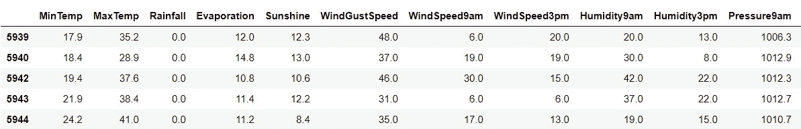

```
dataset.describe()
```

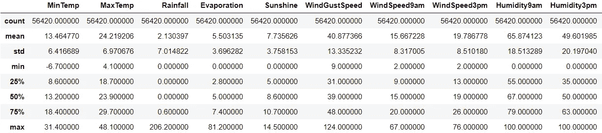

我们怀疑，由于特征的不同比例，缩放将改善分类结果(检查上表中的最小最大值，它甚至在一些其余的特征上变得更差)。

**结果**

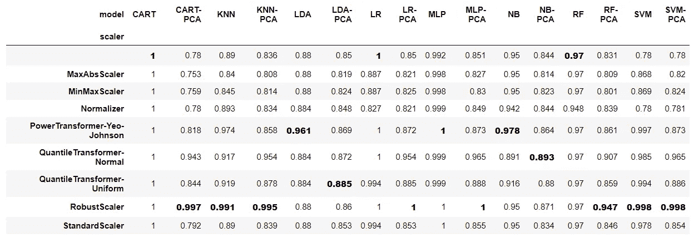

**结果分析**

*   我们可以看到 StandardScaler 从未得到最高分，MinMaxScaler 也是如此。
*   我们可以看到标准定标器和其他方法之间的**差异高达 20%** 。(购物车-PCA 列)
*   我们可以看到缩放通常会改善结果。以 SVM 为例，**从 78%跃升至 99%。**

# 5.2 银行营销数据集

[链接](https://www.kaggle.com/henriqueyamahata/bank-marketing)
**分类任务**:预测客户是否认购了定期存款？
**指标** : AUC **(数据不平衡)**
**数据集形状** : (41188，11)
**每个类的计数** :
否 36548
是 4640

这是一个 5 行的例子，我们不能在一张图中显示所有的列。

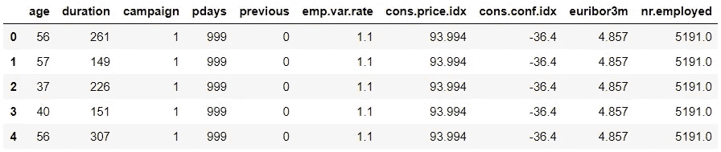

```
dataset.describe()
```

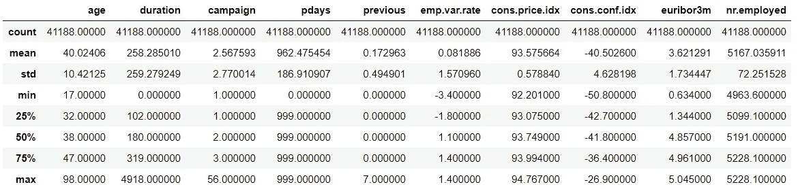

同样，不同比例的特征。

**结果**

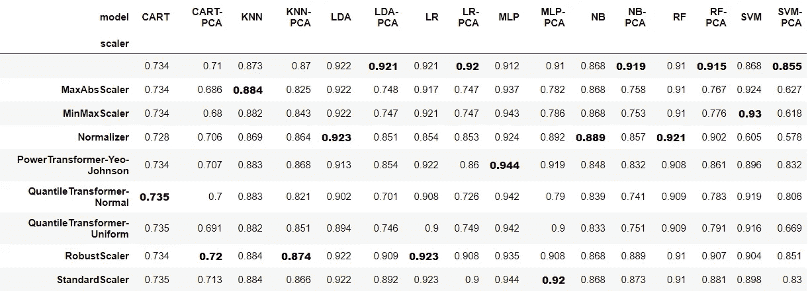

**结果分析**

*   我们可以看到，在该数据集中，即使要素处于不同的比例上，使用 PCA 进行缩放并不总能改善结果。**然而，**每个 PCA 列中的第二好的分数非常接近最好的分数。这可能表明超调 PCA 的组件数量并使用缩放将比根本不缩放改善结果。
*   同样，没有一个单一的缩放方法脱颖而出。
*   另一个有趣的结果是，在大多数模型中，所有的缩放方法都没有产生太大的影响(通常有 1%-3%的改善)。让我们记住，这是一个不平衡的数据集，我们没有超调参数。另一个原因是 AUC 分数已经很高了(~90%)，所以更难看到重大改善。

# 5.3 斯隆数字巡天 DR14 数据集

[链接](https://www.kaggle.com/lucidlenn/sloan-digital-sky-survey)
**分类任务**:预测一个物体是星系、恒星还是类星体。
**度量**:精度(多类)
**数据集形状** : (10000，18)
**每个类的计数** :
星系 4998
恒星 4152
类星体 850

这是一个 5 行的例子，我们不能在一张图中显示所有的列。

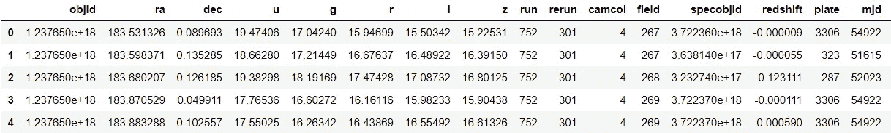

```
dataset.describe()
```

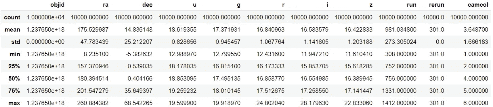

同样，不同比例的特征。

**结果**

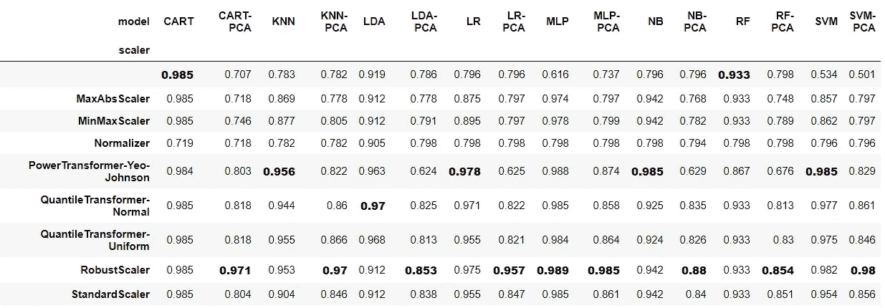

**结果分析**

*   我们可以看到缩放极大地改善了结果。我们可以期待它，因为它包含了不同尺度的特征。
*   我们可以看到，当我们使用 PCA 时，RobustScaler 几乎总是获胜。这可能是由于该数据集中的许多异常值移动了 PCA 特征向量。另一方面，当我们不使用 PCA 时，那些异常值不会产生这样的影响。我们应该做一些数据探索来验证这一点。
*   如果我们将 StandardScaler 与另一种缩放方法进行比较，精确度会有 5%的差异。因此，这是需要试验多种缩放技术的另一个指标。
*   PCA 几乎总是受益于缩放。

# 5.4 收入分类数据集

[链接](https://www.kaggle.com/lodetomasi1995/income-classification)
**分类任务**:预测收入是否> 50K，< =50K。
**度量** : AUC **(不平衡数据集)**
**数据集形状** : (32561，7)
**每个类的计数**:
<= 50K 24720
>50K 7841

这是一个 5 行的例子，我们不能在一张图中显示所有的列。

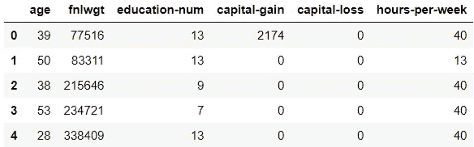

```
dataset.describe()
```

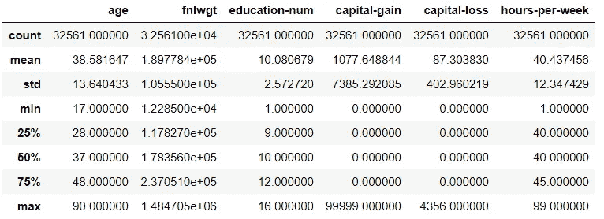

同样，不同比例的特征。

**结果**

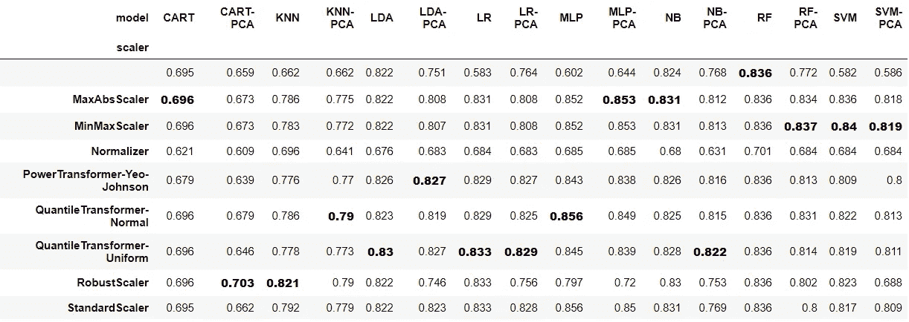

**结果分析**

*   同样，我们有一个不平衡的数据集，但我们可以看到缩放在改善结果方面做得很好(高达 20%！).这可能是因为与银行营销数据集相比，AUC 得分较低(~80%)，因此更容易看到重大改进。
*   即使没有突出显示 StandardScaler(我在每个专栏中只突出显示了第一个最好的分数)，但在许多专栏中，它达到了与最好相同的结果，但并不总是如此。从运行时间的结果(没有出现在这里)，我可以告诉你，运行 StandatdScaler 比许多其他的 Scaler 快得多。因此，如果你急于得到一些结果，这可以是一个很好的起点。但是如果你想从你的模型中榨取每一个百分比，你可能想体验多种缩放方法。
*   同样，没有单一的最佳扩展方法。
*   PCA 几乎总是受益于规模化

# 结论

*   尝试多种缩放方法可以显著提高您在分类任务中的得分，即使您的超参数已经调优。**所以，你应该把缩放方法作为你的模型的一个重要的超参数。**
*   缩放方法对不同的分类器有不同的影响。基于距离的分类器，如 SVM、KNN 和 MLP(神经网络)极大地受益于缩放。但是，即使树(CART，RF)不知道某些缩放方法，也可以从其他方法中受益。
*   了解模型\预处理方法背后的数学基础是理解结果的最佳方式。(例如，树是如何工作的，为什么一些缩放方法不会影响它们)。当你的模型是随机森林时，如果你知道不应用 StandardScaler，也可以节省你很多时间。
*   像 PCA 这样的预处理方法，已知受益于缩放，但确实受益于缩放。**如果不符合**，可能是由于 PCA 的成分数参数设置错误、数据中存在异常值或缩放方法选择不当。

如果你发现一些错误或者有改进实验的覆盖面或有效性的建议，请通知我。