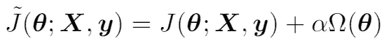
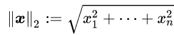
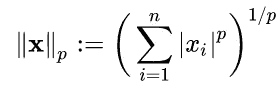
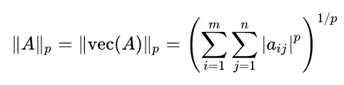
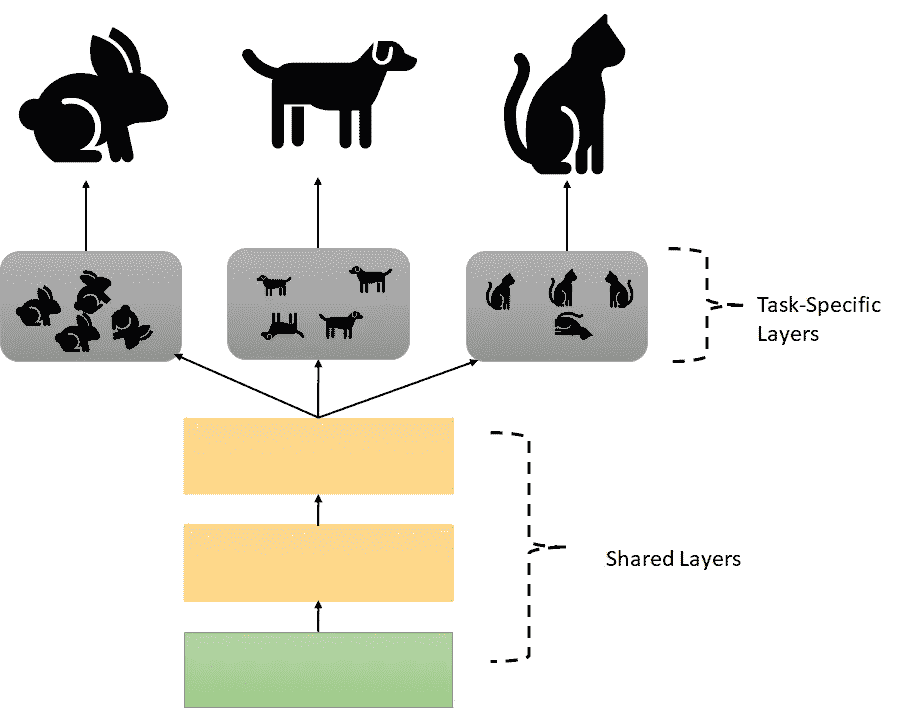
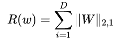

# 统计规范如何改进建模

> 原文：<https://towardsdatascience.com/norms-penalties-and-multitask-learning-2f1db5f97c1f?source=collection_archive---------21----------------------->

# 介绍

正则化器通常用于机器学习中，根据统计规范或先前的假设将模型的能力限制在一定范围内。这增加了模型假设空间中一个解决方案相对于另一个解决方案的偏好，或者学习算法被允许选择作为解决方案的函数集[1]。这种方法的主要目的是提高模型的**概化能力，或者提高模型在以前看不到的数据上的性能。使用正则化器提高了泛化能力，因为它减少了模型对训练数据的*过度拟合* 。**

最常见的做法是在学习过程中对目标函数增加一个范数惩罚。下面的等式是正则化的目标函数:

Regularized objective function adding a penalty to the original objective function. From [1].

原始目标函数 *J、*是参数θ、真实标签 y 和输入 x 的函数。正则化器由罚范数函数ω和对ω的贡献进行加权的罚α组成。下一节将介绍一些常用的惩罚规范。

# 常用的统计规范

范数是测量向量的*长度*或*大小*的一种方法。向量范数是使用某种度量来计算的，这种度量可以概括向量离原点的距离。这些不同的度量通常是 L 范数和 L 范数。

**L 范数**是通过*绝对差之和*计算出来的，通常被称为**曼哈顿范数***:*|***x***||₁= |*x*₁|+ |*x*₂|+|*x*₃|+..+| *x* ₙ|其中| ●|是给定变量的绝对值。虽然这是向量范数，但应用于矩阵时，计算略有不同。例如矩阵 l 的范数是||A|| = |a₁₁|+|a₁₂| +…+|aᵢⱼ|.

**L 范数**也就是通常所说的**欧几里德范数**。本定额测量从原点到点 ***x*** *的距离。*

The Euclidean Norm for a vector.

**L∞范数**或 **max-norm** 测量向量的最大值作为长度:| |**t49】xt51】| | |∞= max(|*x*₁|+ |*x*₂|+|*x*₃|+..+| *x* ₙ|).**

这些标准及其变化可以使用 **Lᵖ** 或 p 标准进行测量。 **p-norm** 通过以下方式测量:

The p-norm for vectors. From [Wikipedia](https://en.wikipedia.org/wiki/Norm_(mathematics)#Euclidean_norm).

The p-norm for matrices. From [Wikipedia](https://en.wikipedia.org/wiki/Matrix_norm).

当 *p* =1 时，我们得到 L，当 *p* =2 时，我们得到 L 范数。当 *p* 接近无穷大时，你得到 L∞范数。

## 规范是如何用于正则化的

**权重衰减**是一种优先选择小于 L 范数的权重的方法，使权重更接近原点(见图 1)。结果是，在执行梯度更新之前，学习规则在每一步都以常数因子倍增地缩小权重[1]。换句话说，它将权重限制在由 L 范数限定的区域内。

Figure 1\. A toy visual example of weight decay.

不同的ω范数选择会导致不同的首选解决方案(见图 2)。L 和 L 罚范数的行为之间的一个共同区别是 L 导致更稀疏的解，这意味着一些参数的最佳值是 0。这通常用于特征选择，其中移除参数最佳为 0 的特征。

Figure 2\. A toy visual example of other choices for Ω.

**多任务学习**是同时学习几个相似任务的学习问题。例如，在多类学习问题中，任务可以是不同的类。对于每项任务，学习一组不同的参数。这个想法是在任务之间共享信息，他们可以从中受益。换句话说，“在解释与 different 任务相关的数据中观察到的变化的因素中，一些因素是两个或更多任务共有的”[1]。这种方法的目标是提高整体的可推广性。

Figure 3\. Toy visualization of Multi-task learning.

通常使用关于任务如何相互关联的先验知识来约束每个任务的不同权重向量(再次参见图 2)。这些约束可以与上面提到的相同，例如 L 范数。这通常是通过对矩阵的列应用范数来实现的。

一个示例是 L 和 L 范数的组合，其中 L 范数应用于每一列，而 L 范数应用于所有列:

The penalty function where R is equivalent to Ω.

# 结论

还有其他不涉及统计规范的正则化方法，如添加噪声、提前停止学习算法和数据扩充。然而，本文主要关注使用统计规范向学习算法添加约束，作为提高模型可推广性的一种手段。

# 参考

[1]伊恩·古德费勒、约舒阿·本吉奥和亚伦·库维尔。*深度学习*。麻省理工出版社。2016.