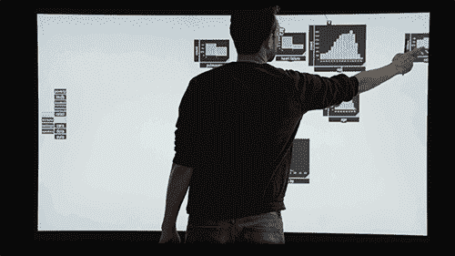
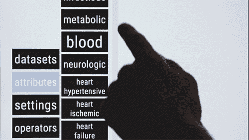
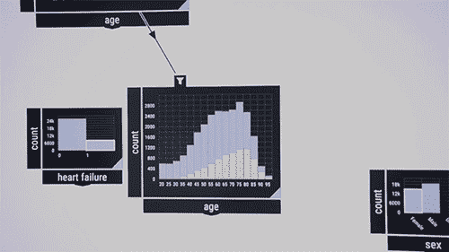

# 北极星——麻省理工学院和布朗大学最新最棒的拖放式数据分析

> 原文：<https://towardsdatascience.com/northstar-the-latest-greatest-in-drag-and-drop-data-analytics-from-mit-and-brown-university-4946dd1107cb?source=collection_archive---------12----------------------->

## 来自麻省理工学院和布朗大学的研究人员开发了一个交互式数据分析系统，该系统运行在触摸屏上，让每个人都可以使用机器学习模型来预测医学研究、销售等。

我们不断听到术语**‘面向所有人的数据科学’**它真正的含义是什么？
从企业到当地的店主，每个人都有一些问题，他们希望用数据来解决，但尽管企业可能能够聘请数据科学家来为他们做这项工作，但当地的咖啡店老板可能没有这种奢侈。
我们的目标是让数据科学变得如此简单，每个人都可以在日常生活中利用它做出数据驱动的决策。承认大问题可能仍然需要大的解决方案，但是解决日常问题应该不难。正是在消除这一困难的过程中，北极星迈出了重要的一步。

Northstar’s aim is to democratize data science by making it easy to do complex analytics, quickly and accurately.

# 这是什么？

北极星不是突然出现震惊世界的东西。这是麻省理工学院和布朗大学的研究人员多年合作的结果，产生了这个**交互式数据科学系统**，它**在云**中运行，但有一个界面**支持任何触摸屏**设备，包括智能手机和大型交互式白板。
用户输入系统数据集，并使用手指或数字笔在用户友好的界面上操作、组合和提取特征，以揭示趋势和模式。

ACM SIGMOD 大会上展示了一个新组件，称为“**虚拟数据科学家**的 VDS”，它可以立即生成机器学习模型，以在数据集上运行预测任务。VDS 基于一种越来越受欢迎的人工智能技术，称为自动机器学习(AutoML)，让数据科学知识有限的人训练人工智能模型，根据他们的数据集做出预测。**目前，该工具领先于 DARPA D3M 自动机器学习竞赛**，该竞赛每六个月评选一次性能最佳的 AutoML 工具。

> “即使是不了解数据科学的咖啡店老板也应该能够预测他们未来几周的销售额，以确定购买多少咖啡，在有数据科学家的公司中，数据科学家和非专家之间有很多交流，所以我们也可以将他们带到一个房间一起进行分析。合著者、北极星项目长期负责人蒂姆·菲利普·克拉斯卡说

# 它是如何工作的？

**底部视频中演示的使用案例是必看的。**

**加载数据—** 北极星启动时为**空白，白色界面**。用户将数据集上传到系统中，然后可以探索、连接、过滤和执行各种类型的 EDA，并具有类似于 Power BI 或 Tableau 的**可视化功能。**

> “这就像一个巨大的无界画布，您可以在其中展示您想要的一切，然后，您可以将事情联系在一起，以创建有关您的数据的更复杂的问题。”“北极星”交互界面的主要发明者兹格拉根说。

**近似 AutoML —** 借助 VDS，用户现在还可以通过定制适合其任务的模型来对该数据进行预测分析，例如数据预测、图像分类或分析复杂的图形结构。
系统将**自动寻找性能最佳的机器学习管道**，以标签的形式呈现，并不断更新准确率。用户可以随时停止这一过程，优化搜索，并检查每个模型的错误率、结构、计算和其他内容。

> “我和我的合著者花了两年时间设计了来模仿数据科学家的思维方式”**尚说**

该系统根据各种编码规则，立即识别哪些模型和预处理步骤应该或不应该在某些任务上运行。它首先从那些可能的机器学习管道的大型列表中进行选择，并在样本集上运行模拟。这样做时，它会记住结果并优化选择。在提供快速近似结果后，系统在后端对结果进行细化。但是最终的数字通常非常接近第一近似值。

> “对于使用预测器，你不会想等四个小时才得到第一个结果。您希望已经看到发生了什么，如果您发现了错误，您可以立即纠正它。这在任何其他系统中通常都是不可能的。”**菲利普·克拉斯卡说**

研究人员在 300 个真实世界数据集上评估了该工具。与其他最先进的 AutoML 系统相比，VDS 近似法同样精确，但在几秒钟内生成，这比其他需要几分钟到几小时的工具要快得多。

# **下一步是什么？**

研究人员正在寻求增加一个功能，提醒用户潜在的数据偏差，异常值或错误。新用户可能无法识别数据中存在的此类问题，因此他们的分析将会偏离正轨。

> “如果你是一个新用户，你可能会得到结果，并认为它们很棒，但我们可以警告人们，事实上，数据集中可能有一些异常值，这可能表明有问题。”**菲利普·克拉斯卡说。**

[Northstar in all it’s glory](https://vimeo.com/342787403)

# 参考

官方麻省理工学院关于北极星
[Vimeo](https://vimeo.com/342787403)
[蒂姆·菲利普·克拉斯卡的新闻。北极星:交互式数据科学系统。PVLDB，11(12):2150–2164，2018](http://www.vldb.org/pvldb/vol11/p2150-kraska.pdf)