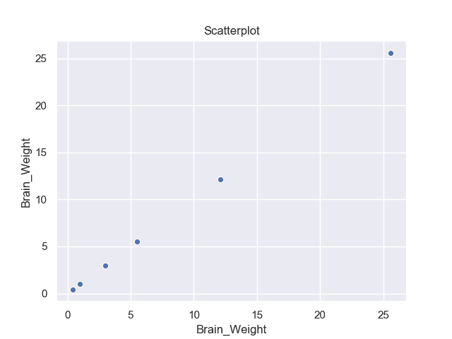
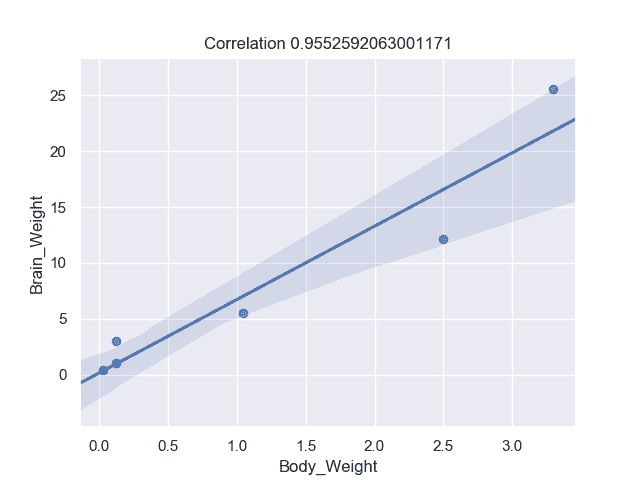
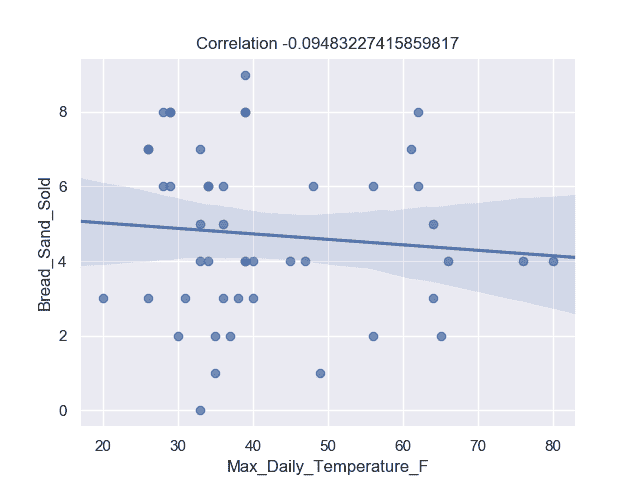
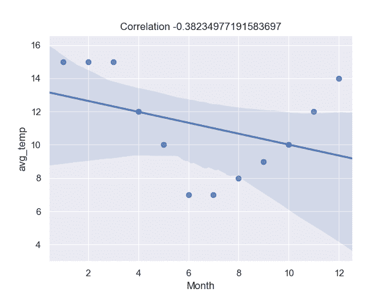
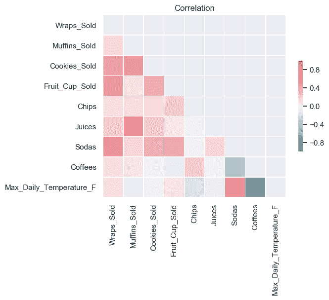
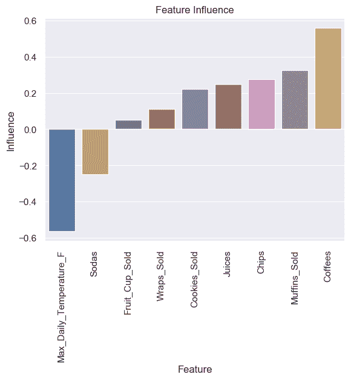
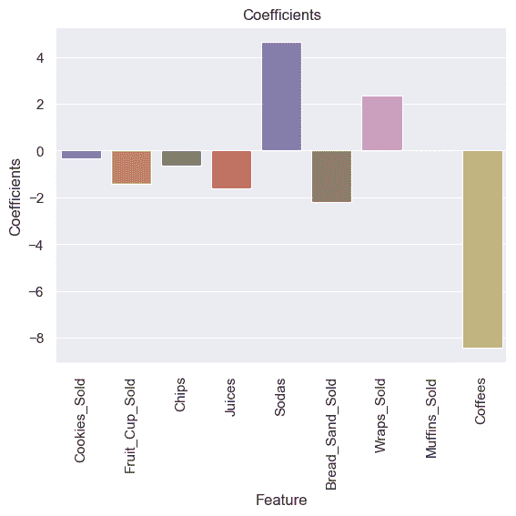

# 不是 1，不是 2…而是 5 种关联方式

> 原文：<https://towardsdatascience.com/not-1-not-2-but-5-ways-to-correlate-6ac92cf42f0f?source=collection_archive---------6----------------------->

## 寻找相关性的各种算法

Photo by [Jonathan Petersson](https://unsplash.com/@grizzlybear?utm_source=unsplash&utm_medium=referral&utm_content=creditCopyText) on [Unsplash](https://unsplash.com/s/photos/five?utm_source=unsplash&utm_medium=referral&utm_content=creditCopyText)

**关联**是指两个事物之间的*相互关系*或关联。几乎在任何业务中或出于个人原因，用与他人的关系来表达某事是有用的。例如，当营销在电视广告上花费更多时，销售额可能会增加，或者当温度升高时，冰淇淋的销售额会增加。通常，相关性是理解这些关系并随后构建更好的业务和统计模型的第一步。

那么，为什么相关性是一个有用的指标呢？

相关性可以(但通常不，正如我们将在下面的一些例子中看到的)表明因果关系的存在

相关性有助于从一个量预测另一个量

相关性被用作许多其他建模技术的基本量和基础

有各种算法来寻找相关性。*然而，理解需要相关性的原因是选择正确算法的关键*。在本文中，我们将看到寻找相关性的不同算法和技术，以及如何选择合适的算法来确定相关性的提示和技巧

# 1.散点图——基本技术

散点图是理解两个事物之间是否有任何关联或关系的最简单的方法之一。为了举例说明，让我们来看一个数据集，它包含一些小动物的体重和大脑重量的信息。下面显示了该数据集中的一个示例

Sample Body weight and brain weight (Image by author)

看着这些数据，我们可以提出这样一个问题:*体重和大脑重量之间有什么联系或关系吗？查看是否存在任何关联或关系的最简单方法之一是绘制体重与大脑重量的散点图。正如我们从下面的散点图中看到的，体重增加，大脑的重量往往会增加*

Scatter Plot (Image by author)

# 2.皮尔逊相关系数——有可测量的东西

散点图观想技术可以给你一种“感觉”,不管有没有关系。然而，它不允许具体衡量这种关系的强度。这就是算法发挥作用的地方。在算法术语中，关系的强度被称为相关系数。最广泛使用的测量相关系数的算法之一是皮尔逊相关。皮尔逊相关度量连续变量之间的线性关联。换句话说，这个系数量化了两个变量之间的*关系可以用线*描述的程度。值得注意的是，虽然相关性可以有多种解释，但卡尔·皮尔逊在 120 多年前开发的同一公式至今仍被最广泛地使用

让我们用皮尔逊相关来找出体重和大脑重量之间的关系强度。皮尔森关联将试图拟合体重和大脑重量之间的直线。这条线的斜率给出了关系的强度

下图显示了体重与大脑重量之间的散点图，以及一条适合两点之间的线。线的斜率是 0.955，这是皮尔逊相关系数。皮尔逊系数值在-1 和 1 之间。值-1 表示强负相关，值 0 表示没有相关，值 1 表示强正相关。因此，在本例中，我们的相关值为 0.955，这表明体重和大脑重量之间有很强的正相关性。事实上，我们可以得出结论，在给定的数据中，大脑重量随着体重的增加而增加

Pearson Correlation (Image by author)

现在让我们再举一个产品销售的例子。如下图所示，数据集包含面包、卷饼、松饼等产品的销售额以及当天的温度

下面还显示了一个负相关的例子。下图中使用的数据是咖啡销售额与温度的关系(单位为华氏度)。

Sales and Temperature data (Image by author)

计算出的皮尔逊系数为-0.741，表明负相关。这意味着随着温度的升高，咖啡的销量会下降。

Negative Correlation (Image by author)

下面给出了一个不相关的例子。这个例子对应于有温度的面包的销售。正如你所看到的，直线拟合几乎是直的。皮尔逊相关系数为-0.09，几乎为零。在这种情况下，两个变量之间没有相关性

No Correlation (Image by author)

在这里，您看到了相关性的基础知识，以及我们如何使用散点图和皮尔逊系数来计算相关性。然而，个人相关性有一些缺点，尤其是当数据是非线性的时候。作为一个例子，让我们来看一个数据集，它有墨尔本一个月的平均温度。数据表明从一月到三月气温很高。然后从四月到十月下降；然后在 11 月和 12 月再次上升

该数据集是非线性数据的一个示例，其中温度不遵循线性路径，而是随着月份的变化而上升、下降和上升。如果计算皮尔逊系数的话，会是-0.38，也就是说月份和温度有些负相关。这意味着从一月到十二月气温会下降。然而，事实并非如此。所以皮尔逊系数的缺点是当数据是非线性的时候它就不起作用了

Non-linear data (Image by author)

# 3.使用相关矩阵—变大…矩阵风格

上述技术，如散点图和皮尔逊相关显示两个变量之间的相关性。如果您的数据集有许多变量，您可能有兴趣找出每个变量组合之间的相关性。为每个组合制作散点图或皮尔逊相关可能很麻烦，尤其是当数据集有许多变量时。在这种情况下，相关矩阵非常有用。

让我们借助产品销售的数据集来说明相关矩阵。正如您在上表中看到的，有许多列。计算所有列组合之间的相关性将非常有用，例如咖啡销售与温度、松饼销售与温度、咖啡与松饼等。然而，在所有组合之间制作散点图或皮尔逊相关性将会使您疲劳和困倦。所以让我们用相关矩阵来保持活跃和清醒。

下面显示的是每个变量组合之间的相关矩阵。相关矩阵以热图的形式显示。单元格越红，表示正相关性越高。单元格越蓝意味着负相关性越高。例如，我们看到温度和汽水有很强的正相关性。此外，正如已经观察到的，温度和咖啡有负相关。同样，松饼和饼干也有很强的正相关性。

因此，相关矩阵是一个很好的视图，可以了解许多列的相关性，而不必单独计算每个组合的相关性。

Correlation Matrix (Image by author)

# 4.主成分分析(PCA)——发现相关性的另一种有趣的方法

相关性算法不是计算相关性的唯一算法。还有一些其他有趣的方法。一种这样的算法是主成分分析(PCA)。这通常用于数据集维数非常高时的降维。它用于将具有许多列的数据集减少到较少的列，而不丢失数据的本质。作为副产品，它也给出了变量之间的相关性

我们将在产品销售数据集上使用 PCA。这个数据集几乎有 30 列。不可能对 30 列进行数据可视化。所以我们会用 PCA 把数据降维，而不会失去用 PCA 得到的数据的本质。

在我们的产品销售示例中，您可以将 30 列减少到更少的列(例如 2 或 3 列)。在这样做的时候，主成分分析也给出了在特征影响分数方面在实现降维中起重要作用的变量。我们产品销售栏目的特色影响力如下图所示。负侧的列彼此相关，正侧的列彼此相关。所以你可以看到温度和苏打水是正相关的，松饼和咖啡也是正相关的。还有，这意味着温度和咖啡是负相关的。

这些结果与我们用皮尔逊相关技术得到的结果相同。

Feature Influence on dimension reduction (Image by author)

# 5.套索回归…只看到重要的东西

为了继续我们寻找不同方法来给出相关性的探索，下一站是套索回归。该算法是普通最小二乘法(OLS)的变体。OLS 算法试图拟合两个变量之间的直线，因此本质上是试图找到两个变量之间的相关性。套索是 OLS 的一个变体，它去掉了不相关的变量，从而给了我们相关的变量。

套索算法采用一个目标变量(Y)和多个独立变量(X1，X2 等……)。该算法将试图找出所有自变量与目标变量之间的相关性。Lasso 将尝试计算每个独立变量的系数，该系数给出了与目标变量相关的指示

如果我们以产品销售为例，目标变量(Y)可以是温度，所有独立变量都可以是(咖啡销售、果汁销售等)。Lasso 的结果是独立变量的系数，如下所示

你可以看到咖啡的系数是负的，这意味着咖啡和温度是负相关的。同样，汽水的系数也很高，这意味着汽水和温度正相关

Lasso Regressor coefficient for variables (Image by author)

在这个故事中，你们对相关性有了一个大概的了解，有五种不同的方法可以用来确定相关性。还有其他方法，如斯皮尔曼相关以及 SVM 或神经网络来寻找非线性相关性

你最终将使用的算法的选择取决于你试图解决什么问题，但是看到和匹配不同方法的结果总是好的。如果结果彼此一致，那么你就在正确的轨道上。

# 额外资源

# 网站(全球资讯网的主机站)

你可以访问我的网站进行零编码分析。[https://experiencedatascience.com](https://experiencedatascience.com)

请**订阅**每当我发布一个新的故事时，请及时通知我。

 [## 每当 Pranay Dave 发表文章时，您都会收到电子邮件。

### 每当 Pranay Dave 发表文章时，您都会收到电子邮件。注册后，如果您还没有，您将创建一个中型帐户…

pranay-dave9.medium.com](https://pranay-dave9.medium.com/subscribe) 

你也可以通过我的推荐链接加入 Medium。

 [## 通过我的推荐链接加入 Medium—Pranay Dave

### 作为一个媒体会员，你的会员费的一部分会给你阅读的作家，你可以完全接触到每一个故事…

pranay-dave9.medium.com](https://pranay-dave9.medium.com/membership) 

https://www.youtube.com/c/DataScienceDemonstrated 的 YouTube 频道
这里是我的 Youtube 频道
[的链接](https://www.youtube.com/c/DataScienceDemonstrated)