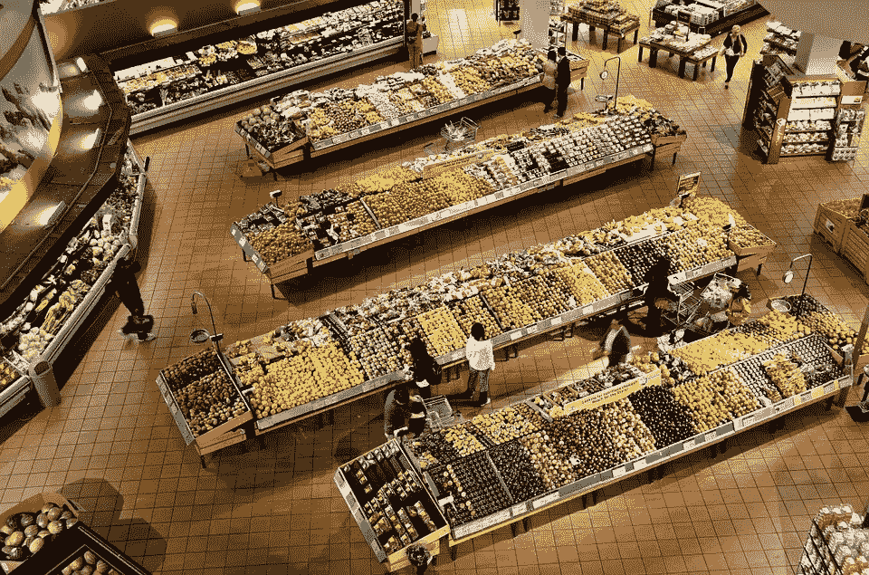

# “并非所有数据都是平等的”

> 原文：<https://towardsdatascience.com/not-all-data-is-equal-63ad1b53b086?source=collection_archive---------33----------------------->

## **人在回路中的机器学习专家轶事，作者 Jennifer Prendki**

我正在分享我的书《人在回路中的机器学习》中的第一个专家轶事。我有幸与机器学习社区的许多领导者聊过他们的经历。许多人和我分享了值得更多人关注的个人趣闻。

对于书中提到的每个领导者，有两个选择标准:

1.  **他们早期的职业是工程师或科学家。书中所有的专家都是软件工程师、物理学家、语言学家或类似的人，在他们职业生涯的早期阶段。因此，他们知道注释数据和/或构建机器学习模型是什么样的。**
2.  他们成立了一家使用机器学习的公司。因此，专家们也知道考虑推出能够影响现实世界的机器学习产品意味着什么。

对于想在数据科学领域发展的人来说，所有的领导者都是很好的榜样。

第一个轶事伴随着关于主动学习的章节:为人类评论选择正确数据的过程。大多数部署的机器学习模型使用监督学习，有数千甚至数百万人类标记的数据项。主动学习确定*哪些*原始数据项最适合人工查看和注释。

第一位专家是 Alectio 的创始人兼首席执行官 Jennifer Prendki。她曾在 Atlassian、Figure Eight 和沃尔玛领导数据科学团队，并拥有粒子物理学博士学位。珍妮弗的公司，Alectio ，专门研究数据效率，帮助机器学习团队用更少的数据建立他们的模型。

# **“并非所有数据都相等”**

> 如果你关心你的营养，你不会去超市，从货架上随机选择商品。你可能最终通过吃超市货架上的随机物品来获得你需要的营养，但是，在这个过程中你会吃很多垃圾食品。我认为很奇怪的是，在机器学习中，人们仍然认为“随机抽样超市”比弄清楚他们需要什么并在那里集中精力更好。
> 
> 我建立的第一个主动学习系统是必然的。我正在构建机器学习系统，以帮助一家大型零售店确保当有人在网站上搜索时，出现正确的产品组合。几乎就在一夜之间，一家公司的重组意味着我的人工标签预算减少了一半，而我们需要贴标签的库存增加了 10 倍。因此，我的标签团队每件商品的预算只有我们之前的 5%。我创建了我的第一个主动学习框架来发现哪一个是最重要的 5%。结果比预算更大的随机抽样要好。从那以后，我在我的大部分项目中使用了主动学习，因为不是所有的数据都是相等的！
> 
> 詹尼弗·普伦斯基，《人在回路中的机器学习》，罗伯特·芒罗，曼宁出版公司

You don’t go shopping by randomly sampling from every shelf, so why are you doing this with your data?

我非常感谢 Jennifer 与我以及我的书和这篇文章的读者分享她的专业知识！

有关主动学习的更多信息，请参见我最近分享的多样性抽样和不确定性抽样的备忘单:

 [## 多样性抽样备忘单

### 主动学习的四种常见多样性抽样策略的快速参考。

towardsdatascience.com](/https-towardsdatascience-com-diversity-sampling-cheatsheet-32619693c304)  [## 不确定性采样备忘单

### 用于主动学习的四种常见不确定性抽样策略的快速参考。

towardsdatascience.com](/uncertainty-sampling-cheatsheet-ec57bc067c0b) 

## 你的数据已经有偏差了

许多数据科学家坚持认为随机抽样仍然是他们的首选，因为他们可能会通过主动学习来偏向他们的数据。我认为这是看待你已有数据的错误方式。

继续类比，超市不是食品的无偏样本。首先，有各种各样的因素决定什么会出现在货架上，包括商店的位置、一年中的时间、特定的供应商合作关系、促销和预期利润。

原始数据可能也是如此:有许多因素导致了您可用的原始数据的创建和存储，并且您的原始数据有可能以许多不同的方式过采样和欠采样。正如我在书中指出的，数据中的偏差通常与现实世界中的偏差相关联，因此，如果您不注意如何处理您的数据注释策略，您就有重复或放大现实世界中的偏差的风险。

我建议您假设您的原始数据已经由于最初生成数据的过滤和采样技术而存在偏差。主动学习是帮助你的数据更加公平的一种方式，同时也让你的模型更加准确。

罗伯特·芒罗

2019 年 11 月