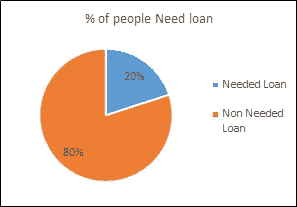
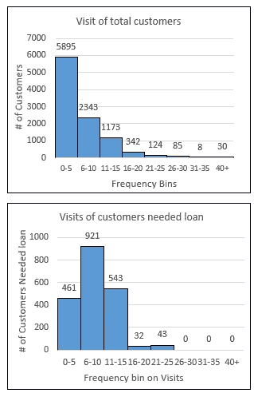
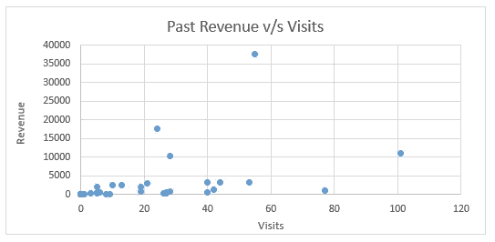

# 并不总是需要预测性分析，探索性分析可以创造奇迹

> 原文：<https://towardsdatascience.com/not-always-predictive-analytics-is-required-exploratory-analysis-can-do-wonders-c1a8d795a4f2?source=collection_archive---------16----------------------->

## 探索性数据分析

在这个人人都在谈论 ML-Al 驱动的东西的时代，人们不太关心探索性的数据分析。

我经常看到那些刚刚开始数据分析或数据科学职业生涯的人，他们总是倾向于建立模型，经常谈论 ML-AI，但很少关注探索性的数据分析。

但是，在转向 ML-AI 算法之前，人们必须理解探索性数据分析的重要性，因为它提供了如此多的数据信息，它们的特征可以为业务产生许多见解。

探索性数据分析的基本步骤

1.  **了解您的数据**:任何数据驱动的任务的第一步也是最重要的一步是了解您的数据集。寻找几个问题的答案:

a)这些数据是怎么回事？

b)有多少个变量？

c)不同类型的变量，如连续变量、分类变量、顺序变量等。

d)您的回应/目标变量是什么？它有多少面旗帜？

让我们为访问个人贷款部分的现有客户获取一个样本数据，我们需要知道，个人贷款的潜在候选人是谁？

Sample data

有三个连续变量——访问量、贷款计算器页面上的浏览量、过去的收入和三个分类变量——国家、现有贷款、贷款需求。

这里，目标变量是需要贷款，它只有两个标志:是，否

**2。探索分类变量**:现在你已经理解了你的数据，接下来是时候识别分类变量下的数据模式了。例:需要贷款的客户的数量和百分比。

从分类变量中提取信息的方法有多种，*可视化*和列联表是重要的方法之一。

条形图和饼图是(众多图表中)最重要的两种图表，有助于彻底分析分类变量。

Pie Chart showing the distribution of customers

在我们的例子中，饼图可以告诉我们需要贷款的人与不需要贷款的人的比例。所以我们可以看到，在我们现有的客户中，只有一小部分人需要个人贷款。

Bar Chart showing breakup by country and status

而在另一边，一个条形图显示了国家间的划分，因此，可以给我们关于分布的信息。在这里，我们可以看到英国是最需要贷款的国家，其次是德国。

另一种方法是，当您需要表格格式的数字时，创建列联表，在一个地方提供比例和绝对信息。

Contingency table with a loan against the country

在我们的案例中，我们可以看到，大多数线索来自英国，但德国需要贷款的人的比例更高。

3.**探索连续变量**:同样在连续变量的情况下，我们有图形可视化以及其他描述性统计方法的可行性。

在可视化的情况下，直方图和箱线图是非常方便和有见地的。它告诉你变量的分布和它的范围。它还有助于发现数据集中的异常值。

Frequency Histogram

在这种情况下，通过查看客户在贷款计算器页面 wrt #上的视图直方图，我们了解到，大约 60%的客户在此期间的访问次数少于 6 次。

在查看需要贷款的人的直方图时，我们可以看到没有客户的访问次数超过 25 次，这意味着他们可能是经常与我们交易但不需要贷款的用户。

在进行描述性统计时，还可以查看*最大值、最小值、平均值、四分位数、十分位数、*等，从而可以收集关于数据的大量信息。

**4。探索多元关系**:在此之下，我们建立多个变量之间的关系，试图找出不同变量之间的关系。

散点图是推断多元关系的最佳可视化方法之一。这是两个变量之间的关系图，有助于我们理解两个变量之间是否有任何关系。关系可以是线性的，也可以是非线性的。

Scatter Plot

因此，在这里我们可以推断，在过去的收入和客户的访问之间存在线性关系。越来越多的游客给这个行业带来了越来越多的收入。

除此之外，我们可以简单地寻找两个变量之间的相关性。相关性越高，变量之间的关系越强。

5.**衍生新变量**:模型构建中的一项重要任务是特征工程(创建新变量)，这有助于发现更多关于数据的逻辑信息。分析师必须找到在可用数据集中设计新变量的方法。它可以是分类变量，也可以是连续变量。

在我们的数据集中，由于是关于个人贷款的信息，我们可以假设大多数客户会在下班时间寻找这些信息。所以我们可以设计新的变量

a)“一天的类型”——工作日/周末

b)“一天中的某个时间”——办公时间/个人时间

c)“电子邮件 Id 类型”——个人/企业

d)“访问过的贷款计算器页面”——是/否

现在，让我们看看上面创建的变量的描述性统计数据。

Contingency table for Visited loan page and Type of Hour

因此，上面的应急表为寻找贷款的用户提供了很好的洞察力。因此，如果您需要在短时间内扭转局面，那么您可以对企业说，任何在个人时间内查找信息并访问过贷款计算器页面的用户，都是实际查找贷款的潜在目标。因此，这种有用的见解可以通过 EDA 交付。

额外收获:有时，它也有助于发现异常磁场。例如:如果您的数据集包含位置的 pin 码(数值)，则默认情况下，该工具会将其视为连续变量，但您可能希望将其视为分类变量来查找地理混合。当你做探索性的数据分析时，这种微小但不规则的事情可以被识别出来。

因此，探索性数据分析是数据建模中最重要和不可或缺的部分之一。即使你不做预测建模，它也能帮助你深入了解数据。有时候，EDA 给出的信息太多，你甚至不需要创建一个模型。此外，它还可以帮助您进行特征工程，这在模型构建过程中非常有效。