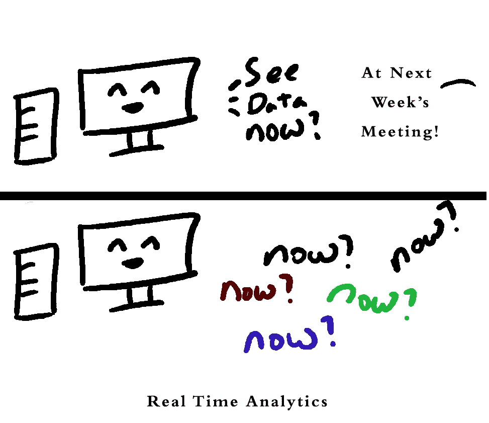

# 不是每个人都需要实时分析，包括你

> 原文：<https://towardsdatascience.com/not-everyone-needs-real-time-analytics-including-you-d5bb86103e6a?source=collection_archive---------12----------------------->

## 艺术是为你的度量标准找到一个好的节奏

“实时分析”是一个你经常听到的性感词汇，现在比十年前稍微多一点。营销文案称，获取数据并“实时”做出决策，谁不想这样呢？但以我的经验来看，对于绝大多数用户来说，实时分析并不是人们实际需要的解决方案。ROI 只是在组织到达某一点时才出现。

大多数人可以忍受对查询执行时间和报告延迟的明显放松的限制，节省大量成本和基础设施，并且除了吹嘘的权利之外，不会牺牲任何东西。

# 有什么吸引力？

有很多市场营销让人们觉得，如果你没有所有的数据，你就会错过机会，并将被一个每毫秒都在做人工智能的世界甩在后面。像往常一样，营销人员会做他们的营销，我们应该对他们兜售的东西持怀疑态度。

不过，基本前提很简单，而且一开始就很有说服力:“我们需要数据/分析/信息来做决策。很难说我们什么时候会需要这些数据来做决定，所以让我们确保我们一直都有这些数据。”还有一种暗示是，神奇的人工智能/人工智能酱可以洒在这样的系统上，“改变你的业务”。

但是所有的事情都是有代价的，那么我们会付出什么代价，我们会得到什么呢？这是给我的吗？

# 俗话说:好，快，便宜。选两个。

首先，分析基础设施不是免费的，所以通常的权衡适用。

## 良好(质量和可靠性)

好的分析，广义上是指你能做的分析和得到的结果是好的。从根本上来说，它包含许多内容:

1.  良好的数据收集—您确信进入分析系统的数据质量良好，没有欠计数/多计数，没有奇怪的偏差，没有错误和奇怪的缺失数据
2.  好的分析工具——不是所有的分析对所有的数据都有意义，但是你可以访问的那些与你相关，无论是 A/B 测试输出，还是保留/群组分析等。这些问题从简单到极其复杂，但无论如何，您都有信心他们做的是正确的事情

## 快速(延迟)

在这里，我说的是“关于分析系统如何运行/给出结果的快速”。你可能会说还有一个“快速的，如开发时间”的组件，但是在这个框架中，我认为这是一个成本，并在下一节中讨论它。

一般的经验法则是，你希望分析周转越快，你被迫做出的妥协就越多。我们有限的计算能力是有实际限制的，存储、移动和处理大量数据的硬件也是有限的。唯一的解决方法是使用更复杂的方法，进行大量的预处理、缓存，甚至可能使用定制系统来获得您想要的性能。

## 便宜($$$$)

构建一个系统需要大量成本，从开发人员的时间和相关的机会成本，到运行分析所需的系统和软件的原始成本。替换现有的系统更加昂贵，到处都有重构、测试和大量的压力。

因为没有人应该在“好”的方面妥协(太多)，因为没有人愿意使用一个怀疑数字是否准确的系统。所以最终归结为交易速度和成本。

# 但我只知道我需要实时分析！

你可能是对的。是不是每个人都在抱怨他们需要一些东西来做决定，而它还没有准备好？是否因为无法及时准备好数据而犯下了可以避免的错误？然后，您应该考虑升级您的基础架构，以减少延迟。它不必是一个$$$的完整大数据 lambda 体系结构堆栈。但是有些事。

如果(这种情况更常见)瓶颈在于人们坐下来用数据做决策。还是只是决策过程本身比较慢？那可能性就小很多了。

# 拥有数据和分析的最佳时机是你做决定的时候。

我甚至可以说，决策时间(或准备决策的时间)是你需要可用数据分析的最重要的时间。当您的系统崩溃时，来自 metrics 的通知是另一个让它们可用的关键时间(可以说您也需要在那时做出决定)。几乎所有其他东西都是值得拥有的。我觉得这是决定如何平衡好、快、便宜等式的关键。

关键是了解和确定决策的时机，并构建您的度量基础架构来满足这些需求。如果您的系统发生变化，您需要在 5 分钟(或 5 毫秒)内做出响应，您的分析必须比这更快，以便给您时间做出反应。在这种情况下，拥有低数据分析延迟对您来说是有价值的，您会希望投资系统来保持速度。

与此同时，如果管理销售客户，其中每份最后的销售合同都需要几个月才能达成，并且合同持续数年，那么您极不可能从低延迟分析系统中受益，延迟存在于其他地方。类似地，如果您只是将您的数据用于季度报告，并且没有任何实际的业务用例可以让它做得更快，那么您可能也不需要一个花哨的系统。

请注意，这主要是一个组织问题，而不是技术问题。再多的快速分析也无法迫使一个结构像糖蜜一样的组织像糖蜜一样运转。

# 了解你的决策节奏有助于降低成本

成比例的[实时分析系统](https://en.wikipedia.org/wiki/Real-time_business_intelligence)往往是[非常](https://www.graymatter.co.in/best-practices-real-time-analytics-architecture-big-data)复杂 猛兽。一定程度的规模是不言而喻的，因为(在某种程度上)你可以用高度优化的强大数据库进行相当低延迟的分析。(是的，我在这里把实时和低延迟混为一谈了。)

然而，一旦达到调优数据库所能做的极限，就需要处理传入的数据流，进行一些工程上的欺骗，在快速的短期数据和慢得多的永久数据存储之间架起一座桥梁。您将需要更多的计算能力来处理不断增长的数据量，您将需要更多的网络和存储，然后需要更多的人来维护系统。这是一项重大投资，你需要为维护所有这些机器付出成本。

同时，批处理作业可以简单得多，在极端情况下，当您有 8 个小时的运行时间时，一个弱分析数据库、一个 SQL 查询和一个发送电子邮件的 cron 脚本就可以按时提交报告。

# 但是互动探索呢？为此，我们需要低延迟。

听着，我是一名分析师，我知道等待 10k+秒(大约 2 小时 45 分钟)是很糟糕的事情。)对于死神回来的一大疑问。但是您的组织愿意花多少钱来将 10k 秒降低到 5k 秒呢？100 分？1s？

由于收益递减，当你的时间需求变短时，成本往往会飙升。通常会有一些唾手可得的成果，比如升级到固态硬盘或更新的硬件。但是没有一个架构是可以永远扩展的，所以最终你不得不把所有的东西都拆了，然后组合一些新的东西，这是很昂贵的。因此，如果有商业案例，是的，争取降低您工作所需的延迟，直到老板愿意为此买单。

# 如果我们不知道我们需要一个实时分析系统，该怎么办？

是的，这绝对是可能发生的事情。拥有更及时的分析可以导致组织运营方式的根本改变，并产生各种奇妙的独角兽。但是访问大量嘈杂的最新数据也会分散注意力。从纯技术的角度来看，很难预测你应该在这里做什么。

相反，我会后退一步。这是一个关于**组织结构**本身的问题。如果能够更快地访问数据，it 部门是否愿意甚至有能力做出改变？是否有人了解如何使用数据来制定决策，并且能够改变流程来与之匹配？也许他们想模仿竞争对手的一个用例？

把技术扔给一个没有准备好利用它的组织很难奏效。因此，如果您计划更快地升级您的分析基础架构，您可能需要额外的培训预算。