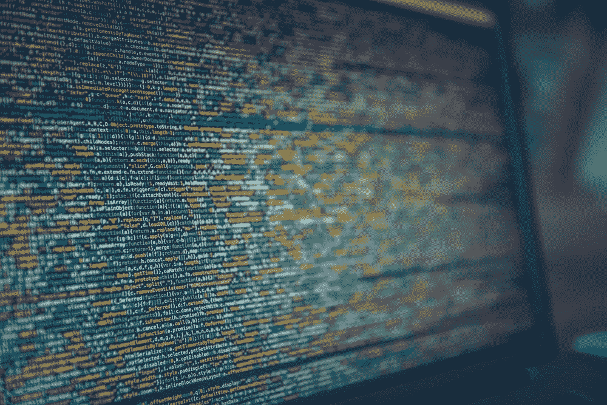
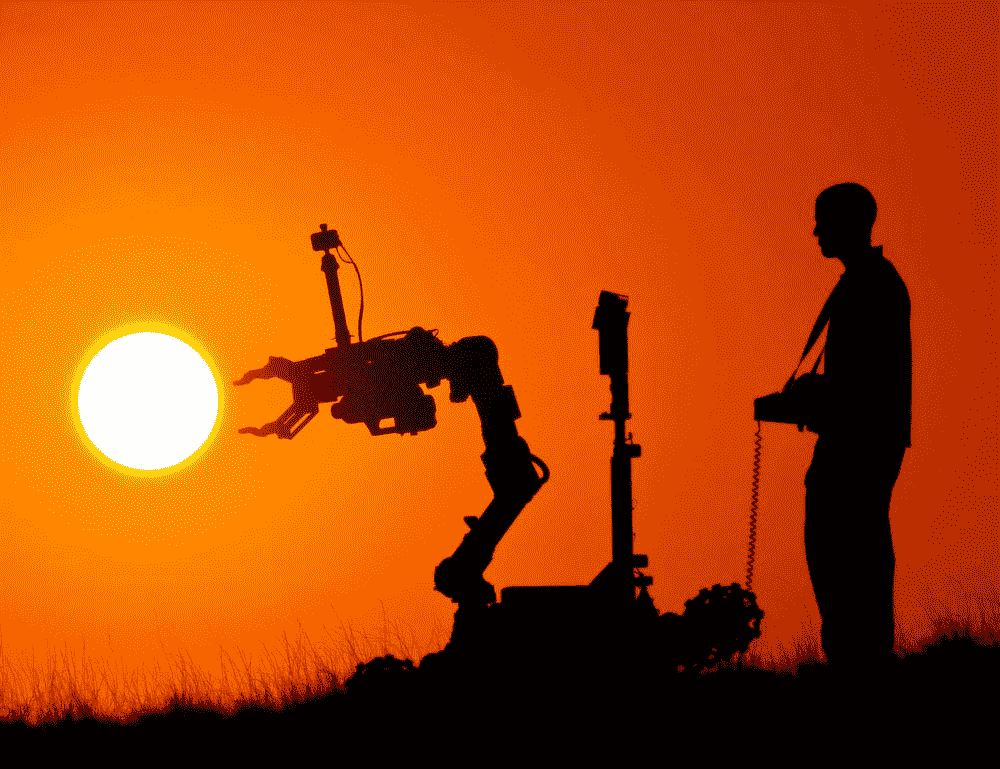
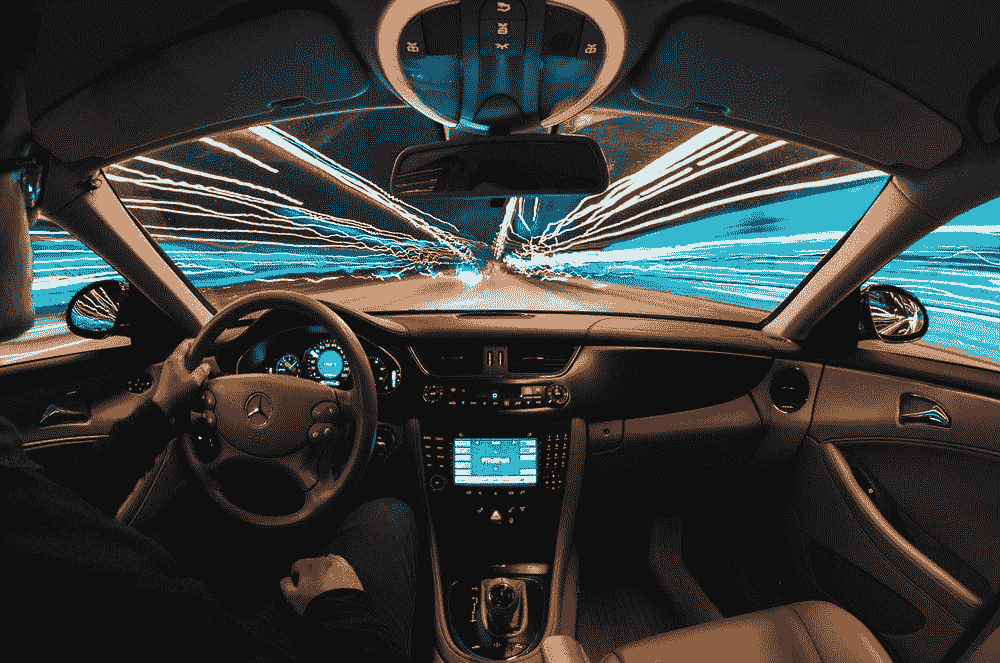

# 不是你想的那样:人机关系的未来

> 原文：<https://towardsdatascience.com/not-what-you-think-the-future-of-human-machine-relationship-b890d7f2072b?source=collection_archive---------26----------------------->

## 机器人会继续为我们工作吗？还是反过来？未来会是什么样子？更重要的是，我们能做些什么来弥补呢？

自从工业革命以来，我们就一直和机器生活在一起。我们每天都在使用手机、笔记本电脑、咖啡机和洗碗机。我们如此习惯于让机器在我们生活的各个方面为我们工作，以至于我们甚至没有注意到机器和我们之间的这些互动。

这次有什么不同？人工智能(AI)时代，机器人与人类之间有哪些新的动态？

## 你会为机器工作吗？或者你已经是了？

**场景一——算法管理:工人被算法管理**

越来越多的公司开始用算法来管理他们的劳动力。优步和 Lyft 等共享或零工经济公司率先开发了自动化工具来管理他们的远程员工，包括用户评级系统和自动化“轻推”。

在物流行业，像 UPS 和亚马逊这样的公司正在使用自动化系统来跟踪他们的工人并优化吞吐量。这些算法收集工人的数据，并实时做出(半)自动决策来激励工人的行为。

一些初创公司也开始提供监控工人或司机行为的人工智能解决方案。与人工监管相比，这些技术能够更好地扩大运营规模，并越来越多地被更多公司采用。

**场景二——蓝领工人为算法工作，例如数据贴标机**

之前我谈到了三种主要的 ML 类型:监督学习、非监督学习和强化学习。今天，超过 90%的 ML 算法仍然是基于监督学习的。

 [## 如何管理机器学习产品—第 1 部分

### 为什么管理机器学习产品这么难？为什么你应该关心？

towardsdatascience.com](/how-to-manage-machine-learning-products-part-1-386e7011258a) 

换句话说，这些算法从标记的训练数据中学习和归纳。为了提供标记的训练数据，一个不断增长的行业出现了，让人类手动组织数据集，以便机器可以消化和学习。

Scale AI 是许多与人类工人合作对数据进行分类以训练 ML 模型的创业公司之一。该公司成立仅三年，最近完成了一笔高达 1 亿美元的 c 系列交易。Scale 与大约 3 万名承包商合作，为自动驾驶汽车和其他人工智能公司(包括 Waymo、Airbnb 和 Lyft)标记具有人类洞察力的数据集。

**场景三——遥控和模仿学习，例如人类为(或假装)机器人工作。**

当用大量数据训练时，深度学习优于传统的 ML。然而，获得高质量的数据既困难又昂贵。

解决这种数据低效问题的方法之一是使用模仿学习:用专家演示来训练算法。FortressIQ 是将模仿学习应用于自动化流程的创业公司之一。它的系统捕捉并分析人类软件的交互，因此它可以在之后自动执行这些过程。

另一方面，像 Cobalt Robotics 这样的安全机器人初创公司，利用机器学习来巡视工作区并识别异常，同时让人类监控机器人车队，并在必要时接管控制权。

这不是科幻小说。它现在正发生在我们认识的人身上，并将很快影响我们每一个人。

> 我们开始看到这些新形式的人机交互的一些副作用。

## **机器人缺乏透明度和同情心。**

在最近的一项研究中，Lior Zalmanson 和 Robert W. Gregory 发现，优步司机觉得这款应用程序了解他们很多，但他们对算法如何工作和做出决策却知之甚少。

司机感到孤立无援，缺乏人性。他们质疑该系统的公平性，尤其是当他们在没有明确解释的情况下受到处罚时。

零工经济工作者也感觉到他们不断被算法监视和审查。他们不知道这些数据将被用来做什么。他们不知道工作分配、评级或报酬是否公平。如果不公平，他们有没有可以倾诉的人或其他方式来投诉？

缺乏可解释性和可解释性是 ML 的一个主要问题。使用这些自动化工具管理员工效率更高，可扩展性更强。但是生产力不应该是唯一的目标。需要考虑透明度和同理心。

## **人机团队苦于角色和责任不清。**

在钴机器人的案例中，人类扮演了一个关键的角色，因为他们处理所有机器人无法处理的案件。但是随着机器人变得越来越聪明，它们可能会得出与人类不同的结论。

> 人类应该总是能够否决机器人的决定吗？

考虑另一个例子:机器人轴。Waymo 已经推出了 robotaxi pilot。特斯拉还宣布了推出 robotaxis 的计划，作为其 2020 年自主共乘网络愿景的一部分。

自主机器人应该由谁来做决定？那辆车。后备人类安全驾驶员？远程监控机器人轴心舰队的人？还是乘客？

在什么情况下，什么时候？如果你只有一瞬间的反应时间，答案会不一样吗？谁应该对任何后果负责？那些公司？备用驱动程序？还是设计算法的工程师？

研究人员正在研究迁移学习和元学习，以设计能够“学会如何学习”的模型。但老实说，我们离人工通用智能还很远。

在可预见的未来，我们仍然需要教会机器，帮助它们变得更加自主。我们将需要调整自己，并与支持人工智能的机器一起进化。我们需要学习与智能机器一起工作的最佳方式。我们准备好迎接如此剧烈的社会转变了吗？我们能做些什么来创造我们想要的未来？我们将在下一篇文章中详细讨论这一点！

C [***想看更多这样的文章就点这里吧！***](https://bastiane.substack.com/)

 [## 亚马逊不想让你知道的自动化战略

### 作为自动化的前沿，亚马逊为什么要淡化 AI 和机器人的影响？

medium.com](https://medium.com/swlh/what-amazon-doesnt-want-you-to-know-about-its-automation-strategy-9046dd9289aa)  [## 它在这里！人工智能机器人将如何革新制造业

### 虽然制造业一直被认为是自动化程度最高的行业，但全自动化…

towardsdatascience.com](/its-here-how-ai-robot-will-revolutionize-manufacturing-44ce784438d4) 

*Bastiane Huang 是 OSARO 的产品经理，OSARO 是一家总部位于旧金山的初创公司，致力于开发软件定义的机器人。她曾在亚马逊的 Alexa 小组和哈佛商业评论以及该大学的未来工作倡议中工作。她写关于 ML、机器人和产品管理的文章。跟着她到这里* 。