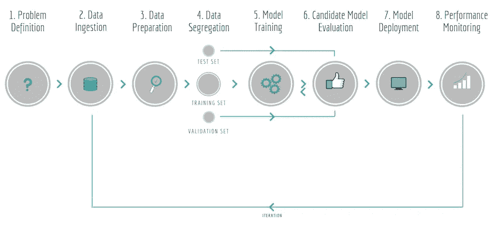

# 又一篇关于机器学习的文章！

> 原文：<https://towardsdatascience.com/not-yet-another-article-on-machine-learning-e67f8812ba86?source=collection_archive---------9----------------------->

## 你能和你的老板进行一次对话，简单解释一下机器学习的基础知识吗？现在你可以…

Photo by [James Pond](https://unsplash.com/@lamppidotco?utm_source=medium&utm_medium=referral) on [Unsplash](https://unsplash.com?utm_source=medium&utm_medium=referral)

如果你一直在关注技术的最新趋势，你可能已经注意到，机器学习(ML)不再只是一个时髦词，而是人工智能(AI)中最重要的突破。有很多例子来验证这些说法(从图像分类到文本生成到语言翻译)，但这篇文章是为那些从零开始或经过简明总结的人提供的关于 ML 的快速概述。

这不仅仅是另一篇关于 ML 的介绍性文章…这是关于 ML 的*介绍性文章！🏆*

# *ML —这是什么？*

*ML 使计算机能够发现数据中的**模式**，然后利用这些模式做出决策，而不是被明确编程来执行某项任务。*

*工作流程非常简单:*

*   *您拥有包含 模式的 ***数据。****
*   *你将它提供给一个 ML 算法，该算法 ***找到*** 模式并生成一个模型。*
*   *模型 ***在呈现新数据时识别*** 这些模式。*

**

*ML Workflow*

*每天的例子包括:*

> *医疗诊断
> 客户的还贷能力
> 市场分析/股票交易
> 信用卡欺诈检测
> 客户细分
> 垃圾邮件*

# *谁是数据科学家？*

*2012 年 HBR 的文章具有预言性…*

> *数据科学家是“21 世纪最性感的工作”。*

*快进到 2019 年，数据科学家是指拥有多学科技能的人，包括数学、统计学、机器学习、计算机科学、编程和商业领域的专业知识。史蒂文·格林勒称之为独角兽*是正确的，因为“传说中有神奇力量的野兽，但从未在野外见过”😄—哦，是的，他们有！。**

****

***Venn diagram of a data science unicorn [Copyright* Steven Geringer*]***

# **ML 管道**

**当数据流经他们的 ML 解决方案时，数据科学家为数据定义了一个管道。流水线的每一步都被馈送从其前一步处理的数据。术语“管道”稍有误导性，因为它意味着数据的单向流动；相反，ML 流水线是循环的和迭代的，因为每一步都被重复以最终实现成功的算法。
关键阶段描述如下:**

1.  ****问题定义**:定义您需要答案的业务问题。**
2.  ****数据摄取**:识别并收集您想要处理的数据。**
3.  ****数据准备**:由于数据是原始的、非结构化的，因此很少以正确的形式进行处理。它通常包括填充缺失值或删除重复记录，或标准化和纠正数据中的其他缺陷，例如同一列中相同值的不同表示。这也是特征提取、构建和选择发生的地方。**
4.  ****数据分离**:分割数据子集*训练*模型，*测试*模型，并进一步*验证*它对新数据的表现。**
5.  ****模型训练**:使用数据的训练子集，让 ML 算法识别其中的模式。**
6.  ****候选模型评估**:使用测试和验证数据子集评估模型的性能，以了解预测的准确性。这是一个迭代的过程，可能会测试各种算法，直到你有一个足以回答你的问题的模型。**
7.  ****模型部署**:一旦选定的模型产生，它通常通过某种 API 公开，并作为分析解决方案的一部分嵌入到决策框架中。**
8.  ****性能监控**:持续监控模型，观察其在现实世界中的表现，并进行相应的校准。收集新数据来逐步改进它。**

**并把它们放在一个图表中:**

****

***ML Pipeline***

# **训练算法分类法**

**ML 算法分为两大类:**

## **监督学习**

**你要预测的 ***的值是训练数据中的*** ，所以算法可以**以合理的方式预测**未来的输出。**

> **数据被**标记为****

## **无监督学习(UL)**

**你要预测的 ***的值不是训练数据中的*** ，所以算法找到**隐藏模式**(根据相似或不同)或内在值。**

> **数据**未标记****

****

**ML Taxonomy**

**主要的子类别包括:**

## **分类**

****

**Supervised Learning — Classification**

**SL 分类的一个子类是预测**分类/离散响应**的过程，即输入数据被分类。另一个应用是异常检测，即识别不出现在正态分布中的异常值/异常对象。
例子:**

> **是/否
> 正版/垃圾邮件
> 男/女
> 欺诈/合法交易**

## **回归**

****

**Supervised Learning — Regression**

**SL 的另一个子类，回归是预测**连续响应**(即数值)的过程，通常回答“多少”/“多少”之类的问题。
例子:**

> **价格变化
> 温度波动
> 销售数字
> 产品需求**

## **使聚集**

****

**Unsupervised Learning — Clustering**

**聚类是 UL 的一个子类，是用于探索性数据分析的过程，以发现隐藏的模式或数据的**分组/分区**。
例子:**

> **客户细分
> 市场调研
> 推荐引擎**

# **结局**

**机器学习是一门令人兴奋的学科；这是艺术，也是科学！在这篇文章中，我们刚刚探索了基础知识——我的目标是让 ML ' *尽可能简单，但一点也不简单【T6’——就像爱因斯坦常说的那样！***

**感谢阅读！**

***我定期在* [*媒体*](https://medium.com/@semika) *上撰写关于技术&的数据——如果你想阅读我未来的帖子，只需“关注”我！***