# 给好奇者的人工智能、机器学习和深度学习笔记

> 原文：<https://towardsdatascience.com/notes-on-artificial-intelligence-ai-machine-learning-ml-and-deep-learning-dl-for-56e51a2071c2?source=collection_archive---------1----------------------->

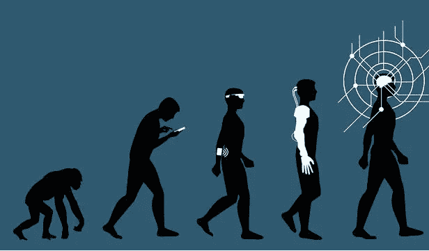

Source: Gerd Leonhard/Flickr Creative Commons

根据麦肯锡的数据，人工智能已经成为 2018 年最有趣的话题。在 Gartner 2019 年十大战略技术趋势的[排名中，It 被列为第一和第三名。](https://www.gartner.com/smarterwithgartner/gartner-top-10-strategic-technology-trends-for-2019/)

人工智能成为一个包罗万象的术语，指的是任何自动做某事的计算机程序。许多人在不知道人工智能真正含义的情况下向其推荐。关于它是 T4 的恶魔还是人类的救星，公众争论不休。因此，这是另一个尝试，为非从业者和好奇的人编译&解释介绍性 AI/ML 概念，以超越这种嗡嗡声。

人工智能作为一门学科创建于 50 年代。事实上,“人工智能”一词是由美国计算机科学家约翰·麦卡锡在 1956 年的达特茅斯会议上创造的。根据约翰·麦卡锡的说法，人工智能是“制造智能机器，尤其是智能计算机程序的科学和工程”。

Evolution of AI — Source: [https://www.embedded-vision.com/](https://www.embedded-vision.com/industry-analysis/blog/artificial-intelligence-machine-learning-deep-learning-and-computer-visionwha)

尽管直到最近，由于大数据可用性和可负担的高计算能力的进步，它才成为日常生活的一部分。 [AI](https://www.sas.com/en_us/insights/analytics/what-is-artificial-intelligence.html) 通过将大量数据集与快速、迭代处理和智能算法相结合，发挥出最佳效果。这使得人工智能软件能够从庞大的数据集中自动学习模式或特征。现在我们在主流新闻上看到人工智能新闻和例子是很典型的。可以说，具有公众意识的流行里程碑是 AlphaGo 人工智能程序，该程序在 2017 年 5 月的古代棋盘游戏 Go 中使用一种叫做“[强化学习](https://en.wikipedia.org/wiki/Reinforcement_learning)的机器学习算法，结束了人类【2,500 年的霸主地位。然后，这些人工智能新闻成为我们日常摘要的一部分，自动驾驶汽车，Alexa/Siri 喜欢数字助理狂潮，机场实时人脸识别，人类基因组计划，亚马逊/网飞算法，人工智能作曲家/艺术家，手写识别，电子邮件营销算法，等等。虽然深度神经网络是人工智能的最高级形式，处于 Gartner 2018 年炒作周期的顶端，这是一个预期膨胀的迹象，但自动驾驶汽车已经行驶了数百万英里，安全记录相对令人满意。

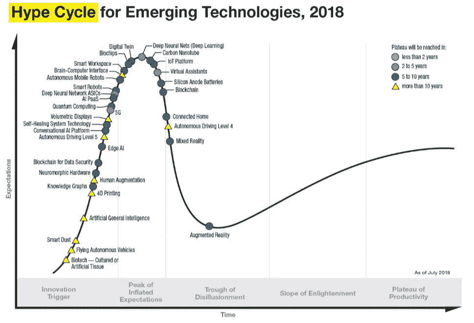

Source: Gartner

人工智能技术将在 2019 年继续颠覆，并将由于负担得起的云计算和大数据爆炸而变得更加广泛。我不记得现在有任何其他技术领域吸引了如此多的聪明人&同时来自开源/制造商社区和最大企业的大量资源。

**人工智能(AI)、机器学习(ML)和深度学习(DL)有什么区别？**

虽然人们经常互换使用这些术语，但我认为下面是区分这 3 个术语的一个很好的概念性描述。人工智能真的是一个宽泛的术语，这也导致现在每个公司都声称他们的产品有人工智能🙂那么 ML 就是人工智能的一个子集，由更先进的技术和模型组成，使计算机能够从数据中找出东西，并提供人工智能应用。ML 是在没有明确编程的情况下让计算机行动的科学 *(* [*斯坦福大学*](https://www.coursera.org/lecture/machine-learning/what-is-machine-learning-Ujm7v) *)。*

Source: [https://blogs.oracle.com/bigdata/difference-ai-machine-learning-deep-learning](https://blogs.oracle.com/bigdata/difference-ai-machine-learning-deep-learning)

最后，DL 是 ML 的一个较新领域，它使用多层人工神经网络来提供高精度的任务，如对象检测、语音识别、语言翻译和其他您在新闻中听到的最新突破。DL 的优点和优势在于，它们可以从图像、视频或文本等数据集自动学习/提取/翻译特征，而无需引入传统的手工编码代码或规则。印象深刻！

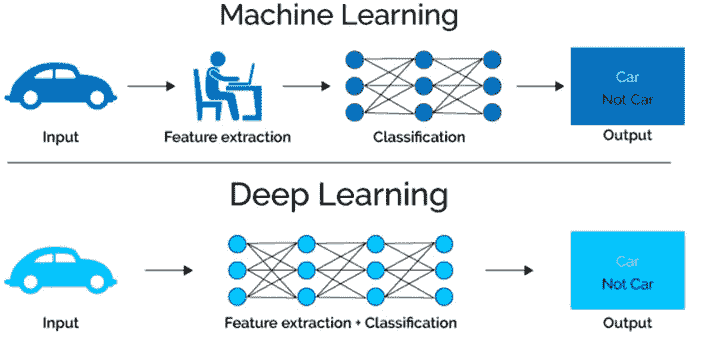

Source: [https://www.xenonstack.com/blog/data-science/log-analytics-deep-machine-learning-ai/](https://www.xenonstack.com/blog/data-science/log-analytics-deep-machine-learning-ai/)

**双击传统机器学习模型:**

在机器学习中有不同的模型，通常分为 3 个不同的类别:(1)****，(2)** [**无监督学习**](https://www.newtechdojo.com/list-machine-learning-algorithms/#Unsupervised%20Learning) **，(3)** [**强化学习**](https://www.newtechdojo.com/list-machine-learning-algorithms/#Reinforcement%20Learning) **。****

1.  ****监督学习:**涉及与数据集中每个实例相关联的输出标签。该输出可以是离散/分类*(红色、狗、熊猫、福特野马、停车标志、垃圾邮件……)*或实值。现在，几乎所有的学习都是被监督的。您的数据有已知的标签作为输出。它涉及一个比神经网络本身更有知识的管理者。例如，主管提供一些主管已经知道答案的示例数据。主管通过标记输出来指导系统。比如一个[有监督的机器学习系统，可以学习哪些邮件是‘垃圾邮件’](http://www.wired.com/2015/07/google-says-ai-catches-99-9-percent-gmail-spam/)，哪些不是‘垃圾邮件’。该算法将首先用可用的输入数据集(亿万封电子邮件)进行训练，该数据集已经用这种分类进行了标记，以帮助机器学习系统学习“垃圾”电子邮件的特征或参数，并将它与“非垃圾”电子邮件区分开来。就像一个三岁的孩子知道“积木”和“毛绒玩具”之间的区别一样，有监督的机器学习系统知道哪些电子邮件是“垃圾邮件”，哪些不是“垃圾邮件”。诸如线性或逻辑回归和决策树分类等技术都属于这种学习范畴。**

**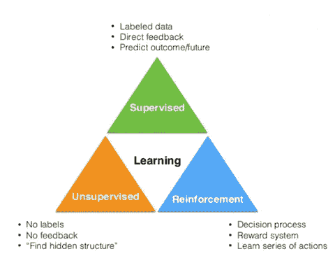**

**Source: [https://www.slideshare.net/SebastianRaschka/nextgen-talk-022015/8-Learning_Labeled_data_Direct_feedback](https://www.slideshare.net/SebastianRaschka/nextgen-talk-022015/8-Learning_Labeled_data_Direct_feedback)**

****回归**:这是一种我们需要预测和预报连续响应值的问题。一些例子是，在一个特定的城市有 3 间卧室和 2000 平方英尺以上的房子的价格是多少？预测财务结果、股票价格或板球比赛中的总得分。您有一个现有的数据集&输出(监督学习),并且您的算法基于拟合函数预测结果。**

****分类**:您需要将某个观察归类到一个组中。在下图中，如果给你一个点，你需要把它归类为蓝点或红点。还有几个例子可以用来预测一封给定的电子邮件是不是垃圾邮件？[被探测到的粒子是希格斯玻色子还是普通的亚原子粒子？](https://www.kaggle.com/c/higgs-boson/)将某篇新闻文章归入一个组，如体育、天气或科学。今天到底会不会下雨？这张图到底是不是猫？检测欺诈或评估欺诈风险或书面保险。**

**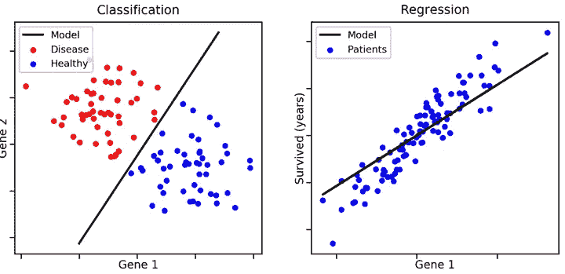**

**Source: [https://medium.freecodecamp.org/using-machine-learning-to-predict-the-quality-of-wines-9e2e13d7480d](https://medium.freecodecamp.org/using-machine-learning-to-predict-the-quality-of-wines-9e2e13d7480d)**

****2。无监督学习** —当你的数据通常没有已知的输出标签或任何反馈循环时，这是一种“独立”类型的学习。当没有已知答案的示例数据集，并且您正在搜索隐藏模式时，这很有用。在这种情况下，基于现有数据集执行聚类，即根据某个未知模式将一组元素分成组。系统必须从我们提供的数据集中了解自己。一般来说，无监督学习有点难以实现，因此它没有像有监督学习那样被广泛使用。最流行的类型是**聚类**和**关联**如下。**

****聚类**:这是一种无监督学习问题，我们将相似的事物分组在一起。一些例子是:给定新闻文章或书籍，将它们分成不同类型的主题。给定一组 tweet，根据 tweet 的内容对它们进行聚类。也可用于政治、医疗保健、购物、房地产等。**

**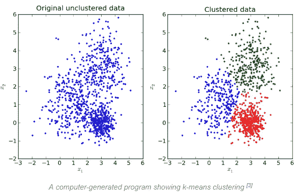**

**Source: [https://brilliant.org/wiki/k-means-clustering/](https://brilliant.org/wiki/k-means-clustering/)**

****关联**:关联规则是您发现描述大部分数据的确切规则的地方。例如:购买 X 的人也是倾向于购买 y 的人。当我们收到基于以前购买或搜索的书籍或电影推荐时，我们可能会遇到这种情况。这些算法也用于使用我们的在线或离线零售商购物(销售点)数据的购物篮分析。很快给定许多篮子，关联技术帮助我们理解一个篮子里的哪些项目预测同一个篮子里的另一个项目。**

**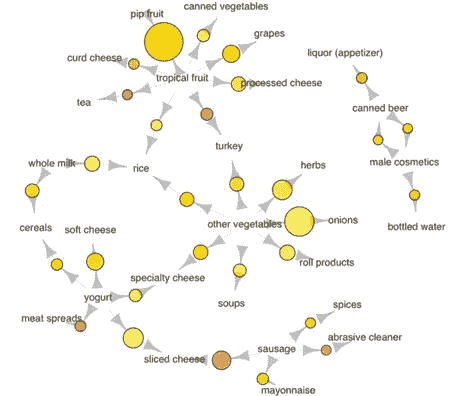**

**Associations between selected items using a data set on an actual grocery transaction over 30 days. Larger circles imply higher support, while red circles imply higher lift. i.e. The most popular transaction was of pip and tropical fruits. Relatively many people buy sausage along with sliced cheese. Source: [kdnuggest](https://www.kdnuggets.com/2016/04/association-rules-apriori-algorithm-tutorial.html)**

****3。强化学习(RL)**现在，当孩子做出正确的选择时，你会奖励孩子一个“大大的拥抱”,而不是告诉孩子把哪个玩具放在哪个盒子里，或者当孩子做出错误的动作时，你会做出“悲伤的表情”。在几次迭代之后，孩子很快就学会了哪些玩具需要放入哪个盒子——这被称为 [*强化学习*](https://en.wikipedia.org/wiki/Reinforcement_learning) *。系统通过接受虚拟的“奖励”或“惩罚”来训练，本质上是通过试错来学习。***

**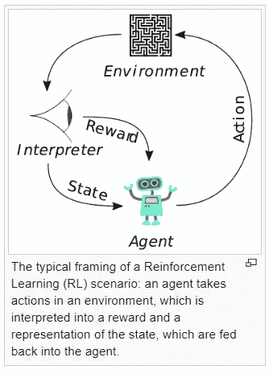**

**Source: Wikipedia**

**这种策略建立在观察和试错的基础上，以实现目标或最大化回报。代理通过观察其环境做出决策。如果观察结果是否定的，该算法调整其权重，以便能够在下一次做出不同的所需决定。根据隐藏节点的数量和算法的复杂性*(稍后将详细介绍)，人们可以将强化学习视为深度学习的一部分。*强化学习算法试图找到最佳的方法来获得最大的回报。奖励可以是赢得一场比赛，赚更多的钱或击败其他对手。他们展示了非常人性化的任务的最新成果，例如，多伦多大学的这篇论文展示了计算机如何在老派的雅达利电子游戏中击败人类。**

**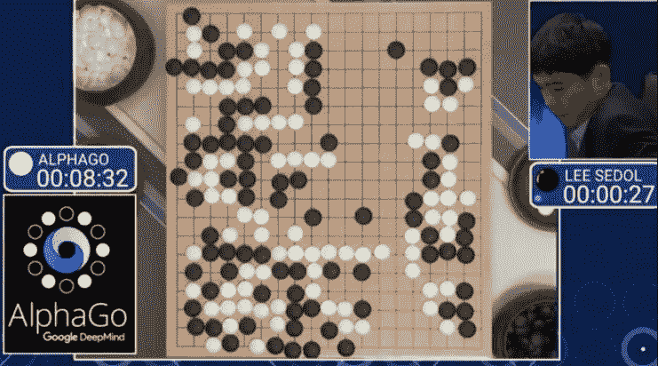**

**谷歌 DeepMind 已经使用强化学习开发了可以玩游戏的系统，包括视频游戏和围棋等棋盘游戏。AlphaGo 以 10 的 170 次方比国际象棋赢了一局棋，比一个 den 9 围棋大师赢了宇宙中的原子数量还要多。强化学习和人工监督学习的结合被用来建立“价值”和“政策”神经网络，该网络还使用搜索树来执行其游戏策略。该软件从人对人游戏中的 3000 万个动作中学习。**

**在写这篇博客的时候，另一个由 RNN 推动的突破性新闻发布了[，谷歌 DeepMind 开发的人工智能代理在*星际争霸 II*中击败了人类职业选手——这是人工智能世界的第一次。对于电脑来说，像《星际争霸 2》这样的游戏比像国际象棋或围棋这样的棋盘游戏更难玩。](https://www.theverge.com/2019/1/24/18196135/google-deepmind-ai-starcraft-2-victory)**

**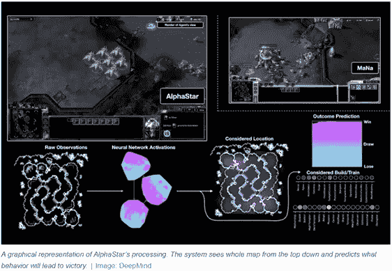**

**Source: [https://www.theverge.com/2019/1/24/18196135/google-deepmind-ai-starcraft-2-victory](https://www.theverge.com/2019/1/24/18196135/google-deepmind-ai-starcraft-2-victory)**

**谷歌 DeepMind 的研究人员使用强化学习来训练这些 AlphaStar 代理。代理人通过试错来玩游戏，同时试图达到某些目标，如获胜或仅仅是活着。他们首先通过模仿人类玩家来学习，然后互相游戏，最强的代理生存下来，最弱的被淘汰。DeepMind 估计，它的 AlphaStar 代理人都以这种加速的方式积累了大约 200 年的游戏时间。至少在游戏的背景下，RNN 把人类带到了奇点！**

**如果你第一次遇到 ML 类型，这听起来可能有点令人不知所措，但是下面是一个总结 ML 的直观总结。**

**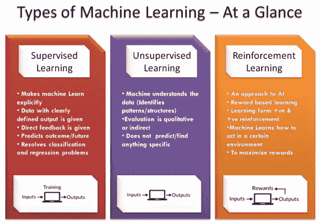**

**Source: [https://www.newtechdojo.com/list-machine-learning-algorithms/](https://www.newtechdojo.com/list-machine-learning-algorithms/)**

****深度学习****

**[麦肯锡声称](https://www.mckinsey.com/featured-insights/artificial-intelligence/notes-from-the-ai-frontier-applications-and-value-of-deep-learning)深度学习技术有潜力在 19 个行业每年创造 3.5 万亿到 5.8 万亿美元的价值！**

**和 ML 一样，“深度学习”也是一种从原始数据集中提取特征或属性的统计学习方法。区别的主要点是 DL 通过利用[多层人工神经网络](https://medium.com/towards-data-science/multi-layer-neural-networks-with-sigmoid-function-deep-learning-for-rookies-2-bf464f09eb7f)来实现这一点，其中许多隐藏层一个接一个地堆叠。DL 也有更复杂的算法，需要更强大的计算资源。这些是专门设计的计算机，配有高性能 CPU 或 GPU。它们可以是本地的($$)或作为云上的工作负载。您仍然可以使用您的笔记本电脑进行原型制作… [参见我的另一篇文章中的应用示例](https://medium.com/@gencozgur/hands-on-machine-learning-example-real-time-object-detection-with-yolo-v2-ebdd8441c12a)。**

> ***在本文中，我将介绍 3 款流行的 DL 型号。它们是卷积神经网络、递归神经网络* *和* *生成对抗网络。我还将分享自然语言处理如何使用 DL 的观点。***

****深度学习是从人脑中获得灵感的吗？有哪些人工神经网络？****

**一个小孩子如何学会辨别校车和普通公交的区别？我们是如何下意识地执行复杂的模式识别任务，甚至没有注意到？答案是我们有一个与神经系统相连的生物神经网络。我们的大脑是非常复杂的网络，大约有 100 亿个神经元，每个神经元都与 1 万个其他神经元相连。**

**这些神经元中的每一个都接收电化学信号，并将这些信息传递给其他神经元。事实上，我们甚至不知道我们的大脑神经元是如何工作的。我们对神经科学和大脑的深层功能了解不够，无法正确模拟大脑的工作方式。DL 只是受到了我们称为神经元的脑细胞的功能的启发，这导致了人工神经网络(ANN)的概念。使用人工神经元层来接收输入并应用激活函数以及人类设定的阈值来模拟 ANN。对于非从业者来说，这可能听起来很科幻，但 DL 已经在我们的日常生活中了。深度学习已经实现了接近或超过人类水平的图像分类、语音/手写识别，当然还有自动驾驶。当我们在网上冲浪时，复杂的广告定位或新闻供稿都结束了。**

**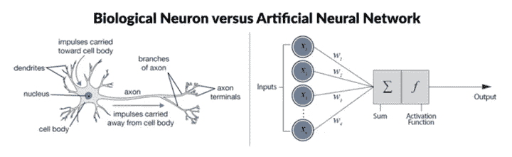**

**Source: [https://www.datacamp.com/community/tutorials/deep-learning-python](https://www.datacamp.com/community/tutorials/deep-learning-python)**

**在最基本的前馈神经网络(右上)中，人工神经元有五个主要组件。从左到右，它们是:**

1.  ****输入节点**。每个输入节点都与一个数值相关联，该数值可以是任何实数。例子可以是图像的一个像素值。**
2.  ****人脉**。类似地，离开输入节点的每个连接都具有与之相关联的权重(w ),并且这可以是任何实数。人工神经网络运行和传播数百万次，以优化这些“w”值。你需要强大的计算能力才能在短时间内完成。**
3.  **接下来，将输入节点的所有值和连接的权重集合在一起。它们被用作**加权和**的输入。**
4.  **该结果将作为**转移或激活功能**的输入。就像生物神经元只有在超过某个阈值时才会激活一样，人工神经元也只有在输入总和超过某个阈值时才会激活。这些是我们设定的参数(稍后将详细介绍道德规范)。**
5.  **结果，您得到了**输出节点**，它与输入节点的加权和函数相关联。**

****深度学习中的“深”是什么？****

**深度学习网络与更一般的单隐层神经网络的区别在于它们的**深度。**深度是节点层的数量，其中有一个以上的隐藏层，因此在训练、测试和最终运行这些神经网络时，需要更多的计算能力来进行向前/向后优化。**

**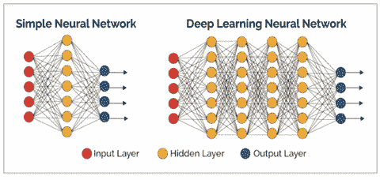**

**Source: [https://verneglobal.com/blog/deep-learning-at-scale](https://verneglobal.com/blog/deep-learning-at-scale)**

**在这些层中，您可以区分输入层、隐藏层和输出层。这些层的作用就像你在上面读到的生物神经元。一层的输出作为下一层的输入。**

****卷积神经网络(CNN):** 这是最流行的应用 DL 案例之一。它们非常适合图像/视频处理或计算机视觉应用。CNN 是深度人工神经网络，主要用于对图像进行分类(例如，标记他们看到的内容)，通过相似性对它们进行聚类(照片搜索)，并在场景中执行对象识别。这些算法可以识别人脸、个人、街道标志、肿瘤、花朵和视觉数据的许多其他方面。自动驾驶汽车或无人机将越来越多地使用 CNN 功能。最受欢迎的应用公司案例可能是光学字符识别(OCR ),将文本数字化以实现数据输入自动化。**

**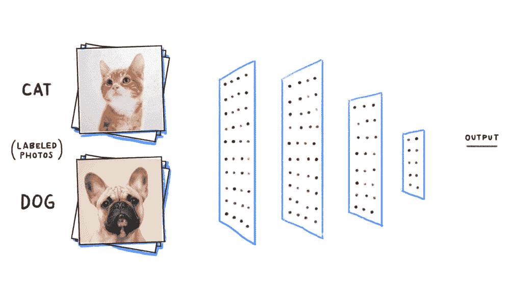**

**Source: [https://cdn-images-1.medium.com/max/1000/1*eEKb2RxREV6-MtLz2DNWFQ.gif](https://cdn-images-1.medium.com/max/1000/1*eEKb2RxREV6-MtLz2DNWFQ.gif)**

**在上面的例子中，我们的 CNN 算法看到的图像与人脑不同。每张图片都是一个三维数字阵列，称为像素，其中有宽度、高度和深度。宽度和高度取决于图像分辨率。第三维(深度)是颜色代码*的红绿蓝(RGB)值(除非您使用黑色&白色图像作为输入)。***

**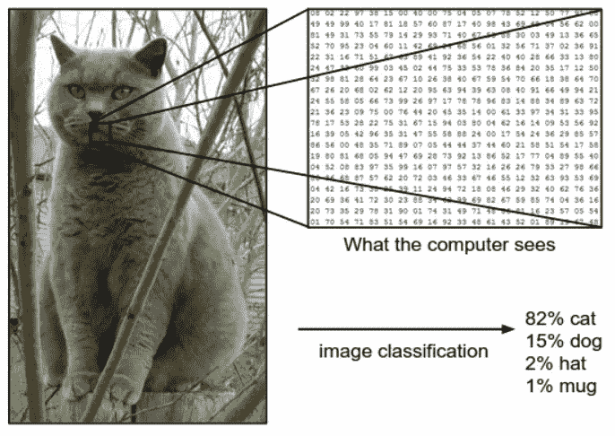**

**How our DL algorithm sees an image. — source: [http://cs231n.github.io/classification/](http://cs231n.github.io/classification/)**

**从技术上来说，深度学习 CNN 接收这些图像是为了通过一系列带有过滤器的卷积层(下面是基本描述)。CNN 下面各层的工作方式是一个更长的独立话题，这里有一篇很好的[文章](https://ujjwalkarn.me/2016/08/11/intuitive-explanation-convnets/)作为开始。**

**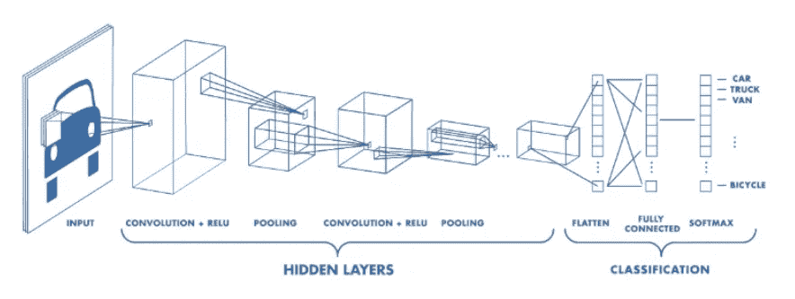**

**当然，最初这些过滤器不知道在哪里寻找图像特征，如边缘或曲线，前面提到的权重是随机数(就像一个具有新鲜思维的婴儿)。我们通常有[一个大型的训练数据集，包含数千张带有预先识别标签的图像](https://www.analyticsvidhya.com/blog/2018/03/comprehensive-collection-deep-learning-datasets/)。该模型首先向前传递，计算初始权重，预测结果标签(即这是一只狗)，并将其与现有训练集标签的真实值进行比较。因为这是一个训练集，我们已经知道结果标签，因此取决于预测的成功，计算一个**损失函数**，并且网络在更新其权重时进行回传。计算机能够调整其权重以减少损失的方法是通过一种叫做 [**反向传播**](https://en.wikipedia.org/wiki/Backpropagation) 的方法。现在，该模型通过网络执行反向传递，确定哪些权重对损失贡献最大，并找到微调这些权重的方法，以便通过连续传递减少损失。**

**最初，预计计算的损耗非常高，并且预计在多次(但固定)向前/向后通过后，损耗会降至最低。最后，希望网络训练得足够好，以便正确调整各层的权重。**

**然后我们运行**测试**来看看我们的 CNN 模型是否有效。我们应该有一个不同的图像集加上其各自的标签，并通过 CNN 的图像测试集。我们将输出与测试集进行比较，以查看我们的网络是否工作以及工作情况如何！当然，你拥有的数据越多，你的模型就能通过训练和测试得到更好的调整。这就是为什么大数据能够实现深度学习。当我们有了一个足够好的模型后，它就可以用于现实生活场景了…同时我们继续调整模型。**

**显然它比这要复杂得多，但这是大多数人工神经网络如何进行训练和测试的超高层次和简化的逻辑。**

**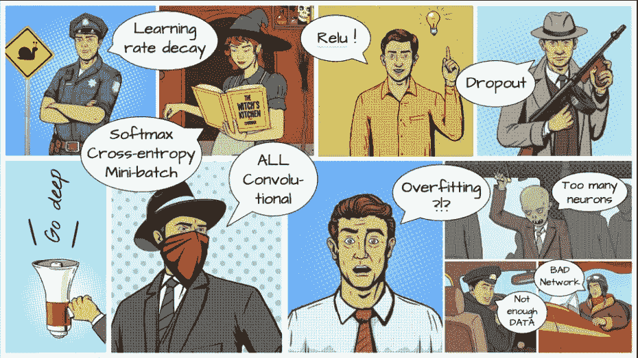**

**Source: [Unknown](https://stackoverflow.com/questions/43865103/how-to-tackle-overfitting-with-fully-convolutional-network-in-caffe?rq=1) Let me know if anyone knows the source. These are some DL terminology examples :)**

**计算机视觉的另一个现实例子是在中国。阿里巴巴在其发源地中国杭州推出了城市大脑系统，人工智能中心优化了交通控制。**

**[https://www.youtube.com/watch?v=v4_2QuS4Xns](https://www.youtube.com/watch?v=v4_2QuS4Xns)**

**类似 CNN 的算法已经主宰了我们的日常生活:脸书——自动标记，谷歌——照片搜索，Pinterest——主页订阅个性化。我真的很期待有一天美国有线电视新闻网会帮助治疗视力障碍者。**

****递归(Recurrent)神经网络(RNN):** 有时可互换使用递归神经网络只是一个递归网络的推广，同时具有相同的缩写。RNN 只是在计算中使用以前的输入源。假设你正在分析笔迹，如果你记得以前的字母，你可以更好地预测单词和未来的字母。考虑 rnn 的另一种方式是，它们有一个“存储器”，可以捕获到目前为止已经计算过的信息。RNN 可以记住以前的输入，这使它们在处理语音识别等顺序和上下文相关的任务时，比其他人工神经网络具有很大的优势。**

****

**Source: [https://towardsdatascience.com/understanding-recurrent-neural-networks-the-prefered-neural-network-for-time-series-data-7d856c21b759](/understanding-recurrent-neural-networks-the-prefered-neural-network-for-time-series-data-7d856c21b759)**

**RNNs 被认为可能是 NLP 最强大的模型。rnn 还用于[语言翻译](https://medium.com/@ageitgey/machine-learning-is-fun-part-5-language-translation-with-deep-learning-and-the-magic-of-sequences-2ace0acca0aa)，[作曲](https://futurism.com/a-new-ai-can-write-music-as-well-as-a-human-composer)，[写小说](https://motherboard.vice.com/en_us/article/evvq3n/game-of-thrones-winds-of-winter-neural-network)，[维基百科文章或莎士比亚诗歌](https://karpathy.github.io/2015/05/21/rnn-effectiveness/)，写 AI 推文……你可以训练它[写机器生成的奥巴马演讲](https://medium.com/@samim/obama-rnn-machine-generated-political-speeches-c8abd18a2ea0)或[创作不存在的“披头士”歌曲](https://www.youtube.com/watch?v=LSHZ_b05W7o)。有趣吧！ [Karpathy 的博客](https://karpathy.github.io/2015/05/21/rnn-effectiveness/)，他是 Tesla AI 的现任负责人，写了一篇最受欢迎的深度学习 RNN 文章，供进一步参考。**

## **AI 还是真正的莎士比亚？**

****

**Source: [Karpathy](https://karpathy.github.io/2015/05/21/rnn-effectiveness/) — RNN generated Shakespearean piece**

****生成对抗网络(GAN):**GAN 是由 [Ian Goodfellow](https://www.technologyreview.com/s/610253/the-ganfather-the-man-whos-given-machines-the-gift-of-imagination/) 和他蒙特利尔大学的同事在 2014 年发明的，他现在是谷歌大脑的研究人员。脸书人工智能的主任 Yann LeCun 说:“在过去的十年里，生成对抗网络是机器学习中最有趣的想法。”GAN 通过允许神经网络进行创建而不仅仅是用数据集来训练它，从而使神经网络更加人性化。**

**生成对抗网络由两个神经网络组成:一个**生成**网络和一个**判别**网络。在开始阶段，生成器模型将随机噪声信号作为输入，并生成随机噪声(假)图像作为输出。渐渐地，在鉴别器的帮助下，它开始生成看起来真实的特定类别的图像。**

**鉴别器是生成器的建议，同时接收生成的图像和某一类图像，使其能够告诉生成器真实图像的样子。**

**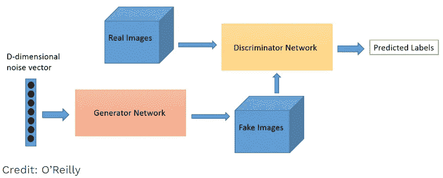**

**Source: O’Reilly. Generator and Discriminator are pitting one against the other (thus the “adversarial”) and compete during the training where their losses push against each other to improve behaviors (via [backpropagation](https://searchenterpriseai.techtarget.com/definition/backpropagation-algorithm)). The goal of the generator is to pass without being caught while the goal of the discriminator is to identify the fakes.**

**在到达某个点之后，鉴别器将无法辨别生成的图像是真实的还是虚假的图像，这就是我们可以看到某个类别(鉴别器所训练的类别)的图像是由我们的生成器生成的，而该生成器以前从未实际存在过！专家有时将此描述为生成网络试图“愚弄”辨别网络，该网络必须经过训练才能识别特定的模式和模型集。**

**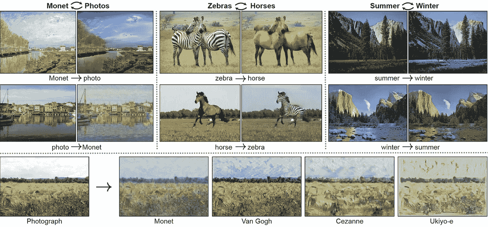**

**Source: [https://github.com/junyanz/CycleGAN](https://github.com/junyanz/CycleGAN) There are other very interesting examples and the source code at this githib account by Jun-Yan Zhu, Researcher at MIT CSAIL.**

****

**Source: another video GAN example by [Jun-Yan Zhu](https://github.com/junyanz/CycleGAN)**

**GANs 可用于提高图像的分辨率，[重建流行图像](https://www.youtube.com/watch?v=C1YUYWP-6rE)或绘画或从文本生成图像，制作产品原型的照片级逼真描述，[生成真人的逼真语音音频](https://www.youtube.com/watch?v=YfU_sWHT8mo) ( *OMG！*)以及[制作时装/商品镜头](https://medium.com/@jonathan_hui/gan-some-cool-applications-of-gans-4c9ecca35900)。**

****

**Source: Wikipedia. GANs were used to create the 2018 painting [*Edmond de Belamy*](https://en.wikipedia.org/wiki/Edmond_de_Belamy) which sold for $432,500.**

**生成性对抗网络在社交媒体中非常流行。当心 [deepfake](https://www.youtube.com/watch?v=gLoI9hAX9dw) 视频！如果你给它输入足够多的人脸数据集，它可以创造出全新的假的[人脸](https://www.technologyreview.com/s/612612/these-incredibly-real-fake-faces-show-how-algorithms-can-now-mess-with-us/?utm_campaign=the_algorithm.unpaid.engagement&utm_source=hs_email&utm_medium=email&_hsenc=p2ANqtz-8kxzmyRmbG-8kGLZmbD-jZcUEpJidf6MnVsJOK62S0aVm88ioDTuQC2FPFAnkZQDBiqBw7)，这些人脸超级逼真，但却是不存在的！下面是 NVIDIA 的 AI 使用 GAN 制作的假人类照片。**

**NVIDIA’s AI produces Fake Human Photos with Unbelievable Quality | QPT**

****自然语言处理(NLP)的深度学习:**实际上NLP 是一个更广泛的话题，尽管它最近由于机器学习而变得非常流行。NLP 是计算机分析、理解和生成包括语音在内的人类语言的能力。例如，你可以对任何文本进行情感分析。NLP 可以通过电影/书评或网络进行解析后提出人工智能建议。NLP 可以使用文本或音频交互运行聊天机器人/数字助理来完成前端任务。Alexa/Siri/Cortana/Google Assistant 是使用 NLP 引擎的著名数字人物角色。**

**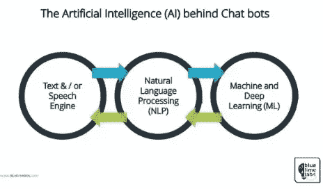**

**NLP 的下一个阶段是自然语言交互，它使人们能够使用日常语言与计算机进行交流，以完成任务。我相信你看过谷歌首席执行官桑德尔·皮帅展示谷歌助手如何打几个电话，为你预约理发。其他已知的使用案例有*企业搜索或意见挖掘(情感分析)。*无论是呼叫中心、聊天机器人、翻译器、自动预测器、垃圾邮件过滤器还是新的广阔的数字助理领域，已经有大量可供选择的自然语言处理引擎可以嵌入到日常生活中。**

**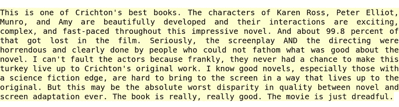**

**Behavior of the sentiment neuron. Colors show the type of sentiment. Source: [https://blog.openai.com/unsupervised-sentiment-neuron/](https://blog.openai.com/unsupervised-sentiment-neuron/)**

****如何成为机器学习的实践者？****

**(1)学习一些 Python 入门，(2)尝试 Keras(或下面其他流行的 DL 库之一)。(3)拿一个现实世界的实际问题来解决它。**

**作为编译器/编辑器，我更喜欢用 Jupyter 来做我的实验，尽管你有很多其他代码编辑器的选择。没有必要从一开始就变得完美。保持敏捷，快速而廉价地失败，在需要时改变路线，最终你会成功的。**

**深度学习框架正在快速变化。虽然我的偏好是 Keras，因为它的用户友好的 API， [TensorFlow](https://www.tensorflow.org/) 是目前支持 Google 的冠军，如下图所示。另一个重量级人物 PyTorch 得到了脸书的支持。CNTK 有微软做后盾。Apache 的 MXnet 是一个易于扩展的框架，由 Amazon 提供支持。简而言之，这种情况是非常动态的，并将继续发展。挑一个做实验吧！**

**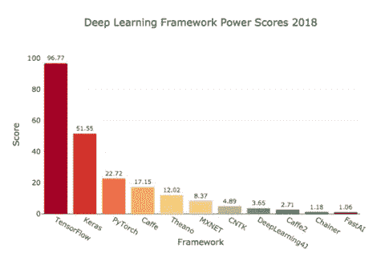**

**Source: [https://towardsdatascience.com/deep-learning-framework-power-scores-2018-23607ddf297a](/deep-learning-framework-power-scores-2018-23607ddf297a)**

**您需要有一个正确设置的笔记本电脑环境来开始。我建议从安装 Anaconda 包开始。这将满足最初的需求，然后你将继续安装其他需要的库。**

**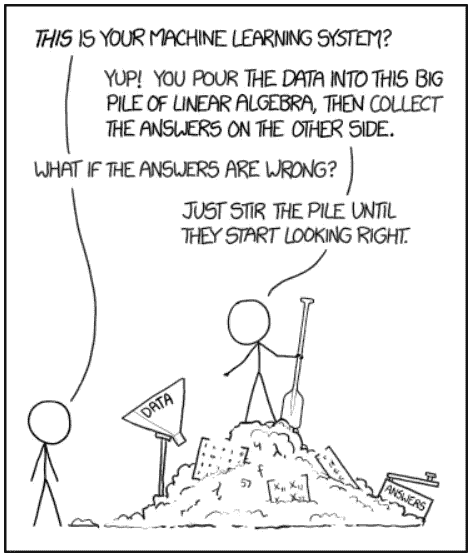**

**Source: [https://towardsdatascience.com/data-scientist-is-it-the-sexiest-job-of-the-21st-century-35a5bf409363](/data-scientist-is-it-the-sexiest-job-of-the-21st-century-35a5bf409363)**

**为了进一步扩大规模，你可以利用大型云 ML 平台之一，如 [AWS SageMaker](https://aws.amazon.com/sagemaker/) 、[微软 Azure AI](https://azure.microsoft.com/en-us/overview/ai-platform/) 、[谷歌云平台 ML](https://cloud.google.com/products/ai/)&[tensor flow](https://www.tensorflow.org/)和其他替代玩家。使用免费点数创建一个帐户。**

**最后，还有许多在线资源和课程。没有包罗万象的地方，但你可以从中型文章、YouTube 视频、人工智能博客、斯坦福课程、在线书籍或 Coursera/Udemy/Datacamp 项目上的优秀课程开始。**

****领先的人工智能公司:****

**英伟达和英特尔生产的特殊微处理器大大加快了最大似然计算。谷歌、亚马逊、微软和 IBM(以及更多的公司)提供云基础设施、ML 服务以及更高级别的框架来加速建模、培训和测试工作。2019 年，几乎每个中/大型公司都会在业务中使用 ML 或 DL。在世界的其他地方，大多数中国人工智能公司都与百度、阿里巴巴和腾讯有联系。比赛开始了。**

****人工智能在工作场所——企业智能流程自动化****

**我认为这个领域将在我们之前提到的所有人工智能能力之后呈指数级增长。用[机器人流程自动化(RPA)](https://www.cio.com/article/3236451/business-process-management/what-is-rpa-robotic-process-automation-explained.html) 取代重复性的手动任务，我们仅仅触及了表面。下一个前沿是转化和数字化 E2E 认知过程。传统的 RPA 现在正与人工智能和其他数字自动化工具相结合，例如光学字符识别(OCR)、工作流(业务流程管理)、聊天机器人(NLP)、人在回路中的认知处理、虚拟员工、自动 ML。这些将会扰乱未来的工作场所和整个业务流程外包行业。**

**[智能流程自动化](https://www.mckinsey.com/business-functions/digital-mckinsey/our-insights/intelligent-process-automation-the-engine-at-the-core-of-the-next-generation-operating-model) (IA)是一个呈指数增长的领域，已经有许多参与者……公认的 RPA 参与者有 Blueprism、UI Path、Automation Anywhere 和 Workfusion 以及许多其他新兴的初创企业。较大的蓝筹股公司(IBM、SAP、SalesForce、Microsoft、Pega、Oracle、SAP……)也开始提供或收购类似的 IA 能力。**

****OK 明白了那数据科学和机器学习的区别是什么？****

**Nisarg Dave 的下图很好地展示了数据科学的跨学科性质，它处于所有这些不同领域的交汇点。数据科学家需要具备多学科技能，以便能够创建数据集进行测试，创建算法所需的代码，并提供创新的业务洞察力。这也许就是为什么它是 21 世纪最性感的工作*！话虽如此，做人工智能工作并不需要成为数据科学家。一点也不。***

***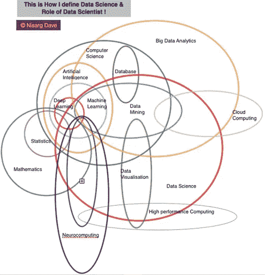***

***Source: [Nisarg Dave](https://www.nisargdave.com/blog/interdisciplinary-data-science)***

*****人工智能与伦理*****

***今天，人工智能没有自由意志或意识，但聪明的人在人工智能模型部署之前进行学习。虽然人工智能的核心目标是增强人类，但也有很多关于人工智能伦理的讨论。以下是其他一些需要思考和反思的重要话题。***

> ***微软首席执行官塞特亚·纳德拉“我们需要为我们创造的人工智能负责……”***

***AI 会制造失业吗？这不是新的恐惧。起初，人工智能将消除一些人类任务，但如果我们能够找到方法来适应和重新掌握自己的技能，那么它有可能创造更多的就业机会。这可能有点类似于第一次工业革命期间从马到汽车的过渡。类似的故事当自动取款机或电脑在 70 年代和 80 年代出现时。***

***有偏见的机器人:算法是由人类编程和设计的，因此这是一个重要的话题，以提高认识，制定政策，也许监管是一种好的力量。我们应该确保我们的训练集、算法或参数不会“偏离”关键应用程序的目标。***

***安全/隐私:这可能是目前讨论最多的话题。我们可能需要更好的法规和政策，就像欧洲的 GDPR 一样。***

***人工智能能力的不平等:随着北美/欧盟和中国主导人工智能世界，当然已经存在数字鸿沟。有机会在全世界进一步民主化人工智能教育。鉴于免费在线信息和开源工作的可用性，我对这种情况更乐观。***

***人为错误和失误:软件故障很容易导致人工智能错误。我认为需要有明确的责任和规则所有权。即如果自动驾驶汽车或无人机发生严重事故，谁负责？社会需要确保我们复杂的人工智能系统做我们希望它们做的事情。***

***人际互动和认知技能:这是一个真实的社会影响，并且已经在发生。我们越多地利用机器人，互动就会减少，我们对人工智能的依赖就会增加。解决方法是什么？***

***最后是[奇点](https://en.wikipedia.org/wiki/Technological_singularity)。我们可能离机器人超越人类的时代还很遥远，尽管从现在开始考虑这一点是值得的！***

> ***【www.weforum.org】来源:***

******结论******

****我认为机器和深度学习，就像一般的数据科学一样，既是科学也是艺术。当你开始研究人工智能领域时，你的脑袋可能会在开始时转向模型、数据集、方法等等。我会鼓励选择一个最喜欢的 ML 领域并深入研究。这几天对我来说就是计算机视觉。就像生活中的其他事情一样，只有通过练习才能达到流利。****

****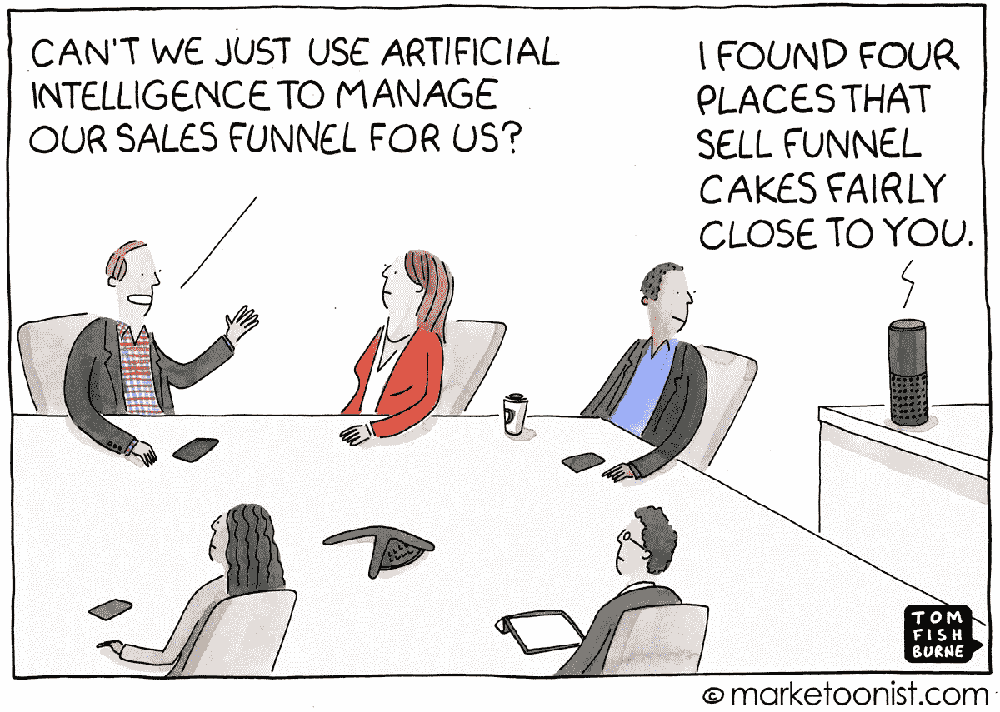****

****2019 年，我们将看到更多人工智能领域的新闻和发明。我还希望看到更多的先进技术和应用案例出现在移动电话、耳塞、手表和其他便携式设备上，而不仅仅是高性能计算机。所以要多加小心！****

****我想用我最喜欢的塞特亚·纳德拉的一句话来结束我的演讲*“我相信这个世界将会有大量的人工智能，但真正的智能和人类品质将会稀缺，就像* ***移情*** *。我认为伟大的创新来自于你对你想为人们解决的问题的同理心。”*****

****2019 年深度学习快乐！****

****资源:****

****[https://www.pyimagesearch.com/](https://www.pyimagesearch.com/)****

****https://www . McKinsey . com/business-functions/McKinsey-analytics/our-insights/an-executives-guide-to-ai。****

****[https://blogs . Oracle . com/big data/difference-ai-machine-learning-deep-learning](https://blogs.oracle.com/bigdata/difference-ai-machine-learning-deep-learning)****

****[https://towards data science . com/machine-learning-vs-deep-learning-62137 a1c 9842](/machine-learning-vs-deep-learning-62137a1c9842)****

****[https://towards data science . com/cousins-of-artificial-intelligence-DD a4 EDC 27 b 55](/cousins-of-artificial-intelligence-dda4edc27b55)****

****[*https://www . tutorialspoint . com/人工智能/人工智能 _ 神经网络. htm*](https://www.tutorialspoint.com/artificial_intelligence/artificial_intelligence_neural_networks.htm)****

****[http://us blogs . PwC . com/emerging-technology/demysiting-machine-learning-part-2-supervised-unsupervised-and-reinforcement-learning/](http://usblogs.pwc.com/emerging-technology/demystifying-machine-learning-part-2-supervised-unsupervised-and-reinforcement-learning/)****

****[https://www . technology review . com/s/612746/a-neural-network-can-learn-to-organize-the-world-it-see-into-concepts just-like-we-do/](https://www.technologyreview.com/s/612746/a-neural-network-can-learn-to-organize-the-world-it-sees-into-conceptsjust-like-we-do/)****

****[https://www . newtechdojo . com/list-machine-learning-algorithms/](https://www.newtechdojo.com/list-machine-learning-algorithms/)****

****[https://becoming human . ai/understanding-and-building-generative-adversarial-networks-gans-8de 7 C1 DC 0 e 25](https://becominghuman.ai/understanding-and-building-generative-adversarial-networks-gans-8de7c1dc0e25)****