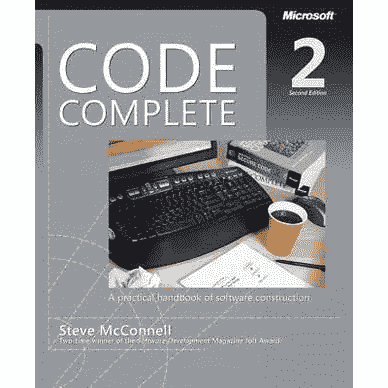

# 从《代码全集》看软件工程

> 原文：<https://towardsdatascience.com/notes-on-software-construction-from-code-complete-8d2a8a959c69?source=collection_archive---------4----------------------->


[Source](https://www.pexels.com/photo/mountain-covered-with-snow-1125268/)

## 从“*Code Complete:A Practical Handbook of Software Construction”*中获得的经验及其在数据科学中的应用

当人们问我作为数据科学家的工作中最难的部分时，他们经常希望我说建立机器学习模型。假设我们所有的 ML 建模都是在大约 3 行代码中完成的:

```
from sklearn import modelmodel.fit(training_features, training_targets)predictions = model.predict(testing_features)
```

我回答说，机器学习是这项工作中比较容易的部分之一。相反，作为一名工业数据科学家，最困难的部分是建立基础设施所需的**软件工程**，该基础设施用于在生产中持续运行机器学习模型。

一开始，(在 [Cortex Building Intel](https://get.cortexintel.com/) )我可以为一个一次性的机器学习项目写一个[好的 Jupyter 笔记本](https://github.com/WillKoehrsen/Data-Analysis)，但是我不知道“在生产中运行机器学习”是什么意思，更不用说怎么做了。在半年的时间里，我已经建立了几个人工智能系统，日以继夜地进行预测，以帮助工程师更有效地运行建筑，我已经了解到这需要大量的软件构建和一点点数据科学。此外，虽然在数据科学中还没有标准的实践，但是有一些经过时间考验的编写软件的最佳实践，可以帮助你成为一名更有效的程序员。

由于我的工作相对缺乏软件工程技能，我不得不快速学习。其中大部分来自于与其他软件工程师的互动和吸收他们的知识，但也有一些来自于教科书和在线教程等资源。其中一本教科书是史蒂夫·麦康奈尔写的长达 900 页的关于构建高质量软件的杰作 [*代码全集:软件构建实用手册*](https://en.wikipedia.org/wiki/Code_Complete) 。在这篇文章中，我想概括一下我从阅读本书中学到的关于软件构造的高层次观点。这些措施如下:

1.  **在触摸键盘之前彻底计划你的项目**
2.  **写可读的代码，因为读的比写的多**
3.  降低你程序的复杂性，释放你的脑力
4.  测试和检查程序中的每一行代码
5.  做一个没有自我的程序员
6.  **重复你的设计，反复测量进度**

尽管这本书的第二版是在 2004 年写的，但是软件工程中被证实的观点在这几年中并没有改变，这本书仍然与今天的软件工程师高度相关。从这本书里你不会学到任何关于 Python 中数据科学的具体细节，但是你会学到如何计划、构建、构建、测试和评审软件项目的基础知识。我试图将这里的想法保持在一个相当高的水平，并计划在以后的文章中更深入地讨论具体的问题。



*Code Complete by Steve McConnell (900 pages for only $35!)*

虽然这些实践可能看起来与数据科学无关，因为*目前正在教授*，但我认为数据科学受到了当前对软件工程缺乏重视的伤害。毕竟，机器学习系统是一个软件项目。如果有交付成功软件项目的经过测试的最佳实践，那么我们作为数据科学家应该实践这些方法，超越 Jupyter 笔记本，开始交付机器学习解决方案。这里涵盖的六个主题不像最新的机器学习算法那样令人兴奋，但它们对于行业中的数据科学家来说是至关重要的想法。

1.  **在触摸键盘之前彻底计划你的项目**

就像你永远不会在没有蓝图的情况下开始[盖房子](https://lab3.co.nz/2018/10/29/software-house-building-metaphor/)一样，你也不应该在没有详细的书面程序设计的情况下开始编码。如果你不知道你的程序的预期结果，你将会浪费大量的时间编写混乱的代码，而这些代码并不能实现特定的目标。我在数据科学方面经常遇到的问题是深入数据集非常有趣。你很难抗拒把手放在键盘上的诱惑，制作图表，寻找异常，并一起黑客模型。几个小时后，你不可避免地会得到许多混乱的代码，没有清晰的可交付成果，这个问题本可以通过花时间规划你的程序来避免。

你接手的每个软件项目——包括机器学习模型——都应该从一个[问题定义](https://en.wikipedia.org/wiki/Problem_statement)开始:一个要解决的问题的高级陈述。我工作中关于需求预测模型的一个例子是“我们希望提前 7 天准确预测建筑能源需求，以帮助建筑工程师为下周做准备。”该陈述捕获了项目的期望结果和商业价值。

在问题陈述之后是[项目需求](https://www.tutorialspoint.com/software_engineering/software_requirements.htm)，一组目标——在问题陈述的较低层次上——解决方案必须满足。这些可以涵盖指标——误差小于 10%——或最终用户体验——图表必须清楚地显示最佳估计[和不确定性](/how-to-generate-prediction-intervals-with-scikit-learn-and-python-ab3899f992ed)。这些需求将指导你的项目的详细设计，并允许你评估项目是否成功。

在描述和需求之后是[架构规范](https://en.wikipedia.org/wiki/Software_architecture_description)，在这里你开始计划组成你的程序的文件、类和例程(函数)。此时，您可以开始了解设计的细节，例如错误处理、输入/输出、用户界面和程序中的数据流。

这些文档应该像实际代码一样被审查和讨论，因为设计阶段的错误和决策会影响项目的其余部分。在这里你需要理解你的程序被要求做什么，以及你将如何处理这个问题。在项目的设计阶段，计划您预见到的困难，为项目估计时间，概述替代方法，并分配责任，只有在每个人都同意描述、需求和体系结构计划后，您才应该想到敲击键盘。

上面的具体步骤可能会改变，但重要的是你永远不要通过写一堆代码来开始一个项目。即使是小的、一次性的个人数据科学项目，我现在也花时间计划并写下我的总体目标和对我的项目的一系列要求。开始是个好习惯；请记住，大型项目不是人们在键盘上敲出来的，它们是按照设计过程中绘制的详细蓝图，一次一个地规划和构建的。

在我目前的公司，我们所有的机器学习项目都涉及到一个实质性的设计阶段，在这个阶段，我们与公司的业务部门、我们的客户和客户成功进行讨论，以确保我们满足最终用户的需求。这个过程通常最终会创建几十页的文档，我们会在项目的其余部分引用这些文档。虽然需求确实会在项目过程中发生变化，但拥有一份需要代码完成的任务清单是至关重要的，因为否则你只是在修改和构建一些最终不可用的东西。对我们来说，设计往往会占用平均项目时间的 30%,这是一项值得的投资。提前计划和写下我们的设计意味着，当我们开始编码时，我们不是漫无目的地敲打锤子和钉子，而是遵循一个大纲，一次构建一个坚固的结构。

**2。编写可读的代码，因为读的比写的多**

[代码被读取的次数将比它被写入的次数多得多](https://devblogs.microsoft.com/oldnewthing/20070406-00/?p=27343)，所以永远不要为了写入时的方便而牺牲读取时的方便——你的代码有多容易理解——你可以多快地编写代码。

数据科学传授了一些关于代码可读性的坏习惯，最明显的是变量名。虽然对你来说很明显`X`和`y`代表特性和目标，因为你已经见过几百次了，为什么不调用变量`features`和`target`来帮助那些不太熟悉 ML 语法的人呢？阅读代码不应该是一种试图破译写代码的人的神秘编造语言的练习。

提高代码可读性意味着对函数、类、数据对象和程序中的任何变量使用描述性名称！例如，不要对循环变量使用`i`、`j`和`k`。而是用它们实际代表的:`row_index`、`column_index`、`color_channel`。是的，键入要多花半秒钟的时间，但是使用描述性的变量名将为您和任何阅读您的代码的人节省几十个小时的调试或试图修改代码的时间。

下面是另一个非描述性变量名的例子:

```
value = value * 2.25
value = value * 5.89
```

这些代码还受到使用[“神奇”数字的困扰:描述某些东西的未定义常量值](https://en.wikipedia.org/wiki/Magic_number_(programming))(一个[转换](https://www1.oanda.com/currency/converter/)、传感器读数的数量、速率等)。)只是没有人能告诉*什么是*，因为它们就像变魔术一样出现了。你应该*永远不要*在你的代码中有一个神奇的数字，因为它们使程序变得难以理解，是错误的主要原因，并且使更新这些值变得困难，因为你必须寻找所有使用它们的地方。相反，采取以下方法:

```
total_widgets_sold = hours * widgets_sold_per_hour
total_revenue_from_widgets = total_widgets_sold * price_per_widget
```

`widgets_per_hour`和`price_per_widget`应该是函数参数，或者是[命名的常量](http://wiki.c2.com/?NamedConstants)，如果它们在你的代码中使用的话(在 Python 中用所有的[大写字母表示)。现在，任何人都可以理解这段代码，通过改变参数值来修改就容易多了。](https://www.programiz.com/python-programming/variables-constants-literals)

使代码可读的想法所包含的其他实践是，代码的视觉结构应该反映逻辑结构(例如当编写循环时)，您的注释应该显示代码的意图，而不仅仅是陈述代码做什么，最小化变量的[跨度和生存时间，将相关语句分组在一起，避免过于复杂的 if-else 语句，并使函数尽可能短。](http://www.rosscode.com/blog/index.php?title=variable_usage_span_and_live_time&more=1&c=1&tb=1&pb=1)

如果你发现自己在想“为了节省时间，我会尽量缩短这些变量名”或者“当我写完代码后，我会回去记录这些代码”，停下来，帮你未来的自己一个忙，让代码更可读。正如 McConnell 所强调的，可读代码对以下所有方面都有积极影响:

*   易懂
*   可变性
*   出错率
*   排除故障
*   开发时间——可读性更好的代码可以在项目过程中缩短开发时间
*   外部质量——由于上述因素，可读性更好的代码为最终用户创造了更好的产品

我认为在数据科学中编写混乱代码的实践是个人开发只打算运行一次的代码的结果。虽然这对于个人项目来说可能没什么问题，但在行业中，代码可读性比构建模型的速度更有价值。我在工作中写的第一段代码很多连我自己都不理解，因为我没有考虑到将来会有哪些人阅读它。因此，这些代码不适合生产，在 GitHub 上闲置着。记住，永远不要把写作速度放在阅读理解的前面。

**3。降低程序的复杂性以释放脑力**

正如《代码完成》中所强调的，软件构建的[首要任务是管理复杂性](https://www.microsoftpressstore.com/articles/article.aspx?p=2222451&seqNum=2)。这是什么意思？这是关于在编程时限制你必须记住的信息量，减少武断的决定。与其扩展你的智力去写更复杂的代码，不如把你现有的代码简化到你现在的智力可以理解的程度。

作为限制回忆信息的一个例子，考虑你有两个函数的情况，一个给用户发邮件，一个给他们发短信。如果你想让事情变得对你自己很难，你可以这样做:

```
def notify_user_method_one(user, message):
    """Send a text to a user"""   
    ...def notify_user_method_two(message, user): 
    """Send an email to a user"""
    ...
```

这段代码的问题在于，你必须记住哪个函数对应哪个方法，以及变量的顺序。一种更好的方法是:

```
def text_user(user, message):
    ...def email_user(user, message):
   ...
```

现在函数名准确地描述了函数的功能，参数也是一致的，所以你不用浪费精力去考虑它们的顺序。

一致性 的 ***概念对于降低代码复杂度至关重要。拥有标准/约定的理由是，你不必对与编码无关的事情(比如格式)做出多个小决定。选择一个标准，并将其应用到整个项目中。与其担心变量名的大小写，不如对项目中的所有变量应用相同的规则，这样你就不必做出决定。标准的选择通常没有实际标准本身重要，所以不要太纠结于应该使用 2 个空格还是 4 个空格。只需选择一个，设置您的开发环境以自动应用它，然后开始工作。***

(我不想太深入具体的技术，但是如果你使用 Python，我不得不推荐`[black](https://black.readthedocs.io/en/stable/)` [自动套用格式器](https://black.readthedocs.io/en/stable/)。这个工具已经完全解决了我们团队在代码格式和样式方面的问题。我们设置它来自动格式化我们的代码，并且永远不用担心行的长度或者我们是否应该在逗号后面加空格。我在 [vscode](https://code.visualstudio.com/) 中将它设置为保存时自动运行。

你可以[降低复杂性](https://codeburst.io/complexity-in-software-architecture-decompose-for-simplicity-22945b4018bf)的其他方法是，为你所有的函数和类提供一致的接口( [sklearn](https://scikit-learn.org/) 就是一个很好的例子)，在任何地方使用相同的错误处理方法，避免深度嵌套循环，尽可能采用约定，保持函数简短。在函数这个主题上，确保每个函数做一个单一的任务，并且做得很好！一个函数的名字应该是自文档化的，准确描述该函数完成的单个动作(比如`email_user`)。如果您发现自己正在编写一个函数文档字符串，其中包含单词“and”来描述该函数的功能，那么您需要简化该函数。只做一件事的较短的函数更容易记忆，更容易测试，减少出错的机会，并允许更大的可修改性。

你不能真的让自己变得更聪明，但是你可以让你的代码更简单，从而释放你的精神资源来专注于解决棘手的问题。在解释技术概念时，大师的标志不是使用复杂的行话，而是使用任何人都能理解的简单语言。同样，在编写代码时，一个有经验的开发人员的代码可能会执行一个复杂的任务，但它会隐藏这种复杂性，让其他人能够理解并构建它。编写只有你自己理解的复杂代码可能会让你暂时感到满足，但是最终，你会意识到一个有效的程序员写的是最简单的代码。降低复杂性提高了代码质量，并限制了您必须做出的决策数量，这样您就可以专注于程序的困难部分。

**4。测试并检查程序中的每一行代码**

测试是数据科学教育中覆盖最少的领域之一，但它对生产代码绝对至关重要。即使是专业程序员写的代码，每 1000 行代码中也有[15–50 个错误](https://labs.sogeti.com/how-many-defects-are-too-many/)。测试是尝试发现错误，或者至少断言您的程序按预期工作的几种技术之一。没有测试，我们就无法将我们的机器学习模型投入生产，因为存在意外失败的风险。失去客户的最快方法之一是让关键任务代码失败，因为它没有经过彻底的测试。

测试的一个很好的经验法则(这种技术被称为[结构基础测试](https://oraclefrontovik.com/2016/07/26/structured-basis-testing/))是你的代码需要每`if, for, while, and, or, elif`进行一次测试。至少，您希望对程序中的每条语句至少测试一次。我们的代码库对每项功能都进行了测试，从加载数据、转换数据、特征工程、建模、预测、存储预测、生成模型解释，到验证模型，涵盖了我们代码库中的每一行代码。

测试至少应该有自己的文章(或者[可能是本书)](https://www.oreilly.com/library/view/python-testing-with/9781680502848/)，但是从 Pytest 开始是一个很好的起点。幸运的是，这些现代化的库使得设置和开发测试变得不那么乏味。此外，您可以设置 pytest(或其他框架)通过 CircleCI 这样的[持续集成服务，在每次提交 GitHub 时自动运行您的测试套件。](https://circleci.com/)

除了测试(而不是替代测试)，为项目编写的每一行代码都应该由多个程序员审查。这可以通过正式的代码检查或非正式的代码评审，目的是让多只眼睛盯着代码以清除错误、检查代码逻辑、实施一致的约定，并通过反馈提高总体代码质量。代码审查是一些最好的学习机会，尤其是如果你没有经验的话。经验是一位伟大的老师，但它需要很长时间才能获得。作为一条捷径，你可以通过听取他们的建设性批评，让别人的后知之明——他们所犯的错误——成为你的远见。

还有，当你知道别人会在评审中看你的代码，这就迫使你写出更好的代码(想想你私下和公开写的东西在质量上的区别)。此外，一旦你开始考虑你需要运行你的代码的测试，它会提高初始代码的质量(有些人甚至建议在你写代码之前写测试)。

在我们的团队中，我们通常花几乎和一开始写代码一样长的时间来测试和审查代码，以确保它完全符合我们的要求，没有副作用。起初，这令人非常沮丧——我的典型反应是“我编写了代码，它在我的机器上运行了一次，所以我为什么要测试它”——然后我意识到我没有在代码中捕捉到所有的错误，因为我没有测试它。测试对于许多数据科学家来说可能是陌生的，但它是软件工程中一种被证明是通用的方法，因为它提高了代码质量并减少了错误。

如果您正在处理一个单独的项目，您仍然可以添加测试并征求反馈。然而，这有时会很难，所以另一种选择是让[开始为开源](https://opensource.guide/how-to-contribute/)做贡献。大多数库，尤其是主要的数据科学库，都有严格的测试和代码审查要求。起初这些可能令人生畏，但是要认识到过程的存在是有原因的——确保代码继续按预期运行——并且不尝试和失败就不会变得更好。我认为测试在数据科学中被忽视了，因为缺乏部署的机器学习系统。您不需要测试来编译 Jupyter 笔记本，但是当您的代码正在帮助运行曼哈顿[最大的办公楼时，您肯定需要测试！](https://cortexintel.com)

**5。做一个没有自我的程序员**

在每次代码审查之前，我都会花时间告诉自己:“你在代码中犯了一些错误。他们将在这篇评论中被指出，但不要把它当成个人的。承认自己的错误，并利用这段经历来学习如何成为一名更好的程序员。”我不得不这样做，因为我发现当我错了的时候很难承认，和大多数人一样，我对批评的最初反应是消极的。然而，随着时间的推移，我认识到不承认自己是错的和需要改变是提高编码水平(以及任何活动)的最大障碍之一。

我对成为一名[无自我的程序员](https://en.wikipedia.org/wiki/Egoless_programming)的解释是，把你的失败当成一次学习的机会。不要把对你的代码的反馈当成个人的，要意识到其他人是真心实意地想在代码评审中提供帮助。无我编程还意味着当你心爱的框架或标准过时时，你愿意放弃它们(换句话说，不要抗拒改变)。麦康奈尔指出，在软件工程这个领域，如果有更多经验的人在开始工作后没有更新自己的知识，那么 10 年的经验可能比 1 年更糟糕。最好的工具在不断变化，尤其是在数据科学领域，标准也会随着时间而变化。

这并不意味着[立即跳槽到最新的技术](https://vicki.substack.com/p/you-dont-need-kafka)，但它确实意味着如果转换有被证实的好处，那么不要如此固定你的方式，以至于你拒绝改变。软件开发不是一个确定性的过程，它是启发式的——由经验法则驱动——你必须愿意尝试许多不同的方法，而不是坚持完全相同的方法。有时这意味着放弃一个明显不起作用的模型——即使你已经在它上面花了几十个小时——并且当其他人的解决方案明显比你自己的好的时候接受他们。

从更早的“建造房子的比喻”来说，建筑工人不使用单一的工具——锤子——来建造房子。相反，他们有一个完整的工具箱，里面装满了不同的工具，可以完成建筑中的各种任务。同样，在软件工程或数据科学中，只知道一种方法的人不会走得很远。如果你是一个没有自我意识的程序员，你会乐于向他人学习，对反馈做出建设性的回应，并用适当的技术填满你的工具箱。承认自己的错误比断言自己永远不会犯错要快得多。

**6。迭代你的设计，反复测量进度**

软件开发(和数据科学)基本上是一个迭代过程。伟大的解决方案不会在一个人的手指第一次接触键盘时就完全成形。更确切地说，它们是在漫长的过程中开发出来的，随着设计的改进和功能的增加，会有许多早期阶段的重复。编写好的软件需要不断解决问题的意愿，通过回应反馈和深入思考问题(有时最好的工具是写下想法的铅笔和纸)，随着时间的推移，使代码更可读、更高效、更不容易出错。不要期望第一次就把事情做对！

迭代——这可能是数据科学家熟悉的概念——应该通过重复测量来了解。没有测量，你实际上是盲目的。如何知道优化是否提高了代码的速度？如何知道代码的哪些部分最容易出错？你怎么知道用户花在哪些功能上的时间最多？你如何知道一个项目的哪些部分花费的时间最多？答案是你收集数据并分析它。基于这些结果，您可以在下一次迭代中改进您的方法。

在整个*代码完成*过程中，麦康奈尔强调测量的必要性，以做出更好的决策。每当我们看到一个流程可以变得更高效时，我们需要寻找一些数据可以帮助我们优化的机会。例如，当我在工作的最初几个月开始跟踪我的时间时，我注意到我在编写和调试测试上花费了超过 75%的编码时间。这是一个不可接受的大份额，所以我决定花时间阅读如何编写好的单元测试，练习编写测试，并且我开始在编码之前考虑我将编写的测试。结果，我将编写测试的时间百分比减少到了不到 50%，并且能够花更多的时间来理解问题领域(数据科学的另一个很难教授的重要方面)。

跟踪数据最重要的部分是观察*随时间的相对变化*。在大多数情况下，观察值的绝对值不如该值相对于上次测量值的*变化*重要。注意到您的模型性能一直在下降吗？嗯，可能是因为大楼的一个电表坏了，需要修理。随着时间的推移，跟踪结果只需要建立一个记录数据的系统，并确保有人定期检查。

度量应该有助于了解软件构建过程的所有方面，从设计到代码调优。当估计一个项目需要多长时间时，你应该看看过去的估计，看看为什么它们不准确。如果你想尝试优化你的代码(总是确保你的代码在[尝试提高性能](https://softwareengineering.stackexchange.com/questions/80084/is-premature-optimization-really-the-root-of-all-evil)之前工作)，你必须测量每一个增量变化。书中有许多例子指出，假设的性能增强实际上产生了相反的效果！如果你不衡量变化的效果，你就无法知道你所做的事情是否真的值得。

数据科学的目标不是收集数据和构建漂亮的图表，而是通过数据做出更好的决策和改进流程。通过跟踪你的发展习惯，找出你最薄弱的地方，并专注于需要改进的地方，你可以将这一点应用到你自己的工作中。随着时间的推移跟踪变化，以确保你朝着正确的方向前进，并根据需要经常保持正确。

## 将这些想法付诸实践

我们已经在高层次上讨论了软件构造的一些关键思想，下一步是通过实际编写(更好的)代码将它们付诸实践。首先，要意识到你不可能一下子采用这些:和任何职业一样，提高编码水平需要时间。(Peter Norvig 有一篇关于如何在 10 年内学会编程的文章，这是一个比“在 24 小时内学会 Python”更现实的目标。)相反，一次专注于一两个想法，无论是在工作中还是在个人项目中，都要努力付诸实践。

如果你有机会在工作中向他人学习，那么采取一种无我的态度，充分利用这一机会(假设他们正在使用最佳实践)。如果你是自学的，看一看参与开源。有很多项目在寻求帮助。如果这有点吓人，您可以尝试阅读一些编写良好的库中的代码。(Python 的搭便车指南中列出的一些 Python 例子[有:](https://docs.python-guide.org/writing/reading/) [Flask](https://github.com/mitsuhiko/flask) 、 [Werkzeug](https://github.com/mitsuhiko/werkzeug) 、 [Requests](https://github.com/kennethreitz/requests) 和 [Diamond](https://github.com/python-diamond/Diamond) )。

# 结论

我从 900 多页的 [*代码全集*](https://www.microsoftpressstore.com/store/code-complete-9780735619678) 中得出的总主题是，优质的软件是通过严格的设计和开发过程产生的。数据科学往往缺乏这种严谨性，它倾向于通过复杂的代码来获得一次解决方案，而不是可以运行数百万次而不出错的代码。许多从事数据科学的人——包括我自己——缺乏计算机科学和软件工程最佳实践方面的正规培训。然而，这些编程实践相对容易掌握，并且将在您编写生产级数据科学代码的能力方面获得回报。

高质量的软件开发是一个过程，我希望数据科学家开始采用彻底的过程，允许他们将他们的工作转化为可交付的产品。当然，当你开发出一个能比人类更好地玩电脑游戏的新人工智能时，这是令人兴奋的，但当你的代码帮助帝国大厦每年节省近一百万美元时，这就更酷了。当数据科学领域证明它能够交付具有商业价值的有用产品时，它将超越曲线的炒作阶段，正如软件工程几十年来所做的那样。[数据科学可以对现实世界产生巨大的](https://matrix.berkeley.edu/initiatives/matrix-seminars/data-science-and-climate-change)影响，但这种影响不会发生，除非数据科学家使用实践让我们的代码能够经受住现实世界的严峻考验。

我写数据科学，有时写其他有趣的活动。关注我最好的地方是在推特上 [@koehrsen_will](http://twitter.com/@koehrsen_will) 。