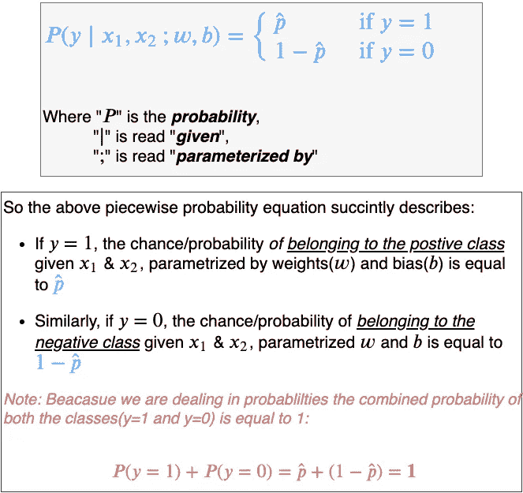
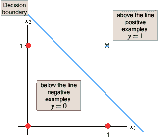
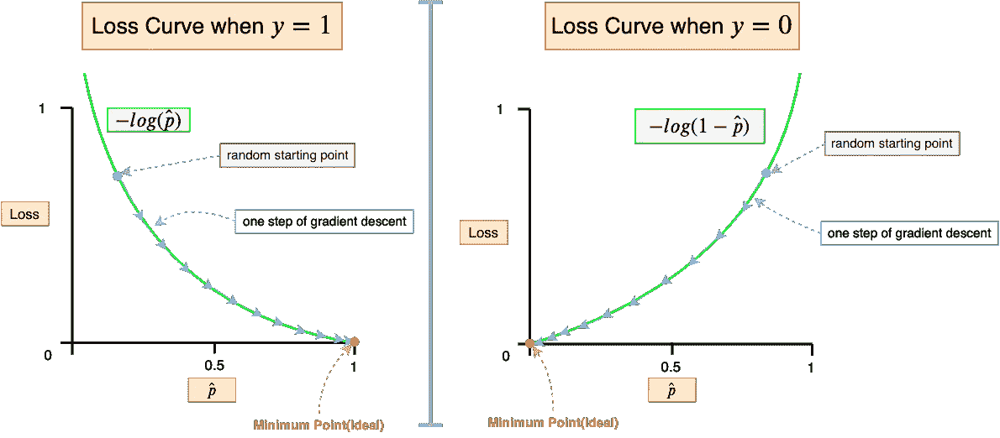
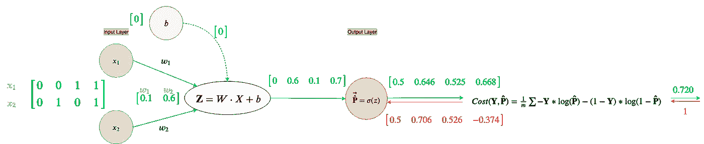
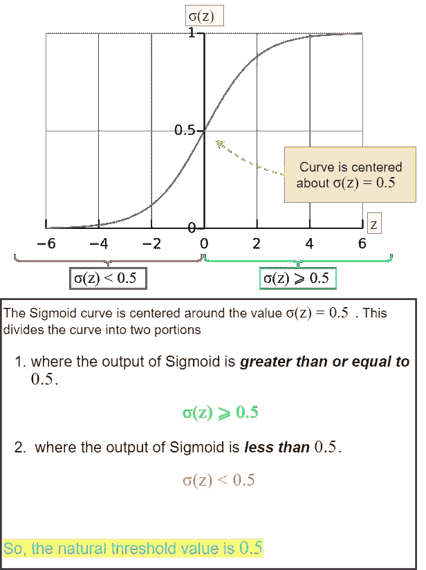
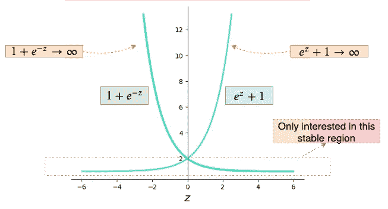
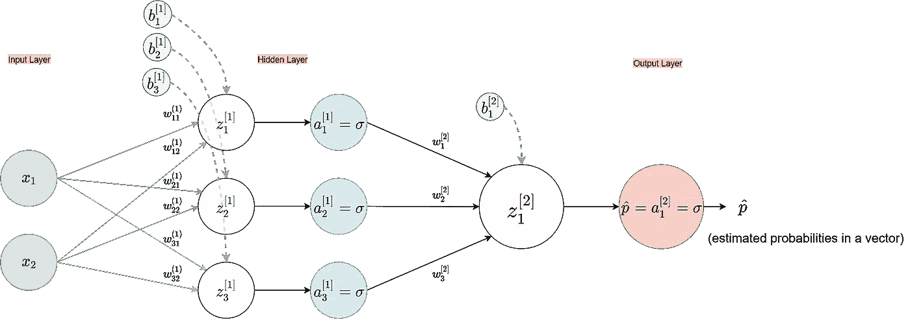
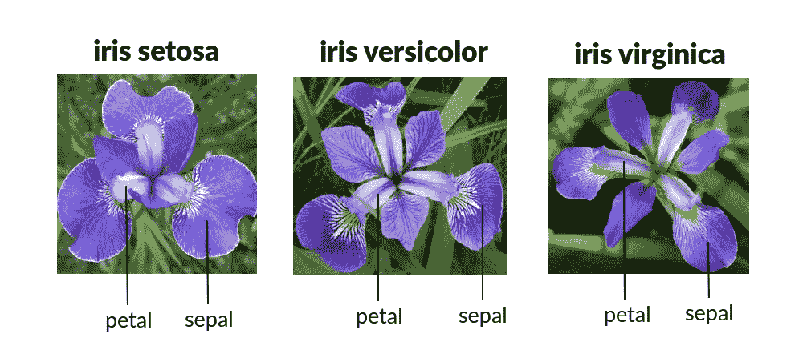

# 只有数字:从零开始理解和创建带有计算图的二元分类神经网络

> 原文：<https://towardsdatascience.com/nothing-but-numpy-understanding-creating-binary-classification-neural-networks-with-e746423c8d5c?source=collection_archive---------1----------------------->

*Nothing but Numpy 是我的神经网络系列的延续。要查看本系列的前一篇博客或重温神经网络，你可以点击* [*这里*](https://medium.com/towards-artificial-intelligence/nothing-but-numpy-understanding-creating-neural-networks-with-computational-graphs-from-scratch-6299901091b0) *。*

这篇文章延续了[从零开始理解和创建带有计算图的神经网络](https://medium.com/towards-artificial-intelligence/nothing-but-numpy-understanding-creating-neural-networks-with-computational-graphs-from-scratch-6299901091b0)。

当你打开 20 个浏览器标签试图理解一个复杂的概念，而你遇到的大多数文章都重复着同样肤浅的解释时，你很容易感到困惑。在 *Nothing but NumPy 的第二部分中，*我将再次努力让读者更深入地了解神经网络，因为我们将更深入地研究一种称为“二进制分类神经网络”的特定神经网络。*如果你读过我的* [*上一篇文章*](https://medium.com/towards-artificial-intelligence/nothing-but-numpy-understanding-creating-neural-networks-with-computational-graphs-from-scratch-6299901091b0) *那么这看起来会很熟悉。*

理解“二元分类”将有助于我们放下主要概念，这些概念有助于我们理解我们在多分类中做出的许多选择，这就是为什么这篇文章也将作为“从头开始理解和创建具有计算图的 Softmax 层”的前奏。

这篇博文分为两部分，第一部分将理解二进制分类神经网络的基础知识，第二部分将包含实现从第一部分学到的所有内容的代码。

# 第一部分:了解二元分类

# 让我们开始吃吧🍽️

二元分类是一种常见的机器学习任务。它包括预测一个给定的例子是属于一个类还是另一个类。这两个类可以被任意分配为一个*或一个***【1】***用于数学表示，但更常见的是感兴趣的对象/类被分配为一个***1******【正标签】*** ，其余的为一个*0****(负标签)例如:****

*   *给出的图片是猫( ***1*** )还是非猫( ***0*** )？*
*   *给定一个病人的检查结果，肿瘤是良性的(***0***)；无害)或恶性(***1***)；有害)？*
*   *给定一个人的信息(如年龄、教育程度、婚姻状况等)作为特征，预测他们的年收入是低于 5 万美元( ***0*** )还是高于 5 万美元( ***1*** )。*
*   *给定的电子邮件是垃圾邮件(1)还是非垃圾邮件(0)？*

*在上述所有示例中，感兴趣的对象/类别被分配了正标签( ***1*** )。*

*大多数时候，一个给定的机器学习问题是否需要*二元分类*是相当明显的。一般的经验法则是*二元分类帮助我们回答是(1)/否(0)问题。**

*现在，让我们构建一个简单的 1 层神经网络(仅输入和输出层)，并手动求解它以获得更好的图像。*(我们将制作一个与我的* [*上一篇文章*](https://medium.com/towards-artificial-intelligence/nothing-but-numpy-understanding-creating-neural-networks-with-computational-graphs-from-scratch-6299901091b0) *中阐述的神经网络相同的神经网络，但有一个关键的区别，* ***神经网络的输出被解释为概率*** *而不是原始值)。**

**

*Fig 1\. Simple input-output only neural network*

*让我们扩展这个神经网络来揭示它的复杂性。*

**

*Fig 2\. Expanded neural network*

*对于那些不熟悉神经网络所有不同部分的人，我将简要介绍一下它们。(在我的[上一篇文章](https://medium.com/towards-artificial-intelligence/nothing-but-numpy-understanding-creating-neural-networks-with-computational-graphs-from-scratch-6299901091b0)中提供了更详细的解释)*

**

*Fig 3\. Annotated Expanded Neural Network*

*   ***输入: *x₁*** 和 ***x₂*** 是两个特征的输入节点，这两个特征表示我们希望我们的神经网络从中学习的示例。由于输入节点形成网络的第一层，因此它们被统称为“ ***输入层*** ”。*
*   ***权重:*w₁***&***w₂***分别代表我们与输入*&***【x₂】******关联的权重值。*** 权重控制每个输入对下一个节点计算的影响。神经网络“学习”这些权重以做出准确的预测。最初，权重是随机分配的。**
*   ****线性节点(z):**“***z***”节点从所有进入它的输入中创建一个线性函数*，即****z =w₁x₁+w₂x₂+b*****
*   ****偏置:*****b****代表偏置节点。偏差节点将一个加性量插入线性函数节点( ***z*** )。顾名思义*，偏置会摆动输出，以便更好地与我们期望的输出*保持一致。偏差的值被初始化为 ***b=0*** 并且也在训练阶段被学习。***
*   ****Sigmoid 节点:**这个 ***σ*** 节点，称为 Sigmoid 节点，从前面的线性节点( ***z*** )获取输入，并将其传递给下面的激活函数，称为 **Sigmoid 函数**(因为它是 S 形曲线)，也称为**逻辑函数**:**

****

**Fig 4\. Output sigmoid/logistic node**

**Sigmoid 是神经网络中使用的许多“激活函数”之一。激活函数是非线性函数(*不是简单的直线*)。他们*通过扩展其维度*为神经网络添加非线性，反过来帮助它学习复杂的东西*(更多细节请参考我之前的* [*帖子*](https://medium.com/towards-artificial-intelligence/nothing-but-numpy-understanding-creating-neural-networks-with-computational-graphs-from-scratch-6299901091b0) *)* 。由于它是我们神经网络中的最后一个节点，它是神经网络的输出，因此被称为“输出层”。**

*****一个线性节点(z)结合一个偏置节点(b)和一个激活节点*，如乙状结肠节点(σ)，在人工神经网络** *中形成一个“*神经元”*。***

**

*Fig 5\. A neuron in a neural network*

**在神经网络文献中，假设人工神经网络中的每一个神经元都有一个线性节点及其对应的偏置，因此线性节点和偏置节点在神经网络图中没有显示*，如 ***图 1*** *。*为了更深入地理解神经网络中的计算，我将在这篇博文中继续展示神经网络的扩展版本，如图 ***图 2*** 。*

***在输出层使用*单个* Sigmoid/Logistic 神经元是*二元分类神经网络的支柱。*** 这是因为一个 Sigmoid/Logistic 函数的 ***输出可以方便地解释为估计的 probability(p̂，*** *读作 p-hat* ***)，即给定的输入属于“正”类。*** 如何？让我们再深入一点。*

*Sigmoid 函数将任何输入压缩到输出范围***0<σ<1***内。因此，例如，如果我们正在创建一个基于神经网络的“cat(1) vs. not-cat(0)”检测器，给定图像作为输入示例，我们的输出层仍将是一个*单个* Sigmoid 神经元，将先前层的所有计算转换为 ***、*** 简单的 0–1 输出范围。*

**

*Fig 6\. Structure of the output layer of any binary classification neural network*

*然后我们可以简单地将***【p̂***解释为*给定的输入图像是猫的概率是多少？*”，其中“猫”为阳性标签。如果 ***p̂≈0*** ，那么**极不可能**输入图像是猫的，另一方面， ***p̂≈1*** 那么**很可能**输入图像是猫的。*简单来说，* ***p̂*** *就是我们的神经网络模型在预测输入是一只猫也就是正类的时候有多自信(* ***1*** *)。**

*这在数学上可以简单地概括为条件概率:*

**

*Fig 7\. Piecewise probability equation*

*由于每个二元分类神经网络架构在输出层都有一个*单个 Sigmoid 神经元，如上面 ***图 6*** 所示，Sigmoid 的输出(估计概率)取决于与神经元相关联的线性节点(***z***)*的输出。如果线性节点的值(***)z***)为:***

**

*Fig 8\. Sigmoid Curve interpreted as a probability distribution*

1.  ****大于零(z > 0)*** 那么 Sigmoid 节点的输出是 ***大于 0.5****(σ(z)>0.5)*，可以解释为“输入图像是猫的概率是 ***大于*** 大于 50%”。*
2.  ****小于零(z < 0)*** 那么乙状结肠节点的输出是 ***小于 0.5(σ(z) < 0.5)*** ，可以解释为“输入图像是猫的概率是 ***小于*** 小于 50%”。*
3.  ****等于零(z=0)*** 那么 Sigmoid 节点 ***的输出等于 0.5(σ(z)=0.5)*** ，也就是说“输入图像是猫的概率是 ***正好是*** 50%”。*

*现在我们知道了我们的神经网络中的每样东西代表什么，让我们看看我们的二元分类神经网络在给定以下数据集的情况下执行什么计算:*

**

*Fig 9\. AND logic gate data and plot*

*上面的数据代表 AND 逻辑门，其中只有当两个输入都是 ***x₁=1*** 和 ***x₂=1*** 时，输出才被赋予一个正标签( ***1*** )，所有其他情况都被赋予一个负标签( ***0*** )。数据的每一行都代表了我们希望我们的神经网络从中学习然后进行分类的一个例子。我还在二维平面上绘制了这些点，以便于可视化*(红点表示类(* ***y*** *)为 0 的点，绿色十字表示类为****1****)*的点)。这个数据集也恰好是 ***线性可分的*** ，即我们可以画一条直线来将阳性标记的样本与阴性标记的样本分开。*

**

*Fig 10\. Showing linear separation of AND gate data points*

*上面显示的蓝线，称为**，*把我们两个阶级分开。线上是我们的阳性标记示例(绿色十字)，线下是我们的阴性标记示例(红色十字)。在幕后，这条蓝线是由 ***z*** *(线性函数)节点*形成的。我们稍后将看到神经网络如何学习这个*决策边界*。**

**像我之前的博文一样，首先，我们将执行 ***随机梯度下降*** ，这是使用来自我们训练数据的一个例子来训练神经网络。然后，我们将把我们从随机过程中学到的知识推广到 ***批量梯度下降*** ( *首选方法*)，在这里，我们使用训练数据中的所有示例来训练神经网络。**

# **随机梯度下降**

**神经网络中的计算从左向右移动，这被称为 ***正向传播。*** 让我们来看一下当提供了*仅第一个训练示例* ***x₁ = 0*** 和 ***x₂ = 0*** 时，我们的神经网络将执行的所有正向计算。此外，我们将随机初始化权重为 ***w₁=0.1*** 和 ***w₂=0.6*** ，偏差为 ***b=0。*****

****

**Fig 11\. Forward propagation on the first example from AND gate table**

**所以，神经网络的预测是**p̂=0.5.的****回想一下，这是一个二进制分类神经网络，****【p̂】***这里代表输入例子的估计概率，具有特征的*&***【x₂=0***，属于正类( ***1*** )。我们的神经网络目前认为有一个 ***0.5*** (或 ***50%*** )的几率第一个训练样本属于正类(*从概率方程回忆这等同于* ***P(1∣ x₁，x₂；w,b)=p̂=0.5*** )。****

**呀！这有点可怜😕，尤其是因为*负*标签与第一个示例相关联，即 ***y=0。*** 估计概率应该在 ***p̂≈0 左右；*** *第一个例子属于积极阶层的可能性应该很小，这样一来，* *属于消极阶层的几率就高*(即 ***P(0∣ x₁、x₂；*** ) *。***

**如果你读过我以前的文章，那么你知道在这一点上，我们需要一个损失函数来帮助我们。那么，我们应该用什么损失函数来告诉一个 ***二元分类*神经网络**来修正它的估计概率呢？进来的是 ***二进制*** ***交叉熵损失函数*** 来解救我们。**

## **二元交叉熵损失函数**

***注:在大多数编程语言中“****log****”是自然对数(log 以-****e****)，在数学上表示为“* ***ln*** *”。为了代码和等式之间的一致性，请将“****log****”视为自然对数，而不是“****log₁₀****”(以 10 为底的 log)。***

**二元交叉熵(BCE)损失函数定义如下:**

****

**Fig 12\. The Binary Cross-Entropy Loss function**

***所有损失函数本质上都告诉我们，我们的预测输出离我们的期望输出有多远，仅举一个例子***。简单地说，损失函数计算预测值和实际值之间的误差*。考虑到这一点，当训练示例的关联标签为 ***y=1*** *【正】*时，二元交叉熵(BCE)损失函数计算不同的损失，并且当标签为 ***y=0*** *【负】*时，计算不同的损失。让我们看看:***

****

**Fig 13\. Binary Cross-Entropy Loss function broken down into piecewise equation**

**现在很明显 ***图 12*** 中的 BCE 损失函数只是分段方程**的优雅压缩版本。****

**让我们绘制上面的分段函数来可视化下面发生的事情。**

****

**Fig 14\. Visualizing the BCE Loss function for each class**

**因此，BCE 损失函数捕捉了当估计的概率相对于训练示例的标签完全错误时，神经网络应该支付高惩罚( ***损失→∞*** )的直觉。另一方面，当估计的概率相对于训练示例的标签是正确的时，损失应该等于零( ***损失=0*** )。简而言之，BCE 损失应该仅在两种情况下等于零:**

1.  **如果该示例被正标记(y=1)，则神经网络模型应该*完全确定该示例* ***属于正类*** *，即* ***p̂=1.*****
2.  **如果该示例被负标记(y=0)，则神经网络模型应该是 c *完全确定该示例* ***不属于正的*** *类，即* ***p̂=0.*****

***在神经网络中，损失函数的梯度/导数决定了是增加还是减少神经网络的权重和偏差。*让我们看看二元交叉熵(BCE)损失函数的导数是什么样子的:**

****

**Fig 15\. The derivative of the Binary Cross-Entropy Loss function**

**我们还可以将导数分解成分段函数，并可视化其效果:**

****

**Fig 16\. Breaking down the derivative of the loss function and visualizing the gradient**

*****正的导数意味着减少权重，负的导数意味着增加权重。*** ***坡度越陡，预测越不正确。*** 让我们先拿**一会儿来确定我们理解了这种说法:****

*   ****如果梯度为* ***负*** ，这将意味着我们正在查看第一条损失曲线，其中示例的实际标签为*正(y=1)* 。将损耗降低到零的唯一方法是沿着斜率(梯度)的相反方向移动，*从负到正。*因此，我们需要*增加权重和偏差*以便***z = w₁x₁+w₂x₂+b>0*****图 8**)**并依次*估计归属概率******
*   *同样，当梯度为 ***正*** 时，我们看到的是第二条损耗曲线，该示例的实际标签为*负(y=0)。*将损耗降至零的唯一方法是再次向斜率(梯度)的相反方向移动，这一次*从正到负。*在这种情况下，*我们将需要减少权重和偏差，以便****z = w₁x₁+w₂x₂+b<0***并因此*估计属于阳性类别* ***p̂≈σ(z)≈0.的概率****

*到目前为止，对 BCE 损失的解释足以满足所有意图和目的，但你们中的好奇者可能想知道这个损失函数是从哪里来的，为什么不像在[上一篇文章](https://medium.com/towards-artificial-intelligence/nothing-but-numpy-understanding-creating-neural-networks-with-computational-graphs-from-scratch-6299901091b0)中那样使用均方误差损失函数呢？稍后将详细介绍。*

*现在我们知道了损失函数的目的和二元交叉熵损失函数如何工作，让我们在我们当前的例子( ***x₁ = 0*** 和 ***x₂ = 0*** )上计算 BCE 损失，对于这个例子，我们的神经网络估计属于正类的概率是***【p̂=0.5***，而它的标签( ***y*** )是 ***y=0****

**

*Fig 17\. Loss on the first example*

*损失约为 ***0.693*** (四舍五入到小数点后 3 位)。*我们现在可以使用 BCE 损失函数的导数来检查我们是否需要增加或减少权重和偏差，使用称为* ***反向传播的过程；*** *它与正向传播相反，我们从输出到输入反向跟踪*。反向传播允许我们计算出神经网络的每个部分造成了多少损失，然后我们可以相应地调整神经网络的这些部分。*

*如我之前的[帖子](https://medium.com/towards-artificial-intelligence/nothing-but-numpy-understanding-creating-neural-networks-with-computational-graphs-from-scratch-6299901091b0)所示，我们将使用以下图形技术将梯度从输出层传播回神经网络的输入层:*

**

*Fig 18\. Gradient Flow*

*在每个节点，我们只计算局部梯度(该节点的偏导数)。然后，在反向传播期间，当我们从上游接收梯度的数值时，我们将上游梯度与局部梯度相乘，并将它们传递到它们各自连接的节点。 *这是对* ***链式法则*** *的概括，来自微积分。**

*让我们一步一步地回顾反向传播:*

**

*Fig 19.a. Backpropagation on the 1ˢᵗ example*

*下一次计算，我们需要 Sigmoid 函数的导数，它在红色节点形成局部梯度。Sigmoid 函数的导数(在我的[上一篇文章](https://medium.com/towards-artificial-intelligence/nothing-but-numpy-understanding-creating-neural-networks-with-computational-graphs-from-scratch-6299901091b0)中有详细推导):*

**

*Fig 20\. The derivative of the sigmoid function*

*现在让我们使用 Sigmoid 节点的导数，并进一步反向传播梯度:*

**

*Fig 19.b. Backpropagation on the 1ˢᵗ example*

*梯度不应传播回输入节点(即红色箭头不应朝向绿色节点),因为我们不想改变我们的输入数据，我们只想改变与它们相关的权重。*

**

*Fig 19.c. Backpropagation on the 1ˢᵗ example*

*最后，我们可以通过执行 ***梯度下降来更新神经网络的参数(权重和偏差)。****

## *梯度下降*

****梯度下降*** 是通过向梯度*的负方向移动，即从倾斜区域向更平坦的区域*移动来调整神经网络的参数。*

**

*Fig 21\. Visualizing Gradient Descent on Binary Cross-Entropy Loss function*

*梯度下降的一般方程为:*

**

*Fig 22\. The general equation for **gradient descent***

**学习率，* ***α*** *(读作 alpha)* ***，*** 用于控制损耗曲线下降的步长( ***图 21*** )。学习率是神经网络的 ***超参数*** ，这意味着它不能通过梯度的反向传播来学习，必须由神经网络的创建者来设置，理想情况下是在一些实验之后。更多关于学习率影响的信息，你可以参考我之前的[帖子](https://medium.com/towards-artificial-intelligence/nothing-but-numpy-understanding-creating-neural-networks-with-computational-graphs-from-scratch-6299901091b0)。*

*请注意，梯度下降的步长(蓝色箭头)越来越小，这是因为当我们从倾斜区域向更平坦的区域移动时，在最小点附近，梯度的幅度也会减小，从而导致步长逐渐变小。*

*我们将*学习率* ( ***α*** )设为 ***α=1。****

**

*Fig 23\. Calculating new weights and bias*

*现在我们已经更新了权重和偏差(实际上我们只能在这次训练迭代中更新我们的偏差),让我们对同一个例子和**进行**正向传播**计算新的损失**来检查我们是否做了正确的事情。*

**

*Fig 24\. Forward propagation with the updated bias on 1ˢᵗ example*

**

*Fig 25\. New loss after training on the 1ˢᵗ example*

*现在，属于正类( ***p̂*** )的 1ˢᵗ示例的估计概率从 0.5 下降到大约 ***0.378*** (四舍五入到 3 d.p)，因此，BCE 损耗也减少了一点，从 0.693 下降到大约*(到 3 d.p)。**

**到目前为止，我们已经执行了 ***随机梯度下降。*** 我们仅使用了一个示例( ***x₁=0*** 和 ***x₂=0*** )，来自我们的四个示例的与门数据集，以执行单个训练迭代(*每个训练迭代是前向传播，计算损耗，随后是反向传播，并通过梯度下降更新权重*)。**

**我们可以继续通过一次从一个例子中学习来更新权重，但理想情况下，我们希望一次从多个例子中学习，并减少所有例子中的损失。**

# **批量梯度下降**

*****在批量梯度下降*** *(* 也称为*完全批量梯度下降)中，我们在每次训练迭代中使用数据集中的所有训练样本。(如果由于某种原因，批量梯度下降是不可能的，例如，所有训练数据的大小太大而不适合 RAM 或 GPU，我们可以在每次训练迭代中使用数据集的子集，这被称为* ***小批量梯度下降*** *)。)***

****一批只是一个充满训练样本的向量/矩阵。****

**在我们继续处理多个例子之前，我们需要定义一个 ***成本函数。*****

## **二元交叉熵代价函数**

**对于批量梯度下降，我们需要调整*二元交叉熵(BCE)损失函数*以适应批量中的所有样本，而不仅仅是一个样本。这种调整后的*损失*函数称为 ***代价*** 函数*(在神经网络文献中也用字母* ***J*** *表示，有时也称为* ***目标函数*** *)* 。**

****不是计算一个示例的*损失*,*成本*函数计算批次中所有示例的*平均* *损失*。****

****

**Fig 26\. Binary Cross-Entropy **Cost** function**

**当执行批量梯度下降(或小批量梯度下降)时，我们对成本函数而不是损失函数求导。接下来，我们将看到如何对二元交叉熵成本函数求导，使用一个简单的例子，然后从那里推广。**

## **二元交叉熵代价函数的导数**

**在矢量化形式中，我们的 BCE 成本函数如下所示:**

****

**Fig 27\. Cost function taking vectorized inputs**

****

**Fig 28\. Calculation of Cost on a simple vectorized example**

**正如所料，成本只是两个示例的平均损失，但我们所有的计算都是矢量化的，允许我们一次性计算一个批次的二元交叉熵成本。我们更喜欢在神经网络中使用矢量化计算，因为计算机硬件(CPU 和 GPU)更适合矢量化形式的批量计算。(*注意:如果我们在批次中只有一个示例，BCE 成本将只是计算 BCE 损失，就像我们之前经历的随机梯度下降示例一样***

**接下来，让我们推导这个矢量化成本函数的偏导数。**

****

**Fig 29\. Calculation of Jacobian on a simple example**

**由此，我们可以推广*二元交叉熵代价*函数的偏导数。**

****

**Fig 30\. The generalized derivative of the Cost Function**

***成本*函数的一个非常重要的结果是*因为它计算一批样本的平均损耗，它*也*计算一批样本的梯度平均值，这有助于计算出一个噪声更小的总方向，其中所有样本的损耗减少*。相反，*随机梯度下降(只有一个例子的批次)给出了一个非常嘈杂的梯度估计*，因为它在每个训练迭代中只使用一个例子来引导*梯度下降*。**

**对于矢量化(批处理)计算，我们需要调整神经网络的线性节点( ***z*** )，以便它接受矢量化输入并使用成本函数而不是损失函数，也是出于同样的原因。**

****

**Fig 31\. Vectorized implementation of Z node**

*****Z*** 节点现在计算适当大小的权重矩阵( ***W*** )和训练数据( ***X*** )之间的 ***点积*** 。 ***Z*** 节点的输出现在也是一个矢量/矩阵。**

**现在我们可以设置我们的数据( ***X，W，b & Y*** )进行矢量化计算。**

****

**Fig 32\. Data setup for batch(vectorized) processing**

**我们现在终于准备好使用 **Xₜᵣₐᵢₙ** 、 **Yₜᵣₐᵢₙ** 、 **W、**和 **b** 执行正向和反向传播。**

***(注:以下所有结果均四舍五入至小数点后 3 位，仅为简洁起见)***

********

**Fig 33\. Vectorized batch forward propagation on AND gate dataset**

**通过向量化计算，我们进行了前向传播；一次性计算批次中每个示例的所有估计概率。**

**现在我们可以计算这些输出估计概率的 BCE 成本(P ***、̂*** )。*(下面，为了便于阅读，我用蓝色突出显示了成本函数中计算正例损失的部分，用红色突出显示了负例损失的部分)***

****

**Fig 34\. Calculation of Cost on the OR gate data(highlighted Loss in red for negative examples and blue for positive examples)**

**因此，用我们当前的权重和偏差计算的*成本*大约是***0.720**。我们现在的目标是使用反向传播和梯度下降来降低这个*成本*。让我们一步一步地进行反向传播。***

********

**Fig 35.a. Vectorized Backpropagation on AND gate dataset**

********

**Fig 35.b. Vectorized Backpropagation on AND gate dataset**

********

**Fig 35.c. Vectorized Backpropagation on AND gate dataset**

**就像这样，我们使用矢量化计算，一次性计算了整批训练样本的成本函数的所有梯度。我们现在可以执行*梯度下降*到*更新权重和偏差。***

***(对于那些对上一个反向传播步骤中∂Cost/∂W 和∂Cost/∂b 是如何计算的感到困惑的人，请参考我之前的博客*[](https://medium.com/towards-artificial-intelligence/nothing-but-numpy-understanding-creating-neural-networks-with-computational-graphs-from-scratch-6299901091b0)**，在那里我分解了这个计算，更具体地说，为什么点积的导数会导致转置矩阵)****

****

**Fig 36\. Updating weights and bias using **batch gradient descent****

**为了检查我们是否做了正确的事情，我们可以使用新的权重和偏差来执行另一个 ***前向传播*** 和**计算新的成本。****

********

**Fig 37\. Forward propagation with updated weights and bias**

****

**Fig 38\. New Cost(highlighted Loss in red for negative examples and blue for positive examples)**

**通过一次训练迭代，我们已经将*二进制交叉熵成本*从 0.720 降低到大约 **0.618。**我们将需要执行多次训练迭代，然后才能收敛到良好的权重和偏差值，从而实现整体较低的 BCE *成本*。**

***在这一点上，如果您想试一试并自己执行下一个反向传播步骤，作为一个练习，下面是成本 w.r.t 权重(* ***W*** *)和偏差(* ***b*** *)的近似梯度，您应该得到(四舍五入到 3 d.p):***

*   *****【∂cost/∂w =[-0.002，0.027】*****
*   *****∂cost/∂b =【0.239】*****

**在大约 5000 个历元之后(当神经网络在一次训练迭代中遍历所有训练示例时，一个历元完成)，成本稳定地降低到大约 ***0.003*** ，我们的权重稳定到大约***W =【10.678，10.678】，*** 偏差稳定到大约***b =[-16.1818]*** 我们通过下面的*成本曲线*看到，网络已经收敛到一组良好的参数(*即****W***&***b***):**

****

**Fig 39\. Plotting the Cost Curve(left) and the Decision Boundary(right)**

****成本曲线**(或学习曲线)是神经网络模型随时间的表现。它是每隔几个训练迭代(或时期)后绘制的成本。请注意*成本*最初下降的速度有多快，然后逐渐接近，回想一下 ***图 21*** 这是因为最初梯度的幅度很高，但是随着我们下降到接近最小*成本*的较平坦区域，梯度的幅度下降，并且进一步的训练仅略微改善了神经网络参数。**

**在神经网络已经训练了 5000 个时期之后，Xₜᵣₐᵢₙ上的预测输出概率(***【p̂】***)是:**

```
**[[9.46258077e-08,  4.05463814e-03,  4.05463814e-03, 9.94323194e-01]]**
```

**让我们来分解一下:**

1.  **对于 *x₁=0，x₂=0，*预测产量为***p̂≈9.46×10⁻⁸≈0.0000000946*****
2.  **对于 *x₁=0，x₂=1* 预测产量为**t23】p̂≈4.05×10⁻≈0.00405****
3.  **对于 *x₁=1，x₂=0* 预测产量为***p̂≈4.05×10⁻≈0.00405*****
4.  **对于 *x₁=1，x₂=1* 预测产量为***p̂≈9.94×10⁻≈0.994*****

**回想一下，标签是***y =【0，0，0，1】。因此，*仅对于最后一个示例，神经网络有 99.4%的置信度认为它属于正类，对于其余的，它的置信度小于 1%**。还有，还记得 ***图 7*** 的概率方程吗？*****p(0)=1-p̂***，所以的预测概率(*)证实我们的神经网络知道它在做什么👌。*****

***既然我们知道神经网络预测的 ***概率*** 是正确的，我们需要定义*何时应该是 ***1*** 以及何时应该是 ***0*** *，即根据这些概率*对示例进行分类。为此，我们需要定义一个 ***分类阈值(*** 也叫 ***决策阈值)。*** 那是什么？让我们开始吧****

## **分类阈值**

**在二元分类任务中，****常见的是，如果估计的 probability(p̂大于某个阈值，则将神经网络的所有预测分类到正类(1)，并且类似地，如果估计的概率低于该阈值，则分类到负类(0)。******

**这可以用数学方法写成如下:**

****

**Fig 40\. Class prediction model**

***阈值的值定义了我们的模型在将输入分配给阳性类别*时的严格程度。假设如果阈值是 ***thresh=0，*** 那么所有的输入实例将被分配到正类，即预测类***【ŷ】***将总是*。类似地，如果 ***thresh=1*** ，那么所有的输入实例将被分配给负类，即预测类***【ŷ】***将始终是 ***ŷ=0.*** *(回想一下，sigmoid 激活函数在两端渐近线，因此它可能非常接近 0 或 1，但绝不会完全输出 0 或 1)****

**Sigmoid/Logistic 函数为我们提供了一个自然的阈值。回想一下前面的 ***图 8*** 。**

****

**Fig 41\. The natural threshold value from the sigmoid function**

**因此，利用自然阈值 ***0.5*** ，可以如下预测类别:**

****

**Fig 42\. Class prediction model with **thresh=0.5****

**我们如何解读这一点？嗯如果神经网络至少有 50%*(***0.5***)的置信度比输入属于正类( ***1*** )那么我们就把它分配给正类(***【ŷ=1***)，否则我们就把它分配给负类(***ŷ=0******

**回想一下我们如何在 ***图 10*** 中预测，神经网络可以通过绘制一条线来分隔阳性类别(绿色十字)和阴性类别(红色十字)来分隔与门数据集中的两个类别。嗯，**那条线的*位置是由我们的阈值定义的。***我们来看看:**

****

**Fig 43\. Deconstructing the inequality equation for class prediction**

**回想训练后我们的权重和偏差分别收敛到大约***W =【10.678】***和 ***b = [-16.186]*** 。我们把这些代入上图 ***图 43*** 中导出的不等式。**

****

**Fig 44\. Plugging in values into the inequality**

**此外，认识到这个不等式给我们一个等式，一条线把我们两个阶级分开:**

****

**Fig 45\. Deriving equation of the line that forms the Decision Boundary**

**图 45 中 ***标记的一条线的这个方程构成了**判定边界**。**决策边界**是神经网络将其预测从正类变为负类的线，反之亦然。*落在线上的所有点(****【x₁,x₂】****)的估计概率恰好为 50%，即****【p̂=0.5】***，*其上的所有点的估计概率大于 50%，即* ***p̂ > 0.5，*** *线下的所有点的估计概率为******

*我们可以通过给区域*加阴影来可视化*决策边界*，其中神经网络预测*正类(1)* 和 ***红*** 神经网络预测*负类(0)* 。**

********

**Fig 46\. (left) Decision Boundary with thresh=0.5\. || (right) Decision Boundary **shaded** with thresh=0.5**

***在大多数情况下，我们可以在二元分类问题中设置 0.5 的阈值。*那么，在深入了解阈值之后，有什么收获呢？我们是不是应该把它设置为 0.5，然后忘掉它？*没有！在某些情况下，您会希望阈值很高，例如，如果您正在创建一个癌症检测神经网络模型，您会希望您的神经网络非常有信心，可能至少有 95%(0.95)甚至 99%(0.99)的患者患有癌症，因为如果他们没有，他们可能不得不白白经历毒性化疗。另一方面，猫检测器神经网络模型可以设置为低阈值，大约 0.5 左右，因为即使神经网络将猫错误分类，这也只是一个有趣的事故，没有伤害也没有犯规。***

**现在，为了阐明分类阈值的概念，让我们将分类阈值对决策边界的位置以及神经网络模型的结果准确性的影响可视化:**

************

**Fig 47.a. **thresh=0.000000001,** all the values assigned to the positive class (accuracy = 25%)**

************

**Fig 47.b. **thresh=0.00001,** only one point(red cross) correctly assigned to negative class, rest to the positive class (accuracy = 50%)**

************

**Fig 47.c. **thresh=0.5,** all points correctly assigned their respective class(accuracy = 100%)**

************

**Fig 47.d. **thresh=0.9999,** all points assigned negative class (accuracy = 75%)**

**在上述四幅图中训练神经网络之后，我绘制了决策边界(左)、阴影决策边界(中)和每个点离决策边界的最短距离(右)，分类阈值的范围从 *0.000000001 到 0.9999。***

***分类阈值也是神经网络* ***模型*** 的超参数，需要根据手头的问题 ***进行调整。*** 分类阈值不直接影响神经网络(它不改变权重和偏差)，它仅用于将输出概率转换回我们类别的二进制表示*，即转换回 1 和 0*。**

***最后说明一下，* ***决定边界的不是数据集*** *的属性，它的形状(直的、弯曲的等等。)是神经网络的权重和偏差的结果，并且它的位置是分类阈值的结果。***

**到目前为止我们已经学到了很多，对吗？😅在很大程度上，我们几乎知道关于二元分类问题的一切，以及如何通过神经网络来解决它们。不幸的是，我有一些坏消息，我们的二元交叉熵损失函数有一个严重的计算缺陷，它在目前的形式下非常不稳定😱。**

**放心吧！通过一些简单的数学运算，我们就能解决这个问题**

# **二元交叉熵函数的实现**

**让我们再来看看*二元交叉熵(BCE)损失*函数:**

****

**Fig 48\. The Binary Cross-Entropy Function**

**从分段方程中注意到，*二元交叉熵损失*函数的所有特征都依赖于" **log"** 函数(回想一下，这里的"**log "****是自然对数)。****

****让我们画出 ***log*** 函数，并形象化其特征:****

********

****Fig 49\. The Natural Logarithm function plotted****

*****二值交叉熵损失*中的 **log** 函数定义了神经网络何时付出高惩罚( ***损失→∞*** )以及神经网络何时正确( ***损失→0*** )。*的域****log****函数是****0<x<∩****其范围是无界的****-∩<log(x)<∩****，*更重要的是，作为**因此，接近零的值的微小变化会对*二进制交叉熵损失*函数的结果产生极大影响，此外，我们的计算机只能以一定的浮点精度存储数字，当有函数趋向于无穷大时，它们会导致 [*数字溢出*](https://stats.stackexchange.com/questions/1389/what-is-numerical-overflow) *(溢出是指数字太大而无法存储在计算机内存中，下溢是指数字太小而无法存储在计算机中)*。原来*二元交叉熵*函数的优点，即**对数**函数，也是它的弱点，使得它在小值附近不稳定。******

*****这对梯度的计算也有可怕的影响*。随着数值越来越接近零，梯度趋向于接近 ***无穷大*** *使得梯度计算也不稳定*。****

********

****Fig 50\. Near zero the gradient of the **log** function also becomes unstable****

****考虑下面的例子:****

********

****Fig 51\. Instability of the natural Log function making it unable to calculate the Cost****

****类似地，在计算上述示例的梯度时:****

********

****Fig 52\. Unable to calculate gradient because we used derivate of natural Log, which is also unstable****

****现在让我们看看如何解决这个问题:****

********

****Fig 53\. Making the Binary Cross-Entropy Loss Function stable****

****我们已经成功地将 then 自然对数( ***log*** )函数带出危险地带！***【1+e⁻ᶻ】*的范围大于 1* (*** **即* **1+e⁻ ᶻ > 1) *结果 BCE 损耗中*【log】*函数的范围变得大于 0* (** *即* **log( *1+e⁻* 总体二元交叉熵函数不再是临界不稳定的。*******

****我们可以就此打住，但让我们更进一步，进一步简化损失函数:****

********

****Fig 54\. Further simplified Binary Cross-Entropy Loss Function****

****我们已经极大地简化了*二进制交叉熵(BCE)* 表达式，但是它有一个问题。看着从 ***到 **1+e⁻ ᶻ** 的曲线，你能猜出来吗？图 53*** ？****

********

****Fig 55\. **1+e⁻ ᶻ** unstable for negative values****

****表达式为“**1+e⁻ᶻ**”**趋于无穷大为负值(** *即* **1+e⁻ ᶻ →∞，** *当 z < 0* **)！** *所以，不幸的是，这个简化的表达式在遇到负值时会溢出。*让我们试着解决这个问题。****

********

****Fig 56\. Second simplification of Binary Cross-Entropy Loss function****

****现在，通过这个“ **eᶻ+1** ”表达式，我们已经解决了对数函数在负值时不稳定的问题。不幸的是，现在我们面临相反的问题，新的二元交叉熵损失函数对于大的正值是不稳定的😕因为“**eᶻ+1**”**对于正值趋向于无穷大(** *即* **eᶻ+1 →∞，** *当 z > 0* **)！******

****让我们想象一下这两个指数表达式:****

********

****Fig 57. **eᶻ+1**(blue)and **1+e⁻ ᶻ**(green) **visualized******

****我们需要以某种方式将这两个简化的函数(在 ***图 54***&***56***中)组合成一个二元交叉熵(BCE)函数，使得整体损失函数在所有值*正和负之间都是稳定的。*****

********

****Fig 58\. Final stable and simplified Binary Cross -Entropy Function****

****让我们确认它对负值和正值进行了正确的计算:****

********

****Fig 59\. Example calculations with new **stable** Binary Cross-Entropy Function****

****花点时间理解这个，试着把它和来自 ***图 58*** 的分段*稳定二元交叉熵损失*函数拼凑起来。****

****因此，通过一些简单的高中数学，我们解决了基本的二元交叉熵函数中的数值缺陷，并创建了一个 ***稳定的二元交叉熵损失和成本函数。*******

****注意，先前的 ***【不稳定】*** ***二元交叉熵损失函数*** *以* 标签( ***y*** )和来自最后一个 sigmoid 节点的概率(***【p̂***)作为输入但是新的稳定成本函数也是如此。****

****现在我们有了一个稳定的 BCE *损失*函数及其对应的 BCE *成本*函数，我们如何找到*二元交叉熵*函数的稳定梯度呢？****

****答案一直就在眼前！****

****回想一下*二元交叉熵损失*函数的导数( ***图 15*** ):****

********

****Fig 60\. The derivative of the Binary Cross Entropy Loss Function****

****还记得在反向传播期间，该导数流入 sigmoid 节点并与 Sigmoid 节点处的局部梯度相乘，这正是 Sigmoid 函数的导数( ***图 19.b.*** ):****

********

****Fig 61\. The derivative of the Sigmoid function****

****当我们将两个导数相乘时，会发生一些美妙的数学现象:****

********

****Fig 62\. Reduction of derivative into simple expression after multiplying the two derivatives****

****所以为了计算导数 ***∂Loss/∂z*** 我们甚至不需要计算损失函数的导数或者乙状结肠节点的导数，相反我们可以绕过乙状结肠节点并传递“*”作为到最后一个线性节点( ***z*** )的上游梯度！*****

********

****Fig 63\. Visualizing the forward and backward training step after optimization****

****这种优化有两大好处:****

1.  ****我们不再需要使用二元交叉熵函数的不稳定导数。****
2.  ****我们也避免与 Sigmoid 函数的 ***饱和梯度*** 相乘。****

****什么是饱和梯度？回想一下 Sigmoid 函数曲线****

********

****Fig 62 Sigmoid curve with flat gradients at either end****

****在 Sigmoid 曲线的两端变得平坦。当权重大量增加或减少使得相关线性节点( ***z*** )的输出变得非常大或非常小时，这在神经网络中成为一个巨大的问题。在这些情况下，梯度(即 sigmoid 节点处的局部梯度)变为零或非常接近零。因此，当进入的上游梯度在 Sigmoid 节点处与非常小的或零的局部梯度相乘时，上游梯度值没有多少或没有能够通过。****

********

****Fig 63\. A consequence of saturating gradients is that very little of the upstream gradient is able to pass through****

****在本节的最后一点上，我们可以找到*稳定二元交叉熵*函数的导数，并得出相同的结论，但我更喜欢上面的解释，因为它帮助我们理解为什么我们可以在二元分类神经网络中反向传播梯度时绕过最后一个 sigmoid 节点。为了完整起见，我还得出以下结论:****

********

****Fig 64\. The derivative using the piecewise stable Binary Cross-Entropy Loss function****

****现在，让我们将我们所学的一切应用到稍微复杂的 XOR 门数据上，我们需要一个多层神经网络*(一个深度神经网络)*，因为单层神经网络的简单直线不会切割(查看我的[以前的帖子](https://medium.com/towards-artificial-intelligence/nothing-but-numpy-understanding-creating-neural-networks-with-computational-graphs-from-scratch-6299901091b0)以了解关于这一现象的更多信息):****

********

****Fig 65 XOR data and plot****

****为了对 XOR 数据集的数据点进行分类，我们将使用以下神经网络架构:****

********

****Fig 66\. A 2-layer neural net architecture****

****神经网络中的一层是具有可调权重的同一深度的任意节点集。神经网络分为两层，中间(隐藏)层和最后一层输出层。****

****在我们继续向前和向后传播之前，让我们扩展这个 2 层神经网络:****

********

****Fig 67\. Expanded 2-layer neural net****

****现在我们准备执行 ***批量梯度下降*** ，从转发传播开始:****

****************

****Fig 68.a. Forward propagation on 2-layer neural net****

****************

****Fig 68.b. Forward propagation on 2-layer neural net****

****我们现在可以计算出**的稳定成本*:*****

********

****Fig 69\. Calculation of Stable Binary Cross-Entropy Cost****

****在计算了*成本*之后，我们现在可以继续进行反向传播并改进权重和偏差。*回想一下，我们可以通过优化技术绕过最后一个乙状结肠节点。*****

****************

****Fig 70.a. Backpropagation on the 2-layer neural net****

****************

****Fig 70.b. Backpropagation on the 2-layer neural net****

****************

****Fig 70.c. Backpropagation on the 2-layer neural net****

****************

****Fig 70.e. Backpropagation on the 2-layer neural net****

****伙计，太多了！😅但是现在我们已经深入了解了关于二分类神经网络的一切。最后，让我们继续进行 ***梯度下降*** 并更新我们的权重。****

********

****Fig 71\. Batch gradient descent update****

****在这一点上，如果你想自己执行下一个训练迭代并进一步理解，下面是你应该得到的近似梯度(四舍五入到 3 d.p):****

********

****Fig 72\. Derivatives computed during 2ⁿᵈ training iteration****

****因此，在 5000 个历元之后，*成本*稳定地降低到大约*0.0017，并且当 ***分类阈值设置为 0.5*** *(在编码部分，您可以摆弄阈值，看看它如何影响决策边界)*:*****

************************

****Fig 73\. (right) The learning curve, (middle) Decision Boundary, (left) Shaded Decision Boundary ***green*** positive label, **red** negative label****

****在结束这一部分之前，我想回答一些可能困扰你的问题:****

## ****1-这不就是逻辑回归吗？****

******是的**，**一个只有*一个 sigmoid 神经元，没有隐含层*的神经网络，如*图 1* 所示，就是逻辑回归**。*单 sigmoid-neuron 神经网络/逻辑回归*可以对可以用直线分离的更简单的数据集进行分类(如与门数据)。对于一个复杂的数据集(如 XOR) ***特征工程*** 需要手工执行，以使*单 sigmoid-neuron 神经网络/逻辑回归充分工作*(在前一篇文章中解释过[)。](https://medium.com/towards-artificial-intelligence/nothing-but-numpy-understanding-creating-neural-networks-with-computational-graphs-from-scratch-6299901091b0)****

****具有多个隐层和多个神经元的多层神经网络称为深度神经网络。深度神经网络可以捕获关于数据集的更多信息，而不是单个神经元，并且可以在很少或没有人工干预的情况下对复杂数据集进行分类，唯一的警告是，它需要比简单分类模型(如*单 sigmoid-neuron 神经网络/逻辑回归)多得多的训练数据。*****

****此外，*单 sigmoid 神经元神经网络/逻辑回归的二元交叉熵成本函数是凸的(u 形),具有保证的全局最小点。*另一方面，对于深度神经网络，二元交叉熵代价函数*不保证有全局最小值*；实际上，这对训练深度神经网络没有严重影响，研究表明，这可以通过更多的训练数据来缓解。****

## ****2-我们可以按原样使用原始输出概率吗？****

*******是的*** ，也可以使用来自神经网络的原始概率，这取决于你试图解决的问题的类型。例如，你训练一个二元分类模型来预测每天在一个路口发生车祸的概率， ***P(事故∣日)*** 。假设概率为 ***P(事故∣日)=0.08。*** 所以在一年的那个关口，我们可以预期:****

*****P(事故∣日)× 365 = 0.08 × 365 = 29.2 起事故*****

## ****3-如何找到最优分类阈值？****

****准确度是计算分类阈值的一个度量。我们需要一个分类阈值来最大化我们模型的准确性。****

****不幸的是，在许多现实世界的案例中，准确性本身就是一个很差的指标。这在数据集中 ***类倾斜*** 的情况下尤其明显(简单来说，一个类的例子比另一个多)。我们前面看到的与门也有这个问题；o *只有一个积极类的例子，其余的消极类*。如果您回过头来查看 ***图 47d .***，其中我们将分类阈值设置得如此之高( ***0.9999*** )，以至于模型预测了我们所有示例的负类，您会看到模型的准确度仍然是 ***75%！*** *这听起来挺能接受的，但看看数据就不是了。*****

****考虑另一种情况，您正在训练一个癌症检测模型，但是您的 1000 个患者数据集只有**一个患有癌症*的患者的例子。现在，如果模型总是输出一个负类(即 **not-cancer， *0*** )，不管输入是什么，您都会得到一个在数据集上具有 99.9%*准确率的分类器！******

*****因此，为了处理现实世界中的问题，许多数据科学家使用使用*和*的指标。*******

********精度*** :分类器得到了多少个正确的肯定预测？(真阳性/预测阳性总数)*****

*******回忆*** :分类器能够识别的正面例子比例是多少？(真阳性/实际阳性总数)****

****这两个指标都可以通过一个称为“ ***混淆矩阵*** ”的 2×2 矩阵来可视化:****

********

****Fig 74\. The Confusion Matrix and metrics derived through it****

****调优分类阈值是*精度*和*召回*之间的拉锯战。如果*精度*高(即高分类阈值)*召回*将低，反之亦然。理解*精度与召回之间的权衡*是一个*主题*超出了本文的范围，也将是未来 *Nothing but Numpy* 博客的主题。****

****大多数数据科学家用于调整分类阈值的一个常见指标是 [***F1 得分***](https://en.wikipedia.org/wiki/F1_score) ，该指标结合了*精度*和*召回*。****

*****为了简洁起见，以下问题有自己的简短帖子，作为对我们讨论的补充(点击/轻触问题，转到相应的帖子)*****

## ****4- [这个二元交叉熵损失函数从何而来？](https://medium.com/@rafayak/where-did-the-binary-cross-entropy-loss-function-come-from-ac3de349a715)****

## ****5- [为什么不像你上一篇博客那样直接用均方差(MSE)函数呢？毕竟，您能够使用 MSE 解决相同的示例。](https://medium.com/@rafayak/why-using-mean-squared-error-mse-cost-function-for-binary-classification-is-a-bad-idea-933089e90df7)****

## ****6-[tensor flow 和 Keras 是如何实现二进制分类和二进制交叉熵函数(Bonus)的？](https://medium.com/@rafayak/how-do-tensorflow-and-keras-implement-binary-classification-and-the-binary-cross-entropy-function-e9413826da7)****

****第一部分到此结束**。******

****[](https://www.buymeacoffee.com/rafaykhan)

If you’re enjoying it**** 

# ****第二部分:模块化二元分类神经网络编码****

*****这个实现建立在上一篇文章的代码基础上(要了解更多细节，您可以查看上一篇文章*[](https://medium.com/towards-artificial-intelligence/nothing-but-numpy-understanding-creating-neural-networks-with-computational-graphs-from-scratch-6299901091b0)**的编码部分，或者阅读代码中的文档)。******

*******线状图层的代码*** 类保持不变。****

****Fig 92\. Linear Layer Class****

****Sigmoid 图层类的代码也保持不变:****

****Fig 93\. Sigmoid Activation Layer class****

****二进制交叉熵(BCE)代价函数(及其变体)是上次代码表单的主要新增内容。****

****首先，让我们看看“不稳定的”二元交叉熵成本函数`compute_bce_cost(Y, P_hat)`，它将真实标签(`Y`)和来自最后一个 Sigmoid 层的概率(`P_hat`)作为自变量。成本函数的这个简单版本返回二元交叉熵成本(`cost`)及其关于概率的导数(`dP_hat`)的*不稳定*版本:****

****Fig 94\. Unstable Binary Cross-Entropy Function****

****现在，让我们看看二进制交叉熵成本函数`compute_stable_bce_cost(Y, Z)`的稳定版本，它将真实标签(`Y`)和来自最后一个线性层的输出(`Z`)作为自变量。该成本函数返回由 TensorFlow 计算的二进制交叉熵成本(`cost`)的*稳定*版本，以及关于最后一个线性层的导数(`dZ_last`):****

****Fig 95\. Stable Binary Cross-Entropy Function****

****最后，我们也来看看 Keras 实现二元交叉熵代价函数的方式。`compute_keras_like_bce_cost(Y, P_hat, from_logits=Flase`将真实标签(`Y`)、最后一个线性层(`Z`)或最后一个 s 形层(`P_hat`)的输出作为自变量，这取决于可选自变量`from_logits`。If from `from_logtis=Flase`(默认)然后 all 假设`P_hat`包含需要转换为 logits 的概率，用于计算稳定成本函数。如果来自`from_logtis=True`，那么所有假设`P_hat`包含来自线性节点(`Z`)的输出，并且可以直接计算稳定的成本函数。该函数返回成本(`cost`)和最后一个线性层的导数(`dZ_last`)。****

****Fig 96\. Keras-like Stable Binary Cross-Entropy Function****

*****此时，你应该从这个 [*资源库*](https://github.com/RafayAK/NothingButNumPy/tree/master/Understanding_and_Creating_Binary_Classification_NNs) *中打开*[*1 _ layer _ toy _ network _ on _ Iris _ petals*](https://github.com/RafayAK/NothingButNumPy/blob/master/Understanding_and_Creating_Binary_Classification_NNs/1_layer_toy_network_on_Iris_petals.ipynb)笔记本，在一个单独的窗口中并排浏览这个博客和笔记本。*****

***我们将使用 Iris flower 数据集，它恰好是为统计分析创建的第一批数据集之一。Iris 数据集包含属于 3 个物种的 150 个鸢尾花样本——鸢尾-刚毛鸢尾、鸢尾-杂色鸢尾和鸢尾-海滨鸢尾。每个例子都有 4 个特征——花瓣长度、花瓣宽度、萼片长度和萼片宽度。***

******

***Fig 97\. Three Species of Iris Flowers (courtesy [thegoodpython](https://thegoodpython.com/iris-dataset/))***

***对于我们的第一个二元分类神经网络，我们将创建一个 1 层神经网络，如 ***图 1*** 所示，仅使用花瓣长度和花瓣宽度作为输入特征来区分鸢尾-海滨鸢尾与其他。让我们来构建我们的神经网络层:***

***Fig 98\. Defining the layers and training parameters***

***现在我们可以继续训练我们的神经网络:***

***Fig 99\. The training loop***

****注意，我们是通过导数，* `*dZ1*` *，直接进入线性层* `*Z1.backward(dZ1)*` *绕过乙状结肠层，* `*A1*` *，因为优化的原因，我们想到了更早。****

***在运行 5000 个纪元的循环后，在笔记本中，我们看到成本稳步下降到大约 *0.080。****

```
*Cost at epoch#4700: 0.08127062969243247
Cost at epoch#4800: 0.08099585868475366
Cost at epoch#4900: 0.08073032792428664
Cost at epoch#4999: 0.08047611054333165*
```

***导致以下学习曲线和决策边界:***

******************

***Fig 100\. The Learning Curve, Decision Boundary, and Shaded Decision Boundary.***

***我们的模型对训练数据的准确度是:***

```
*The predicted outputs of first 5 examples: 
[[ 0\.  0\.  1\.  0\.  1.]]
The predicted prbabilities of first 5 examples:
 [[ 0.012  0.022  0.542  0\.     0.719]]The accuracy of the model is: 96.0%*
```

***查看 [***资源库***](https://github.com/RafayAK/NothingButNumPy/tree/master/Understanding_and_Creating_Binary_Classification_NNs) 中的其他笔记本。我们将在以后的博客中学习更多的东西，因此，你应该从记忆中创建层类(如果你以前没有)和二进制交叉熵代价函数作为练习，并尝试重新创建来自 ***部分*******ⅰ****的 and 门示例。*****

****博客到此结束🙌🎉。感谢你花时间阅读这篇文章，希望你喜欢。****

****如有任何问题，请随时通过推特[推特](https://twitter.com/RafayAK)推特[@拉法亚克](https://twitter.com/RafayAK)联系我****

****[](https://www.buymeacoffee.com/rafaykhan)

If you enjoyed it!**** 

# ****如果没有以下资源和人员，这个博客是不可能的:****

*   ****TensorFlow [文档](https://www.tensorflow.org/api_docs/python/tf/nn/sigmoid_cross_entropy_with_logits)和 [GitHub](https://github.com/tensorflow/tensorflow/blob/r2.0/tensorflow/python) (特别是[这个](https://github.com/tensorflow/tensorflow/blob/1cf0898dd4331baf93fe77205550f2c2e6c90ee5/tensorflow/python/ops/nn_impl.py#L112))****
*   ****Keras [文档](https://www.tensorflow.org/api_docs/python/tf/keras/losses/BinaryCrossentropy)和 GitHub(特别是[这个](https://github.com/tensorflow/tensorflow/blob/r2.0/tensorflow/python/keras/losses.py#L348-L406)和[这个](https://github.com/tensorflow/tensorflow/blob/1cf0898dd4331baf93fe77205550f2c2e6c90ee5/tensorflow/python/keras/metrics.py#L2493))****
*   ****[赛特雪拉比](http://www.linkedin.com/in/saitcelebi)的[博客](http://saitcelebi.com/)****
*   ****谷歌的 [ML 速成班](https://developers.google.com/machine-learning/crash-course)****
*   ****詹姆斯·d·麦卡弗里的[博客](https://jamesmccaffrey.wordpress.com/2013/11/05/why-you-should-use-cross-entropy-error-instead-of-classification-error-or-mean-squared-error-for-neural-network-classifier-training/)****
*   ****威尔·沃尔夫([@威尔·沃尔夫 _](https://twitter.com/willwolf_?s=20) )关于通过 MLE 推导函数的惊人[帖子](http://willwolf.io/2017/05/18/minimizing_the_negative_log_likelihood_in_english/)****
*   ****安德烈·卡帕西( [**@** 卡帕西](https://twitter.com/karpathy))斯坦福[课程](http://cs231n.stanford.edu/)****
*   ****克里斯托弗·奥拉赫( [**@** ch402](https://twitter.com/ch402) ) [博客](https://colah.github.io/) s****
*   ****吴恩达([@安德温](http://twitter.com/AndrewYNg))和他的 Coursera 关于[深度学习](https://www.coursera.org/specializations/deep-learning)和[机器学习](https://www.coursera.org/learn/machine-learning)的课程****
*   ****伊恩·古德费勒( [**@** 古德费勒 _ 伊恩](https://twitter.com/goodfellow_ian))和他那本令人惊叹的[书](https://www.deeplearningbook.org/)****
*   ****[Reddit](https://www.reddit.com/r/MachineLearning/comments/8im9eb/d_crossentropy_vs_meansquared_error_loss/) 和 [StackExchange](https://stats.stackexchange.com/questions/217798/using-mse-instead-of-log-loss-in-logistic-regression)****
*   ****伯克利 CS294 [讲义](https://www2.eecs.berkeley.edu/Research/Projects/CS/vision/classes/cs294_f99/notes/lec3/lec3.pdf)****
*   ****斯坦福 CS229 [课堂讲稿](http://cs229.stanford.edu/notes/cs229-notes1.pdf)****
*   ****斯坦福[概率图形模型讲座](https://www.coursera.org/lecture/probabilistic-graphical-models-3-learning/maximum-likelihood-estimation-KzlS4)****
*   ******最后，哈桑-乌兹-扎曼(** [**，@OKidAmnesiac**](https://twitter.com/OKidAmnesiac) **)和哈桑·陶凯尔(**[**)@ _ 哈桑·陶凯尔**](https://twitter.com/_hassaantauqeer?s=20) **)进行宝贵的反馈。******