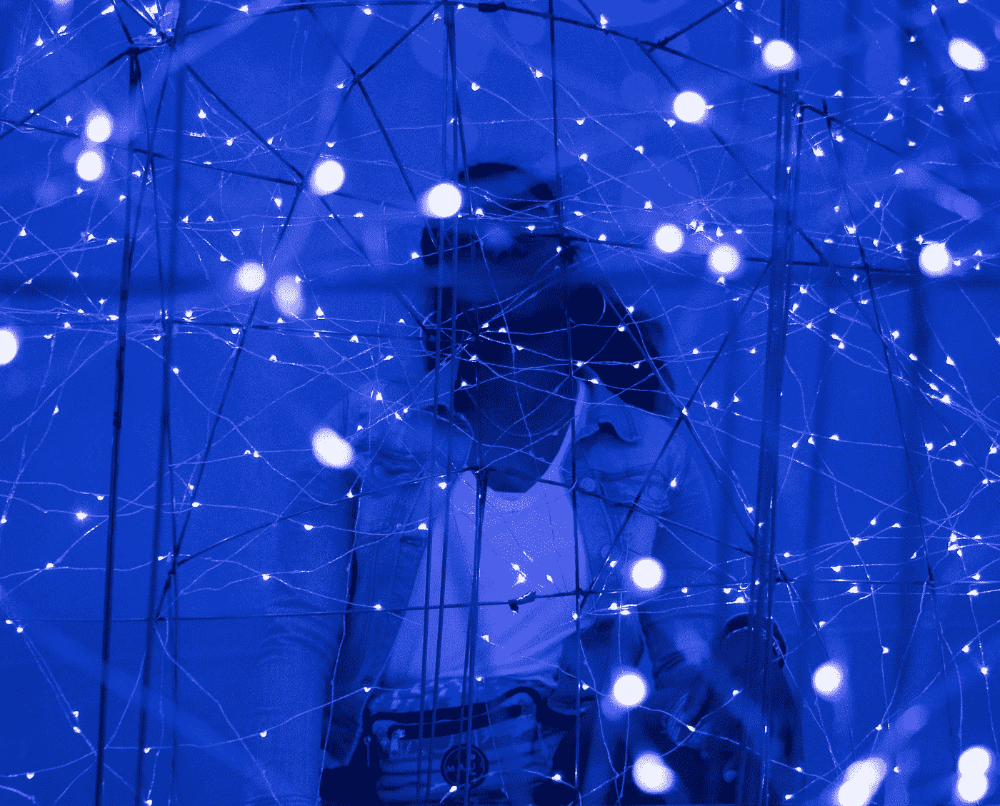

# 11 月版:深度学习

> 原文：<https://towardsdatascience.com/november-edition-deep-learning-6d97357a975b?source=collection_archive---------33----------------------->

Photo by [Brian](https://unsplash.com/@_brianjr?utm_source=unsplash&utm_medium=referral&utm_content=creditCopyText) on [Unsplash](https://unsplash.com/s/photos/network-lights?utm_source=unsplash&utm_medium=referral&utm_content=creditCopyText)

我们生活在一个无论好坏都被深度学习算法包围的世界。从社交网络过滤到无人驾驶汽车到电影推荐，从金融欺诈检测到药物发现到医学图像处理，深度学习算法每天都在影响我们的生活和决策。

在基本层面上，深度学习是基于学习数据表示而非特定任务算法的机器学习家族的一部分。深度学习的灵感来自人脑过滤信息的方式。它教会计算机通过层层过滤图像、文本或声音等输入，以学习如何预测和分类数据。它的目的是模仿人类大脑如何工作来创造一些真正的魔法。

深度学习入门需要什么？做好它需要什么？哪些库和框架最适合深度学习问题，最好的使用方法是什么？我们已经看到深度学习的局限性了吗？为了研究这些问题，我们收集了一些最好的文章，很高兴与你分享。

— [安妮·邦纳](https://medium.com/u/a71060a2ef24?source=post_page-----6d97357a975b--------------------------------)，TDS 编辑

## [深入探究深层网络背后的数学](/https-medium-com-piotr-skalski92-deep-dive-into-deep-networks-math-17660bc376ba)

作者[皮奥特·斯卡斯基](https://medium.com/u/11b65705ec0?source=post_page-----6d97357a975b--------------------------------) — 9 分钟阅读

神经网络的奥秘

## [用深度学习检测疟疾](/detecting-malaria-with-deep-learning-9e45c1e34b60)

由迪潘詹(DJ)萨卡尔 — 16 分钟阅读

人工智能促进社会公益——医疗保健案例研究

## [如何用图卷积网络在图上做深度学习](/how-to-do-deep-learning-on-graphs-with-graph-convolutional-networks-7d2250723780)

由 Tobias Skovgaard Jepsen[—9 分钟阅读](https://medium.com/u/565f7254b058?source=post_page-----6d97357a975b--------------------------------)

图形卷积网络的高级介绍

## [一个神经网络，多种用途](/one-neural-network-many-uses-image-captioning-image-search-similar-image-and-words-in-one-model-1e22080ce73d)

By [Paras Chopra](https://medium.com/u/ce4d7f282c52?source=post_page-----6d97357a975b--------------------------------) — 15 分钟阅读

使用单一模型构建图像搜索、图像标题、相似文字和相似图像

## [哪个深度学习框架发展最快？](/which-deep-learning-framework-is-growing-fastest-3f77f14aa318)

由[杰夫·黑尔](https://medium.com/u/451599b1142a?source=post_page-----6d97357a975b--------------------------------) — 8 分钟阅读

TensorFlow 与 PyTorch

## [神经 ODEs:又一次深度学习突破的崩溃](http://m/neural-odes-breakdown-of-another-deep-learning-breakthrough-3e78c7213795)

由[亚历山大·巴甫洛夫·洪查尔](https://medium.com/u/1b1fb9c5ea70?source=post_page-----6d97357a975b--------------------------------) — 11 分钟阅读

如果你正在阅读这篇文章，很可能你正在赶上人工智能世界最近的进展。

## [深度学习是否已经触及其极限？](/is-deep-learning-already-hitting-its-limitations-c81826082ac3)

托马斯·尼尔德 — 11 分钟阅读

又一个人工智能的冬天来了吗？

## [测量等变卷积网络的简单指南](/an-easy-guide-to-gauge-equivariant-convolutional-networks-9366fb600b70)

由迈克尔·基斯纳——12 分钟阅读

几何深度学习是一个非常令人兴奋的新领域，但它的数学正在慢慢漂移到代数拓扑和理论物理的领域。

我们也感谢最近加入我们的所有伟大的新作家，[加里·科普利克](https://medium.com/u/702aabb62014?source=post_page-----6d97357a975b--------------------------------)，[莎拉·伊德](https://medium.com/u/7f53a4f6247a?source=post_page-----6d97357a975b--------------------------------)，[蒂莫西·谭](https://medium.com/u/41b263f1f6fd?source=post_page-----6d97357a975b--------------------------------)，[戴夫·洛伦兹](https://medium.com/u/da442a22f041?source=post_page-----6d97357a975b--------------------------------)，[鲍林·于](https://medium.com/u/ec148056cc2a?source=post_page-----6d97357a975b--------------------------------)，[阮庆](https://medium.com/u/bb9e5af5001b?source=post_page-----6d97357a975b--------------------------------)，[乔丹·瑞达](https://medium.com/u/2bffef734ec4?source=post_page-----6d97357a975b--------------------------------)，[加贺·尹](https://medium.com/u/ee0d7547aae1?source=post_page-----6d97357a975b--------------------------------)，[什拉万·库奇库拉](https://medium.com/u/5d4f7cb8ab0d?source=post_page-----6d97357a975b--------------------------------)，[普拉纳夫·普拉什维克我们邀请你看看他们的简介，看看他们的工作。](https://medium.com/u/79026d6c6124?source=post_page-----6d97357a975b--------------------------------)