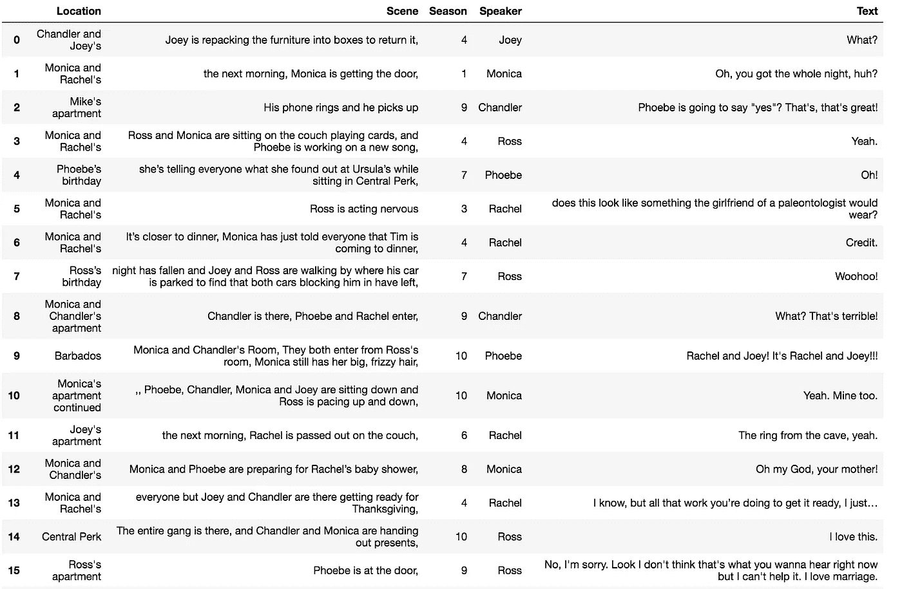
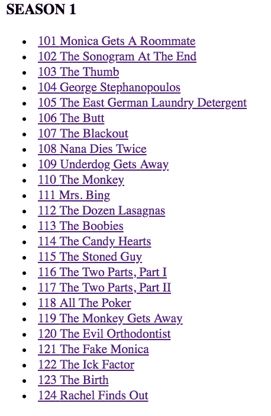
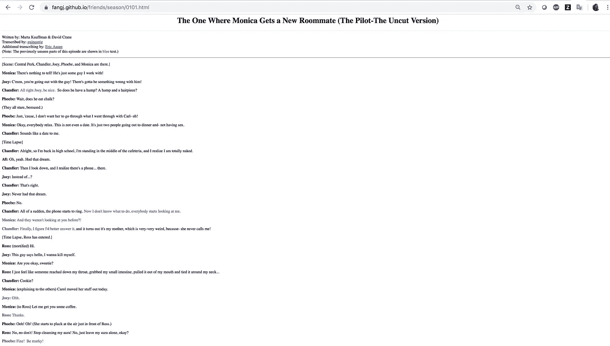
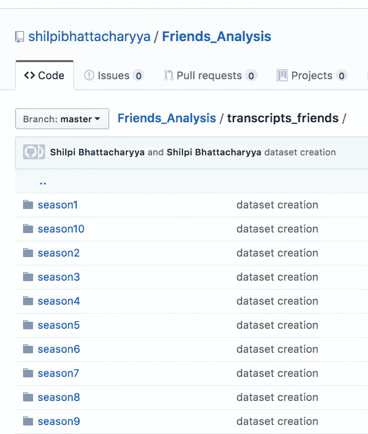

# 如何从原始网络脚本创建电视情景喜剧数据集？

> 原文：<https://towardsdatascience.com/now-we-have-tv-sitcom-f-r-i-e-n-d-s-dataset-created-from-web-transcripts-908af7777977?source=collection_archive---------18----------------------->

到目前为止，除了网络记录之外，还没有可用的 F.R.I.E.N.D.S 或任何流行情景喜剧的数据集(在这次演示中，我使用了来自这个链接的记录-[https://fangj.github.io/friends/](https://fangj.github.io/friends/))。因此，我创建了这个数据集，供对探索这个数据集感兴趣的每个人使用，并使用这里描述的方法创建类似的数据集。

# 先睹为快数据:

最终创建的数据集如下所示。关于这个的 csv 文件可以在[https://raw . githubusercontent . com/shilpbhattacharyya/Friends _ Analysis/master/Friends _ dataset . CSV](https://raw.githubusercontent.com/shilpibhattacharyya/Friends_Analysis/master/friends_dataset.csv)获得



A peek into the created dataset

# 代码演练:

这种方法和数据集创建的完整代码可以在我的 github repo(【https://github.com/shilpibhattacharyya/Friends_Analysis】T4)中找到。此数据有一个 93335 行 5 列的形状(93335，5)。我在这里粘贴一个片段来说明我是如何创建这个数据集的。

下面是网页文字链接([https://fangj.github.io/friends/](https://fangj.github.io/friends/))的一瞥:



Transcript files for the Friends different seasons (only 3 shown)



Transcript file for Season1 Episode1 to get an idea of the transcripts

该算法可以总结如下:

1.  将每集的 html 内容复制/转换为 txt/csv 文件。
2.  为每一季的所有剧集副本创建单独的文件夹。



Folder layout in the github repo

1.  将每一季的剧集合并成一个. csv 文件(mergedx.csv ),我们可以从中读取数据。
2.  我首先提取了上图中的场景内容，然后根据逗号(，)分隔符将其分割成[Location，Scene]。
3.  然后提取每个字符对应的文本，保存在以关键字为‘字符’的字典中。
4.  用文本加场景创建一个熊猫系列，并分割以创建一个由列[位置、场景、季节、演讲者、文本]组成的数据帧，定义如下。

地点:说这段文字的地方

**场景:**画周围环境的活动

**季节**:说这段文字的季节

**说话者**:说这段文字的人物【瑞秋，钱德勒，菲比，乔伊，莫妮卡，罗斯】

**文本**:对应以上属性的角色所说的文本。

5.我打乱了数据，使其在分布中更加分散。

```
import re
friends_chars={} 
Rachel=''
Ross=''
Joey=''
Chandler=''
Phoebe=''
Monica=''
Scene=''
with open("transcripts_friends/season1/merged1.csv", "r+") as fp:
    for cnt, line in enumerate(fp):
        if line.startswith('[Scene:'):
            Scene=(line[7:].replace("]", "").replace(":", ","))
        if line.startswith('Rachel:'):
            string=Scene.replace("\n", "")+"*"+(line[8:].replace(":", ""))
            Rachel=Rachel+re.sub(r'\(.*\)', '', string)
        elif line.startswith('Ross:'):
            string=Scene.replace("\n", "")+"*"+(line[6:].replace(":", ""))
            Ross=Ross+re.sub(r'\(.*\)', '', string)
        elif line.startswith('Monica:'):
            string=Scene.replace("\n", "")+"*"+(line[8:].replace(":", ""))
            Monica=Monica+re.sub(r'\(.*\)', '', string)
        elif line.startswith('Chandler:'):
            string=Scene.replace("\n", "")+"*"+(line[10:].replace(":", ""))
            Chandler=Chandler+re.sub(r'\(.*\)', '', string)
        if line.startswith('Phoebe:'):
            string=Scene.replace("\n", "")+"*"+(line[8:].replace(":", ""))
            Phoebe=Phoebe+re.sub(r'\(.*\)', '', string)
        if line.startswith('Joey:'):
            string=Scene.replace("\n", "")+"*"+(line[6:].replace(":", ""))
            Joey=Joey+re.sub(r'\(.*\)', '', string)friends_chars['RACHEL']=Rachel
friends_chars['ROSS']=Ross
friends_chars['MONICA']=Monica
friends_chars['PHOEBE']=Phoebe
friends_chars['CHANDLER']=Chandler
friends_chars['JOEY']=Joeys=pd.Series(friends_chars['RACHEL'].split('\n'))
df1 = pd.DataFrame({'Text':s.values})
df1 = pd.DataFrame(df1.Text.str.split('*',1).tolist(), columns = ['Scene','Text'])
s=df1.Text
df1=  pd.DataFrame(df1.Scene.str.split(',',1).tolist(),
                                   columns = ['Location','Scene'])
df1['Text']=s
df1['Speaker']='Rachel'
df1['Season']='1'
df1.head(20)s2=pd.Series(friends_chars['ROSS'].split('\n'))
df2 = pd.DataFrame({'Text':s2.values})
df2 = pd.DataFrame(df2.Text.str.split('*',1).tolist(), columns = ['Scene','Text'])
s=df2.Text
df2=  pd.DataFrame(df2.Scene.str.split(',',1).tolist(),
                                   columns = ['Location','Scene'])
df2['Text']=s
df2['Speaker']='Ross'
df2['Season']='1' 
df2.head(20)s3=pd.Series(friends_chars['MONICA'].split('\n'))
df3 = pd.DataFrame({'Text':s3.values})
df3 = pd.DataFrame(df3.Text.str.split('*',1).tolist(), columns = ['Scene','Text'])
s=df3.Text
df3=  pd.DataFrame(df3.Scene.str.split(',',1).tolist(),
                                   columns = ['Location','Scene'])
df3['Text']=s
df3['Speaker']='Monica'
df3['Season']='1'                         
df3.head(20)s4=pd.Series(friends_chars['JOEY'].split('\n'))
df4 = pd.DataFrame({'Text':s4.values})
df4 = pd.DataFrame(df4.Text.str.split('*',1).tolist(), columns = ['Scene','Text'])
s=df4.Text
df4=  pd.DataFrame(df4.Scene.str.split(',',1).tolist(),
                                   columns = ['Location','Scene'])
df4['Text']=s
df4['Speaker']='Joey'
df4['Season']='1'                            
df4.head(20)s5=pd.Series(friends_chars['PHOEBE'].split('\n'))
df5 = pd.DataFrame({'Text':s5.values})
df5 = pd.DataFrame(df5.Text.str.split('*',1).tolist(), columns = ['Scene','Text'])
s=df5.Text
df5=  pd.DataFrame(df5.Scene.str.split(',',1).tolist(),
                                   columns = ['Location','Scene'])
df5['Text']=s
df5['Speaker']='Phoebe'
df5['Season']='1'                           
df5.head(20)s6=pd.Series(friends_chars['CHANDLER'].split('\n'))
df6 = pd.DataFrame({'Text':s6.values})
df6 = pd.DataFrame(df6.Text.str.split('*',1).tolist(), columns = ['Scene','Text'])
s=df6.Text
df6=  pd.DataFrame(df6.Scene.str.split(',',1).tolist(),
                                   columns = ['Location','Scene'])
df6['Text']=s
df6['Speaker']='Chandler'
df6['Season']='1'                            
df6.head(20)df_1 = pd.concat([df1, df2,df3,df4,df5,df6])
df_1 = df_1.sample(frac=1).reset_index(drop=True)df_1.head()
df2.head()
```

6.我将这十个季节的内容结合起来，并将内容写入。csv 文件，这是我们创建的数据集。

```
df = pd.concat([df_10, df_9,df_8,df_7,df_6,df_5,df_4,df_3,df_2,df_1])
df = df.sample(frac=1).reset_index(drop=True)df.to_csv('friends_dataset.csv')
```

同样，可以从在线提供的网络脚本中为所有想要的电视情景喜剧创建数据集。

# **备注:**

1.  创建这个数据集的动机是有一个简单的方法来为电视情景喜剧创建结构化数据，我们今天只有非结构化的 web 脚本可用。

2.如果你正在使用这个数据集或方法，请注明链接(【https://github.com/shilpibhattacharyya/Friends_Analysis】T2)或这篇文章的链接。