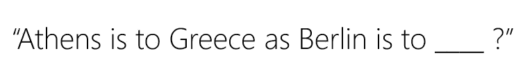

# 单词嵌入用法的细微差别:语义和句法关系

> 原文：<https://towardsdatascience.com/nuances-in-the-usage-of-word-embeddings-semantic-and-syntactic-relationships-780940fe28f?source=collection_archive---------29----------------------->

Photo by [Dan Gold](https://unsplash.com/@danielcgold?utm_source=medium&utm_medium=referral) on [Unsplash](https://unsplash.com?utm_source=medium&utm_medium=referral)

> 注:前面是超级短帖。我想只是精神食粮吧？:)

# 介绍

在过去的几周里，我一直在写关于单词嵌入的文章。

[我如何为新加坡英语这样的口语语言从头开始创建单词嵌入](/creating-word-embeddings-for-out-of-vocabulary-oov-words-such-as-singlish-3fe33083d466)，以及我如何将其扩展到[处理拼写错误或带有翻译向量的不在词汇表中的单词](/using-a-generalised-translation-vector-for-handling-misspellings-and-out-of-vocabulary-oov-words-494cd142cd31)。

在后一篇文章中，我测试了我的实验对下游文本分类准确性的影响。

然而，通过更多的阅读和研究，我开始意识到单词嵌入用法的细微差别及其真正的含义。

**请允许我详细说明。**

你看， ***使用*** 单词嵌入进行自然语言处理(NLP)是一回事，每个人都可以做到。

但是…

***理解*** 它对下游任务的影响是另一回事。

为了**理解**它的含义，你首先需要知道所使用的单词嵌入学到了什么语义和句法关系。

# 什么是语义和句法关系？

我想*【什么】*在我说到*“为什么”的时候就说清楚了。*

那么，这有什么关系呢？

> 这很重要，因为它以比你想象的更多的方式影响你的语言模型的下游准确性。

以情感分析这样的 NLP 任务为例。

如果所使用的单词嵌入更多地捕捉了单词的**语义**(单词的意思)或它们之间的**句法**(英语语法结构)关系，你的情感模型会更好吗？

斯坦福大学的 Global Vectors (GloVe)等现成的单词嵌入似乎在与语义相关的任务中表现得更好，如他们的研究论文所示。

Figure 1 — Example of a Semantic Relationship Task

另一方面，Google 的 Word2Vec 虽然在大多数自然语言处理任务中表现不如 GloVe，但似乎在与相关的任务中表现更好。

Figure 2 — Example of Syntactic Relationship Task

话虽如此，**语义和句法关系对于语言模型的良好表现同样重要。**

> 唉，这个世界上没有什么是完美的。

没有任何预先训练好的单词嵌入在这两方面都很出色。我个人认为，GloVe 在大多数 NLP 任务中表现出色。

此外，这个世界似乎已经脱离了预先训练的单词嵌入。

注意力模型是现在中的**。**

看看谷歌 10 月 25 日的这篇文章吧，[比以往更好地理解搜索](https://blog.google/products/search/search-language-understanding-bert)。

谷歌最近实现了他们著名的算法“BERT ”,这是一种注意力模型——注意力模型基本上能够给在不同上下文中使用的**相同单词**赋予**不同的**单词嵌入。

例如:

*“我去* ***银行*** *存工资。它坐落在一条* ***河边*** *”*

作为人类，我们知道“银行”这个词的第一个用法是指金融机构，而这个词的最后一个用法是指河流。

注意模型对单词“银行”给出了不同的单词嵌入，例如金融银行和河岸银行。

很酷的东西，是吧？

公平地说，我也想指出百度的 [**厄尼**](https://arxiv.org/abs/1905.07129) 。

厄尼实际上是 NLP 世界中最新最受关注的模型。到目前为止，ERNIE 在所有标准基线 NLP 任务中的表现都超过了 BERT，甚至在普通话方面也是如此。不知道为什么人们不怎么谈论它。

抱歉，在谈论注意力模型时分心了。

让我们回到最初的话题！

# 结尾注释

我想我在这篇短文中想要表达的是:

> 对于所有的 NLP 任务，没有神奇的预训练单词嵌入。

你必须记住你要解决的 NLP 任务，并训练最适合的单词嵌入类型。

就拿我的新加坡英语文章来说，我肯定不会用 GloVe 或 Word2Vec。

记住，单词嵌入最终会影响你下游的准确性。

垃圾进来，垃圾出去。

希望这篇关于使用单词嵌入时所涉及的细微差别的短文能给你一些启发！

下次见，再见！

LinkedIn 简介:[蒂莫西·谭](https://www.linkedin.com/in/timothy-tan-97587190/)