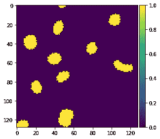

# 基于 U-网的细胞核分割

> 原文：<https://towardsdatascience.com/nucleus-segmentation-using-u-net-eceb14a9ced4?source=collection_archive---------6----------------------->

## 深度学习如何用于分割医学图像？

被困在付费墙后面？点击[这里](https://medium.com/p/nucleus-segmentation-using-u-net-eceb14a9ced4?source=email-c3f5233f3441--writer.postDistributed&sk=881ef594402fb347d56e1c12f077732d)阅读完整故事与我的朋友链接！

显微图像的自动分割是医学图像处理和分析中的一项重要任务。细胞核检测是这项任务的一个重要例子。想象一下加快对几乎所有疾病的研究，从肺癌和心脏病到罕见疾病。2018 年 [**数据科学碗**](https://www.kaggle.com/c/data-science-bowl-2018) 提供了我们迄今为止最雄心勃勃的任务:创建一种算法来自动检测细胞核。我们都见过人们遭受癌症、心脏病、慢性阻塞性肺病、老年痴呆症和糖尿病等疾病的折磨。想想看，如果治疗来得更快，会有多少人的生活发生改变。通过自动化细胞核检测，您可以帮助更快地找到从罕见疾病到普通感冒的治疗方法。

这个项目是在 Kaggle 上举行的 2018 年数据科学碗的一部分。

# 环境和工具

1.  sci kit-学习
2.  sci kit-图像
3.  numpy
4.  克拉斯
5.  熊猫
6.  matplotlib
7.  张量流

# 数据

数据可以从 kaggle 网站下载，可以在 [**这里**](https://www.kaggle.com/c/data-science-bowl-2018/data) 找到。

# 基础

这是一个典型的实例分割问题。在这方面非常成功的两个架构是 U-Net 和 Mask-R-CNN。我在这个项目中使用了 U-Net。

*   **图像分类**:对图像中的主要物体类别进行分类。
*   **对象检测**:识别对象类别，并使用图像中每个已知对象的边界框定位位置。
*   **语义分割**:为图像中每个已知的物体识别每个像素的物体类别。**标签是类感知的。**
*   **实例分割**:识别图像中每个已知对象的每个像素的每个对象实例。标签是实例感知的。

# 代码在哪里？

事不宜迟，让我们从代码开始吧。github 上的完整项目可以在这里找到[。](https://github.com/abhinavsagar/Kaggle-tutorial)

让我们从加载所有的库和依赖项开始。

我们还应该设置一些参数值，并加载训练集和测试集图像。

接下来我们应该以我们想要的形式准备数据。为了降低计算复杂度，我们需要调整所有图像的大小。

下一步可能是项目中最重要的部分，但却经常被忽视。是的，这就是数据增强。我使用图像剪切来克服过度拟合。由于在这种情况下数据集的大小很小，过度拟合在这里不是一个主要问题。

让我们展示一些有分割和没有分割的显微图像。

without segmentation

with segmentation

让我们也创建一个生成遮罩和图像的生成器。

# 优信网

该建筑看起来像一个“U”形，名副其实。这个架构由三个部分组成:收缩部分、瓶颈部分和扩展部分。收缩段由许多收缩块组成。每个模块接受一个输入，并应用两个 3×3 卷积层，然后是一个 2×2 最大池。每个块之后的核或特征图的数量加倍，以便架构可以有效地学习复杂的结构。最底层位于收缩层和膨胀层之间。

但是这个架构的核心在于扩展部分。类似于收缩层，也是由几个膨胀块组成。每个模块将输入传递到两个 3X3 CNN 层，然后是一个 2×2 上采样层。此外，在每个块之后，卷积层使用的特征图的数量减半以保持对称性。扩展块的数量与收缩块的数量相同。之后，所得到的映射通过另一个 3X3 CNN 层，其特征映射的数量等于期望的分段数量。

U-net architecture

让我们继续定义 Union (IOU)度量上的 [**交集。**](https://en.wikipedia.org/wiki/Jaccard_index)

然后我们应该使用 keras 图层建立如上图所示的 U-Net 模型。

我使用早期停止标准作为参数对模型进行了三次迭代训练，它给出了相当好的结果，平均 IOU 为 0.416。请随意使用这里的超参数。

最后，我为最后的预测写了几行。

# 结果

# 结论

这是我参与过的最具挑战性的项目之一，同时也很有趣。虽然这不是一个典型的计算机视觉项目，其中计算复杂性是一个挑战，但它更多的是在相对较大的图像中找到小特征。坦率地说，在图像中分割细胞核是一个挑战。有时，即使是专家也可能在这方面犯错误，因此自动化整个流水线，看起来像是细胞核分割的未来。

# 参考资料/进一步阅读

 [## U-Net:生物医学图像分割的卷积网络

### 人们普遍认为，深度网络的成功训练需要成千上万个带注释的训练样本。在…

arxiv.org](https://arxiv.org/abs/1505.04597)  [## 2018 数据科学碗

### 在不同的图像中找到细胞核以推进医学发现

www.kaggle.com](https://www.kaggle.com/c/data-science-bowl-2018)  [## 综述:U-Net(生物医学图像分割)

### 在这个故事中，我们回顾了 U-Net。U-Net 是生物医学图像领域著名的全卷积网络(FCN)之一

towardsdatascience.com](/review-u-net-biomedical-image-segmentation-d02bf06ca760) 

# 在你走之前

相应的源代码可以在这里找到。

 [## abhinavsagar/ka ggle-教程

### Kaggle 竞赛笔记本样本。显微图像的自动分割是医学图像处理中的一项重要任务

github.com](https://github.com/abhinavsagar/Kaggle-tutorial) 

# 联系人

如果你想了解我最新的文章和项目[，请关注我的媒体](https://medium.com/@abhinav.sagar)。以下是我的一些联系人详细信息:

*   [个人网站](https://abhinavsagar.github.io)
*   [领英](https://in.linkedin.com/in/abhinavsagar4)
*   [中等轮廓](https://medium.com/@abhinav.sagar)
*   [GitHub](https://github.com/abhinavsagar)
*   [卡格尔](https://www.kaggle.com/abhinavsagar)

快乐阅读，快乐学习，快乐编码。