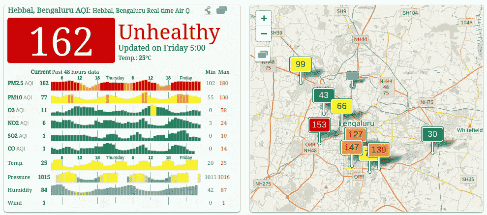
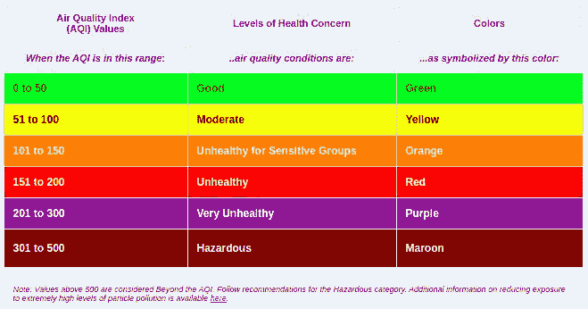

# 零假设和 P 值

> 原文：<https://towardsdatascience.com/null-hypothesis-and-the-p-value-fdc129db6502?source=collection_archive---------8----------------------->

> 最初发表于[我的个人博客](https://blog.contactsunny.com/data-science/null-hypothesis-and-the-p-value)。

当你开始机器学习之旅时，你会遇到零假设和 p 值。在你旅程的某一点上，当设计你的机器学习模型时，知道这些对做出有意义的决定意味着什么变得相当重要。所以在这篇文章中，我会试着解释这两件事的意思，你也试着去理解。

现在，如果你没有统计学的背景，零假设和 p 值的定义对你来说将毫无意义。这只是你脑子里的胡言乱语。这就是我头几次试图理解他们时的遭遇。我花了好几天时间才明白它们的意思。直到今天，我的理解仍然可能是错误的。我相信你们会比我更了解这一点，并且会在评论中纠正我。所以我很期待。

# 无效假设

为了理解这一点，我们来看一些真实世界的数据。我刚才看了我居住的城市(班加罗尔)的空气质量指数(AQI ),它说目前的 AQI 是 162，比“令人满意”的质量指数高出 62 个单位。

对于那些不知道的人来说，如果空气质量指数在 0-50 范围内，空气质量就很好，超过这个范围但在 100 以内的都是中度污染。任何超出这个范围的都是不健康的。

现在，我会参考这个网站，或任何其他网站，告诉你我的城市的空气质量指数是 162，这是不健康的。在这份声明中，我陈述了一些事情，并证明了它的价值，以及为什么它是不健康的。所以现在，这个陈述变成了无效假设。换句话说，我们可以说一个测试的结果可以被认为是零假设。零假设表示为 H0 (H-not)。

对统计和零假设有足够经验的人会首先指出，我为这个例子选择的陈述可以分解成两个零假设，这是真的。这两个是:

*   班加罗尔的空气质量指数现在是 162。
*   空气质量指数超过 150 是不健康的。

为了使这个例子简单，我们考虑第一个陈述，AQI 是 162。

> **零假设**->2019 年 11 月 8 日下午 6 点 Bangalore 的空气质量指数是 162。

这种说法可能是错误的。发布这个值的人用他们的工具做了一堆测试，在测试结束时得出这个值。但你可能有自己的工具来测量空气质量，或者你可能觉得空气看起来太干净了，没有这么高的值。所以你想对这种说法提出质疑，你准备证明在那个日期、时间和地点，空气质量指数远小于 162。所以你的“替代假设”变成了:

> **替代假设** - >班加罗尔 2019 年 11 月 8 日下午 6 点的空气质量指数小于 162。

这里要注意的一点是，零假设通常是科学家们想要证明错误的陈述，但他们会在假设零假设为真的情况下朝着那个目标开始研究。无效假设的真实例子如下:

*   科技行业男性的平均收入与女性的平均收入相同。
*   挫折和攻击性之间没有关联。

正如你所看到的，科学家们假设这些陈述是真实的，或者是事实，并将开始他们的研究或测试来证明这些是错误的。但是类似于在法庭上发生的事情，这些陈述被认为是正确的，除非被证明是错误的。当证明他们错误的过程开始时，科学家们将形成另一个与这些无效假设相反的陈述，这些新的陈述成为替代假设。因此，上述陈述的替代假设是:

*   科技行业中男性的平均收入与女性的平均收入是不一样的**。**
*   挫折和攻击性之间有一种关联**。**

可选假设表示为 H1 或哈。

我希望你理解这个非常混乱的概念。记住无效假设，我们将继续讨论 P 值。

# p 值

我们可以将 p 值定义如下:

> 在统计学中，p 值是在假设零假设正确的情况下，获得某个测试的观察结果的概率。

这只是 p 值的定义之一。理解了什么是零假设之后，理解 p 值就相对容易了。p 值是您得出与零假设相同结果的概率。因此，如果我们考虑上一节中技术行业的平均收入，我们可以说 p 值是发现技术行业中男性和女性的平均收入相同的概率。我们考虑的是收入相同的情况下的概率(而不是收入不同的情况)，因为我们相信零假设是正确的。

最常用的 p 值是 0.05。如果计算出的 p 值小于 0.05，则零假设被认为是错误的或无效的(因此称为零假设)。如果该值大于 0.05，则认为零假设为真。让我详细说明一下。

请记住，p 值是我们得到与零假设相同结果的概率，在我们的例子中，该概率的阈值是 0.05。因此，如果计算的 p 值小于 0.05，这意味着我们得到与零假设相同的结果的可能性非常小。而如果 p 值大于 0.05，那么得到与零假设相同结果的概率非常高，所以我们可以认为零假设为真。

再次，我希望你明白这一点。我真的不知道如何解释这些事情，而不会让你或我自己感到困惑。但我尽力了。如果你有更好更简单的例子，请在下面留下评论。

> 在 [Twitter](https://twitter.com/contactsunny) 上关注我，了解更多[数据科学](https://blog.contactsunny.com/tag/data-science)、[机器学习](https://blog.contactsunny.com/tag/machine-learning)，以及通用[技术更新](https://blog.contactsunny.com/category/tech)。此外，你可以[关注我的个人博客](https://blog.contactsunny.com/)，因为我在 Medium 之前发布了许多我的教程、操作方法帖子和机器学习的优点。