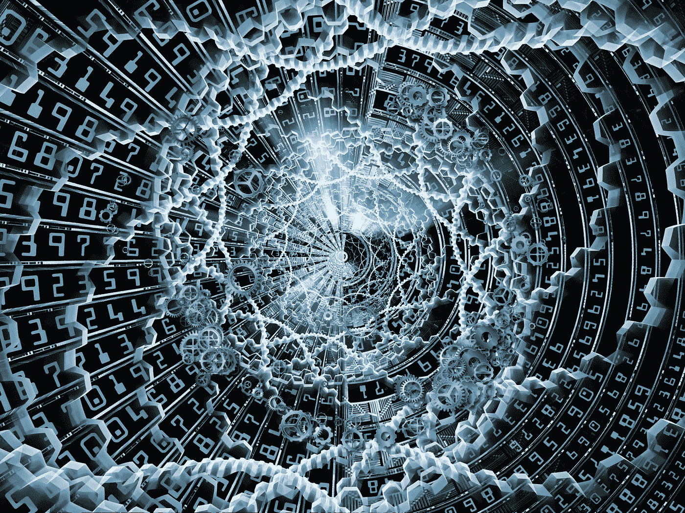
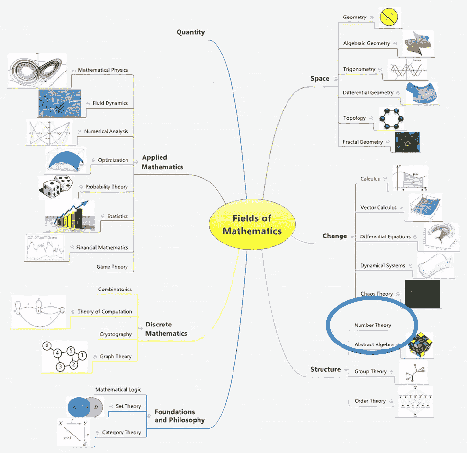
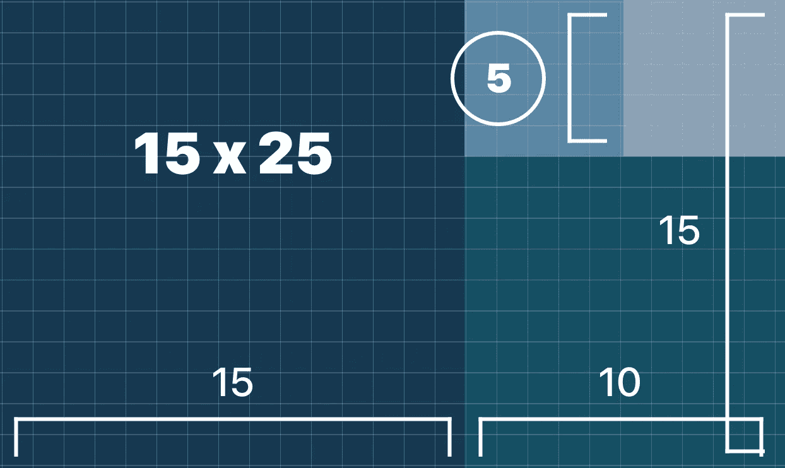
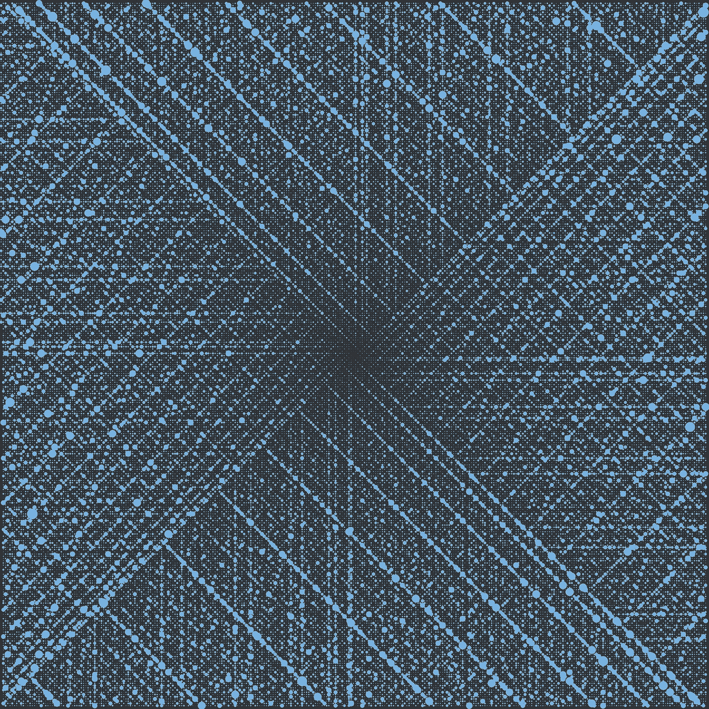

# 数论——历史与概述

> 原文：<https://towardsdatascience.com/number-theory-history-overview-8cd0c40d0f01?source=collection_archive---------13----------------------->

## 第一部分——什么是数论&为什么它与今天相关？

Originally Published On [https://www.setzeus.com/](https://www.setzeus.com/)

数学是宇宙的自然语言。自从我们作为一个物种存在以来，*这些数字就深深地吸引着我们。经常邀请我们最伟大的思想家来揭开宇宙的许多深层奥秘，*对自然数*、**、*数论*、**的研究是数学最古老的分支之一。*

*数论的纯粹性吸引了一代又一代的数学家——每个人都对卡尔·高斯称之为“数学女王”的分支做出了贡献直到最近的突破，*数论*一直是纯数学之王。然而，今天，对数论的基本理解是尖端软件工程，特别是基于安全的软件的绝对关键的先驱。数论是密码学的核心——密码学本身正在经历一个迷人的快速发展时期，从著名的 RSA 算法到广受欢迎的区块链世界。*

**

*Article Originally Published On [https://www.setzeus.com/](https://www.setzeus.com/)*

*历史上两个不同的时刻是数论发展的转折点。首先，在古代，欧几里德提出了他的 GCD(最大公约数)算法——这是一套利用几何观察将分数简化为最简单形式的绝妙步骤。然后，大约两千年后，卡尔·高斯将欧几里得的非正式著作和他自己在永恒的《算术论文集》中的广泛证明结合在一起，使欧几里得的原理正式化。*

# *欧几里德&最大公约数*

*数论作为一门分支学科的起源可以追溯到公元前，特别是欧几里得的一生。一位杰出的数学家，欧几里得，也被称为“几何之父”，提出了有记录以来最古老的“算法”(这里指的是一系列逐步操作)之一。这个算法，即[最大公约数](https://en.wikipedia.org/wiki/Greatest_common_divisor)，经受住了时间的考验，成为我们数论的起点，因为它突出了自然数的迷人特性。*

*公元前 300 年左右，欧几里德推出了他的经典的 [*【元素】*](https://amzn.to/31zd57D) 丛书；一个十本书的系列，涵盖了从整数到线段&表面区域的一系列主题。有趣的是，他的 GCD 算法在这个系列中不是一次而是两次被列出来——首先是在第 7 本书中(用数字呈现)，然后是在第 10 本书中(通过几何呈现)。*

*根据数学史家的说法，很可能是后一种形式的算法，一种基于几何的算法(第 10 册)，实际上早于第 7 册中基于数字的算法。从长度、面积和体积的角度来看，理论上 GCD 算法对欧几里得非常重要，因为它提供了一种方法来***(a)&(b)****找出任意两个线段之间的最大公共长度。鉴于他生活的时代，这一观察很可能对任何人都有很大用处&任何参与任何类型建筑(石工、木工等)的人。**

*扩展前面的定义，两个长度 *(a)* & *(b)* 的最大公约数，是平均度量**&b*的最大长度*(g)*；或者， ***长度(a)&【b】都是长度(g)*** 的整数倍。下面是一个几何示例——假设我们的任务是铺设 15 米 x25 米的地板。为了最大限度地降低成本，我们只想购买相同尺寸的瓷砖长度；这就要求我们计算出最大的瓷砖长度(以米为单位),既要有长度&又要有宽度，而且不能断裂。换句话说，15 & 25 的最大公约数是多少？**

****

**Originally Published On [https://www.setzeus.com/](https://www.setzeus.com/)**

**对于我们的例子，我们忽略了计算 GCD 的具体步骤，但是，希望上面的插图提供了对所涉及的几何图形的直观理解。正如圈起来的，我们的示例问题的答案是 **5 m** ，这确实是在 15 & 25 中找到的最大的普通整数。**

# **高斯&算术的基本定理**

**接下来数论的巨大飞跃源于欧几里得大约 2000 年后的突破。在令人惊叹的 21 岁时，卡尔·高斯提出了一篇论文，将欧几里得的《几何原本》与当时的现代数学结合起来。他的代表作《T2》*研究算术* (粗略翻译为“算术调查”)包含了多种卓越的&精确方法，尽管不一定是他所有的原创作品，但这些方法汇总了&系统化的数论领域。通过这份出版物，他建立了这个分支，将以前分散的&非正式方法正式化，为重要的未决问题提供了原始答案，&为未来的贡献者奠定了基础。**

**[*研究*](https://en.wikipedia.org/wiki/Disquisitiones_Arithmeticae) 的基石灵光一现是一个永恒的定理，被称为[算术基本定理](http://mathworld.wolfram.com/FundamentalTheoremofArithmetic.html):**

> **任何大于 1 的整数要么是一个**素数**，要么可以写成素数的**唯一乘积(忽略顺序)。****

**上面的维基百科定义通过分成两个独立的部分变得易于理解。第一，陈述了 ***任何大于 1 的*** 整数要么是质数本身 ***要么是质数*** 可以通过严格的质数相乘来构造。第二部分保证对于每一个非质数(合数)来说，这些质数相乘的方式只有一种，也是唯一的(再次忽略顺序)。**

**换句话说，素数是整数的(乘法)“构建块”:素数的乘积将(唯一地)生成所有整数。这个结果无疑是过去几个世纪的数学家都知道的，但是高斯在*的论文中*第一个正式陈述了这个结果并给出了严格的证明。**

****

**[Ulam Spiral](https://en.wikipedia.org/wiki/Ulam_spiral)**

## **巧妙的加密应用**

**现在有了数论的基本历史&对其影响深度的快速预览，是时候让我们熟悉数论中最适用的主题:密码学了。**

**正如我们接下来将看到的，当高斯正式为这个分支搭建舞台的时候，密码系统的早期例子已经存在了，而且相当大胆。通过其中的几个例子，我们将推断出基本的、通用的密码学原理；之后，这将帮助我们分解和理解现代最重要的安全算法之一:RSA 算法。**

***最初发布于***

**https://www.setzeus.com/**

***来源***

**[数论简介](https://amzn.to/31y8nqD)**

**[https://www.cs.purdue.edu/homes/spa/courses/cs182/mod5.pdf](https://www.cs.purdue.edu/homes/spa/courses/cs182/mod5.pdf)**