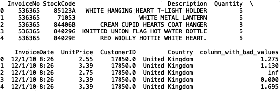

# 数据科学家的 Numpy 和熊猫

> 原文：<https://towardsdatascience.com/numpy-and-pandas-for-data-scientists-2be4a093b4b5?source=collection_archive---------27----------------------->


Photo by [Kevin Ku](https://www.pexels.com/@kevin-ku-92347) on [Pexels](https://www.pexels.com/photo/coding-computer-data-depth-of-field-577585/)

Numpy 是一个用于科学计算的 python 包。它支持大型多维数组和矩阵。Pandas 是用于数据操作和分析的 python 库。对这两个库有扎实的了解对于特征工程、数据插补和模型构建非常有用。

在这篇文章中，我将回顾 numpy 和 pandas 的一些简单应用，包括数据标注、工程特性和输入缺失值。

出于本帖的目的，我们将使用来自UCI ML 回购的*在线零售数据集*，该数据集可在 [Kaggle](https://www.kaggle.com/jihyeseo/online-retail-data-set-from-uci-ml-repo) 上找到。该数据包含一家英国在线商店从 2010 年 1 月 12 日到 2011 年 9 月 12 日的交易信息。这家商店出售独特的节日礼品。

现在让我们开始吧！

首先，让我们将数据读入 pandas 数据帧，并打印前五行:

```
import pandas as pd 
df = pd.read_csv("online_retail.csv")
print(df.head())
```


# 输入缺失值

*用零估算缺失/错误的数值*

在处理真实数据列时，经常会包含缺失值或错误值。缺少的值通常显示为“nan ”,它代表“不是一个数字”,错误的值可能是那些与现实中出现的值不一致的值。错误值的一个例子可能是负数或无穷大的价格。输入缺失数值的一种方法是用零替换它们。该数据不包括缺失值，因此我们可以人为地添加一些无穷大的缺失值:

```
np.random.seed(42)
df['column_with_bad_values'] = df['UnitPrice']/np.random.randint(4, size = len(df))
df['column_with_bad_values'].iloc[3] = np.nan
print(df.head())
```


我们可以使用 fillna()将缺失的值替换为零:

```
df['column_with_bad_values'].fillna(0, inplace = True)
print(df.head())
```



我们可以使用 np.isinf()对无穷大的值做类似的事情:

```
df.loc[np.isinf(df['column_with_bad_values']), 'column_with_bad_values'] = 0
```


*用平均值估算缺失的数值*

假设我们的数据有以下缺失值(注意，我已经删除了无限值):

```
np.random.seed(42)
df['column_with_bad_values'] = np.random.randint(4, size = len(df))
df['column_with_bad_values'].iloc[0] = np.nan
df['column_with_bad_values'].iloc[2] = np.nan
df['column_with_bad_values'].iloc[4] = np.nan
print(df.head())
```


我们可以将“nan”值替换为该列的平均值，如下所示:

```
df['column_with_bad_values'].fillna(df['column_with_bad_values'].mean(), inplace = True)
print(df.head())
```


请注意，所有以前的“nan”值都已替换为平均值 1.500803。如果我们保持无穷大的值，这就行不通了。让我们尝试在同时具有无穷大和“nan”值的情况下，使用均值法进行插补:

```
np.random.seed(32)
df['column_with_bad_values'] = df['UnitPrice']/np.random.randint(4, size= len(df))
df['column_with_bad_values'].iloc[0] = np.nan
df['column_with_bad_values'].iloc[2] = np.nan
print(df.head())
```


如果我们有无限值和“nan”值，我们希望用平均值估算，我们可以将无限值转换为“nan”值，然后用平均值填充“nan”值:

```
df.loc[np.isinf(df['column_with_bad_values']), 'column_with_bad_values'] = np.nan
df['column_with_bad_values'].fillna(df['column_with_bad_values'].mean(), inplace = True)
```


我们可以看到，无穷大值和缺失值都被平均值 2.692406 所取代。请注意，这个平均值是不同的，因为我们更改了随机数种子，我们使用它来生成用于演示的随机整数。

*用正态分布的随机数估算缺失/错误的数值*

我们可以使用 fillna()和 np.random.normal()用正态分布的随机数填充缺失值。首先，让我们重新生成缺失值的数据帧:

```
np.random.seed(32)
df['column_with_bad_values'] = np.random.randint(4, size= len(df))
df['column_with_bad_values'].iloc[0] = np.nan
df['column_with_bad_values'].iloc[2] = np.nan
print(df.head())
```


正态分布是根据列的平均值和标准差构建的。然后，我们可以使用 fillna()和 np.random.normal()的值来填充缺少的值:

```
mu, sigma = df['column_with_bad_values'].mean(), df['column_with_bad_values'].std()
df['column_with_bad_values'].fillna(np.random.normal(mu, sigma), inplace = True)
print(df.head())
```


*用模式*估算缺失/错误的分类变量

我们可以使用 fillna()和 mode()来估算缺失分类变量的值。首先，让我们生成测试数据框架:

```
df['column_with_bad_values'] = df['Description']
df['column_with_bad_values'].iloc[0] = np.nan
df['column_with_bad_values'].iloc[2] = np.nan
print(df.head())
```


然后，我们可以使用统计包中的模式来填充这些缺失值:

```
from statistics import mode
mode = mode(list(df['column_with_bad_values'].values))
df['column_with_bad_values'].fillna(mode, inplace = True)
print(df.head())
```

# **特色工程**

*数值数据的对数变换*

出于演示的目的，我将对数据进行一些过滤。我将只考虑单价大于或等于$5 且小于或等于$30 的记录。此外,“单价”列类型需要从字符串转换为数字类型。为了简单起见，我将价格转换为整数:

```
df['UnitPrice'] = df['UnitPrice'].astype(int)
df = df[df['UnitPrice'] >= 5]
df = df[df['UnitPrice'] <= 30]
print(df.head())
```


特征工程的一个流行例子是获取数据集中某个数字列的日志。为了形象化，我们将比较记录前后的价格分布:

```
df['UnitPrice'].hist()
```


进行对数变换后，我们得到:

```
import numpy as np 
df['log_price'] = np.log(df['UnitPrice'])
df['log_price'].hist()
```


如您所见，这种转换使价格值符合某种看起来更像正态分布的东西。当涉及到模型构建时，这具有有利的属性。

*特征工程使用 np.where()*

我们可以使用 np.where()将新列定义为机器学习模型目标或作为模型输入的附加特征。例如，我们可以使用 np.where()创建一列布尔值。首先让我们看一下原始数据的前五行:

```
df = pd.read_csv("online_retail.csv")
print(df.head())
```


现在，让我们创建一个新列，该列的值为 True，描述值为“白色悬挂心形 T 形灯座”，对应于第一行:

```
df['bool_description'] = np.where(df['Description'] == 'WHITE HANGING HEART T-LIGHT HOLDER', True, False)
print(df.head())
```


您也可以对多个描述值执行相同的操作。我们可以定义一个描述值列表，我们的新列将为其提供真实值:

```
description_list = ['WHITE HANGING HEART T-LIGHT HOLDER',
'CREAM CUPID HEARTS COAT HANGER', 'RED WOOLLY HOTTIE WHITE HEART.']df['bool_description'] = np.where(df['Description'].isin(description_list), True, False)
print(df.head())
```


也可以基于其他列生成字符串要素。这里我们生成字符串输出“是”和“否”:

```
df['string_description'] = np.where(df['Description'].isin(description_list), 'Yes', 'No')
print(df.head())
```


甚至二进制整数输出:

```
df['int_description'] = np.where(df['Description'].isin(description_list), 1, 0)
print(df.head())
```


# **数据标注**

最后，我经常发现自己需要根据其他列的值来标记数据。假设我们想预测一个产品是否会卖出超过十个单位。我们可以使用 np.where()来分配二进制标签，其中值 1 被分配给销售十个或更多单位的产品，值 0 被分配给销售少于十个单位的产品:

```
df['new_target'] = np.where(df['Quantity'] >= 10, 1, 0)
print(df.head())
```


我就停在这里。这篇文章的代码将在 GitHub 上发布。请随意摆弄数据和代码，如果有任何问题，请在下面留下。感谢您的阅读。祝你好运！