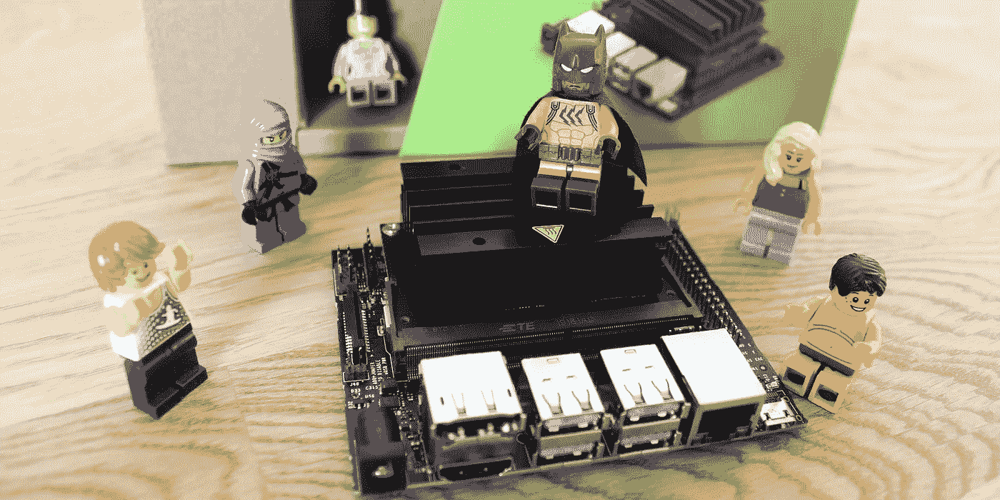
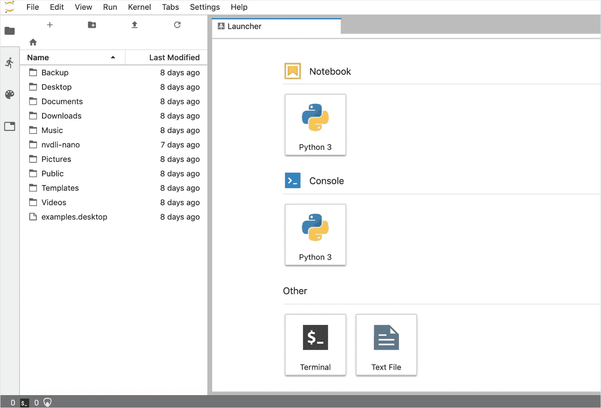
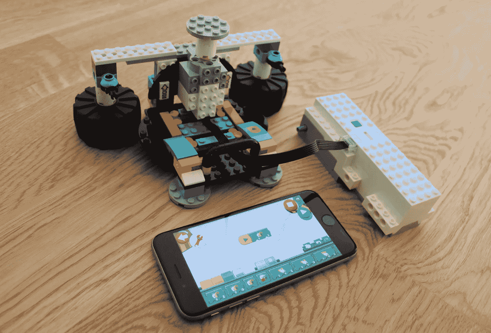
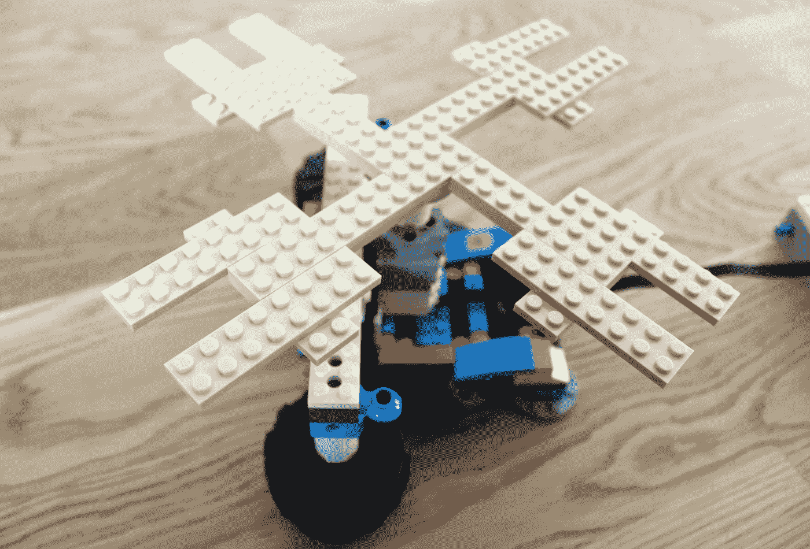
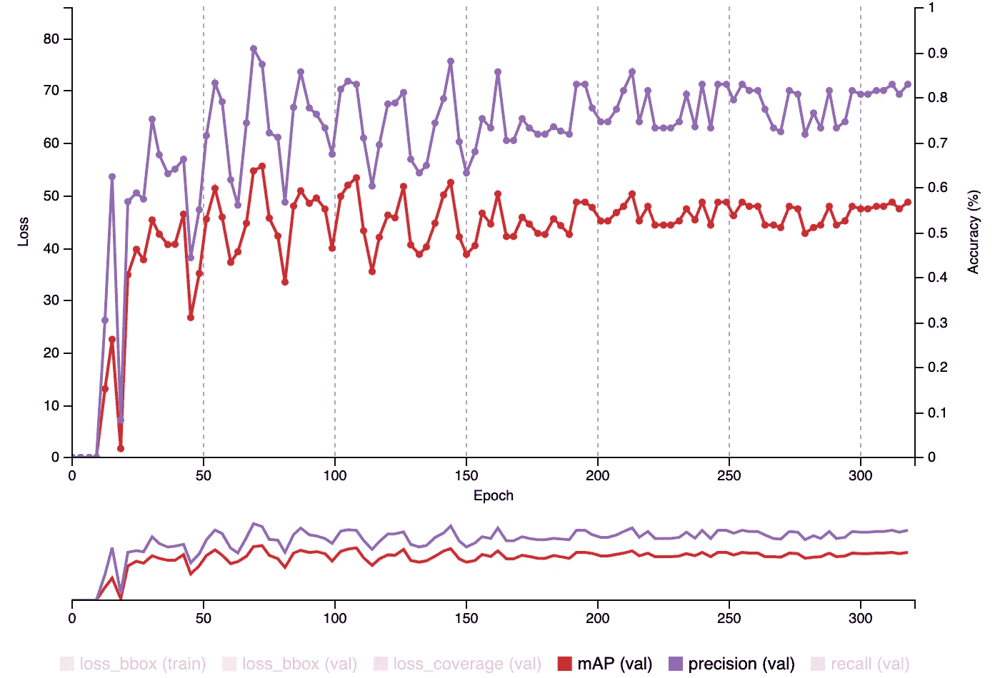
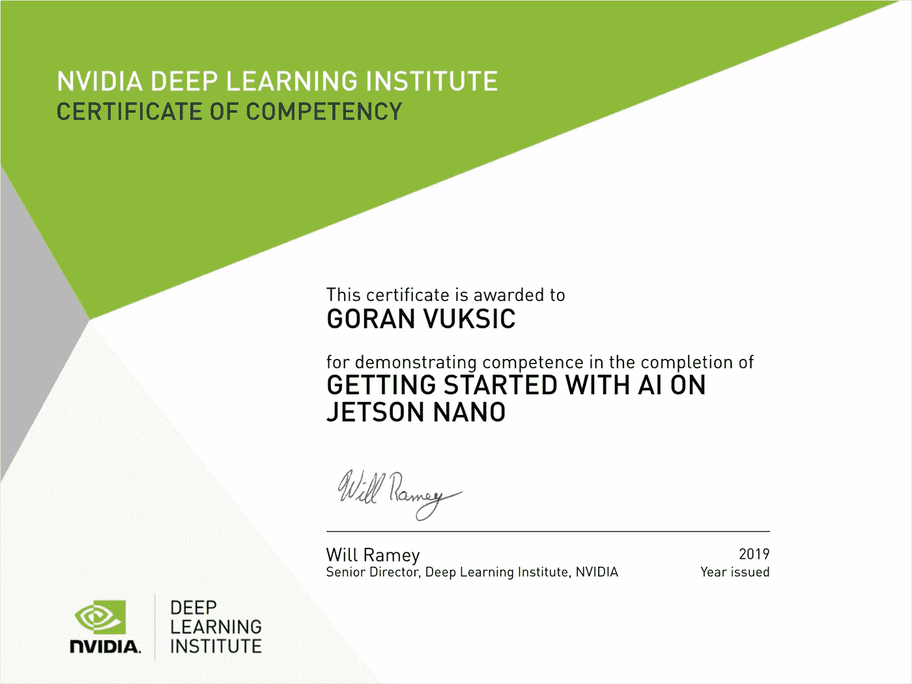

# NVIDIA Jetson Nano 和乐高迷你人偶

> 原文：<https://towardsdatascience.com/nvidia-jetson-nano-and-lego-minifigures-e62e57cf3f21?source=collection_archive---------30----------------------->

## 乐高迷你人物与 NVIDIA 杰特森纳米对象检测。

NVIDIA Jetson Nano 是一台小型人工智能计算机，人们经常称它为“类固醇上的树莓 Pi”几天前我收到了我的 [Jetson Nano 开发工具包](https://developer.nvidia.com/embedded/jetson-nano-developer-kit)，并决定用它来建立一个小项目:乐高迷你人物对象检测。

设置 Jetson Nano 非常容易，NVIDIA 提供了一个很好的教程:“[开始使用 Jetson Nano 开发工具包](https://developer.nvidia.com/embedded/learn/get-started-jetson-nano-devkit)请注意，您需要 micro USB 电源和 microSD 卡，它们不包含在开发工具包中。此外，我在这个项目中使用了标准的 Raspberry Pi v2 相机。

在初始设置和 SD 卡映像安装之后，我能够启动 Jetson Nano 并登录到设备上的 JupyterLab 服务器。

JupyterLab server running in “headless” mode

为了这个项目，我必须建立一个旋转平台，我决定使用乐高助推。我的想法是将乐高迷你人物放在平台的顶部，将树莓 Pi 摄像头固定在它的前面，并以不同的速度旋转平台，以测试 Jetson Nano 识别的工作原理。

Platform base made with the LEGO Boost

我在 iPhone 上安装的 [LEGO Boost 应用程序](https://apps.apple.com/us/app/lego-boost/id1217385613)通过蓝牙连接到乐高积木，它允许我为平台顶部旋转的电机设置不同的速度。在我把不同的乐高迷你模型和其他乐高物品放在平台上之前，我必须把它加长一点。

Platform top used to place LEGO Minifigures

为了建立我的训练数据集，我花了几个小时在互联网上搜索乐高迷你玩具图片，并手动注释它们。我知道你现在在想什么，但是为了科学和互联网的荣耀，必须有人这么做！😉我已经在 AWS 上建立了一个 NVIDIA DIGITS 实例，创建了数据集，并训练了我的模型。

Model training on NVIDIA DIGITS

如果你想用乐高迷你玩具做一个类似的项目，我训练过的模型可以在这里找到。如果你用它做了一些很酷的东西，请随时告诉我！

最后，我把模型转移到杰特森纳米，我测试了它是如何工作的。你可以在下面的视频中看到:

1280*720px @ 7.6 FPS

我用这个设置做了几次测试，我对 Jetson Nano 的性能很满意。设置它、训练模型和测试的整个过程进行得很顺利。如果您想构建类似的项目，我肯定会建议您尝试一下。

如果你决定购买 Jetson Nano，我建议你参加 NVIDIA 的关于 Jetson Nano 的“[人工智能入门”课程，这是免费的。它将带你通过几个样本图像分类和图像回归项目，这足以让你开始你的人工智能之旅。完成本课程后，您将获得一份](https://courses.nvidia.com/courses/course-v1:DLI+C-RX-02+V1/about)[证书](https://courses.nvidia.com/certificates/ba8cb6509a634e9bae11f9cf039ce10c):

NVIDIA Jetson Nano Certificate

对于这个项目，我要特别感谢我的儿子简，他帮助我组装了乐高助推平台。

感谢阅读，我希望你喜欢它！