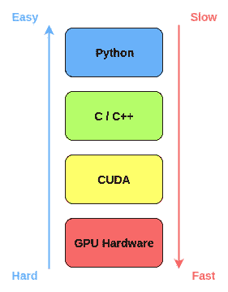
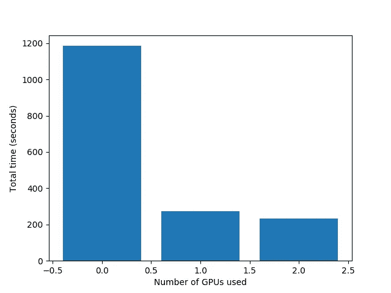
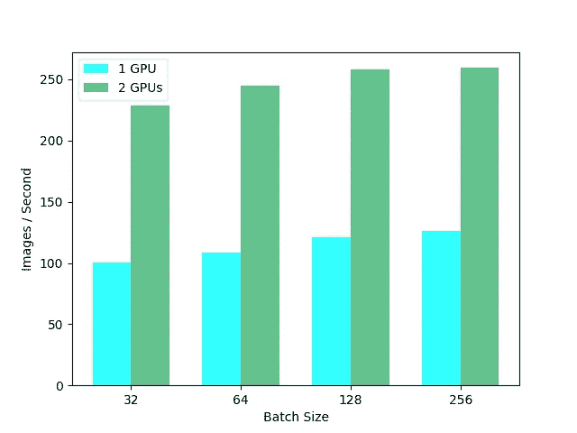

# Nvidia 的新数据科学工作站——回顾和基准

> 原文：<https://towardsdatascience.com/nvidias-new-data-science-workstation-a-review-and-benchmark-e451db600551?source=collection_archive---------6----------------------->

## 数据科学炙手可热。

> 我为学习者写了一份名为《强大的知识》的时事通讯。每一期都包含链接和最佳内容的关键课程，包括引文、书籍、文章、播客和视频。每一个人都是为了学习如何过上更明智、更快乐、更充实的生活而被挑选出来的。 [**在这里报名**](https://mighty-knowledge.ck.page/b2d4518f88) 。

在过去的几年里，人们对数据科学的兴趣激增，以至于许多公司正在重新调整其业务战略，并将自己标榜为“数据驱动”。

这有一个很好的理由，而且这不是什么秘密:更多的数据给了我们更大的机会来提取洞察力并创造更大的商业价值。

大数据集需要大计算能力。你需要一个好的 CPU，最好是像至强处理器那样的多核处理器。大量内存是一个明确的要求，数据科学家购买 64 甚至 128GB 内存的情况并不少见，有时这甚至不够！

The Nvidia [Quadro RTX 8000 GPU](https://www.techpowerup.com/gpu-specs/quadro-rtx-8000.c3306) has 48GB of VRAM

最重要的是，在深度学习中变得非常流行之后，GPU 现在正在进入数据科学。GPU 现在也可以用来加速大型数据帧的处理和可视化(类似于熊猫)。一直受欢迎的 [XGBoost](https://xgboost.readthedocs.io/en/latest/gpu/) 库自带内置 GPU 加速。

Nvidia 最近发布了他们的[数据科学工作站](https://blogs.nvidia.com/blog/2019/06/12/nvidia-powered-data-science-workstations/)，一台将所有数据科学硬件和软件整合到一个漂亮的包中的 PC。工作站是一台完全强大的机器，拥有所有的计算能力和软件，非常适合处理数据。

我最近有机会测试和评估数据科学工作站，我们将在本文中详细介绍。

# 规格

我测试的工作站是由 [Boxx](https://www.boxx.com/) 打造的。它附带所有预构建的硬件和预安装的软件，外加一些额外的电缆以防万一。预建机器非常棒，因为这可能需要几个小时。以下是主要的硬件规格:

*   CPU — [2 个英特尔至强处理器 Gold 5217](https://ark.intel.com/content/www/us/en/ark/products/193396/intel-xeon-gold-5217-processor-11m-cache-3-00-ghz.html) ，每个处理器 8 个内核/ 16 个线程，3.0Ghz
*   RAM—[192 GB DDR 4–2933 MHz ECC](https://www.tomshardware.com/reviews/ecc-memory-ram-glossary-definition,6013.html)
*   存储— [1.0TB 固态硬盘 M.2 PCIe 硬盘](https://www.howtogeek.com/238253/what-is-a-pcie-ssd-and-do-you-need-one/)
*   GPU — [2 个 NVIDIA Quadro RTX 8000](https://www.techpowerup.com/gpu-specs/quadro-rtx-8000.c3306) ，每个 48GB VRAM

外加鼠标、键盘和 3 年保修。

当涉及到让您的钱发挥最大作用时，构建一台定制机器始终是一条可行之路。这台机器配备的部件挑选得恰到好处:来自并行处理 CPU 的 32 个线程，大量的高速 RAM，一个 PCIe SSD(比标准 SATA 驱动器快得多，[示例](https://ssd.userbenchmark.com/Compare/Samsung-960-Evo-NVMe-PCIe-M2-250GB-vs-Samsung-860-Evo-250GB/m200373vs3949))，以及两个各带 48GB VRAM 的 GPU。

The Data Science Workstation from [Boxx](https://www.boxx.com/). Although it’s designed for Data Science, it still comes with all the standard ports including USB, audio, mic, and a disk drive

接下来是经常被低估的部分:软件。该工作站预装了 Ubuntu 18.04，以及几乎所有你想从 **source** 安装的数据科学和机器学习库和软件。仅举几个例子:

*   数据和 ML — pandas、numpy、scipy、numba、matplotlib、xgboost、dask、scikit-learn、h5py、cython
*   深度学习— TensorFlow、Keras、PyTorch、NLTK
*   Nvidia — GPU 驱动，CUDA 10，cuDNN，[急流](https://rapids.ai/)

所有这些 Python 库都打包在一个 [Python 虚拟环境](/how-to-setup-a-python-environment-for-machine-learning-354d6c29a264)中，以避免任何未来的冲突。

从源代码安装 TensorFlow 可能是一项重大挑战。让 GPU 驱动程序和 CUDA 与上述任何一个库一起工作会更加困难。因此，预装所有软件是避免大麻烦的一大解脱。

那么，这些听起来很棒的硬件和软件能做什么呢？

让我们找出答案。

# XGBoost 基准测试

[XGBoost](https://xgboost.readthedocs.io/en/latest/) 是一个开源库，提供了梯度增强决策树的高性能实现。底层的 C++代码库与顶层的 Python 接口相结合，使它变得超级快速和易于使用。这是数据科学家的首选图书馆，尤其是在 Kaggle 竞赛中。

我们将运行一个基准测试，看看工作站在使用 XGBoost 处理一个非常大的数据集时表现如何。我们将使用来自 [Rapids.ai](https://rapids.ai/) 的[演示笔记本](https://github.com/rapidsai/notebooks/blob/branch-0.8/xgboost/XGBoost_Demo.ipynb)来运行测试。

Rapids 是一套软件库，旨在通过利用 GPU 来加速数据科学。它使用低级的 CUDA 代码来实现快速的、GPU 优化的实现算法，同时仍然在顶部有一个易于使用的 Python 层。

How rapids speeds things up

笔记本使用 Numpy 的`random.rand()`函数生成数据帧。为了突破极限，我将数据帧的大小设置为 1，000，000 行乘以 5000 列 float32 数字；这是我在笔记本上能做的最大的内存了。如果您更有效地读取数据，您可能会挤出更多的空间，因为一旦培训开始，机器上的 RAM 使用量似乎就稳定下来了。

笔记本然后在数据上运行我们的 XGBoost 模型的训练。

即使有如此庞大的数据集，仅使用 CPU，总共 16 核/ 32 线程的 2 个至强处理器也能很好地处理它。一旦训练开始，所有 32 个线程的使用率都将达到 100%。我们还有足够的内存空间，如果我们想的话，可以运行另一个更小的训练任务。

一旦我们添加了 GPU，XGBoost 的速度在单个 GPU 和 5X 在两个 GPU 的情况下无缝加速了约 4.5 倍。

# 深度学习基准

深度学习在数据科学中有自己稳固的地位。计算机视觉和自然语言处理中几乎所有的挑战都是由最先进的深度网络主导的。

人们可能想要购买具有这种 GPU 能力的机器的一个重要原因是为了训练深度学习模型。

对于大型深度学习数据集，GPU 内存越多越好。那些数百层深的深度网络需要大量的内存空间，尤其是如果您想要增加批量大小来帮助加快训练速度。

高端消费 GPU，如 2080 Ti 和 1080 Ti，配有 11GB 的内存。它们是非常强大的卡，但 11GB 通常不足以在内存中容纳一个大的神经网络。你可以使用更强大的东西，比如云上的 V100 GPU，但按需每小时收费 3.06 美元！

为了测试我们能从这些 RTX 8000 中得到多少，我们将使用 TensorFlow 的官方 [tf_cnn_benchmarks](https://github.com/tensorflow/benchmarks/tree/master/scripts/tf_cnn_benchmarks) 。该存储库包含在 ImageNet 分类数据集上运行标准图像分类模型训练的脚本。训练以设定的迭代次数运行，而平均速度以图像/秒为单位测量。

为了真正测试工作站的能力，我们将使用不同的批处理大小和 GPU 数量来运行基准测试。我在这个基准上训练一只 [ResNet152](https://arxiv.org/pdf/1512.03385.pdf) 的结果如下表所示。

即使是一台 RTX 8000 也能每秒处理 100 多张图像，对于 ResNet152 来说已经非常快了。我们也有足够的空间来增加批量，进一步加快速度，达到 256。

由于我们能够充分利用我们的计算能力，较大的批量已经被证明能够持续地[减少训练时间](https://people.eecs.berkeley.edu/~youyang/publications/batch32k.pdf)。在一些需要大量内存的应用中，如用于视频处理的 3D CNNs，即使是 1 的批处理大小也无法在标准的消费级 11GB GPU 上运行！RTX 8000 中的 48GB 为批量大小和型号大小提供了充足的空间。

# 最后几点

总而言之，数据科学工作站是一台伟大的机器。真的很难不与所有高质量的硬件在一起。

最棒的是，一切都“正常工作”。所有库和软件都更新到最新版本并完全安装。几乎令人惊讶的是，打开电脑，你会发现你可以毫无困难地运行通常需要安装源代码的 TensorFlow 代码。仅此一项就能节省大量的时间、金钱和挫折！

硬件选择是正确的。拥有如此多的 RAM 和 GPU 内存带来的灵活性非常方便。没有运行许多 GPU 通常带来的额外工作或问题。获得越来越多的 GPU 也有递减的回报，因为你超过了 4 张牌。如果您确实喜欢不同的硬件设置，您可以在订购机器时定制您的 CPU、RAM 和 GPU 选择，以满足您的需求。

获得一台内部工作站可能是一笔相当大的前期投资——你一次性购买了大量硬件。但是，在本地工作的便利性，没有云成本，一切都设置得很完美，远远超过了前期的价格。这是一个“管用”的数据科学包。

# 喜欢学习？

在[推特](https://twitter.com/GeorgeSeif94)上关注我，我会在那里发布所有最新最棒的人工智能、技术和科学！也在 [LinkedIn](https://www.linkedin.com/in/georgeseif/) 上和我联系吧！