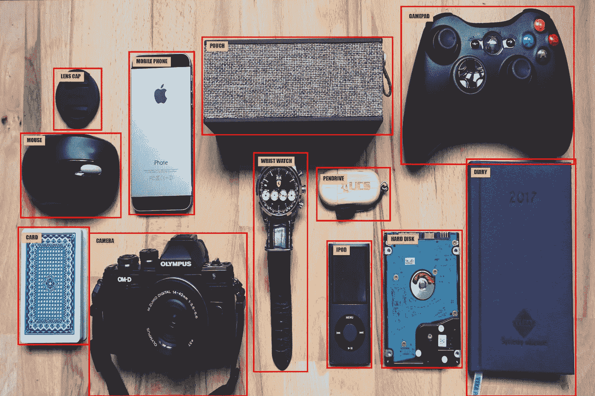
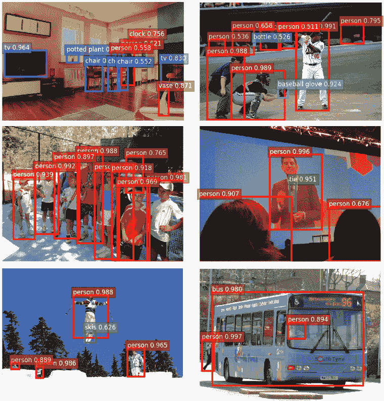
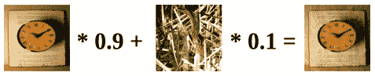
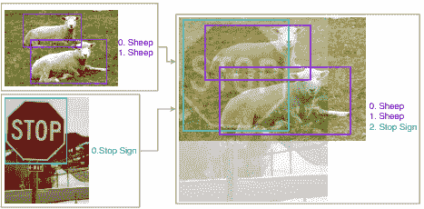
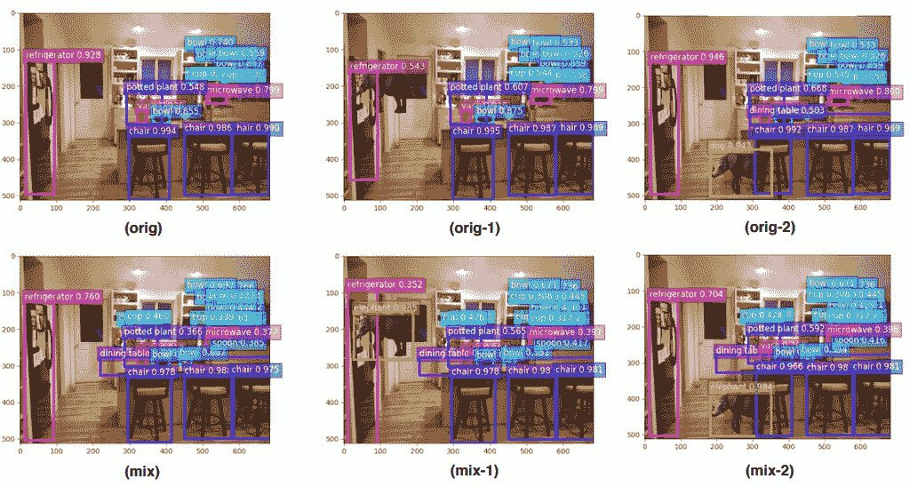
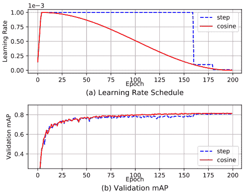
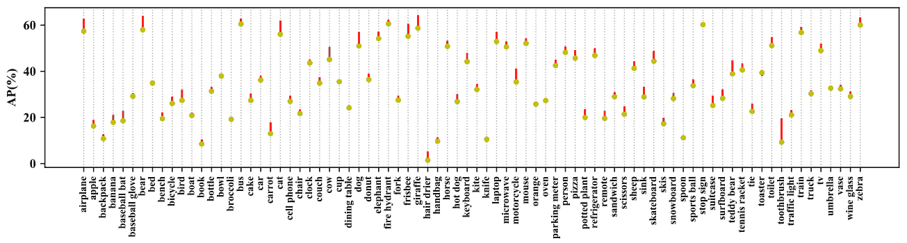

# 目标探测精度(mAP)备忘单

> 原文：<https://towardsdatascience.com/object-detection-accuracy-map-cheat-sheet-8f710fd79011?source=collection_archive---------4----------------------->

## 6 个免费赠品，帮助您提高对象检测模型的性能

物体检测是机器学习(ML)应用中的一种，已经获得了一般人工智能社区越来越多的关注。处于当代计算机视觉应用的中间，包括运动识别、图像分类、生物识别、自动驾驶汽车、法医、真实世界机器人等等，显而易见，人工智能研究人员和工程师都将长期驻扎在这一趋势上。

此外，作为一个重要的研究领域和前沿创新，大公司处于投资对象检测研究和开发的前沿，另一方面，研究人员集中精力提高对象检测神经网络的性能。

本指南探讨了对象检测领域的研究人员可以应用的经过验证的通用方法，以在不增加任何计算成本的情况下，将不同网络结构的模型性能提高多达 5%。研究人员肯定需要探索这些调整，并考虑将它们应用于对象检测训练以提高性能。

**用于物体检测的视觉连贯图像混合(+3.55%地图增强)**

在用 YOLOv3 模型在 COCO 2017 和 PASCAL 数据集上进行测试后，该方法已经被证明可以成功减轻网络分类中的对立恐惧。

这里的不同之处在于，研究人员引入了自然图像呈现中常见的遮挡和空间信号扰动，特别是使用几何保留位置进行图像混合，以避免初始训练迭代期间图像失真。他们还寻求具有更直观的一致性比率的 beta 分布，包括 a >= 1 和 b >= 1，而不是遵循实现实际模型性能改进的传统图像分类。

[*这些性能免费赠品直接来自我在建立我的每周人工智能研究时事通讯 AI Scholar 时发现的一篇研究论文。立即注册*](http://eepurl.com/ghCeNn) ，了解最新动态，成为第一个了解这些和更多信息的人

**分类头标签平滑(+2.16%地图增强)**

现有模型应用 Softmax 技术来计算类别的概率分布。但是有一个风险是模型对它的预测过于自信，这可能导致过度拟合。一个可能的解决办法是放松我们对标签的信心。例如，我们可以将损失目标值从 1 稍微降低到 0.9。自然地，我们稍微增加了其他人的目标值 0。这种想法被称为标签平滑。有关更多信息，请参考此。

[神奇的标签平滑实验](https://github.com/Kyubyong/label_smoothing)

**数据预处理(混合结果)**

对于对象检测预处理，关键是要采取额外的谨慎措施，因为检测网络对几何变换很敏感。一些经过验证的数据扩充方法包括:

*   用于随机裁剪(带约束)、随机扩展、随机水平翻转和随机调整大小(带随机插值)的随机几何变换。
*   亮度、色调、饱和度和对比度的随机颜色抖动

**训练调度器改造(+1.44%地图提升)**

在模型训练中，步长调度是应用最广泛的学习速率调度。它包括在多次模型迭代后，将学习率乘以一个小于 1 的常数。例如，对于更快的 RCNN，默认的分步学习速率计划旨在在 60k 次迭代时将学习速率降低 0.1 倍。同样，YOLOv3 在 40k 和 45k 迭代时使用相同的比率来降低学习率。

在最先进的对象检测器中，步长调度器的缺点是学习速率急剧变化，这可能导致优化器在后续迭代中重新稳定。

更好的方法是对以下人员进行培训:

*   **余弦调度器—** 根据 0 到 pi 的余弦函数值调整学习率。它从缓慢降低学习率开始，然后快速降低一半，最终达到一个微小的斜率，进一步将学习率降低到 0。
*   **预热调度器—** 旨在避免初始模型训练迭代期间的梯度爆炸。

余弦调度器较少遭受平台现象，并且已经被证明优于步进调度器。应用这两个调度器可以帮助您获得更好的验证准确性。

**同步批处理标准化(+0.56%地图增强)**

诚然，在多台设备(GPU)上实现批量规范化速度很快，而且不会增加通信开销。但是，它减少了批量大小，并在计算过程中改变了统计数据，这会损害模型性能。这个问题的解决方案在于同步批处理规范化。使用 YOLOv3 对同步批处理规范化进行了评估，以显示相对较小的批处理大小对 GPU 的影响。

**单级 ODN 的随机形状训练(+0.98%地图增强)**

为了抑制内存限制并实现更简单的批处理，许多单级对象检测是用固定形状训练的。自然图像有各种不固定的形状。为了处理由固定图像训练引起的过拟合问题，并提高网络预测的泛化能力，最好的方法是实现随机形状模型训练。

[*如果你认为这些性能技巧有用，你会发现我的文章《深度学习性能备忘单》很有用*](/deep-learning-performance-cheat-sheet-21374b9c4f45)

**总之**

为了比较和验证对象检测调整的增量改进，YOLOv3 和更快的 R-CNN 用于在 COCO 和 PASCAL VOC 数据集上表示单级和多级流水线。提议的免费赠品将 fast-RCNN 模型的绝对平均 AP 提高了大约 1.1%到 1.7%，超过了主流的最先进的实现方式。免费赠品也比 YOLOv3 模型高出 4.9%的绝对地图。

对于驱动物体探测领域的研究人员来说，这是一顿免费的午餐。方法代码和预训练权重可在[这里](https://github.com/dmlc/gluon-cv)访问

# 感谢阅读:)如果你喜欢它，尽可能多的点击下面的按钮！这对我意义重大，鼓励我写更多这样的故事

*咱们也在 Twitter 上联系一下，*[*LinkedIn*](https://www.linkedin.com/in/christopherdossman/)*，或者我的简讯* [*AI 书生*](http://eepurl.com/ghCeNn)