# 对象检测和人脸识别算法

> 原文：<https://towardsdatascience.com/object-detection-face-recognition-algorithms-146fec385205?source=collection_archive---------15----------------------->

Photo by [Skitterphoto](https://www.pexels.com/fr-fr/@skitterphoto?utm_content=attributionCopyText&utm_medium=referral&utm_source=pexels) downloaded from [Pexels](https://www.pexels.com/fr-fr/photo/appareil-photo-appareils-bureau-cafe-705164/?utm_content=attributionCopyText&utm_medium=referral&utm_source=pexels)

## 卷积神经网络.第 2 部分:实现目标探测和人脸识别算法的详细卷积结构

卷积神经网络广泛用于解决基于图像的问题，例如对象/字符检测和人脸识别。在本文中，我们将重点介绍从 LeNet 到 Siamese networks 的最著名架构，其中大多数架构如下:

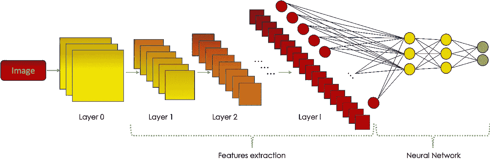

Image by Author

如果你没有任何关于卷积神经网络的知识，我建议你阅读这篇文章的[第一部分](/convolutional-neural-networks-mathematics-1beb3e6447c0) t，讨论 CNN 的基础知识。

注意:因为 Medium 不支持 LaTeX，所以数学表达式是作为图像插入的。因此，为了更好的阅读体验，我建议你关闭黑暗模式。

# 目录

> *1。交叉熵
> 2。图像分类
> 3。物体检测— YOLOv3
> 4。人脸识别—暹罗网络*

# 1-交叉熵

当对图像进行分类时，我们通常在最后一层使用大小为( *C* ，1)的`softmax`函数，其中 *C* 是所讨论的类的数量。
向量的第*I*行是输入图像属于类别 *i* 的概率。`predicted class`被设置为与`highest probability.`相对应的那个

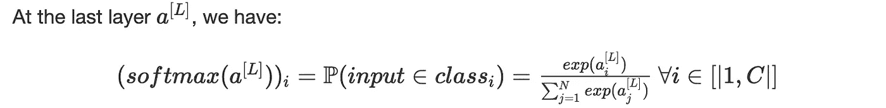

网络通过使用[反向传播](/deep-learnings-mathematics-f52b3c4d2576)进行学习，并优化定义如下的`cross entropy`:

在哪里

*   *p* ( *x* ，*类*)是参考概率，如果对象确实属于所填写的类，则等于 1，否则等于 0
*   *q* ( *x* ，*类*)是网络通过 softmax 获知的对象 x 属于该类的概率

对于输入 *x* ∈ *class_j* :

因此，我们把`loss function`设定为:

我们平均损失，其中 *m* 是训练集的大小。

# 2-图像分类

## LeNet —数字识别

LeNet 是由 [Yann Lecun](https://www.linkedin.com/in/yann-lecun-0b999/) 开发的一个架构，它的目标是检测输入中出现的数字。
给定从 0 到 9 的`hand-written`位数的`gray-scale`幅图像，卷积神经网络预测图像的位数。
训练集被称为`MNIST`，它是一个数据集，包含超过 70k 个具有 28x28x1 像素的图像。神经网络具有以下计算超过 60k 个参数的架构:

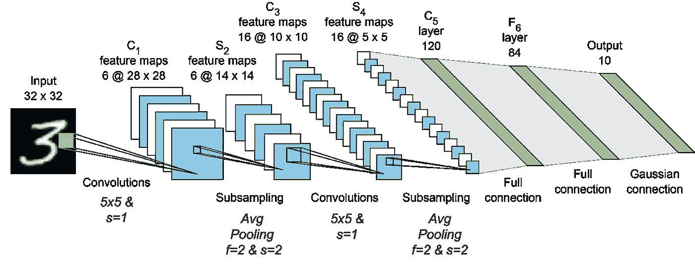

Official paper of LeNet

更多详情，建议你看官方[论文](http://yann.lecun.com/exdb/publis/pdf/lecun-01a.pdf)。

## AlexNet

AlexNet 是一个著名的建筑，它赢得了 2012 年的 ImageNet 竞赛。它类似于 LeNet，但有更多的层次，辍学和重新激活功能的大部分时间。

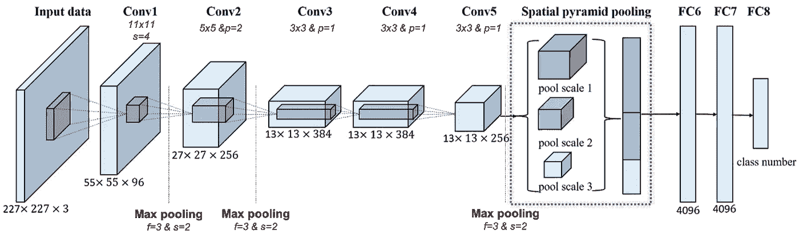

Official paper of AlexNet

训练集是`ImageNet database`的子集，T3 是 1500 万张[标记的图像](http://www.image-net.org/)，具有高分辨率，代表超过 22k 个类别。
AlexNet 在训练集中使用了超过 120 万张图片，在验证集中使用了 50k，在测试集中使用了 150k，这些图片都被调整到了 227x227x3。该架构有多个`60 million parameters`，因此在`2 GPUs`上被训练，它输出一个大小为 *(1000，1)* 的`softmax vector`。

要了解更多信息，我建议你阅读官方[文件](https://papers.nips.cc/paper/4824-imagenet-classification-with-deep-convolutional-neural-networks.pdf)。

## VGG-16

VGG-16 在一个卷积神经网络上进行图像分类，在同一个数据集`ImageNet`上训练，并且已经在多个`138 million parameters`GPU 上训练。
架构如下:

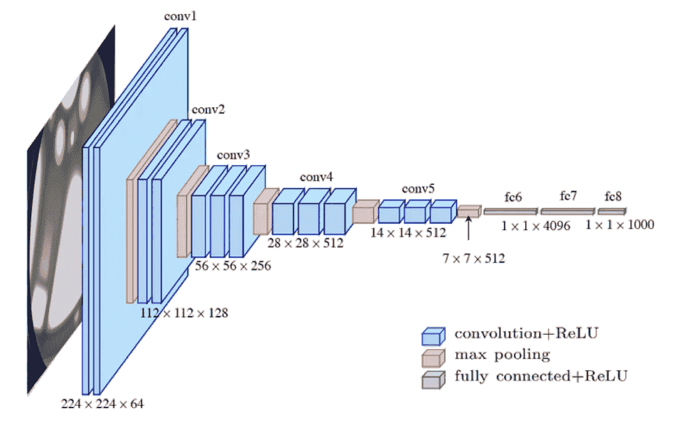

Official paper of VGG-16

它比 AlexNet 更准确、更深入，因为它用连续的 3x3 内核取代了大型内核 11x11x5 和 5x5。更多细节，请查看 VGG 项目的官方文件。

# 三物体检测— YOLO

目标检测是在图像中检测多个目标的任务，包括目标定位和目标分类。第一种粗略的方法是滑动具有可定制尺寸的窗口，并使用在裁剪图像上训练的网络来预测每次内容的类别。这个过程有很高的计算成本，幸运的是可以使用卷积来实现自动化。
YOLO 代表**Y**ou**O**only**L**ook**O**nce，其基本思想是在图像上放置一个网格(通常为 19x19 ),其中:

> 只有一个单元，即包含对象中心/中点的单元，负责检测该对象

网格( *i* ， *j* )的每个单元格标记如下:

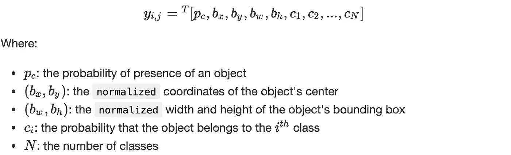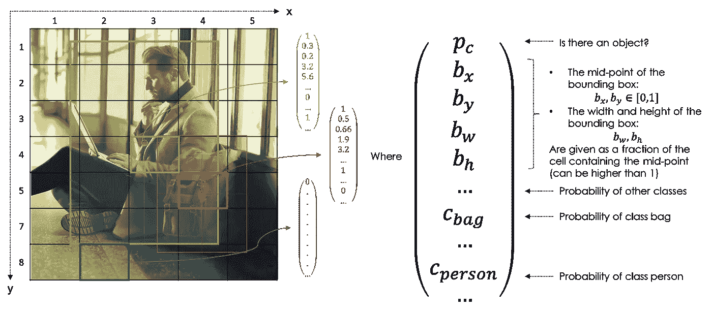

Image by Author

因此，对于每个图像，目标输出的大小为:

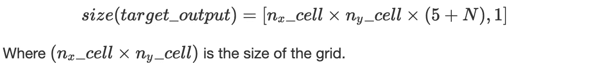

## IOU & NMS

为了评估对象定位，我们使用**I**intersection**O**ver**U**nion 来测量两个边界框之间的`overlap`:

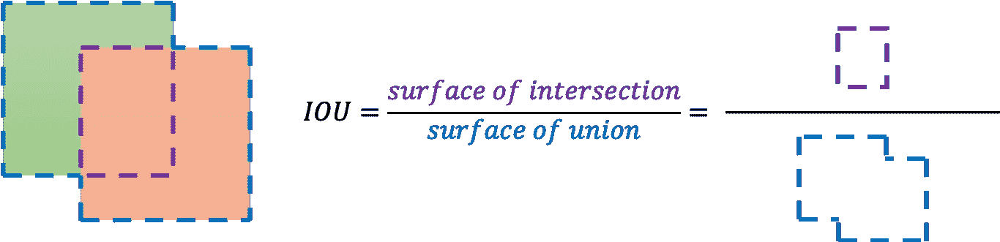

Image by Author

当预测给定网格单元中给定对象的边界框时，可能会给出许多输出，`Non-Max Suppression`帮助您检测对象`only once`。它取最高的概率，并抑制具有高重叠(IOU)的其他框。
对于网格的每个单元，算法如下:

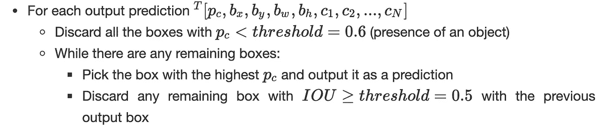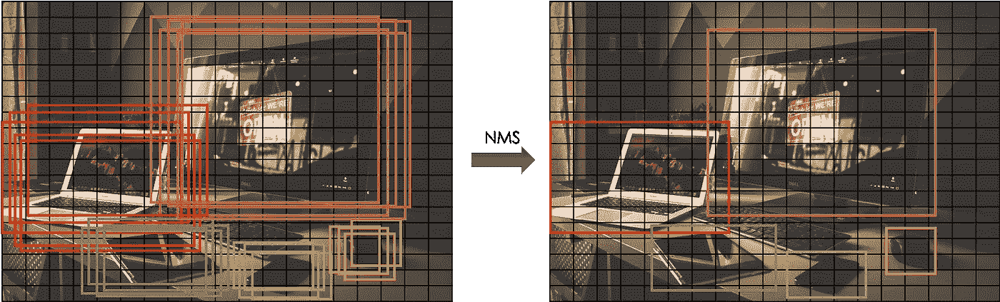

Image by Author

## 锚箱

在大多数情况下，一个网格单元可能包含`multiple objects`，锚盒允许检测所有这些。在`2 anchor boxes`的情况下，网格的每个单元格标记如下:

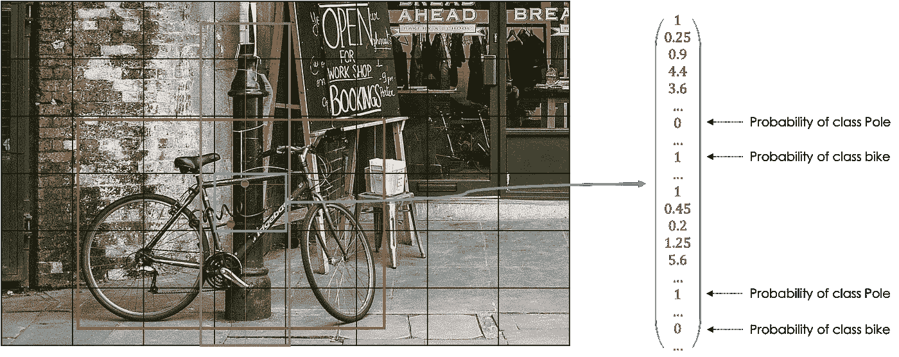

Image by Author

更一般地，输出目标的大小为:

其中 *N* 为班数 *M* 为锚箱数。

## YOLOv3 算法

YOLO 接受了 coco 数据集的训练，这是一个大规模的对象检测、分割和字幕数据库，包含 80 个对象类别。YOLOv3 有一个`Darknet-53`架构作为特征提取器，也称为`backbone`。

通过使用梯度方法最小化`loss function`来进行训练。
是`combined`的:

*   *p_c 上的逻辑回归损失*
*   *b_i* 的平方误差损失
*   概率 *c_i* 的软最大损失(交叉熵)

在每个时期，在每个单元中，我们生成输出 *y_(i，j)* 和`evaluate`损失函数。
进行预测时，我们检查 *p_c* 是否足够高，对于每个网格单元，我们去除低概率预测，并对每个类使用非最大抑制来生成最终输出。
想了解更多信息，我建议你阅读官方[论文](https://arxiv.org/pdf/1804.02767.pdf)。

# 4-人脸识别-连体网络

暹罗网络是神经网络，通常是卷积的，它允许计算两个输入(在我们的情况下是图像)之间的相似度，如下所示:

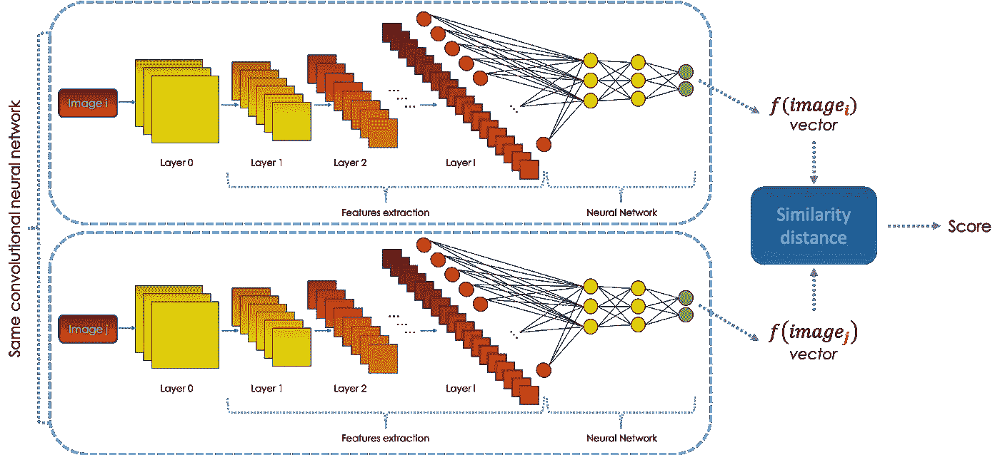

Image by Author

CNN 模块的目的是在另一个空间中表示图像上的信息，这要归功于一个函数，叫做`embedding space`。然后，我们使用某个距离比较两个嵌入。暹罗网络中的学习是通过最小化一个目标函数来完成的，该目标函数由一个叫做`triplet`的损失函数组成。

`triplet`函数以 3 个向量变量作为输入:一个锚点 ***A*** ，一个正的 ***P*** (类似于 ***A*** )和一个负的 ***N*** (不同于 ***A*** )。因此，我们希望:

其中∨*x*∨=<*x*， *x* >为给定的标量积。

为了防止学习函数 *f* 为空，我们定义裕量 0 < *α* ≤1，从而:

因此，我们将`loss`函数定义如下:

从大小为 *n* 的学习数据库开始，要最小化的目标函数是:

在训练架构时，对于每个时期，我们固定三元组的数量，并且对于每个三元组:

*   我们随机选择同一类别的两个图像(锚和积极的)
*   我们从另一个类中随机选取一张图片(负面)

一个三联体( ***一个*** ， ***N*** ， ***P*** )可以是:

*   **易负**，当∩*f*(*A*)*f*(*P*)∩+*α*∩*f*(*A*)*f*(【T75
*   **半硬负**，当∩*f*(*A*)*f*(*P*)∩+*α*>∩*f*(*A*)*f*(*N*)∩>∩
*   **硬负**，当∩*f*(*A*)—*f*(*N*)∩<∩*f*(*A*)*f*(*P*)∩

我们通常选择聚焦在*半硬*底片上来训练神经网络。

## 应用:人脸识别

暹罗网络可以用来开发一个能够识别人脸的系统。给定相机拍摄的图像，该架构将其与数据库中的所有图像进行比较。由于我们的数据库中不能有同一个人的多个图像，我们通常在足够丰富的开源图像集上训练暹罗网络来创建三胞胎。

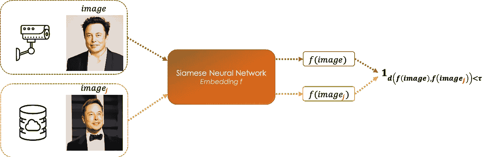

Image by Author

卷积神经网络学习相似性函数 *f* ，这是图像的嵌入。
给定一张相机照片，我们将其与数据库中的每张*图像进行比较，从而:*

*   如果 *d* ( *f* ( *图像*，*图像 _ j*)≤*τ*，两幅图像代表同一个人
*   如果 *d* ( *f* ( *图像*，*图像 _ j*)>*τ*，图像是两个不同的人

我们选择距离 *d* 最接近*图像*的人脸 *image_j* 。阈值 *τ* 以这样一种方式选择，即例如*F*1-得分最高。

# 结论

CNN 是图像处理中广泛使用的架构，它们能够实现更好更快的结果。最近，它们也被用于文本处理，其中网络的输入是标记的嵌入，而不是图像的像素。

不要犹豫，检查我以前的文章处理:

*   [深度学习的数学](https://medium.com/p/deep-learnings-mathematics-f52b3c4d2576)
*   [卷积神经网络的数学](https://medium.com/p/convolutional-neural-networks-mathematics-1beb3e6447c0)
*   [递归神经网络](/recurrent-neural-networks-b7719b362c65)

# 参考

*   [深度学习专业化](https://fr.coursera.org/specializations/deep-learning)，Coursera，吴恩达
*   [机器学习](http://deeploria.gforge.inria.fr/cours/cours1.html#/machine-learning-introduction)，洛里亚，克里斯托夫·塞里萨拉

*原载于 2019 年 2 月 15 日*[*【https://www.ismailmebsout.com*](https://www.ismailmebsout.com/Convolutional%20Neural%20Network%20-%20Part%202/)*。*