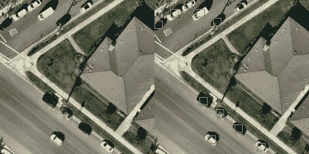
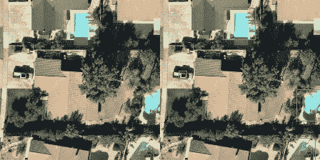
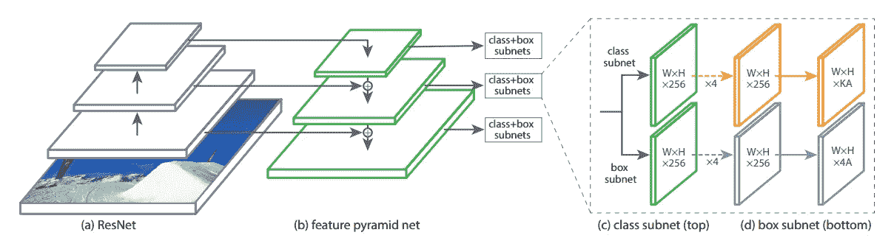
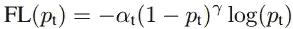
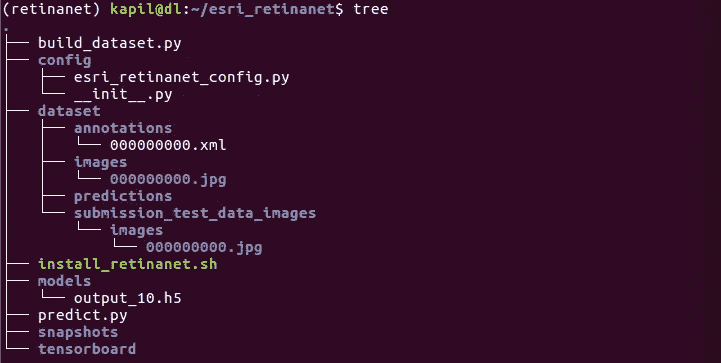
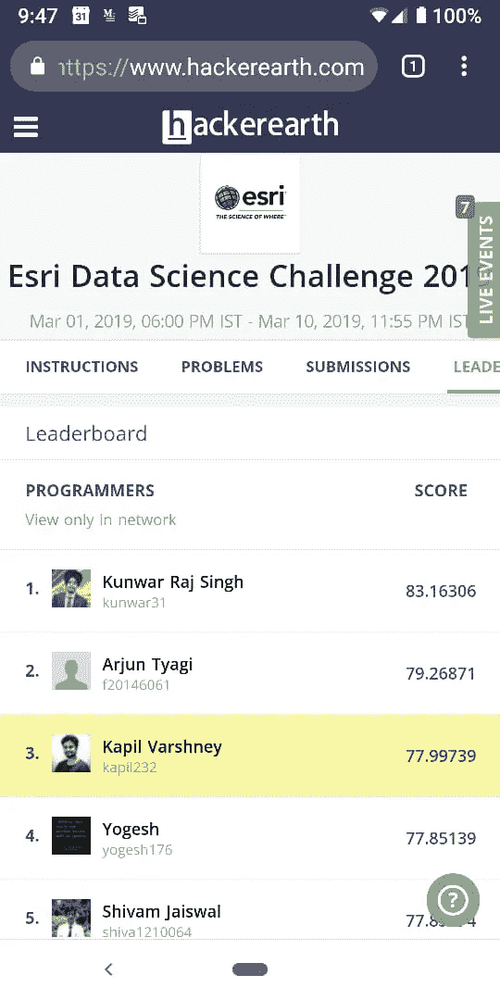

# 基于 RetinaNet 的航空影像目标检测

> 原文：<https://towardsdatascience.com/object-detection-on-aerial-imagery-using-retinanet-626130ba2203?source=collection_archive---------1----------------------->

## ESRI 数据科学挑战赛 2019 第三名解决方案



(Left) the original image. (Right) Car detections using RetinaNet, marked in green boxes



Detecting cars and swimming pools using RetinaNet

# 介绍

为了进行纳税评估，通常需要在实地人工进行调查。这些调查对计算房产的真实价值很重要。例如，拥有一个游泳池可以提高房地产价格。类似地，一个街区或商店周围的汽车数量可以表明那个地方的经济活动水平。能够通过航空图像和人工智能实现这一点，可以通过消除低效率以及人类所需的高成本和时间来大大帮助这些过程。

为了解决这个问题，我们将尝试在 224x224 像素的航空图像的 RGB 芯片中检测汽车和游泳池。训练数据集具有 3748 个图像，具有 PASCAL VOC 格式的边界框注释和标签。

这个问题和数据集一起由 [ESRI](http://www.esri.in/) 在[黑客地球](https://www.hackerearth.com)上发布为 [ESRI 数据科学挑战赛 2019](https://www.hackerearth.com/challenges/hiring/esri-data-science-challenge-2019/) 。我参加了比赛，并在[公共排行榜](https://www.hackerearth.com/challenges/hiring/esri-data-science-challenge-2019/leaderboard/)中获得第三名，在`IoU = 0.3`时，我使用最先进的 RetinaNet 模型获得了 77.99 的地图(平均精度)。在下面的帖子中，我将解释我是如何尝试这个问题的。

# RetinaNet

RetinaNet 是通过对现有的单级对象检测模型(如 YOLO 和 SSD)进行两项改进而形成的:

1.  [用于目标检测的特征金字塔网络](https://arxiv.org/abs/1612.03144)
2.  [密集物体检测的焦点损失](https://arxiv.org/abs/1708.02002)

## 特征金字塔网络

金字塔网络通常用于识别不同尺度的物体。特征金字塔网络(FPN)利用深层 CNN 固有的多尺度金字塔等级来创建特征金字塔。



> 一级 RetinaNet 网络架构在前馈 ResNet 架构(a)之上使用特征金字塔网络(FPN)主干来生成丰富的多尺度卷积特征金字塔(b)。RetinaNet 将两个子网络连接到该主干，一个用于分类锚盒(c ),一个用于从锚盒回归到地面真实对象盒(d)。网络设计非常简单，这使得这项工作能够专注于一种新的焦点损失函数，该函数消除了我们的一级检测器与最先进的两级检测器(如带 FPN 的更快 R-CNN)之间的精度差距，同时运行速度更快。

## 焦点损失

焦点损失是对交叉熵损失的改进，有助于减少分类良好的示例的相对损失，并将更多的注意力放在困难的、错误分类的示例上。

> 焦点损失使得能够在存在大量简单背景示例的情况下训练高度精确的密集物体检测器。



Focal Loss Function

如果你对这个模型的细节更感兴趣，我建议你阅读原始论文和这个非常有用的描述性博客“[retina net](https://medium.com/@14prakash/the-intuition-behind-retinanet-eb636755607d)背后的直觉”。

现在，让我们开始实际的实现并开始编码。这里有一个 Github 库，你可以跟随它:

[](https://github.com/kapil-varshney/esri_retinanet) [## kapil-varshney/esri_retinanet

### 通过在 GitHub 上创建帐户，为 kapil-varshney/esri_retinanet 的开发做出贡献。

github.com](https://github.com/kapil-varshney/esri_retinanet) 

# 安装 Retinanet

我们将使用由 [Fizyr](https://fizyr.com/) 开发的 RetinaNet 的令人敬畏的 [Keras 实现。我假设你有你的深度学习机器设置。如果没有，跟随我的指南](https://github.com/fizyr/keras-retinanet)[这里](https://medium.com/@kapilvarshney/how-to-setup-ubuntu-16-04-with-cuda-gpu-and-other-requirements-for-deep-learning-f547db75f227)。另外，我建议使用虚拟环境。以下脚本将安装 RetinaNet 和其他必需的包。

或者，您可以在 AWS 上使用一个 GPU 实例(p2.xlarge)和“使用 python 的计算机视觉深度学习”AMI。这个 AMI 预装了 keras-retinanet 和其他必需的包。通过`workon retinanet`命令激活 RetinaNet 虚拟环境后，就可以开始使用模型了。

注意:Retinanet 计算量很大。一批 4 张(224x224)图像至少需要 7–8gb 的 GPU 内存。

一旦安装了 RetinaNet，就为这个项目创建以下目录结构。



我将详细解释其中的每一个，但这里有一个概述:
`build_dataset.py` —创建训练/测试集
`config/esri_retinanet_config.py`的 Python 脚本—构建脚本使用的配置文件。
`dataset/annotations` —保存所有图像注释的目录
`dataset/images` —保存所有图像的目录
`dataset/submission_test_data_images`—Esri 数据科学挑战赛的提交测试目录。如果您正在处理自己的数据集和不同的项目，则可以忽略这一点。
`snapshots` —每个历元
`models`后保存所有训练快照的目录—为评估和测试转换快照的目录。将被保存
`tensorboard` —保存训练日志的目录，供 tensorboard
`predict.py` —脚本对提交的测试文件进行预测

# 构建数据集

首先，我们需要编写一个配置文件，它将保存图像、注释、输出 CSV——训练、测试和类，以及测试训练分割值的路径。有了这样的配置文件，代码就可以通用于不同的数据集。

在这个配置文件中，`TRAIN_TEST_SPLIT = 0.75`。标准做法是在原始数据集的训练数据集和测试数据集之间进行 75–25 或 70–30 甚至 80–20 的拆分。但是，为了这次比赛的目的，我没有制作测试数据集，而是使用完整的数据集进行训练。这样做是因为只提供了 3748 幅图像的小数据集。此外，还提供了一个由 2703 幅图像组成的测试数据集(没有注释),在此基础上，可以通过在线提交预测来测试该模型。

接下来，让我们编写一个 Python 脚本，该脚本将读取所有图像路径和注释，并输出训练和评估模型时所需的三个 CSV:

1.  train . CSV——该文件将保存所有用于训练的注释，格式如下:`<path/to/image>,<xmin>,<ymin>,<xmax>,<ymax>,<label>`
    每一行代表一个边界框，因此，一幅图像可以出现在多行中，这取决于该图像中有多少对象被注释。
2.  test.csv 格式类似于 train.csv，该文件将保存用于测试模型的所有注释。
3.  classes.csv 包含数据集中所有唯一类标签的文件，带有索引分配(从 0 开始，忽略背景)

让我们从创建一个`build_dataset.py`文件并导入所需的包开始。注意，我们导入之前在 config 目录中创建的`esri_retinanet_config.py`文件，并给它一个别名`config`。

在上面的代码中，我们创建了一个参数解析器，可选地接收图像和注释路径、输出 CSV 路径和训练测试分割。是的，我知道我们已经在配置文件中定义了这些参数。但是，我也意识到，有时候我想为一个实验创建一个图像子样本，或者有一个不同的训练测试分割，等等。那时，在执行脚本时选择传递这些参数，而不改变配置文件，速度会更快。您可以看到，我已经为配置文件本身的每个参数提供了默认值。因此，除非您愿意，否则不要求您提供这些参数。解析参数后，为每个参数分配简单的变量名。

在前面的代码中，我们将图像路径读入一个列表，随机化该列表，将其分为训练集和测试集，并以`(<dataset_type>, <list_of_paths>, <outpuCSV>)`的格式将它们存储在另一个列表`dataset`中。我们还将初始化`CLASS`集合来保存数据集中所有唯一的类标签。

接下来，我们遍历每个数据集(训练和测试)并打开要写入的输出 CSV 文件。对于每个数据集，我们在每个图像路径上循环。对于每个图像，提取文件名并构建相应的注释路径。这是因为，通常，图像和注释文件具有相同的名称，但扩展名不同。例如，`dataset/images/0000001.jpg`在`dataset/annotations/0000001.xml`中有其注释。如果数据集遵循不同的命名约定，请修改此部分。使用`BeautifulSoup`解析注释(XML)文件。然后，我们可以从解析的 XML 中找到“宽度”和“高度”以及“对象”。

对于每幅图像，找到所有的对象，并对每个对象进行迭代。然后，为注释中的每个对象找到边界框(xmin，ymin，xmax，ymax)和类标签(name)。通过截断图像边界外的任何边界框坐标来进行清理。此外，如果任何最小值错误地大于最大值，则进行健全性检查，反之亦然。如果我们找到这样的值，我们将忽略这些对象并继续下一个。

现在，我们已经有了所有的信息，我们可以继续写入输出 CSV，一次一行。此外，继续向`CLASSES`集合添加标签。这将最终拥有所有唯一的类标签。

构建所需格式的数据集的最后一件事是将带有各自索引的类标签写入 CSV。在 ESRI 数据集中，只有两个类-汽车(标签:' 1 '，索引:1)和游泳池(标签:' 2 '，索引:0)。这就是`classes.csv`查找 Esri 数据集的方式。

```
2,0
1,1
```

# 训练和评估模型

现在，数据集已经准备好，RetinaNet 已经安装，让我们继续在数据集上训练模型。

```
# For a list of all arguments
$ retinanet-train --help
```

为了训练模型，我使用了以下命令:

```
$ retinanet-train --weights resnet50_coco_best_v2.1.0.h5 \
--batch-size 4 --steps 4001 --epochs 20 \
--snapshot-path snapshots --tensorboard-dir tensorboard \
csv dataset/train.csv dataset/classes.csv
```

建议加载预训练的模型或权重文件，而不是从头开始训练，以加快训练速度(损失会更早开始收敛)。我在 COCO 数据集上使用了来自带有 ResNet50 主干的预训练模型的权重。使用以下链接下载该文件。

```
[https://github.com/fizyr/keras-retinanet/releases/download/0.5.0/resnet50_coco_best_v2.1.0.h5](https://github.com/fizyr/keras-retinanet/releases/download/0.5.0/resnet50_coco_best_v2.1.0.h5)
```

`batch-size`和`steps`将取决于你的系统配置(主要是 GPU)和数据集。我通常从`batch-size = 8`开始，然后根据模型训练是否成功开始，增加或减少 2 倍。如果训练成功开始，我将终止训练(CTRL+C ),并以较大的批量开始，否则以较小的批量开始。

一旦决定了批量大小，您就需要计算在每个时期覆盖整个数据集所需的步骤。下面的命令将给出先前在`dataset`目录中创建的`train.csv`中的行数。

```
$ wc -l datatset/train.csv
```

步长的计算很简单:`steps = count of rows in train.csv / batch-size`。接下来，设置`epochs`的数量。根据我的经验，RetinaNet 收敛得很快，所以通常用较少的历元就可以完成这项工作。如果不是，你可以随时从上一个时代开始训练，并进一步训练你的模型。因此，我们将提供一个`snapshot-path`,在每个时期后模型将被保存在这里。

我们还将提供一个`tensorflow-dir`，所有的日志将被保存，tensorboard 可以运行，以可视化的培训进行。要启动 tensorboard，打开一个新的终端窗口并运行下面提到的命令。在运行 tensorboard 之前，请确保您已经安装了它。

```
# To launch tensorboard
$ tensorboard --logdir <path/to/logs/dir>
```

最后，提供带有训练数据集和类标签的`csv`文件。并执行训练命令。现在，当你的模型训练的时候，去做一个钢铁侠或者睡觉什么的。在 AWS p2.xlarge 实例上的 K80 Tesla GPU 上，每个包含 3748 张(224x224)图像的历元花费了 2 个多小时。

一旦模型训练到您满意的程度，就将模型转换成可用于评估和预测的格式。

```
# To convert the model
$ retinanet-convert-model <path/to/desired/snapshot.h5> <path/to/output/model.h5># To evaluate the model
$ retinanet-evaluate <path/to/output/model.h5> csv <path/to/train.csv> <path/to/classes.csv># Sample evaluation
95 instances of class 2 with average precision: 0.8874
494 instances of class 1 with average precision: 0.7200
mAP: 0.8037
```

在对 125 幅测试图像的样本评估中，该模型能够利用 18 个时期的 375 幅图像训练实现 80.37%的 mAP(平均精度)。对于如此小的数据集来说，这是一个很好的结果。

# 预言

构建一个脚本`predict.py`，它将使用训练好的模型，对提交的图像进行预测，并将其写在磁盘上。

在将图像输入模型进行预测之前，需要使用 keras_retinanet 实用程序中的一些方法对图像进行预处理。此外，导入我们之前创建的配置文件，用于加载几个路径。

构造参数解析器以在执行脚本时接受参数，然后解析参数。参数`model`将接受训练模型文件的路径，该文件将用于进行预测。对于类标签和预测输出目录，默认值取自配置文件。因此，这些不是必需的参数。参数`input`将接受包含图像的目录的路径来进行预测。此外，`confidence`参数可用于过滤弱预测。

接下来，从类标签 CSV 加载类标签映射，并将其创建到字典中。加载要用于预测的模型。使用`input`参数中提供的目录路径获取并列出所有图像路径。

迭代每个图像路径，以便我们可以对提供的数据集中的每个图像进行预测。上面代码中的第 6–9 行从图像路径中提取图像文件名，然后构造并打开一个输出文本文件路径，在该路径中保存对该图像的预测。在第 11–15 行中，我们加载图像，对其进行预处理，调整其大小，然后在将其传递给模型之前扩展其尺寸。在第 18 行，我们将预处理的图像传递给模型，它返回预测的框(边界框坐标)、每个框的概率得分以及相关联的标签。在上面块的最后一行，根据原始图像大小重新调整边界框坐标。

接下来，迭代模型预测的每个检测。跳过得分低于提供的置信度值的项目。虽然，如果你想计算地图(平均平均精度)保持所有的预测。为此，将参数`confidence`的值作为`0.0`传递。包围盒坐标将是`float`值，因此将其转换为`int`。按照所需的格式:`<classname> <confidence> <ymin> <xmin> <ymax> <xmax>`为每个预测构造一行，并将其写入文件。一旦该图像的所有检测结果都已写入相应的文件，请关闭该文件。

```
$ python predict.py --model models/output.h5 --input dataset/submission_test_data_images --confidence 0.0
```

运行上面的命令来执行`predict.py`脚本。请根据您的数据集和项目随意更改参数。

# 实验和结果

最初，我只使用 18 个时期 10%的数据(375 张图像)来训练模型。该模型在测试图像上具有置信度值为 0.5 的 71 的 mAP。我继续在另外 10 个时期的 3748 幅图像的完整数据集上训练该模型，以产生 74 幅增加的地图。我决定对模型进行一点工程设计，并对锚盒进行修改。数据集只有方形的边界框，我将这些框的长宽比从`[0.5, 1, 2]`改为`[1]`。这似乎是一个很好的尝试，但我意识到这不是因为锚盒的比例会随着图像的增加而改变。随着网络规模的减小，使用总数据集进行网络训练的速度比以前快得多。预测的准确性也有所提高，但随后开始下降。我决定使用置信值为 0.0 的第二代结果来包含所有预测。这就产生了`77.99`的地图，使我在挑战中获得了第三名。我还尝试了一些其他的实验，将图像的比例用于 FPN 和数据增强参数，但都没有成功，但最终提交时还是坚持使用早期的结果。



# 摘要

在这篇文章中，我们谈到了最先进的 RetinaNet 模型，以及我如何在 2019 年 Esri 数据科学挑战赛中使用它来检测 224x224 航拍图像中的汽车和游泳池。我们从构建项目目录开始。接下来，我们构建了模型要使用的训练/测试数据集。用适当的参数对模型进行训练，然后对训练好的模型进行转换以进行评估和预测。我们创建了另一个脚本来对提交测试图像进行检测，并将预测写到磁盘上。最后简单描述一下我尝试的实验和取得的成果。

# 参考

 [## 密集物体探测的聚焦损失

### 迄今为止最高精度的物体探测器是基于一个由 R-CNN 推广的两阶段方法，其中…

arxiv.org](https://arxiv.org/abs/1708.02002)  [## 用于目标检测的特征金字塔网络

### 特征金字塔是识别系统中的基本组件，用于检测不同尺度的对象。但是最近…

arxiv.org](https://arxiv.org/abs/1612.03144) [](https://www.pyimagesearch.com/deep-learning-computer-vision-python-book/) [## 用 Python 进行计算机视觉的深度学习:用我的新书掌握深度学习

### 计算机视觉深度学习入门吃力？我的新书会教你所有你需要知道的。

www.pyimagesearch.com](https://www.pyimagesearch.com/deep-learning-computer-vision-python-book/) 

感谢你阅读这篇文章。希望对你有帮助。欢迎留言，提出意见和建议。也可以在 [LinkedIn](https://www.linkedin.com/in/kapilvarshney14/) 上和我联系。下面是 GitHub 存储库和代码:

[](https://github.com/kapil-varshney/esri_retinanet) [## kapil-varshney/esri_retinanet

### 通过在 GitHub 上创建帐户，为 kapil-varshney/esri_retinanet 的开发做出贡献。

github.com](https://github.com/kapil-varshney/esri_retinanet)