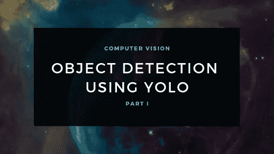
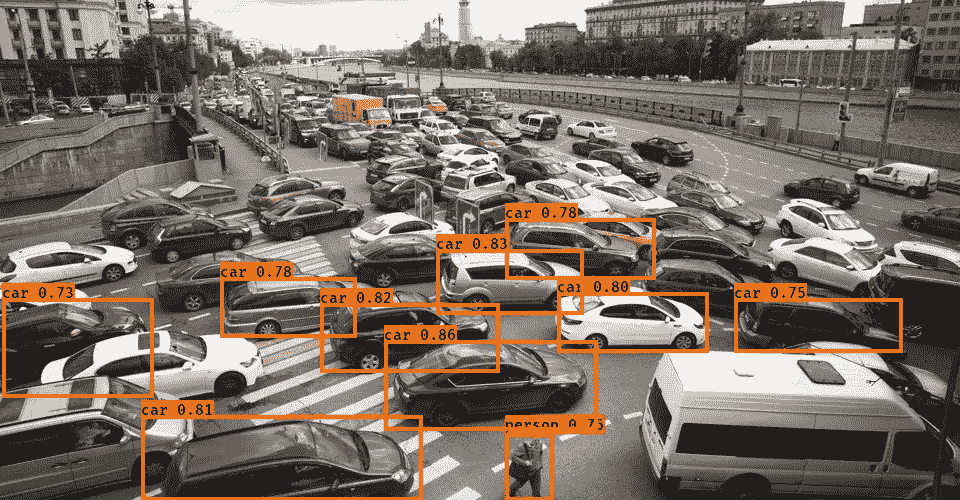
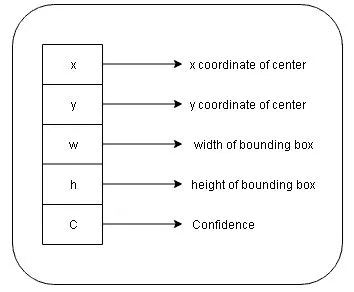
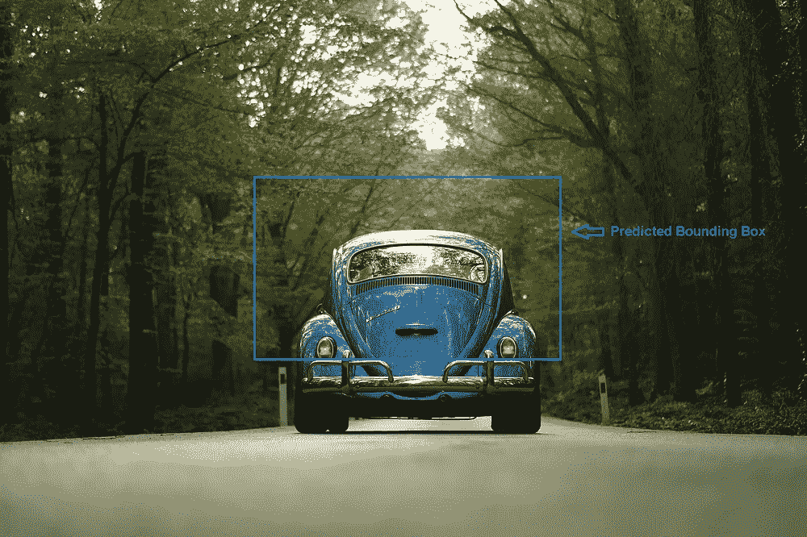
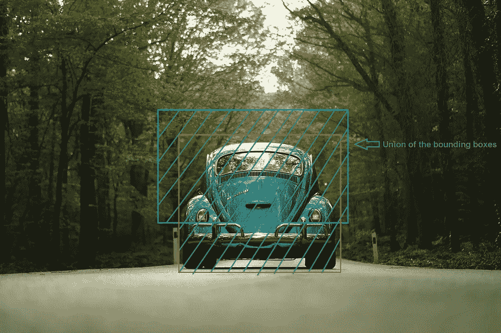
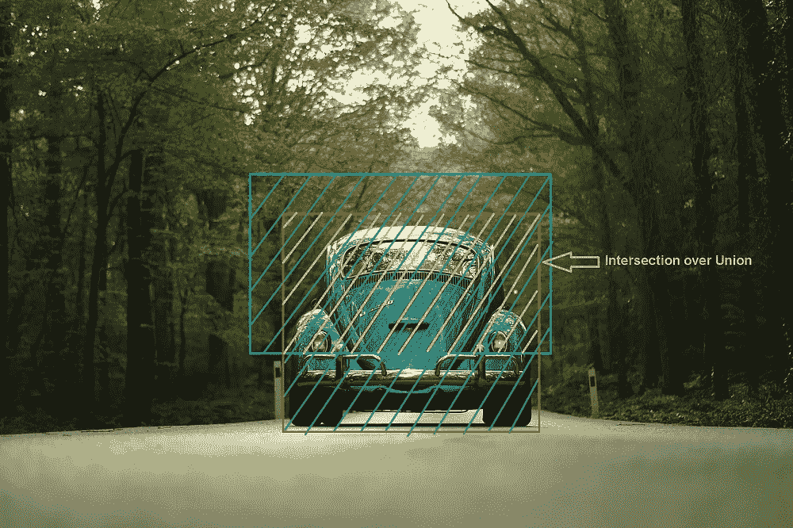
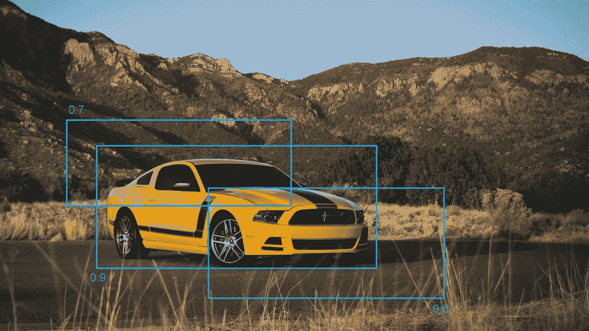
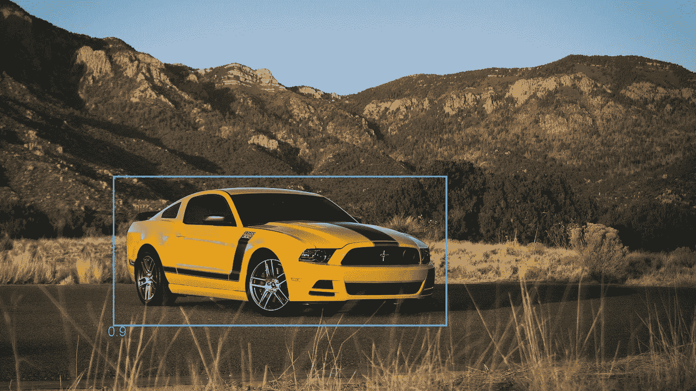
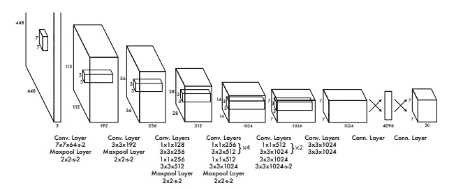

# 使用 YOLO 框架进行目标检测的综合指南—第一部分

> 原文：<https://towardsdatascience.com/object-detection-part1-4dbe5147ad0a?source=collection_archive---------8----------------------->

## YOLO 背后的理论，网络架构和更多

Cover Image (Source: Author)

# 目录:

*   介绍
*   为什么是 YOLO？
*   它是如何工作的？
*   并集上的交集
*   非最大抑制
*   网络体系结构
*   培养
*   YOLO 的局限性
*   结论

# **简介:**

你只看一次(YOLO)是一种新的和更快的对象检测方法。传统系统重新利用分类器来执行检测。基本上，为了检测任何对象，系统采用该对象的分类器，然后对其在图像中不同位置的存在进行分类。其他系统使用区域提议方法在图像中生成潜在的边界框，然后对这些潜在的框运行分类器。这产生了一种稍微有效的方法。分类后，使用后处理来细化边界框，消除重复检测等。由于这些复杂性，系统变得缓慢且难以优化，因为每个组件都必须单独训练。

Object Detection with Confidence Score

# **为什么是 YOLO？**

基本模型可以以每秒 45 帧的速度实时处理图像。作为网络的一个较小版本，快速 YOLO 可以每秒 155 帧的速度处理图像，同时达到其他实时检测器的两倍。它优于其他检测方法，包括 DPM(可变形部分模型)和 R-CNN。

# **它是如何工作的？**

YOLO 将物体检测重新定义为一个单一的回归问题，而不是一个分类问题。该系统只需查看图像一次，就能检测出哪些物体存在以及它们的位置，因此得名 YOLO。

系统将图像分成一个 S×S 的网格。这些网格单元中的每一个预测 B 边界框和这些框的置信度得分。置信度得分表明模型对盒子包含对象的确信程度，以及它认为盒子预测的准确性。可以使用以下公式计算置信度得分:

*C = Pr(object) * IoU*

IoU:预测框和实际情况之间的交集。

如果单元格中不存在任何对象，则其置信度得分应该为零。

Bounding Box Predictions (Source: Author)

每个边界框由五个预测组成: **x，y，w，h** 和置信度其中，

**(x，y):** 代表盒子中心的坐标。这些坐标是相对于网格单元的边界计算的。

**w:** 边框的宽度。

**h:** 边框的高度。

每个网格单元还预测 C 个条件类概率 *Pr(Classi|Object)* 。它只预测每个网格单元的一组类别概率，而不考虑盒子 b 的数量。在测试期间，这些条件类别概率乘以单个盒子置信度预测，该预测给出每个盒子的特定类别置信度得分。这些分数显示了该类别的概率以及该框与对象的匹配程度。

*Pr(I 类|对象)*Pr(对象)*IoU = Pr(I 类)* IoU。*

最终的预测被编码为一个 S x S x (B*5 + C)张量。

# **交集超过并集(欠条):**

IoU 用于评估对象检测算法。它是基础真实和预测边界框之间的重叠，即它计算预测框相对于基础真实有多相似。

Demonstration of IoU (Edited by Author)

通常，IoU 的阈值保持在 0.5 以上。尽管许多研究人员采用更严格的阈值，如 0.6 或 0.7。如果边界框的 IoU 小于指定阈值，则不考虑该边界框。

# **非最大抑制:**

该算法可以找到同一物体的多次检测。非最大值抑制是一种算法仅检测一次对象的技术。考虑一个例子，其中算法检测到同一对象的三个边界框。下图显示了具有相应概率的方框。

Multiple Bounding Boxes Of the Same Object (Edited by Author)

盒子的概率分别是 0.7、0.9 和 0.6。为了消除重复，我们首先要选择概率最高的盒子，并将其作为预测输出。然后用预测输出消除任何 IoU > 0.5(或任何阈值)的边界框。结果将是:

Bounding Box Selected After Non-Max Suppression (Edited by Author)

# **网络架构:**

基本模型有 24 个卷积层，后面是 2 个全连接层。它使用 1 x 1 缩减层，然后是 3 x 3 卷积层。快速 YOLO 使用的神经网络有 9 个卷积层，这些层中的过滤器较少。完整的网络如图所示。

Network Architecture ([Source](https://www.cv-foundation.org/openaccess/content_cvpr_2016/papers/Redmon_You_Only_Look_CVPR_2016_paper.pdf))

**注:**

*   该架构设计用于 Pascal VOC 数据集，其中 S = 7，B = 2，C = 20。这就是为什么最终的特征图是 7×7，并且输出张量的形状也是(7×7×2 * 5+20)的原因。要将此网络用于不同数量的类或不同的格网大小，您可能需要调整图层尺寸。
*   最后一层使用线性激活函数。其余的使用泄漏的 ReLU。

# **培训:**

*   在 ImageNet 1000 级竞争数据集上预训练前 20 个卷积层，然后是平均池层和全连接层。
*   由于检测需要更好的视觉信息，请将输入分辨率从 224 x 224 提高到 448 x 448。
*   训练网络 135 个纪元。在整个训练过程中，使用批量 64，动量 0.9，衰减 0.0005。
*   学习率:对于第一个时期，将学习率从 10–3 提高到 10–2，否则模型会由于不稳定的梯度而发散。继续以 10–2 训练 75 个周期，然后 10–3 训练 30 个周期，然后 10–4 训练 30 个周期。
*   为了避免过度拟合，请使用剔除和数据扩充。

# **YOLO 的局限性:**

*   边界框预测的空间约束，因为每个格网单元只能预测两个框，并且只能有一个类。
*   很难检测成群出现的小物体。
*   当模型学习从数据本身预测边界框时，它很难以新的或不寻常的纵横比来概括对象。

# **结论:**

这是对研究论文的简要解释，以及从各种其他来源获得的细节。我希望我让你更容易理解这个概念。

虽然如果真的要检查自己的理解，最好的方法还是实现算法。在下一节中，我们将会这样做。许多细节无法通过文本解释，只能在实现时理解。

感谢您的阅读。[点击这里](https://medium.com/@pratheesh.27998/object-detection-part2-6a265827efe1)进入下一部分。