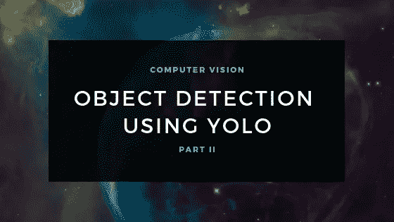
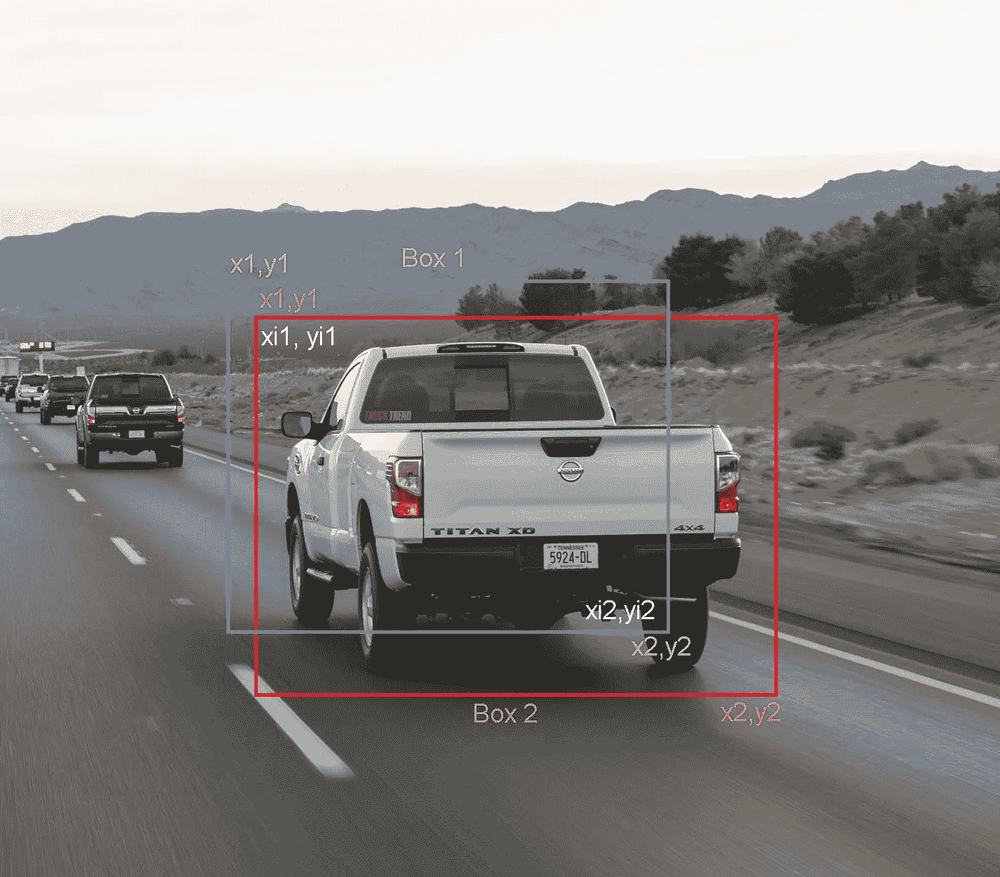

# 利用 YOLO 框架进行目标探测的综合指南——第二部分

> 原文：<https://towardsdatascience.com/object-detection-part2-6a265827efe1?source=collection_archive---------10----------------------->

## 使用 Python 实现



Cover Image (Source: Author)

在最后一部分，我们了解了 YOLO 是什么以及它是如何工作的。在本节中，让我们了解如何使用预先训练的权重应用它并获得结果。这篇文章受到了[吴恩达深度学习专业化](https://www.coursera.org/specializations/deep-learning)课程的极大启发。我还试图从各种其他文章/资源中收集信息，以使这个概念更容易理解。

现在是时候使用 Python 实现我们所理解的内容了。您可以借助 Jupyter 笔记本电脑(或您选择的任何其他 IDE)来完成这项工作。YOLO 的实现取自[吴恩达的 Github 库](https://github.com/enggen/Deep-Learning-Coursera)。您还必须下载这个 [zip 文件](https://drive.google.com/open?id=1j3N1Tp112CfDzRchwa3d-D2zksChMVtY)，其中包含预训练的权重和包来实现 YOLO。这里有一个[链接](https://github.com/iampratheesh/Object-Detection-YOLO)到我的 GitHub 库，你可以在那里找到 Jupyter 笔记本。

为了更好地理解，我已经尝试对尽可能多的代码行进行注释。

# 导入库:

让我们首先导入所有需要的库。

```
import os
import imageio
import matplotlib.pyplot as plt
from matplotlib.pyplot import imshow
import scipy.io
import scipy.misc
import numpy as np
import pandas as pd
import PIL
import tensorflow as tf
from skimage.transform import resize
from keras import backend as K
from keras.layers import Input, Lambda, Conv2D
from keras.models import load_model, Model
from yolo_utils import read_classes, read_anchors, generate_colors, preprocess_image,draw_boxes, scale_boxes
from yad2k.models.keras_yolo import yolo_head, yolo_boxes_to_corners, preprocess_true_boxes, yolo_loss, yolo_body
%matplotlib inline
```

# 应用过滤器:

首先，我们将应用阈值过滤器。我们可以通过去掉那些分数低于所选阈值的盒子来做到这一点。

该模型包含 80 个不同的检测类别。它总共给出了 19x19x5x85 个数字，其中:

19x19:网格的形状

5:锚箱数量

85:每盒包含 85 个号码(Pc，bx，by，bh，bw，c1，c2…..c80)

```
def yolo_filter_boxes(box_confidence, boxes, box_class_probs, threshold = .6):'''
box confidence: tensor of shape (19,19,5,1) containing Pc
boxes: tensor of shape (19,19,5,4)
box_class_probs: tensor of shape (19,19,5,80)
threshold: if Pc<threshold, get rid of that box
'''
    #Computing box scores
    box_scores = box_confidence*box_class_probs #Finding the index of the class with maximum box score
    box_classes = K.argmax(box_scores, -1) #Getting the corresponding box score
    box_class_scores = K.max(box_scores,-1) #Creating a filtering mask. The mask will be true for all the boxes        we intend to keep (pc >= threshold) and false for the rest
    filtering_mask = box_class_scores>threshold #Applying the mask to scores, boxes and classes
    scores = tf.boolean_mask(box_class_scores, filtering_mask)
    boxes = tf.boolean_mask(boxes, filtering_mask)
    classes = tf.boolean_mask(box_classes, filtering_mask)'''
scores: contains class probability score for the selected boxes
boxes: contains (bx,by,bh,bw) coordinates of selected boxes
classes: contains the index of class detected by the selected boxes
'''    
    return scores, boxes, classes
```

# 实现并集上的交集(IoU):

现在我们要实现 IoU。这将用于评估边界框。



Intersection over Union (Edited by Author)

我们将使用它的两个角(左上角和右下角)来定义一个盒子。坐标可以命名为(x1，y1，x2，y2)。

我们还必须找出两个盒子的交点坐标。

**xi1:** 两个框的 x1 坐标的最大值。

**yi1:** 两个框的 y1 坐标的最大值。

**xi2:** 两个框的 x2 坐标的最小值。

**yi2:** 两个框的 y2 坐标的最小值。

相交后形成的矩形的面积可以使用公式计算:(xi2-xi1)*(yi2-yi1)

计算借据的公式是:

```
(Intersection area)/(Union area)
```

现在让我们定义一个函数来计算 IoU。

```
def iou(box1, box2): #Calculating (xi1,yi1,xi2,yi2) of the intersection of box1 and box2 
    xi1 = max(box1[0], box2[0])
    yi1 = max(box1[1], box2[1])
    xi2 = min(box1[2], box2[2])
    yi2 = min(box1[3], box2[3])
    #Calculating the area of intersection
    inter_area = (yi2-yi1)*(xi2-xi1) #Calculating the areas of box1 and box2 using the same formula
    box1_area = (box1[3] - box1[1])*(box1[2] - box1[0])
    box2_area = (box2[3] - box2[1])*(box2[2] - box2[0])
    #Calculating the union area by using the formula: union(A,B) = A+B-Inter(A,B)
    union_area = box1_area + box2_area - inter_area #Calculating iou
    iou = inter_area/union_area

    return iou
```

# 实施非最大抑制:

接下来，我们将实现非最大抑制来移除同一对象的所有重复边界框。涉及的步骤有:

1.  选择得分最高的方框。
2.  计算其与所有其他盒子的 IoU，并移除 IoU 大于所述阈值的那些盒子。
3.  重复此操作，直到不再有分数低于所选框的框。

让我们来定义这个函数

```
def yolo_non_max_suppression(scores, boxes, classes, max_boxes = 10, iou_threshold = 0.5): #tensor used in tf.image.non_max_suppression()of size 'max_boxes' 
    max_boxes_tensor = K.variable(max_boxes, dtype = 'int32') #initiating the tensor 
    K.get_session().run(tf.variables_initializer([max_boxes_tensor])) #Using the tensorflow function tf.image.non_max_suppression to get the indices of boxes kept
    nms_indices = tf.image.non_max_suppression(boxes, scores, max_boxes, iou_threshold) #Using K.gather to individually access scores, boxes and classes from nms_indices
    scores = K.gather(scores, nms_indices)
    boxes = K.gather(boxes, nms_indices)
    classes = K.gather(classes, nms_indices)

    return scores, boxes, classes
```

# 调用上面定义的函数:

现在是实现一个函数的时候了，该函数获取深度 CNN 的输出，然后使用上述函数过滤盒子。

注意，有几种方法可以表示一个边界框，即通过它们的角或中点和高度/宽度。YOLO 在几种格式之间进行转换，其中有一个名为“yolo _ boxes _ to _ corners”的函数。

此外，YOLO 还接受了 608 x 608 尺寸图像的训练。如果我们提供的图像的尺寸大于或小于原始尺寸(YOLO 在其上被训练),那么我们将不得不相应地重新缩放边界框以适合图像。为此，我们将使用一个名为“scale _ boxes”的函数。

```
def yolo_eval(yolo_outputs, image_shape = (720., 1280.), max_boxes = 10, score_threshold = .6, iou_threshold = .5): '''
    yolo_outputs contains:
    box_confidence, box_xy, box_wh, box_class_probs
    '''    #Retrieving output
    box_confidence, box_xy, box_wh, box_class_probs = yolo_outputs #Converting the boxes for filtering functions
    boxes = yolo_boxes_to_corners(box_xy, box_wh) #Using the function defined before to remove boxes with less confidence score
    scores, boxes, classes = yolo_filter_boxes(box_confidence, boxes, box_class_probs, threshold = score_threshold) #Scaling the boxes
    boxes = scale_boxes(boxes, image_shape) #Using the function defined before for non-max suppression
   scores, boxes, classes = yolo_non_max_suppression(scores, boxes, classes, max_boxes, iou_threshold)

    return scores, boxes, classes
```

# 加载预训练模型:

现在，我们将在图像上测试 YOLO 预训练模型。为此，我们必须创建一个会话。此外，请记住，我们正在尝试检测 80 个类别，并使用 5 个锚盒。我们在“coco_classes.txt”和“yolo_anchors.txt”中有所有的课程信息，这些信息必须存在于您之前在“model_data”文件夹中下载的 zip 文件中。

YOLO 模型的训练需要很长时间，尤其是如果你没有一个高规格的系统。因此，我们将加载存储在“yolo.h5”中的现有预训练的 Keras YOLO 模型。这些是 YOLOv2 模型的预训练重量。

让我们创建一个会话并加载这些文件。

```
sess = K.get_session()
class_names = read_classes("model_data/coco_classes.txt")
anchors = read_anchors("model_data/yolo_anchors.txt")
yolo_model = load_model("model_data/yolo.h5")
```

***注意:*** *在某些情况下，加载砝码时会弹出警告。如果是这种情况，就忽略警告。*

```
#Converting the output of model into usable bounding box tensors
yolo_outputs = yolo_head(yolo_model.output, anchors, len(class_names))
#Filtering the boxes
scores, boxes, classes = yolo_eval(yolo_outputs, image_shape)
```

到目前为止，我们已经创建了一个会话图，它被提供给 yolo_model 来计算输出，由 yolo_head 处理，并经过过滤函数 yolo_eval。

# 在图像上应用 YOLO:

现在我们必须实现一个运行图形的函数来测试图像上的 YOLO。

```
def predict(sess, image_file): #Preprocessing the image
    image, image_data = preprocess_image("images/"+image_file, model_image_size = (608,608)) #Running the session and feeding the input to it
   out_scores, out_boxes, out_classes = sess.run([scores, boxes, classes],feed_dict = {yolo_model.input: image_data, K.learning_phase(): 0}) #Prints the predicted information
    print('Found {} boxes for {}'.format(len(out_boxes), image_file)) #Generates color for drawing bounding boxes
    colors = generate_colors(class_names) #Draws bounding boxes on the image file
    draw_boxes(image, out_scores, out_boxes, out_classes, class_names, colors) #Saving the predicted bounding box on the image
    image.save(os.path.join("out", image_file), quality = 150) #Displaying the results in notebook
    output_image = imageio.imread(os.path.join("out", image_file))
    plt.figure(figsize=(12,12))
    imshow(output_image) return out_scores, out_boxes, out_classes
```

在您的测试图像上运行以下单元格以查看结果。

```
#Loading the image
img = plt.imread('images/traffic.jpeg')#Calculating the size of image and passing it as a parameter to yolo_eval
image_shape = float(img.shape[0]),float(img.shape[1])
scores, boxes, classes = yolo_eval(yolo_outputs, image_shape)#Predicts the output
out_scores, out_boxes, out_classes = predict(sess, "traffic.jpeg")
```

输出是:


Output after feeding image to the model.

# 结论:

如果你已经走了这么远，非常感谢。请注意，如果使用相同的图像进行检测，结果可能相同，也可能不同。您可以进一步自定义每个图像的最大边界框数、阈值等。以获得更好的结果。

如果你有任何建议让这个博客更好，请在评论中提出。我会努力做出改变。

# 参考资料:

*   [你只看一次:统一的、实时的物体检测](https://www.cv-foundation.org/openaccess/content_cvpr_2016/papers/Redmon_You_Only_Look_CVPR_2016_paper.pdf)
*   [Coursera-卷积神经网络](https://www.coursera.org/learn/convolutional-neural-networks?specialization=deep-learning)
*   [用 Python 从零开始理解和构建对象检测模型](https://www.analyticsvidhya.com/blog/2018/06/understanding-building-object-detection-model-python/)