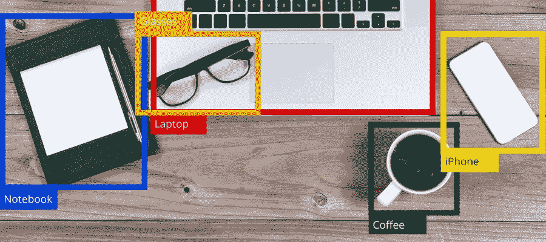
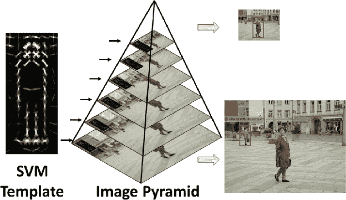
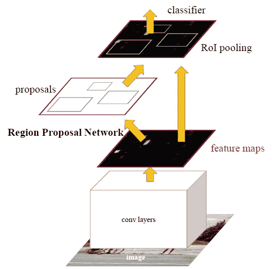
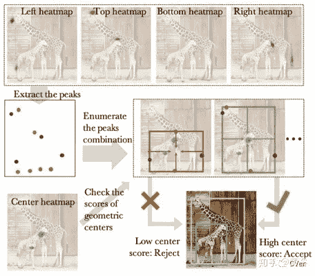

# 对象检测:简化

> 原文：<https://towardsdatascience.com/object-detection-simplified-e07aa3830954?source=collection_archive---------9----------------------->

## 让我们来看看计算机视觉中最著名的问题陈述之一

## 什么是物体检测？

目标检测是一个常见的计算机视觉问题，它处理在图像中识别和定位某些类别的目标。可以用各种方式解释对象定位，包括在对象周围创建边界框或标记图像中包含对象的每个像素(称为分割)。

Object Detection using bounding boxes

Object Segmentation by predicting pixel-level masks

## 回到过去..

甚至在 CNN 在计算机视觉中大受欢迎之前，就已经研究了对象检测。虽然 CNN 能够自动提取更复杂和更好的特征，但看一眼传统方法在最坏的情况下可能是一个小弯路，在最好的情况下是一个灵感。

深度学习之前的对象检测是一个分几个步骤的过程，首先是使用 SIFT、HOG 等技术进行边缘检测和特征提取。然后将这些图像与现有的物体模板进行比较，通常是在多尺度水平上，以检测和定位图像中存在的物体。

## 了解指标

**并集上的交集(IoU) :** 不能期望边界框预测在像素级上是精确的，因此需要为 2 个边界框之间的重叠范围定义度量。

Union 上的交集*确实如它所说的那样*。它取所涉及的两个边界框的交集的面积，并用它们的并集的面积除之。这提供了介于 0 和 1 之间的分数，表示两个框之间的重叠质量。

**平均精确度和平均召回率:**精确度考虑我们的预测有多准确，而召回率则考虑我们是否能够检测到图像中存在的所有对象。平均精度(AP)和平均召回率(AR)是用于对象检测的两个常用度量。

## 两步目标检测

既然我们已经享用了这道汤，那就让我们直接进入主菜吧！！两步目标检测包括首先识别可能包含目标的边界框，然后分别对每个边界进行分类的算法。

第一步需要一个*区域提议网络，*提供多个区域，然后将这些区域传递给基于通用 DL 的分类架构。从 rcnn 中的分层分组算法(非常慢)到在快速 rcnn 中使用 CNN 和 ROI 池以及在更快 rcnn 中使用锚点(从而加速流水线和端到端训练)，已经向这些区域提议网络(rpn)提供了许多不同的方法和变体。

已知这些算法比它们的一步目标检测对应物执行得更好，但是相比之下更慢。随着多年来提出的各种改进，两步目标检测网络的延迟的当前瓶颈是 RPN 步骤。关于基于 RPN 的物体检测的更多细节，你可以参考下面这个不错的博客。

 [## 使用深度学习方法的对象检测:端到端的理论观点

### 物体探测领域最有影响力的论文详解

towardsdatascience.com](/object-detection-using-deep-learning-approaches-an-end-to-end-theoretical-perspective-4ca27eee8a9a) 

## 一步目标检测

随着实时目标检测的需要，许多一步目标检测架构被提出，如 YOLO，YOLOv2，YOLOv3，SSD，RetinaNet 等。其试图将检测和分类步骤结合起来。

这些算法的主要成就之一是引入了“回归”边界框预测的思想。当每个边界框很容易用几个值(例如，xmin、xmax、ymin 和 ymax)来表示时，将检测和分类步骤结合起来就变得更容易，从而大大加快流水线的速度。

例如，YOLO 将整个图像分成更小的网格框。对于每个网格单元，它预测通过该网格单元的每个边界框的类概率和 x 和 y 坐标。有点像基于图像的验证码，你可以选择所有包含物体的小格子！！！

这些修改允许单步检测器运行得更快，且还可以在全局水平上工作。然而，由于它们不能单独作用于每个边界框，这可能导致它们在较小的对象或附近的类似对象的情况下表现更差。已经引入了多个新的体系结构来给予较低级别的特性更多的重视，从而试图提供一种平衡。

## 基于热图的对象检测

在某种意义上，基于热图的对象检测可以被认为是基于单镜头的对象检测的扩展。基于单镜头的对象检测算法试图直接回归边界框坐标(或偏移)，而基于热图的对象检测提供边界框角/中心的概率分布。

基于热图中这些角/中心峰值的定位，预测得到的边界框。由于可以为每个类别创建不同的热图，因此该方法还结合了检测和分类。虽然基于热图的对象检测目前正在引领新的研究，但它仍然没有传统的一次性对象检测算法快。这是因为这些算法需要更复杂的主干架构(CNN)来获得可观的精度。

## 下一步是什么？

虽然对象检测是一个不断发展的领域，这些年来已经有了各种改进，但是这个问题显然还没有完全解决。对象检测的方法多种多样，各有利弊，人们总是可以选择最适合自己要求的方法，因此目前还没有哪种算法主宰这个领域。

这个博客是为机器学习领域创建简化介绍的努力的一部分。点击此处的完整系列

 [## 机器学习:简化

### 在你一头扎进去之前就知道了

towardsdatascience.com](/machine-learning-simplified-1fe22fec0fac) 

*或者干脆阅读系列的下一篇博客*

 [## 知识蒸馏:简体

### 窥探师生网络的世界

towardsdatascience.com](/knowledge-distillation-simplified-dd4973dbc764) 

## 参考

*[1]林，宗毅，等.“微软 coco:情境中的公共对象”欧洲计算机视觉会议。施普林格，查姆，2014 年。
【2】基于 HOG 的高能效硬件实现，1080HD 60 fps，多尺度支持
【3】任，等，“更快的 r-cnn:面向区域建议网络的实时对象检测”神经信息处理系统进展。2015.
【4】Redmon，Joseph 等《你只看一次:统一的，实时的物体检测》。IEEE 计算机视觉和模式识别会议录。2016.
[5]刘，魏，等.“Ssd:单次多盒探测器”欧洲计算机视觉会议。施普林格，查姆，2016。
[6]周、邢毅、贾成卓、Philipp Krahenbuhl。"通过组合极值点和中心点的自下而上的物体检测."IEEE 计算机视觉和模式识别会议录。2019.*