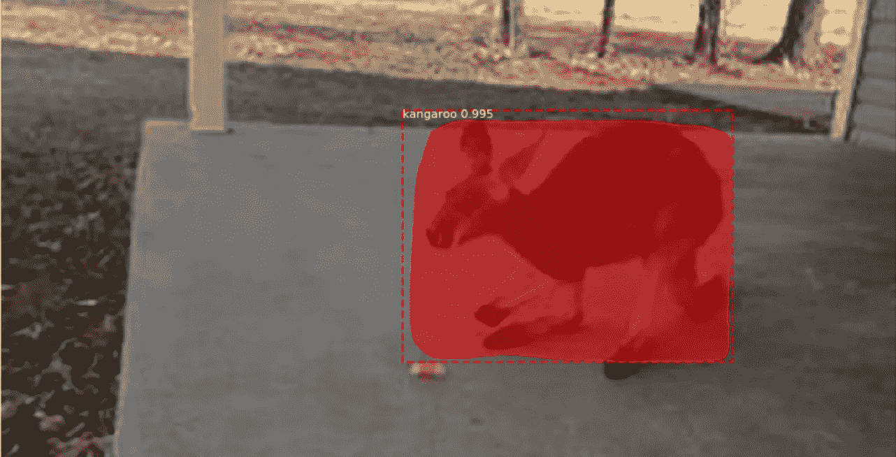

# 在定制数据集上使用掩模 R-CNN 的对象检测

> 原文：<https://towardsdatascience.com/object-detection-using-mask-r-cnn-on-a-custom-dataset-4f79ab692f6d?source=collection_archive---------2----------------------->

***在这篇文章中，我们将实现掩模 R-CNN，用于从自定义数据集*** 中检测对象

## 先决条件:

[计算机视觉:从 CNN 到面具 R-CC 和 YOLO 的旅程第一部分](/computer-vision-a-journey-from-cnn-to-mask-r-cnn-and-yolo-1d141eba6e04)

[计算机视觉:从 CNN 到面具之旅 R-CNN 和 YOLO 第二部分](/computer-vision-a-journey-from-cnn-to-mask-r-cnn-and-yolo-part-2-b0b9e67762b1)

[实例分割使用掩模 R-CNN](https://medium.com/@arshren/computer-vision-instance-segmentation-with-mask-r-cnn-7983502fcad1)

[迁移学习](/deep-learning-using-transfer-learning-cfbce1578659)

[使用 ResNet50 转移学习](https://medium.com/@arshren/deep-learning-using-transfer-learning-python-code-for-resnet50-8acdfb3a2d38)

## 数据集

[文章中使用了袋鼠数据集](https://github.com/experiencor/kangaroo)

## 屏蔽 R-CNN

Mask R-CNN 是用于实例分割的深度神经网络。该模型分为两部分

*   **区域提议网络(RPN)提出候选对象包围盒。**
*   **二进制掩码分类器，为每个类别生成掩码**


掩模 R-CNN 具有用于分类和包围盒回归的分支。它使用

*   ResNet101 架构从图像中提取特征。
*   区域提议网络(RPN)生成感兴趣区域(RoI)

# keras 中使用掩码 R-CNN 码的迁移学习

为此我们使用**[**matter port Mask R-CNN**](https://github.com/matterport/Mask_RCNN)**。****

****步骤 1:克隆屏蔽 R-CNN 库****

```
git clone [https://github.com/matterport/Mask_RCNN.git](https://github.com/matterport/Mask_RCNN.git)
cd Mask_RCNN
$ python setup.py install
```

****第二步:从**[**matter port**](https://github.com/matterport/Mask_RCNN/releases/download/v2.0/mask_rcnn_coco.h5)下载 COCO 模型的预训练权重。**

**将文件放在名为“mask_rcnn_coco.h5”的 Mask_RCNN 文件夹中**

****第三步:导入所需的库****

```
from mrcnn.config import Config
from mrcnn import model as modellib
from mrcnn import visualize
import mrcnn
from mrcnn.utils import Dataset
from mrcnn.model import MaskRCNNimport numpy as np
from numpy import zeros
from numpy import asarray
import colorsys
import argparse
import imutils
import random
import cv2
import os
import timefrom matplotlib import pyplot
from matplotlib.patches import Rectangle
from keras.models import load_model%matplotlib inlinefrom os import listdir
from xml.etree import ElementTree
```

****步骤 4:** 我们创建一个***myMaskRCNNConfig***类，用于在袋鼠数据集**上进行训练。**它是从基础***Mask R-CNN Config****类派生出来的，覆盖了一些值。***

```
***class myMaskRCNNConfig(Config):**
    # give the configuration a recognizable name
    **NAME = "MaskRCNN_config"**

    # set the number of GPUs to use along with the number of images
    # per GPU
    **GPU_COUNT = 1
    IMAGES_PER_GPU = 1**

    # number of classes (we would normally add +1 for the background)
     # kangaroo + BG
    **NUM_CLASSES = 1+1**

    # Number of training steps per epoch
    **STEPS_PER_EPOCH = 131**

    # Learning rate
    **LEARNING_RATE=0.006**

    # Skip detections with < 90% confidence
   ** DETECTION_MIN_CONFIDENCE = 0.9**

    # setting Max ground truth instances
    **MAX_GT_INSTANCES=10***
```

*****步骤 5:创建一个 *myMaskRCNNConfig* 类**的实例***

```
***config = myMaskRCNNConfig()***
```

***让我们显示所有的配置值。***

```
***config.display()***
```

******

***第六步:建立定制的袋鼠数据集。***

*****数据集类提供了一种一致的方式来处理任何数据集**。我们将为袋鼠数据集创建新的数据集进行训练，而无需更改模型的代码。***

***数据集类还支持同时加载多个数据集。当您想要检测不同的对象，而它们都不在一个数据集中时，这非常有用。***

***在 ***load_dataset*** 方法中，我们使用 ***add_class*** 和 ***add_image*** 方法遍历 image 和 annotations 文件夹中的所有文件来添加类、图像和注释以创建数据集。***

******extract _ boxes***方法从注释文件中提取每个边界框。注释文件是使用 pascal VOC 格式的 xml 文件。它返回盒子，它的高度和宽度***

******load_mask*** 方法为图像中的每个对象生成遮罩。它为每个实例和类 id 返回一个掩码，这是实例掩码的类 id 的 1D 数组***

******image _ reference***方法返回图像的路径***

```
***class KangarooDataset(Dataset)**:
    # load the dataset definitions
    **def load_dataset(self, dataset_dir, is_train=True)**:

        # Add classes. We have only one class to add.
        **self.add_class("dataset", 1, "kangaroo")**

        # define data locations for images and annotations
        images_dir = dataset_dir + '\\images\\'
        annotations_dir = dataset_dir + '\\annots\\'

        # Iterate through all files in the folder to 
        #add class, images and annotaions
        **for filename in listdir(images_dir):**

            # extract image id
            image_id = filename[:-4]

            # skip bad images
            if image_id in ['00090']:
                continue
            # skip all images after 150 if we are building the train set
            if is_train and int(image_id) >= 150:
                continue
            # skip all images before 150 if we are building the test/val set
            if not is_train and int(image_id) < 150:
                continue

            # setting image file
            **img_path = images_dir + filename**

            # setting annotations file
           ** ann_path = annotations_dir + image_id + '.xml'**

            # adding images and annotations to dataset
            **self.add_image('dataset', image_id=image_id, path=img_path, annotation=ann_path)**# extract bounding boxes from an annotation file
    **def extract_boxes(self, filename):**

        # load and parse the file
        tree = ElementTree.parse(filename)
        # get the root of the document
        root = tree.getroot()
       ** # extract each bounding box**
        boxes = list()
        **for box in root.findall('.//bndbox'):
            xmin = int(box.find('xmin').text)
            ymin = int(box.find('ymin').text)
            xmax = int(box.find('xmax').text)
            ymax = int(box.find('ymax').text)
            coors = [xmin, ymin, xmax, ymax]
            boxes.append(coors)**

        # extract image dimensions
       ** width = int(root.find('.//size/width').text)
        height = int(root.find('.//size/height').text)
        return boxes, width, height**# load the masks for an image
    """Generate instance masks for an image.
       Returns:
        masks: A bool array of shape [height, width, instance count] with
            one mask per instance.
        class_ids: a 1D array of class IDs of the instance masks.
     """
    **def load_mask(self, image_id):**
        # get details of image
        **info = self.image_info[image_id]**

        # define anntation  file location
        **path = info['annotation']**

        # load XML
        **boxes, w, h = self.extract_boxes(path)**

        # create one array for all masks, each on a different channel
        **masks = zeros([h, w, len(boxes)], dtype='uint8')**

        # create masks
        class_ids = list()
        **for i in range(len(boxes)):
            box = boxes[i]
            row_s, row_e = box[1], box[3]
            col_s, col_e = box[0], box[2]
            masks[row_s:row_e, col_s:col_e, i] = 1
            class_ids.append(self.class_names.index('kangaroo'))
        return masks, asarray(class_ids, dtype='int32')**# load an image reference
     """Return the path of the image."""
    **def image_reference(self, image_id):**
        **info = self.image_info[image_id]**
        print(info)
        **return info['path']***
```

*****第七步:准备列车和测试装置*****

```
*# prepare train set
**train_set = KangarooDataset()
train_set.load_dataset(‘..\\Kangaroo\\kangaroo-master\\kangaroo-master’, is_train=True)
train_set.prepare()**
print(‘Train: %d’ % len(train_set.image_ids))# prepare test/val set
**test_set = KangarooDataset()
test_set.load_dataset(‘..\\Kangaroo\\kangaroo-master\\kangaroo-master’, is_train=False)
test_set.prepare()**
print(‘Test: %d’ % len(test_set.image_ids))*
```

*****步骤 8:使用我们创建的配置实例**初始化*“训练”*的屏蔽 R-CNN 模型***

```
*print("Loading Mask R-CNN model...")
**model = modellib.MaskRCNN(mode="training", config=config, model_dir='./')***
```

*****步骤 9:从 COCO 数据集中加载掩模 R-CNN 的预训练权重，不包括最后几层*****

***我们从 ResNet101 的训练中排除了最后几层。排除最后的层是为了匹配新数据集中的类的数量。***

```
*#load the weights for COCO
model.load_weights('.\\Mask_RCNN\\mask_rcnn_coco.h5', 
                   by_name=True, 
                   exclude=["mrcnn_class_logits", "mrcnn_bbox_fc",  "mrcnn_bbox", "mrcnn_mask"])*
```

## ***第十步:训练学习率较高的头部，加快学习速度***

***我们可以通过提高学习速率来提高头层的学习速度***

***此外，我们可以将历元增加到 100–500 之间的任何值，并查看对象检测准确性的差异。我只用了 5 个纪元，因为我在 CPU 上训练它。***

```
*## train heads with higher lr to speedup the learning
model.train(train_set, test_set, learning_rate=2*config.LEARNING_RATE, epochs=5, layers=’heads’)history = model.keras_model.history.history*
```

******

*****步骤 11:保存自定义数据集的训练权重*****

```
*import time**model_path = '..\\Kangaroo\\kangaroo-master\\kangaroo-master\\mask_rcnn_'  + '.' + str(time.time()) + '.h5'****model.keras_model.save_weights(model_path)***
```

*****步骤 12:利用来自训练模型的遮罩和包围盒检测图像中的对象*****

***在推理模式下创建模型。从我们训练模型的数据集中加载模型的权重。***

***加载我们想要检测的图像的包围盒、类别和置信度百分比***

```
*from keras.preprocessing.image import load_img
from keras.preprocessing.image import img_to_array#Loading the model in the inference mode
**model = modellib.MaskRCNN(mode="inference", config=config, model_dir='./')**# loading the trained weights o the custom dataset
**model.load_weights(model_path, by_name=True)**img = load_img("..\\Kangaroo\\kangaroo-master\\kangaroo-master\\images\\00042.jpg")
img = img_to_array(img)# detecting objects in the image
**result= model.detect([img])***
```

***最后显示结果***

```
*image_id = 20
**image, image_meta, gt_class_id, gt_bbox, gt_mask =    modellib.load_image_gt(test_set, config, image_id, use_mini_mask=False)****info = test_set.image_info[image_id]**
print("image ID: {}.{} ({}) {}".format(info["source"], info["id"], image_id, 
                                       **test_set.image_reference(image_id)))**# Run object detection
**results = model.detect([image], verbose=1)**# Display results

**r = results[0]**
**visualize.display_instances(image, r['rois'], r['masks'], r['class_ids'], 
                            test_set.class_names, r['scores'], 
                            title="Predictions")***
```

******

## ***参考资料:***

***[](https://github.com/matterport/Mask_RCNN/) [## matterport/Mask_RCNN

### 这是 Mask R-CNN 在 Python 3、Keras 和 TensorFlow 上的实现。该模型生成边界框和…

github.com](https://github.com/matterport/Mask_RCNN/) 

[https://github . com/arshren/Mask _ RCNN/blob/master/Transfer % 20 learning % 20 Mask % 20 RCNN-Custom % 20 dataset . ipynb](https://github.com/arshren/Mask_RCNN/blob/master/Transfer%20Learning%20Mask%20RCNN-Custom%20dataset.ipynb)

[](https://engineering.matterport.com/splash-of-color-instance-segmentation-with-mask-r-cnn-and-tensorflow-7c761e238b46) [## 色彩的飞溅:使用掩膜 R-CNN 和张量流的实例分割

### 通过构建彩色飞溅滤镜来解释

engineering.matterport.com](https://engineering.matterport.com/splash-of-color-instance-segmentation-with-mask-r-cnn-and-tensorflow-7c761e238b46) 

[https://machine learning mastery . com/how-to-perform-object-detection-with-yolov 3-in-keras/](https://machinelearningmastery.com/how-to-perform-object-detection-with-yolov3-in-keras/)***