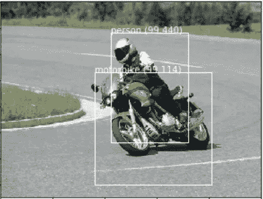
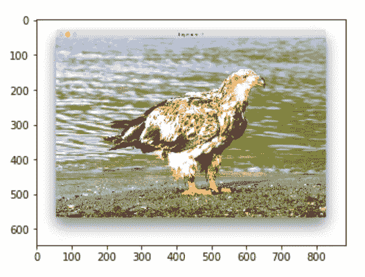
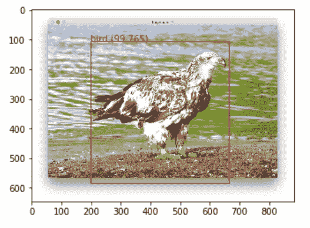

# 使用 Keras 的 YOLOv3 对象检测

> 原文：<https://towardsdatascience.com/object-detection-using-yolov3-using-keras-80bf35e61ce1?source=collection_archive---------3----------------------->

[***第一部分——CNN，R-CNN，快 R-CNN，更快 R-CNN***](https://medium.com/datadriveninvestor/computer-vision-a-journey-from-cnn-to-mask-r-cnn-and-yolo-1d141eba6e04)

[***第二部分——了解 YOLO、约洛夫 2、YOLO v3***](https://medium.com/@arshren/computer-vision-a-journey-from-cnn-to-mask-r-cnn-and-yolo-part-2-b0b9e67762b1)

这是本系列的第三篇文章，我们将使用 YOLOv3 预测边界框和类。代码可用[***github***](https://github.com/arshren/YOLOV3/blob/master/YOLO%20Step%20by%20Step.ipynb)



output from YOLO v3

> 你只需要看一次(YOLO)图像，就可以使用一个卷积网络来预测什么物体存在以及它们在哪里。YOLO 预测多个边界框和这些框的类别概率。

这段代码将使用 yolo v3 中预先训练的权重，然后使用 keras 库预测边界框和类概率

该代码受到 experiencor 的 keras-yolo3 projec 的强烈启发，用于使用 YOLOv3 模型执行对象检测。代码是将代码分解成简单的步骤，使用 yolov3 模型来预测边界框和类。[原始代码可从 Huynh Ngoc Anh 的 github 获得](https://github.com/experiencor/keras-yolo3/blob/master/yolo3_one_file_to_detect_them_all.py)。 **Yolo3 预训练权重可从** [**YOLOv3 预训练权重**](https://pjreddie.com/media/files/yolov3.weights) **下载。**

YOLOv3 模型使用预先训练的权重来解决标准对象检测问题，如袋鼠数据集、浣熊数据集、红细胞检测等。该模型将用于新图像上的对象检测。

**第一步:**导入所需的库

```
import os
import scipy.io
import scipy.misc
import numpy as np
import pandas as pd
import PIL
import struct
import cv2
from numpy import expand_dimsimport tensorflow as tf
from skimage.transform import resize
from keras import backend as K
from keras.layers import Input, Lambda, Conv2D, BatchNormalization, LeakyReLU, ZeroPadding2D, UpSampling2Dfrom keras.models import load_model, Model
from keras.layers.merge import add, concatenate
from keras.preprocessing.image import load_img
from keras.preprocessing.image import img_to_arrayimport matplotlib.pyplot as plt
from matplotlib.pyplot import imshow
from matplotlib.patches import Rectangle
%matplotlib inline
```

**第二步:创建一个类 WeightReader 来加载 yolov3** 的预训练权重

WeightReader 类将解析该文件并将模型权重加载到内存中，以在我们的 Keras 模型中设置它。

```
# class to load the pretrained Weights
**class WeightReader:**
    **def __init__(self, weight_file)**:
        with open(weight_file, 'rb') as w_f:
            major,    = struct.unpack('i', w_f.read(4))
            minor,    = struct.unpack('i', w_f.read(4))
            revision, = struct.unpack('i', w_f.read(4))if (major*10 + minor) >= 2 and major < 1000 and minor < 1000:
                w_f.read(8)
            else:
                w_f.read(4)transpose = (major > 1000) or (minor > 1000)

            binary = w_f.read()self.offset = 0
        self.all_weights = np.frombuffer(binary, dtype='float32')

    **def read_bytes(self, size)**:
        self.offset = self.offset + size
        return self.all_weights[self.offset-size:self.offset]**def load_weights(self, model):**
        for i in range(106):
            try:
                conv_layer = model.get_layer('conv_' + str(i))
                print("loading weights of convolution #" + str(i))if i not in [81, 93, 105]:
                    norm_layer = model.get_layer('bnorm_' + str(i))size = np.prod(norm_layer.get_weights()[0].shape)beta  = self.read_bytes(size) # bias
                    gamma = self.read_bytes(size) # scale
                    mean  = self.read_bytes(size) # mean
                    var   = self.read_bytes(size) # varianceweights = norm_layer.set_weights([gamma, beta, mean, var])if len(conv_layer.get_weights()) > 1:
                    bias   = self.read_bytes(np.prod(conv_layer.get_weights()[1].shape))
                    kernel = self.read_bytes(np.prod(conv_layer.get_weights()[0].shape))

                    kernel = kernel.reshape(list(reversed(conv_layer.get_weights()[0].shape)))
                    kernel = kernel.transpose([2,3,1,0])
                    conv_layer.set_weights([kernel, bias])
                else:
                    kernel = self.read_bytes(np.prod(conv_layer.get_weights()[0].shape))
                    kernel = kernel.reshape(list(reversed(conv_layer.get_weights()[0].shape)))
                    kernel = kernel.transpose([2,3,1,0])
                    conv_layer.set_weights([kernel])
            except ValueError:
                print("no convolution #" + str(i))     

    def reset(self):
        self.offset = 0
```

**第三步:创建 Yolo v3 模型。**

我们首先创建一个函数来创建卷积块

```
**def _conv_block(inp, convs, skip=True):**
    x = inp
    count = 0

    for conv in convs:
        if count == (len(convs) - 2) and skip:
            skip_connection = x
        count += 1

        if conv['stride'] > 1: x = ZeroPadding2D(((1,0),(1,0)))(x) # peculiar padding as darknet prefer left and top
        x = Conv2D(conv['filter'], 
                   conv['kernel'], 
                   strides=conv['stride'], 
                   padding='valid' if conv['stride'] > 1 else 'same', # peculiar padding as darknet prefer left and top
                   name='conv_' + str(conv['layer_idx']), 
                   use_bias=False if conv['bnorm'] else True)(x)
        if conv['bnorm']: x = BatchNormalization(epsilon=0.001, name='bnorm_' + str(conv['layer_idx']))(x)
        if conv['leaky']: x = LeakyReLU(alpha=0.1, name='leaky_' + str(conv['layer_idx']))(x)return add([skip_connection, x]) if skip else x
```

接下来，我们创建一个有 108 个卷积层的**暗网**。我在 CPU 上运行它，在 GPU 上它几乎快了 500 倍

```
**# creating the YOLO model**
def make_yolov3_model():
    input_image = Input(shape=(None, None, 3))# Layer  0 => 4
    x = _conv_block(input_image, [{'filter': 32, 'kernel': 3, 'stride': 1, 'bnorm': True, 'leaky': True, 'layer_idx': 0},
                                  {'filter': 64, 'kernel': 3, 'stride': 2, 'bnorm': True, 'leaky': True, 'layer_idx': 1},
                                  {'filter': 32, 'kernel': 1, 'stride': 1, 'bnorm': True, 'leaky': True, 'layer_idx': 2},
                                  {'filter': 64, 'kernel': 3, 'stride': 1, 'bnorm': True, 'leaky': True, 'layer_idx': 3}])# Layer  5 => 8
    x = _conv_block(x, [{'filter': 128, 'kernel': 3, 'stride': 2, 'bnorm': True, 'leaky': True, 'layer_idx': 5},
                        {'filter':  64, 'kernel': 1, 'stride': 1, 'bnorm': True, 'leaky': True, 'layer_idx': 6},
                        {'filter': 128, 'kernel': 3, 'stride': 1, 'bnorm': True, 'leaky': True, 'layer_idx': 7}])# Layer  9 => 11
    x = _conv_block(x, [{'filter':  64, 'kernel': 1, 'stride': 1, 'bnorm': True, 'leaky': True, 'layer_idx': 9},
                        {'filter': 128, 'kernel': 3, 'stride': 1, 'bnorm': True, 'leaky': True, 'layer_idx': 10}])# Layer 12 => 15
    x = _conv_block(x, [{'filter': 256, 'kernel': 3, 'stride': 2, 'bnorm': True, 'leaky': True, 'layer_idx': 12},
                        {'filter': 128, 'kernel': 1, 'stride': 1, 'bnorm': True, 'leaky': True, 'layer_idx': 13},
                        {'filter': 256, 'kernel': 3, 'stride': 1, 'bnorm': True, 'leaky': True, 'layer_idx': 14}])# Layer 16 => 36
    for i in range(7):
        x = _conv_block(x, [{'filter': 128, 'kernel': 1, 'stride': 1, 'bnorm': True, 'leaky': True, 'layer_idx': 16+i*3},
                            {'filter': 256, 'kernel': 3, 'stride': 1, 'bnorm': True, 'leaky': True, 'layer_idx': 17+i*3}])

    skip_36 = x

    # Layer 37 => 40
    x = _conv_block(x, [{'filter': 512, 'kernel': 3, 'stride': 2, 'bnorm': True, 'leaky': True, 'layer_idx': 37},
                        {'filter': 256, 'kernel': 1, 'stride': 1, 'bnorm': True, 'leaky': True, 'layer_idx': 38},
                        {'filter': 512, 'kernel': 3, 'stride': 1, 'bnorm': True, 'leaky': True, 'layer_idx': 39}])# Layer 41 => 61
    for i in range(7):
        x = _conv_block(x, [{'filter': 256, 'kernel': 1, 'stride': 1, 'bnorm': True, 'leaky': True, 'layer_idx': 41+i*3},
                            {'filter': 512, 'kernel': 3, 'stride': 1, 'bnorm': True, 'leaky': True, 'layer_idx': 42+i*3}])

    skip_61 = x

    # Layer 62 => 65
    x = _conv_block(x, [{'filter': 1024, 'kernel': 3, 'stride': 2, 'bnorm': True, 'leaky': True, 'layer_idx': 62},
                        {'filter':  512, 'kernel': 1, 'stride': 1, 'bnorm': True, 'leaky': True, 'layer_idx': 63},
                        {'filter': 1024, 'kernel': 3, 'stride': 1, 'bnorm': True, 'leaky': True, 'layer_idx': 64}])# Layer 66 => 74
    for i in range(3):
        x = _conv_block(x, [{'filter':  512, 'kernel': 1, 'stride': 1, 'bnorm': True, 'leaky': True, 'layer_idx': 66+i*3},
                            {'filter': 1024, 'kernel': 3, 'stride': 1, 'bnorm': True, 'leaky': True, 'layer_idx': 67+i*3}])

    # Layer 75 => 79
    x = _conv_block(x, [{'filter':  512, 'kernel': 1, 'stride': 1, 'bnorm': True, 'leaky': True, 'layer_idx': 75},
                        {'filter': 1024, 'kernel': 3, 'stride': 1, 'bnorm': True, 'leaky': True, 'layer_idx': 76},
                        {'filter':  512, 'kernel': 1, 'stride': 1, 'bnorm': True, 'leaky': True, 'layer_idx': 77},
                        {'filter': 1024, 'kernel': 3, 'stride': 1, 'bnorm': True, 'leaky': True, 'layer_idx': 78},
                        {'filter':  512, 'kernel': 1, 'stride': 1, 'bnorm': True, 'leaky': True, 'layer_idx': 79}], skip=False)# Layer 80 => 82
    yolo_82 = _conv_block(x, [{'filter': 1024, 'kernel': 3, 'stride': 1, 'bnorm': True,  'leaky': True,  'layer_idx': 80},
                              {'filter':  255, 'kernel': 1, 'stride': 1, 'bnorm': False, 'leaky': False, 'layer_idx': 81}], skip=False)# Layer 83 => 86
    x = _conv_block(x, [{'filter': 256, 'kernel': 1, 'stride': 1, 'bnorm': True, 'leaky': True, 'layer_idx': 84}], skip=False)
    x = UpSampling2D(2)(x)
    x = concatenate([x, skip_61])# Layer 87 => 91
    x = _conv_block(x, [{'filter': 256, 'kernel': 1, 'stride': 1, 'bnorm': True, 'leaky': True, 'layer_idx': 87},
                        {'filter': 512, 'kernel': 3, 'stride': 1, 'bnorm': True, 'leaky': True, 'layer_idx': 88},
                        {'filter': 256, 'kernel': 1, 'stride': 1, 'bnorm': True, 'leaky': True, 'layer_idx': 89},
                        {'filter': 512, 'kernel': 3, 'stride': 1, 'bnorm': True, 'leaky': True, 'layer_idx': 90},
                        {'filter': 256, 'kernel': 1, 'stride': 1, 'bnorm': True, 'leaky': True, 'layer_idx': 91}], skip=False)# Layer 92 => 94
    yolo_94 = _conv_block(x, [{'filter': 512, 'kernel': 3, 'stride': 1, 'bnorm': True,  'leaky': True,  'layer_idx': 92},
                              {'filter': 255, 'kernel': 1, 'stride': 1, 'bnorm': False, 'leaky': False, 'layer_idx': 93}], skip=False)# Layer 95 => 98
    x = _conv_block(x, [{'filter': 128, 'kernel': 1, 'stride': 1, 'bnorm': True, 'leaky': True,   'layer_idx': 96}], skip=False)
    x = UpSampling2D(2)(x)
    x = concatenate([x, skip_36])# Layer 99 => 106
    yolo_106 = _conv_block(x, [{'filter': 128, 'kernel': 1, 'stride': 1, 'bnorm': True,  'leaky': True,  'layer_idx': 99},
                               {'filter': 256, 'kernel': 3, 'stride': 1, 'bnorm': True,  'leaky': True,  'layer_idx': 100},
                               {'filter': 128, 'kernel': 1, 'stride': 1, 'bnorm': True,  'leaky': True,  'layer_idx': 101},
                               {'filter': 256, 'kernel': 3, 'stride': 1, 'bnorm': True,  'leaky': True,  'layer_idx': 102},
                               {'filter': 128, 'kernel': 1, 'stride': 1, 'bnorm': True,  'leaky': True,  'layer_idx': 103},
                               {'filter': 256, 'kernel': 3, 'stride': 1, 'bnorm': True,  'leaky': True,  'layer_idx': 104},
                               {'filter': 255, 'kernel': 1, 'stride': 1, 'bnorm': False, 'leaky': False, 'layer_idx': 105}], skip=False)model = Model(input_image, [yolo_82, yolo_94, yolo_106])    
    return model
```

**步骤 4:我们现在创建 yolo 模型并加载预训练的权重**

```
**# create the yolo v3**
yolov3 = make_yolov3_model()**# load the weights trained on COCO into the model**weight_reader = WeightReader(‘yolov3.weights’)
weight_reader.load_weights(yolov3)
```

**第五步:设置变量。**

Yolov3 的输入图像大小是 416 x 416，我们使用 net_h 和 net_w 来设置。

对象阈值设定为 0.5，非最大抑制阈值设定为 0.45

我们设置锚框，然后为上下文中的公共对象(COCO)模型定义 80 个标签以进行预测

```
**net_h, net_w = 416, 416****obj_thresh, nms_thresh = 0.5, 0.45****anchors** = [[116,90, 156,198, 373,326], [30,61, 62,45, 59,119], [10,13, 16,30, 33,23]]**labels** = [“person”, “bicycle”, “car”, “motorbike”, “aeroplane”, “bus”, “train”, “truck”, “boat”, “traffic light”, “fire hydrant”, “stop sign”, “parking meter”, “bench”, “bird”, “cat”, “dog”, “horse”, “sheep”, “cow”, “elephant”, “bear”, “zebra”, “giraffe”, \
 “backpack”, “umbrella”, “handbag”, “tie”, “suitcase”, “frisbee”, “skis”, “snowboard”, “sports ball”, “kite”, “baseball bat”, “baseball glove”, “skateboard”, “surfboard”, “tennis racket”, “bottle”, “wine glass”, “cup”, “fork”, “knife”, “spoon”, “bowl”, “banana”, “apple”, “sandwich”, “orange”, “broccoli”, “carrot”, “hot dog”, “pizza”, “donut”, “cake”, “chair”, “sofa”, “pottedplant”, “bed”, “diningtable”, “toilet”, “tvmonitor”, “laptop”, “mouse”, \
 “remote”, “keyboard”, “cell phone”, “microwave”, “oven”, “toaster”, “sink”, “refrigerator”, “book”, “clock”, “vase”, “scissors”, “teddy bear”, “hair drier”, “toothbrush”]
```

**第六步:将图像加载到右边 416 x 416 的输入形状**

```
from numpy import expand_dimsdef **load_image_pixels(filename, shape)**:
 # load the image to get its shape
 image = load_img(filename)
 width, height = image.size

# load the image with the required size
 image = load_img(filename, target_size=shape) # convert to numpy array
 image = img_to_array(image)

# scale pixel values to [0, 1]
 image = image.astype(‘float32’)
 image /= 255.0

# add a dimension so that we have one sample
 image = expand_dims(image, 0)
 **return image, width, height**
```

步骤 7:为边界框创建一个类。

BoundBox 在输入图像形状和类别概率的上下文中定义每个边界框的角。

```
**class BoundBox:**
 **def __init__**(self, xmin, ymin, xmax, ymax, objness = None, classes = None):
 self.xmin = xmin
 self.ymin = ymin
 self.xmax = xmax
 self.ymax = ymax

 self.objness = objness
 self.classes = classesself.label = -1
 self.score = -1**def get_label(self)**:
 if self.label == -1:
 self.label = np.argmax(self.classes)

 return self.label

 **def get_score(self)**:
 if self.score == -1:
 self.score = self.classes[self.get_label()]

 return self.score
```

**步骤 8:为**定义函数

*   间隔重叠-检查两个间隔是否重叠。当一个间隔在另一个间隔开始之前结束时，两个间隔不重叠。
*   两个盒子的并集交集(IoU)
*   非最大抑制，将包含对象的框以及非最大阈值作为参数
*   Sigmoid 函数

```
**def _sigmoid(x)**:
 return 1\. / (1\. + np.exp(-x))**def _interval_overlap(interval_a, interval_b**):
 x1, x2 = interval_a
 x3, x4 = interval_bif x3 < x1:
 if x4 < x1:
 return 0
 else:
 return min(x2,x4) — x1
 else:
 if x2 < x3:
 return 0
 else:
 return min(x2,x4) — x3

**def bbox_iou(box1, box2**):
 intersect_w = _interval_overlap([box1.xmin, box1.xmax], [box2.xmin, box2.xmax])
 intersect_h = _interval_overlap([box1.ymin, box1.ymax], [box2.ymin, box2.ymax])

 intersect = intersect_w * intersect_hw1, h1 = box1.xmax-box1.xmin, box1.ymax-box1.ymin
 w2, h2 = box2.xmax-box2.xmin, box2.ymax-box2.ymin

 union = w1*h1 + w2*h2 — intersect

 return float(intersect) / union**def do_nms(boxes, nms_thresh)**:
 if len(boxes) > 0:
 nb_class = len(boxes[0].classes)
 else:
 return

 for c in range(nb_class):
 sorted_indices = np.argsort([-box.classes[c] for box in boxes])for i in range(len(sorted_indices)):
 index_i = sorted_indices[i]if boxes[index_i].classes[c] == 0: continuefor j in range(i+1, len(sorted_indices)):
 index_j = sorted_indices[j]if bbox_iou(boxes[index_i], boxes[index_j]) >= nms_thresh:
 boxes[index_j].classes[c] = 0
```

**第九步:解码网络的输出。**

我们将遍历 NumPy 数组中的每一个，一次一个，并基于对象阈值解码候选边界框和类预测。

前 4 个元素将是边界框的坐标，第 5 个元素将是对象分数，后跟类别概率

```
**def decode_netout(netout, anchors, obj_thresh, net_h, net_w):**
 grid_h, grid_w = netout.shape[:2]
 nb_box = 3
 netout = netout.reshape((grid_h, grid_w, nb_box, -1))
 nb_class = netout.shape[-1] — 5boxes = [] netout[…, :2] = _sigmoid(netout[…, :2])
 netout[…, 4:] = _sigmoid(netout[…, 4:])
 netout[…, 5:] = netout[…, 4][…, np.newaxis] * netout[…, 5:]
 netout[…, 5:] *= netout[…, 5:] > obj_threshfor i in range(grid_h*grid_w):
 row = i / grid_w
 col = i % grid_w

 for b in range(nb_box):
 # 4th element is objectness score
 objectness = netout[int(row)][int(col)][b][4]
 #objectness = netout[…, :4]

 if(objectness.all() <= obj_thresh): continue

 # first 4 elements are x, y, w, and h
 x, y, w, h = netout[int(row)][int(col)][b][:4]x = (col + x) / grid_w # center position, unit: image width
 y = (row + y) / grid_h # center position, unit: image height
 w = anchors[2 * b + 0] * np.exp(w) / net_w # unit: image width
 h = anchors[2 * b + 1] * np.exp(h) / net_h # unit: image height 

 # last elements are class probabilities
 classes = netout[int(row)][col][b][5:]

 **box = BoundBox(x-w/2, y-h/2, x+w/2, y+h/2, objectness, classes)** boxes.append(box)**return boxes**
```

**步骤 10:纠正 Yolo 框。**

我们有边界框，但它们需要被拉伸回原始图像的形状。这将允许绘制原始图像和边界框，检测真实对象。

```
 **def correct_yolo_boxes(boxes, image_h, image_w, net_h, net_w):**
 if (float(net_w)/image_w) < (float(net_h)/image_h):
 new_w = net_w
 new_h = (image_h*net_w)/image_w
 else:
 new_h = net_w
 new_w = (image_w*net_h)/image_h

 for i in range(len(boxes)):
 x_offset, x_scale = (net_w — new_w)/2./net_w, float(new_w)/net_w
 y_offset, y_scale = (net_h — new_h)/2./net_h, float(new_h)/net_h

 boxes[i].xmin = int((boxes[i].xmin — x_offset) / x_scale * image_w)
 boxes[i].xmax = int((boxes[i].xmax — x_offset) / x_scale * image_w)
 boxes[i].ymin = int((boxes[i].ymin — y_offset) / y_scale * image_h)
 boxes[i].ymax = int((boxes[i].ymax — y_offset) / y_scale * image_h)
```

步骤 11:获取所有高于指定阈值的盒子。

***get_boxes*** 函数将盒子、标签和阈值的列表作为参数，并返回盒子、标签和分数的并行列表。

```
 **def get_boxes(boxes, labels, thresh):**
    v_boxes, v_labels, v_scores = list(), list(), list()
    # enumerate all boxes
    for box in boxes:
        # enumerate all possible labels
        for i in range(len(labels)):
            # check if the threshold for this label is high enough
            if box.classes[i] > thresh:
                v_boxes.append(box)
                v_labels.append(labels[i])
                v_scores.append(box.classes[i]*100)
                # don't break, many labels may trigger for one box
    return v_boxes, v_labels, v_scores
```

步骤 12:在图像中的物体周围画一个白框。

```
from matplotlib.patches import Rectangle**def draw_boxes(filename, v_boxes, v_labels, v_scores):**

# load the image
 data = plt.imread(filename)

# plot the image
 plt.imshow(data)

# get the context for drawing boxes
 ax = plt.gca()

# plot each box
 for i in range(len(v_boxes)):box = v_boxes[i]
        # get coordinates
        y1, x1, y2, x2 = box.ymin, box.xmin, box.ymax, box.xmax
        # calculate width and height of the box
        width, height = x2 - x1, y2 - y1
        # create the shape
        rect = Rectangle((x1, y1), width, height, fill=False, color='red')
        # draw the box
        ax.add_patch(rect)
        # draw text and score in top left corner
        label = "%s (%.3f)" % (v_labels[i], v_scores[i])
        plt.text(x1, y1, label, color='red')
    # show the plot
plt.show()
```

最后，我们结合代码对新图像进行预测。

首先我们使用***load _ image _ pixels()***函数将图像加载到 416 x 416 的输入形状中。

预测盒子起诉 yolov 3**T23 预测()**方法

Yolov3 模型将预测同一对象的多个框。

然后，我们使用***decode _ netout()***函数基于对象阈值对候选包围盒和类别预测进行解码

我们通过使用***correct _ yolo _ boxes()***函数来校正边界框，以将其拉伸回原始图像的形状

边界框将根据 IoU 定义的重叠进行过滤，然后使用 ***do_nms()*** 函数应用非最大值抑制。

我们使用 ***get_boxes()*** 得到高于指定类阈值 0.6 的盒子，然后使用 ***draw_boxes()*** 函数在图像上绘制这些盒子。

```
# define our new image
photo_filename = 'eagle.png'# load and prepare image
image, image_w, image_h = **load_image_pixels**(photo_filename, (net_w, net_w))# make prediction
**yolos = yolov3.predict(image)**# summarize the shape of the list of arrays
print([a.shape for a in yolos])# define the anchors
anchors = [[116,90, 156,198, 373,326], [30,61, 62,45, 59,119], [10,13, 16,30, 33,23]]# define the probability threshold for detected objects
class_threshold = 0.6boxes = list()for i in range(len(yolos)):
        # decode the output of the network
    boxes += ***decode_netout***(yolos[i][0], anchors[i], obj_thresh, nms_thresh, net_h, net_w)# correct the sizes of the bounding boxes
**correct_yolo_boxes(boxes, image_h, image_w, net_h, net_w)**# suppress non-maximal boxes
**do_nms**(boxes, nms_thresh)# get the details of the detected objects
v_boxes, v_labels, v_scores = **get_boxes**(boxes, labels, class_threshold)
# summarize what we found
for i in range(len(v_boxes)):
    print(v_labels[i], v_scores[i])
# draw what we found
**draw_boxes**(photo_filename, v_boxes, v_labels, v_scores)
```

原象



绘制边界框和类后的图像



代码可从 [Github](https://github.com/arshren/YOLOV3/blob/master/YOLO%20Step%20by%20Step.ipynb) 获得

## 参考资料:

[YOLO V3 论文](https://pjreddie.com/media/files/papers/YOLOv3.pdf)作者约瑟夫·雷德蒙、阿里·法尔哈迪

[https://pjreddie.com/darknet/yolo/](https://pjreddie.com/darknet/yolo/)

[](https://github.com/experiencor/keras-yolo3) [## experiencor/keras-yolo3

### 从 https://pjreddie.com/media/files/yolov3.weights. python 中抓取 yolo3 的预训练重量…

github.com](https://github.com/experiencor/keras-yolo3) [](https://machinelearningmastery.com/how-to-perform-object-detection-with-yolov3-in-keras/) [## 如何在 Keras 中使用 YOLOv3 执行对象检测

### 目标检测是计算机视觉中的一项任务，涉及识别一个或多个目标的存在、位置和类型

machinelearningmastery.com](https://machinelearningmastery.com/how-to-perform-object-detection-with-yolov3-in-keras/)