# 使用 python 通过基于颜色的图像分割进行目标检测

> 原文：<https://towardsdatascience.com/object-detection-via-color-based-image-segmentation-using-python-e9b7c72f0e11?source=collection_archive---------3----------------------->

## 使用 python 和 OpenCV 绘制轮廓的教程。

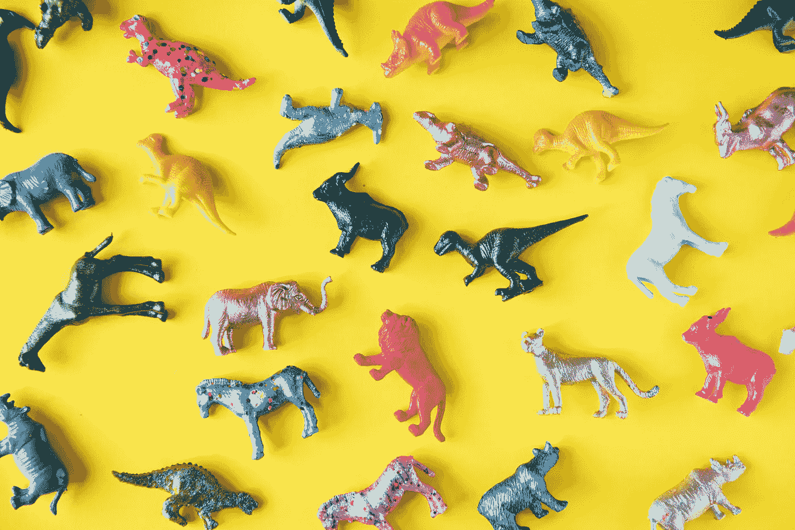

Photo by rawpixel.com from Pexels

# 入门指南

如果你已经安装了 jupyter notebook 或者可以运行 python & OpenCV 的 IDE，只需跳到**执行。**

## 工具

我们今天的英雄是[蟒蛇](https://www.anaconda.com/)。一个免费的开源发行版帮助安装不同的软件包&把它们的混乱整理到隔离的环境中。

关于蟒蛇，维基百科的告诉了我们什么

> Anaconda 是用于科学计算(数据科学、机器学习应用、大规模数据处理、预测分析等)的 Python 和 R 编程语言的免费开源发行版。)，**旨在简化包管理和部署**。包版本由包管理系统 *conda* 管理。Anaconda 发行版有 1200 多万用户使用，它包含 1400 多个适用于 Windows、Linux 和 MacOS 的流行数据科学包。

下面是关于如何下载 Anaconda 的详细教程。
[anaconda for Windows](https://docs.anaconda.com/anaconda/install/windows/)&[anaconda for Linux。](https://docs.anaconda.com/anaconda/install/linux/)

## 创造环境

打开 bash (cmd)并键入以下内容

```
$ conda create -n myEnv python=3
```

当提示下载软件包时，键入 **y** (表示是)。

```
$ source activate myEnv
$ conda install anaconda
$ conda activate myEnv
$ conda install opencv$ jupyter notebook
```

这将为您在浏览器中打开 jupyter 笔记本。

# 一些重要术语

## 轮廓

轮廓可以简单地解释为连接所有连续点(连同边界)的曲线，具有相同的颜色或强度。轮廓是形状分析和物体检测与识别的有用工具。

## 阈值

对灰度图像应用阈值处理使其成为二值图像。您可以设置一个阈值，低于该阈值的所有值都变成黑色，高于该阈值的所有值都变成白色。

# 执行

现在，您已经拥有了开始工作所需的一切。
我们将从一个简单的例子开始，向您展示基于颜色的分割是如何工作的。

耐心听我说，直到我们找到好东西。

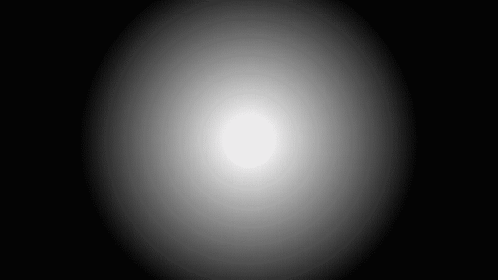

An Ombre circle — image made using photoshop

如果你想和我一起试试这个，你可以从这里免费得到这张图片。在下面的代码中，我将把这张图片分割成 17 个灰度级。然后用等高线测量每一层的面积。

```
import cv2
import numpy as npdef viewImage(image):
    cv2.namedWindow('Display', cv2.WINDOW_NORMAL)
    cv2.imshow('Display', image)
    cv2.waitKey(0)
    cv2.destroyAllWindows()def grayscale_17_levels (image):
    high = 255
    while(1):  
        low = high - 15
        col_to_be_changed_low = np.array([low])
        col_to_be_changed_high = np.array([high])
        curr_mask = cv2.inRange(gray, col_to_be_changed_low,col_to_be_changed_high)
        gray[curr_mask > 0] = (high)
        high -= 15
        if(low == 0 ):
            breakimage = cv2.imread('./path/to/image')
viewImage(image)
gray = cv2.cvtColor(image, cv2.COLOR_BGR2GRAY)
grayscale_17_levels(gray)
viewImage(gray)
```

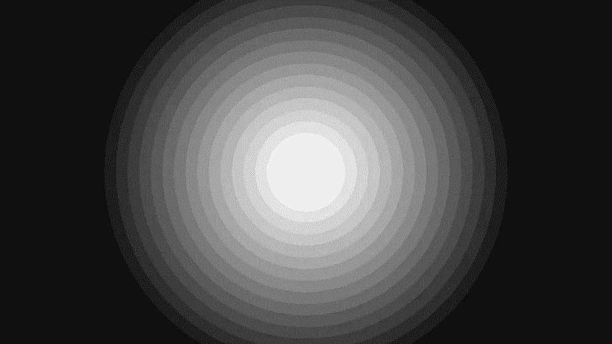

The same image segmented into 17 gray levels

```
def get_area_of_each_gray_level(im):## convert image to gray scale (must br done before contouring)
    image = cv2.cvtColor(im, cv2.COLOR_BGR2GRAY)
    output = []
    high = 255
    first = True
    while(1):low = high - 15
        if(first == False):# making values that are of a greater gray level black 
            ## so it won't get detected  
            to_be_black_again_low = np.array([high])
            to_be_black_again_high = np.array([255])
            curr_mask = cv2.inRange(image, to_be_black_again_low, 
            to_be_black_again_high)
            image[curr_mask > 0] = (0)

        # making values of this gray level white so we can calculate
        # it's area
        ret, threshold = cv2.threshold(image, low, 255, 0)
        contours, hirerchy = cv2.findContours(threshold, 
        cv2.RETR_LIST, cv2.CHAIN_APPROX_NONE)if(len(contours) > 0):output.append([cv2.contourArea(contours[0])])
            cv2.drawContours(im, contours, -1, (0,0,255), 3)high -= 15
        first = False
        if(low == 0 ):breakreturn output
```

在这个函数中，我简单地转换了我想要在这个迭代中轮廓化(突出显示)的灰度范围，将所有在这个范围内的灰度统一为一个灰度。我把除了这个范围之外的所有强度都变成黑色(包括更大和更小的强度)。第二步，我对图像进行阈值处理，这样现在只有我想要轮廓的颜色显示为白色，其他颜色都转换为黑色。这一步在这里变化不大，但必须完成，因为轮廓绘制在黑白(阈值)图像上效果最好。
在应用该步骤(阈值处理)之前，下图将是相同的，除了白色环将是灰色的(第 10 个灰度级的灰度(255–15 * 10))

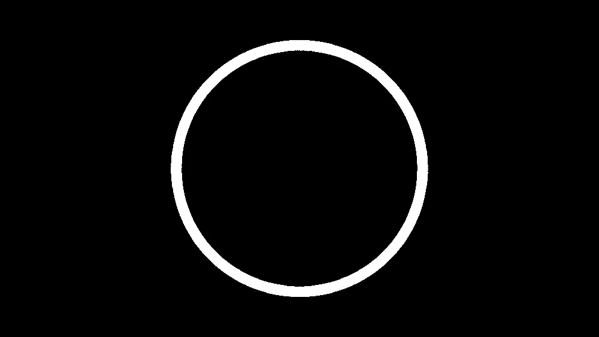

The 10th segment appear alone to be able to calculate its area

```
image = cv2.imread('./path/to/image')
print(get_area_of_each_gray_level(image))
viewImage(image)
```

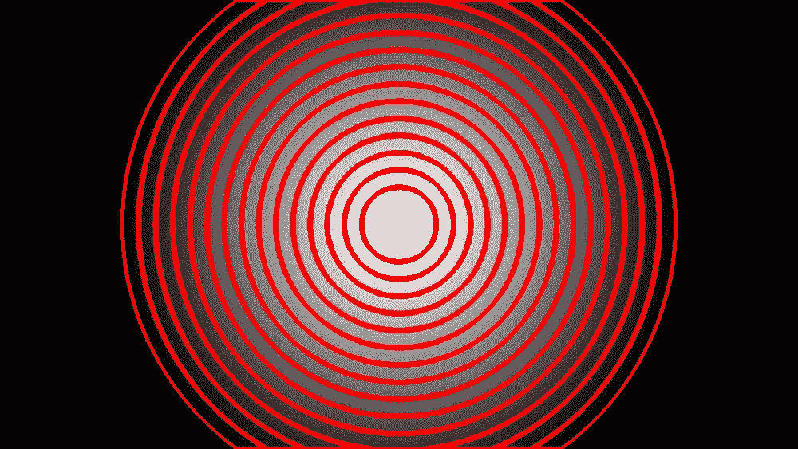

Contours of the 17 gray levels onto the original image

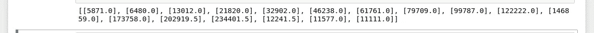

Array containing the value of the areas

这样我们就获得了每个灰度级的面积。

# 这真的很重要吗？

在我们继续之前，我想强调一下这个话题的重要性。
我是一名计算机工程专业的学生，我正在从事一个名为**用于智能肿瘤检测和识别的机器学习项目**。
本项目使用基于颜色的图像分割来帮助计算机学习如何检测肿瘤。当处理 MRI 扫描时，程序必须检测所述 MRI 扫描的癌症水平。它通过将扫描分为不同的灰度级来实现，其中最暗的部分充满癌细胞，最接近白色的部分是健康的部分。然后计算肿瘤对每个灰度级的隶属度。有了这些信息，程序就能够识别肿瘤及其阶段。
这个项目基于软计算、模糊逻辑&机器学习，你可以在[模糊逻辑上了解更多信息，以及它是如何治愈癌症的](/fuzzy-logic-and-how-it-is-curing-cancer-dc6bcc961ded)。

# 目标检测

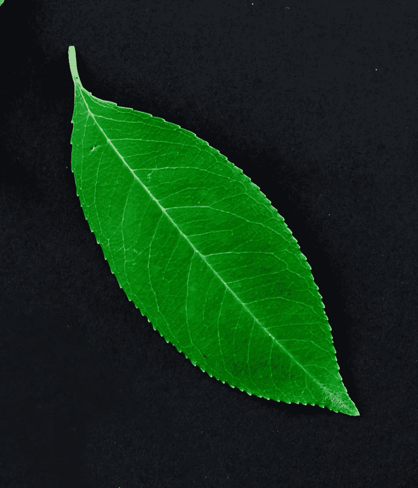

Photo by [Lukas](https://www.pexels.com/@goumbik?utm_content=attributionCopyText&utm_medium=referral&utm_source=pexels) from [Pexels](https://www.pexels.com/photo/autumn-dry-fall-foliage-628229/?utm_content=attributionCopyText&utm_medium=referral&utm_source=pexels)

你可以从[这里](https://www.pexels.com/photo/autumn-dry-fall-foliage-628229/)的像素上免费获得这张图片。你只需要修剪它。

在这个图像中，我们只想描绘叶子的轮廓。因为这张图像的纹理非常不规则和不均匀，这意味着虽然没有太多的颜色。这幅图像中绿色的强度和亮度都会发生变化。所以，这里最好的办法是把所有这些不同色调的绿色统一成一种色调。这样，当我们应用轮廓时，它将把叶子作为一个整体对象来处理。

注意:这是在没有任何预处理的情况下对图像应用轮廓的结果。我只是想让你看看叶子的不均匀性是如何让 OpenCV 不明白这只是一个对象。

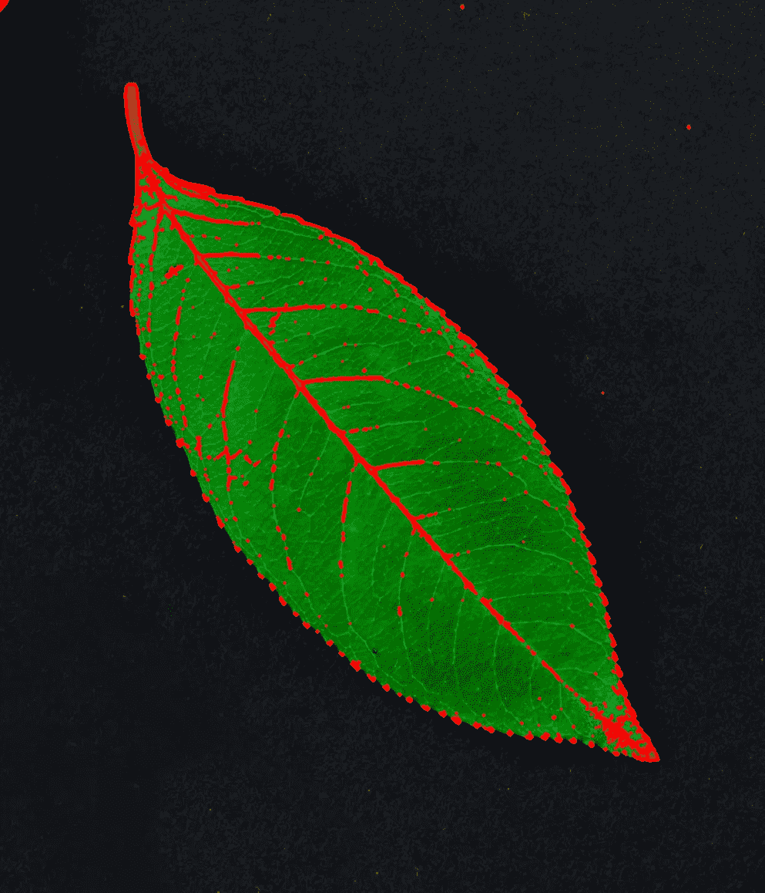

Contouring without pre-processing, 531 contours detected

```
import cv2
import numpy as npdef viewImage(image):
    cv2.namedWindow('Display', cv2.WINDOW_NORMAL)
    cv2.imshow('Display', image)
    cv2.waitKey(0)
    cv2.destroyAllWindows()
```

首先，你必须**知道你的颜色的 HSV 表示**，你可以通过把它的 RGB 转换成 HSV 来知道它，就像下面这样。

```
## getting green HSV color representation
green = np.uint8([[[0, 255, 0 ]]])
green_hsv = cv2.cvtColor(green,cv2.COLOR_BGR2HSV)
print( green_hsv)
```

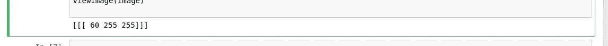

Green HSV color

**将图像转换为 HSV** :使用 HSV 更容易获得一种颜色的完整范围。HSV，H 代表色调，S 代表饱和度，V 代表数值。我们已经知道绿色是[60，255，255]。世界上所有的果岭都位于[45，100，50]到[75，255，255]之间，即[60-**15**，100，50]到[60+ **15** ，255，255]。15 只是一个近似值。
我们将此范围转换为[75，255， **200** ]或任何其他浅色(**第三个值**必须相对较大)，因为这是颜色的亮度，当我们对图像进行阈值处理时，该值将使该部分为白色。

```
image = cv2.imread('./path/to/image.jpg')
hsv_img = cv2.cvtColor(image, cv2.COLOR_BGR2HSV)
viewImage(hsv_img) ## 1green_low = np.array([45 , 100, 50] )
green_high = np.array([75, 255, 255])
curr_mask = cv2.inRange(hsv_img, green_low, green_high)
hsv_img[curr_mask > 0] = ([75,255,200])
viewImage(hsv_img) ## 2## converting the HSV image to Gray inorder to be able to apply 
## contouring
RGB_again = cv2.cvtColor(hsv_img, cv2.COLOR_HSV2RGB)
gray = cv2.cvtColor(RGB_again, cv2.COLOR_RGB2GRAY)
viewImage(gray) ## 3ret, threshold = cv2.threshold(gray, 90, 255, 0)
viewImage(threshold) ## 4contours, hierarchy =  cv2.findContours(threshold,cv2.RETR_TREE,cv2.CHAIN_APPROX_SIMPLE)
cv2.drawContours(image, contours, -1, (0, 0, 255), 3)
viewImage(image) ## 5
```

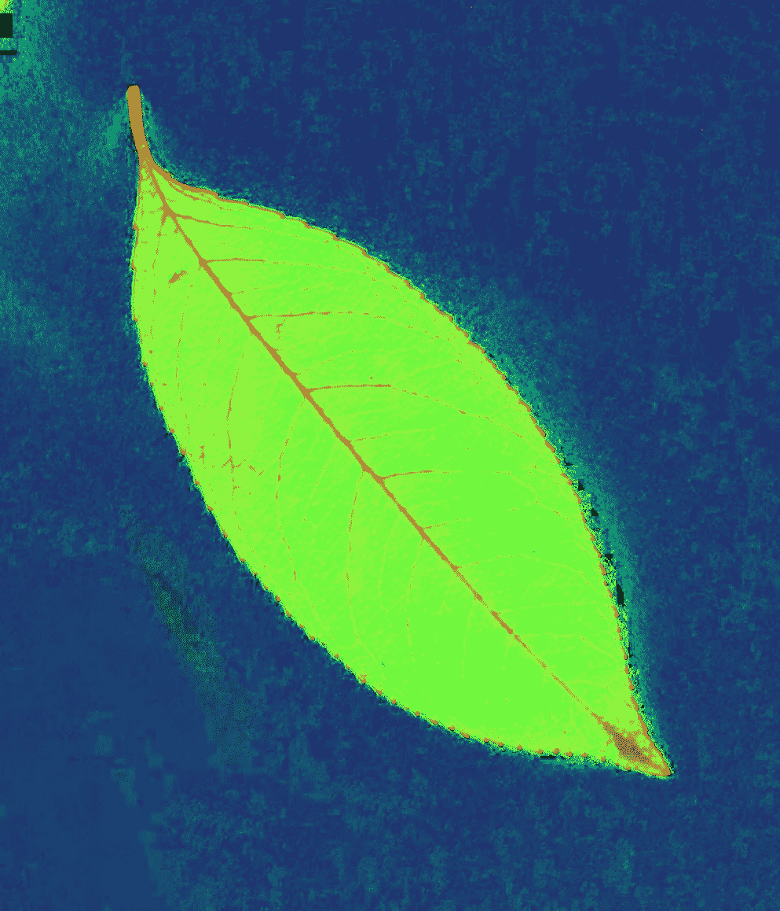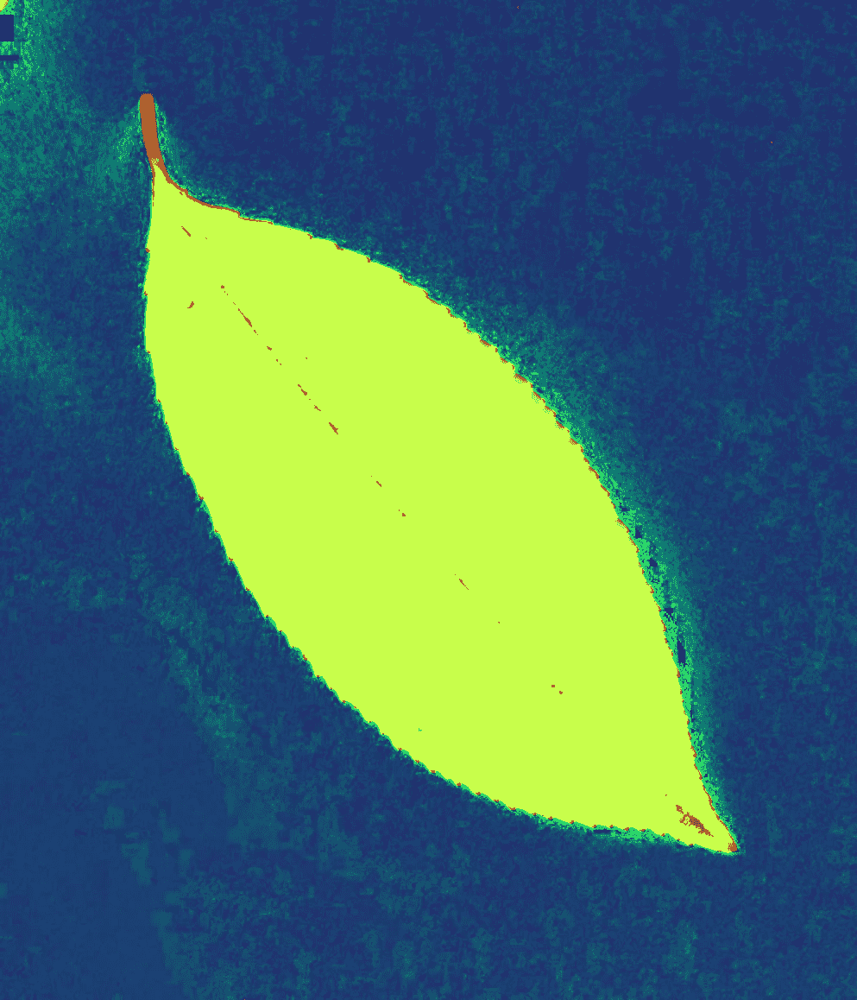

Left: Image just after conversion to HSV (1). Right: Image after applying the mask (color unification)(2)

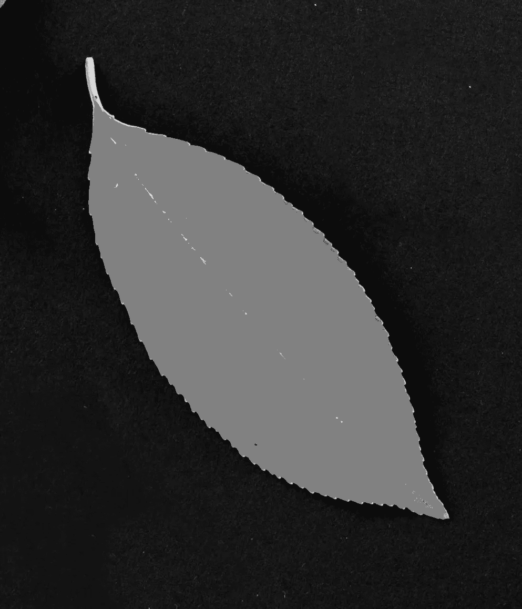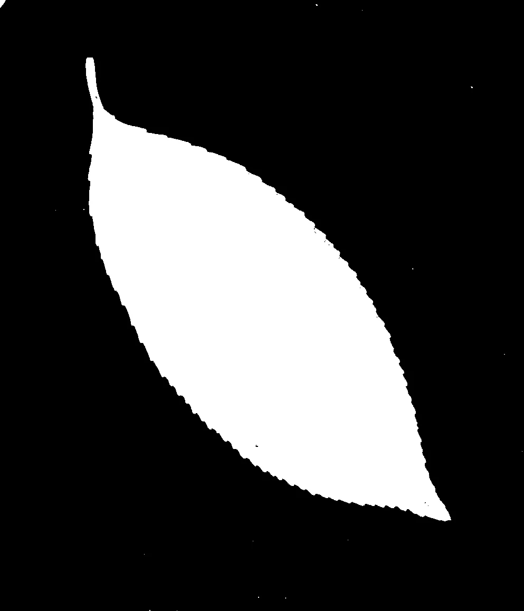

Left: Image after conversion from HSV to gray(3), Right: Threshold Image, final step(4)

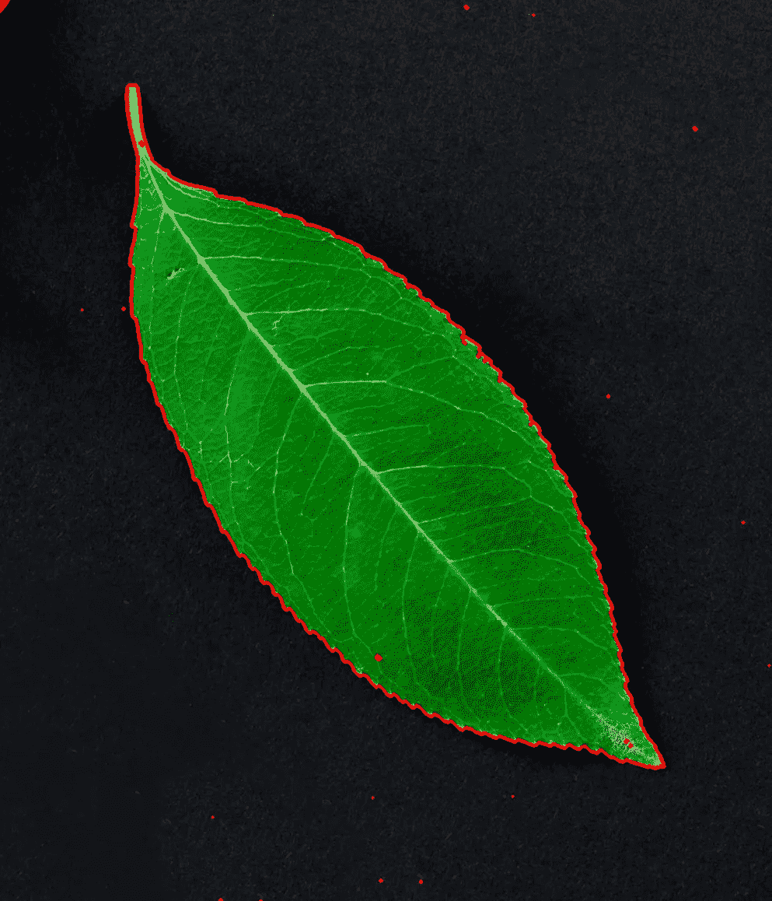

Final contour(5)

由于背景中似乎也有不规则性，我们可以用这种方法得到最大的轮廓，最大的轮廓当然是叶子。
我们可以得到轮廓数组中叶子轮廓的索引，从中我们可以得到叶子的面积和中心。
轮廓有许多其他可以利用的特征，如轮廓周长、凸包、边界矩形等。你可以从[这里](https://docs.opencv.org/3.4.2/dd/d49/tutorial_py_contour_features.html)了解更多。

```
def findGreatesContour(contours):
    largest_area = 0
    largest_contour_index = -1
    i = 0
    total_contours = len(contours)
    while (i < total_contours ):
        area = cv2.contourArea(contours[i])
        if(area > largest_area):
            largest_area = area
            largest_contour_index = i
        i+=1

    return largest_area, largest_contour_index# to get the center of the contour
cnt = contours[13]
M = cv2.moments(cnt)
cX = int(M["m10"] / M["m00"])
cY = int(M["m01"] / M["m00"])largest_area, largest_contour_index = findGreatesContour(contours)print(largest_area)
print(largest_contour_index)print(len(contours))print(cX)
print(cY)
```

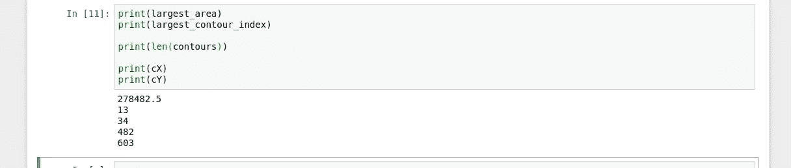

The result of the print statements