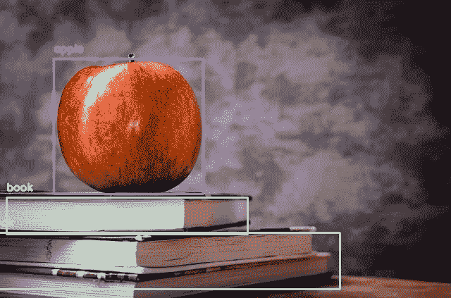
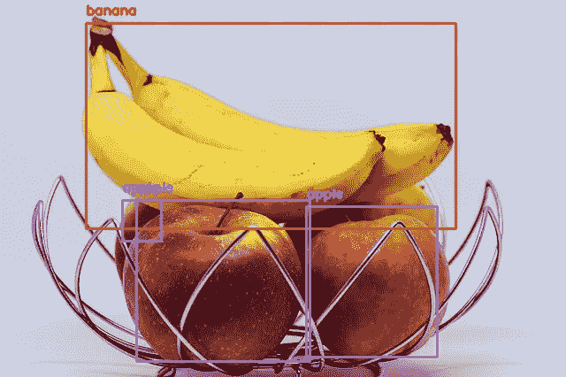
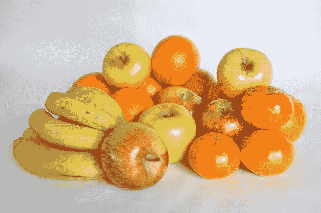
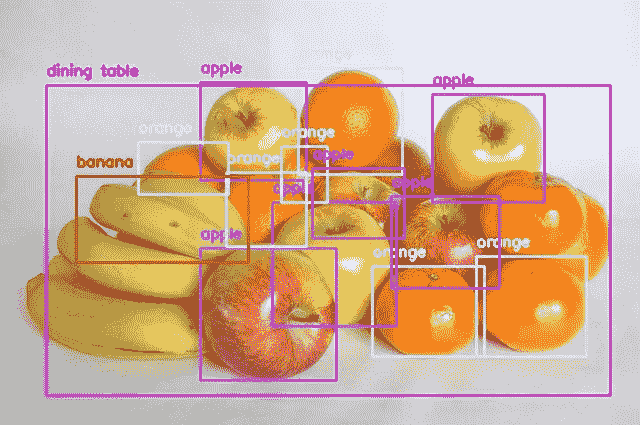

# 使用 Python 实现不到 10 行代码的对象检测

> 原文：<https://towardsdatascience.com/object-detection-with-less-than-10-lines-of-code-using-python-2d28eebc5b11?source=collection_archive---------0----------------------->

## 找出图像中的对象


Home Office (Image by [LEEROY Agency](https://pixabay.com/users/Life-Of-Pix-364018/?utm_source=link-attribution&utm_medium=referral&utm_campaign=image&utm_content=569153) from [Pixabay](https://pixabay.com/?utm_source=link-attribution&utm_medium=referral&utm_campaign=image&utm_content=569153))

> 什么要知道图像中有哪些对象？
> 
> 或者您可能想计算图像中苹果的数量？

在这篇文章中，我将展示如何用不到 10 行代码用 Python 创建自己的对象检测程序。

如果尚未安装以下 python 库，则需要进行安装:

```
opencv-python
cvlib
matplotlib
tensorflow
```

以下代码用于导入所需的 python 库，从存储中读取图像，对图像执行对象检测，并显示带有检测到的对象的边界框和标签的图像。

```
import cv2
import matplotlib.pyplot as plt
import cvlib as cv
from cvlib.object_detection import draw_bboxim = cv2.imread('apple-256261_640.jpg')bbox, label, conf = cv.detect_common_objects(im)output_image = draw_bbox(im, bbox, label, conf)plt.imshow(output_image)
plt.show()
```

下面是使用上述代码进行对象检测的一些结果。



(Left) Orignal image of an apple on top of some books (Image by [Michal Jarmoluk](https://pixabay.com/users/jarmoluk-143740/?utm_source=link-attribution&utm_medium=referral&utm_campaign=image&utm_content=256261) from [Pixabay](https://pixabay.com/?utm_source=link-attribution&utm_medium=referral&utm_campaign=image&utm_content=256261)), (Right) Object detection on original image



(Left) Orignal image of apples and bananas (Image by [Michal_o79](https://pixabay.com/users/Michal_o79-8039136/?utm_source=link-attribution&utm_medium=referral&utm_campaign=image&utm_content=3270453) from [Pixabay](https://pixabay.com/?utm_source=link-attribution&utm_medium=referral&utm_campaign=image&utm_content=3270453)), (Right) Object detection on original image



(Left) Orignal image of apples, bananas and oranges (Image by [Jose Luis Montesino](https://pixabay.com/users/comefruta-446797/?utm_source=link-attribution&utm_medium=referral&utm_campaign=image&utm_content=448599) from [Pixabay](https://pixabay.com/?utm_source=link-attribution&utm_medium=referral&utm_campaign=image&utm_content=448599)), (Right) Object detection on original image

你已经准备好了你的物体探测程序。

***觉得这个帖子有帮助？*** *在下面留下你的想法作为评论。*

希望实现人脸检测。查看我在 [**上的帖子如何使用 python 在不到 3 分钟的时间内实现人脸检测。**](/implement-face-detection-in-less-than-3-minutes-using-python-9f6b43bb3160)

[**点击这里**](https://medium.com/@sabinaa.pokhrel) 阅读我其他关于 AI/机器学习的帖子。

*要了解更多关于 cvlib 库的信息，可以访问下面的链接。*

 [## cvlib

### 用于 Python 的高级易用开源计算机视觉库。它的开发重点是实现简单的…

www.cvlib.net](https://www.cvlib.net/) 

*要了解使用该库可以检测到的所有物体，您可以访问下面的链接。*

 [## arunponnusamy/对象检测-opencv

### 此时您不能执行该操作。您已使用另一个标签页或窗口登录。您已在另一个选项卡中注销，或者…

github.com](https://github.com/arunponnusamy/object-detection-opencv/blob/master/yolov3.txt) 

*这里有一些进一步的阅读材料，有助于理解物体探测是如何工作的:*

[](/object-detection-using-deep-learning-approaches-an-end-to-end-theoretical-perspective-4ca27eee8a9a) [## 使用深度学习方法的对象检测:端到端的理论观点

### 物体探测领域最有影响力的论文详解

towardsdatascience.com](/object-detection-using-deep-learning-approaches-an-end-to-end-theoretical-perspective-4ca27eee8a9a) [](https://www.analyticsvidhya.com/blog/2018/10/a-step-by-step-introduction-to-the-basic-object-detection-algorithms-part-1/) [## 基本对象检测算法的逐步介绍(第 1 部分)

### 你花了多少时间在一个又脏又乱的房子里寻找丢失的房间钥匙？它发生在我们最好的人身上，而且…

www.analyticsvidhya.com](https://www.analyticsvidhya.com/blog/2018/10/a-step-by-step-introduction-to-the-basic-object-detection-algorithms-part-1/)