# YOLO 物体检测|为自动驾驶汽车带来视觉

> 原文：<https://towardsdatascience.com/object-detection-with-yolo-bringing-vision-to-self-driving-cars-980295226830?source=collection_archive---------8----------------------->

## 解释和使用 YOLO(你只看一次)计算机视觉算法的对象检测

> **编辑**:写完这篇文章后不久，我制作了一个 YouTube 视频(VSauce Parody)来解释 YOLO。请随意查看！

我们都认为我们的愿景是理所当然的。它是数亿年进化的产物，从一片感光细胞进化成一种被称为人眼的复杂光学奇观。

纵观人类的生存历程，我们的生存依赖于我们理解和解释环境的能力。在我们漫游非洲平原的时候，原始人类需要立即识别威胁并做出反应。

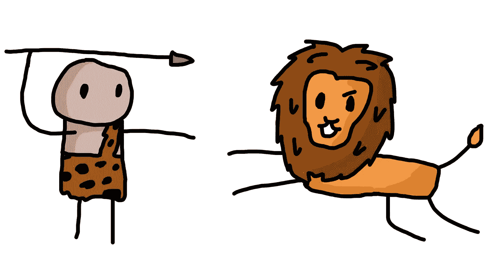

即使在今天，这种情况仍然存在。

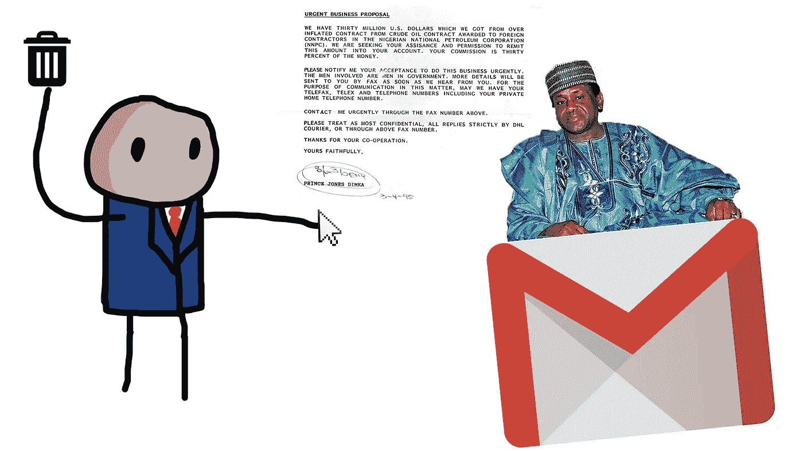

看到我们生活的世界的能力让克里斯托弗·哥伦布得以环游世界，让莱昂纳多·达·芬奇得以画出蒙娜丽莎，让小蒂米得以骑独轮车。干得好，提米。

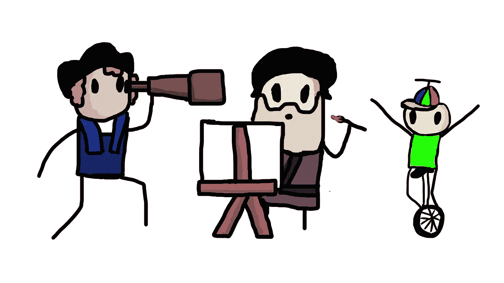

自从智人出现以来，人类拥有了最好的视觉。然而，这种情况不会持续太久。因为人类很懒。最初人类认为:

> "嘿，走路太累了，让我们驯养这些大的四足动物，然后骑着它们到处走."

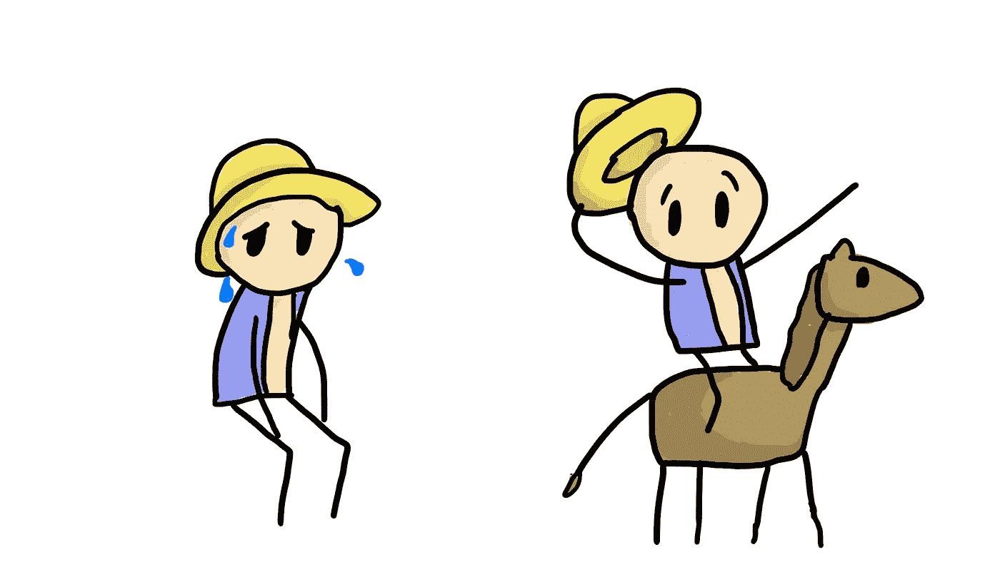

然后我们想:

> “喂，养这些马太费事了，让我们造这些大四轮车到处跑吧”

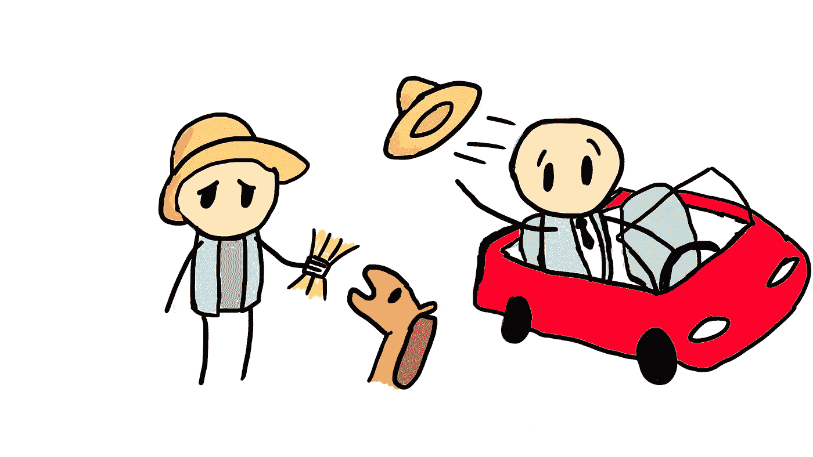

现在我们认为:

> “嘿，驾驶这些汽车太费力了，让我们建立复杂的人工智能算法来为我们做这件事”

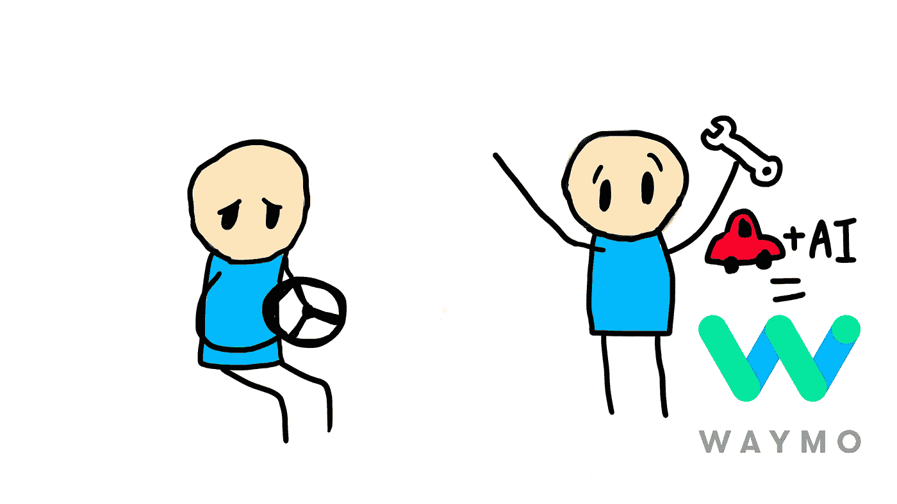

于是自动驾驶汽车诞生了——诞生于我们甚至连开车都懒得做的懒惰。

**但是我们到底是如何制造出一辆能够自动驾驶的汽车的呢？**仅仅将一台带有摄像头的电脑连接到汽车上是不够的，因为电脑看图像的方式与我们不同。看一看:

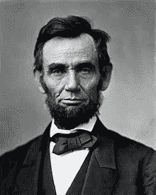

对我们来说，我们看到精致的形状和边缘，我们的**大脑**可以拼凑出一张脸。但是对一台计算机来说，他们看到的是一组**多**多 的数字。

这么长时间以来，人类一直不知道如何教会计算机看东西。请想一想:

> 如果给你一个装满数字的格子，你会用它做什么？你怎么能看穿这个？

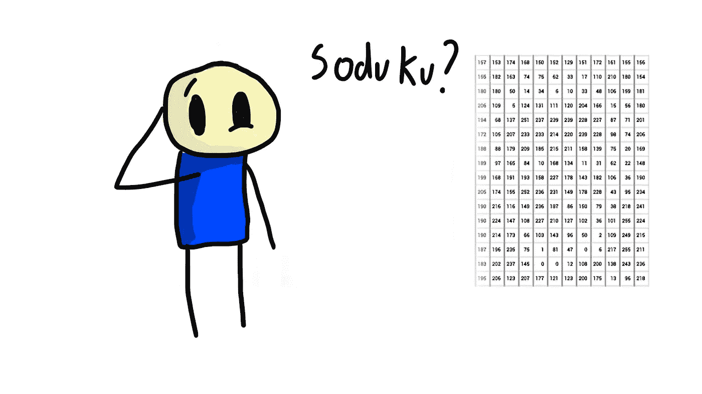

更不用说，我上面用的亚伯拉罕·林肯的照片是黑白的。正常的彩色图像是 RGB(红绿蓝)格式，有 3 个独立的颜色通道，而不是 1 个，这意味着图像不仅仅是一个二维数组，而是一个三维数组。计算机如何识别这些数字中的模式来观察物体？这次，仅仅有一堆 if-else 语句是不够的。

**进入神经网络。**

神经网络受人脑工作方式的启发，由许多层相互连接的神经元组成，这些神经元共同工作。毕竟，如果我们的大脑能学会看东西，为什么人工大脑不能做到呢？神经网络允许计算机自学识别它希望完成的特定任务所需的复杂模式。在这种情况下，目标是教计算机看到并理解它所处的环境。

教汽车看东西的最好方法是使用一种特殊类型的神经网络，称为**卷积神经网络**。

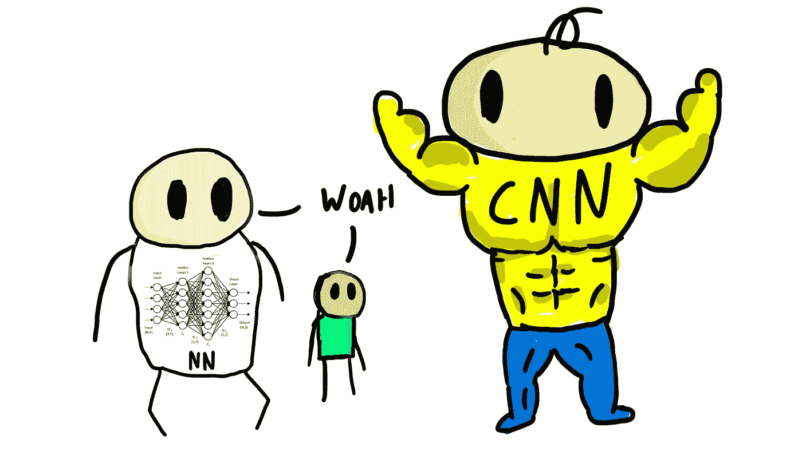

**卷积神经网络**(**CNN**)因其理解空间信息的惊人能力而被用于计算机视觉。这意味着如果我有一张人的照片，即使我旋转它，移动它，挤压和拉伸它，CNN 仍然会识别出它是一个人。

CNN 强大背后的关键是他们使用了一种叫做**卷积层**的特殊层，从图像中提取特征。初始卷积层识别边缘和拐角等低级特征。随着特征通过更多的卷积层，检测到的特征变得复杂得多。例如，用于检测人的卷积层可能会从边缘到形状到四肢再到人的整体。你可以在这篇 [**文章**](/classifying-skin-lesions-with-convolutional-neural-networks-fc1302c60d54) 中阅读更多关于卷积神经网络的内容。

The architecture of Convolutional Neural Networks

卷积神经网络本身主要用于图像分类:给定一幅图像，网络将准确地指定给定的类别。例如，使用在皮肤病变数据集上训练的 CNN，它可以学习从给定的图像中诊断不同的皮肤癌。

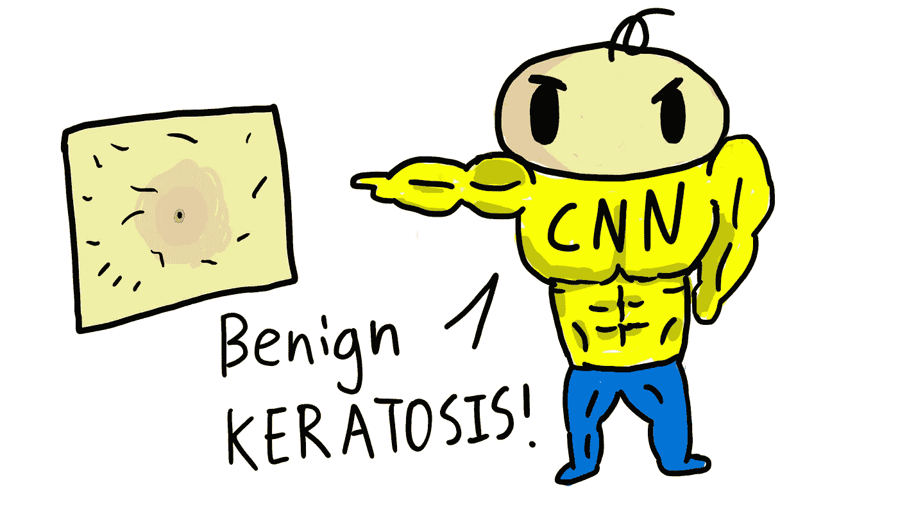

但是，如果我想知道的不仅仅是图像是否属于某个类，更具体地说，对象的确切位置是什么呢？此外，如果一个图像中有多个不同类别的对象，该怎么办？自动驾驶汽车不能只知道该区域有 5 辆车和 20 个人，它需要知道他们相对于自己的位置**，以便安全导航**。

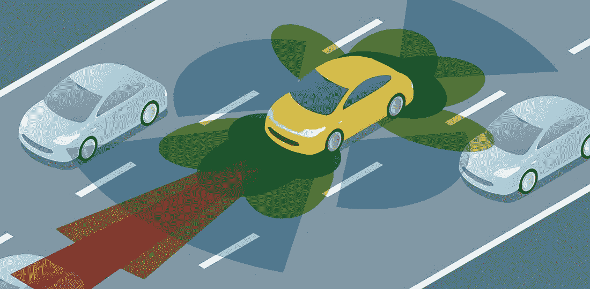

这就是**物体检测**的用武之地。通过增强我们的卷积神经网络，我们可以重新利用其惊人的分类属性来定位图像中的类别。我们可以通过一种叫做 **YOLO(你只看一次)**的算法来做到这一点，这种算法可以进行实时物体检测，非常适合自动驾驶汽车。YOLO 非常快，使用 24 个卷积层，每秒可以处理高达 155 帧。这使得它很容易实现成为一辆**自动驾驶汽车**。那么它是如何工作的呢？

# #YOLO 解释道

正如研究论文所述，YOLO:

> 单个卷积神经网络同时预测多个**边界框**和这些框的**类概率**

YOLO 使用整个图像的特征来预测每个边界框和它们的类别，它同时进行**。与人类相似，YOLO 几乎可以立即识别出给定图像中的物体位置和内容。**

**在运行一幅图像时，YOLO 首先将图像分成一个由 S 组成的网格。**

**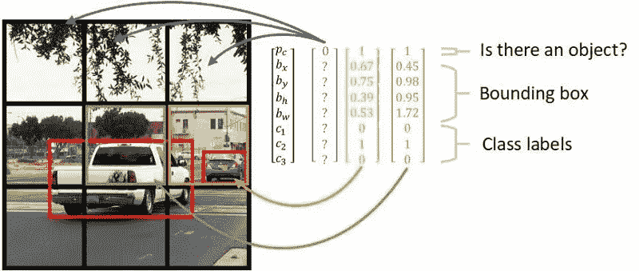**

**在每个网格单元内，YOLO 将预测预定数量的**边界框**的**位置**、**大小**和**置信度得分**——本质上是预测一个物体可能存在的类别和潜在位置。如果对象的中心落在网格单元中，则该网格单元的边界框负责准确定位和预测该对象。**

**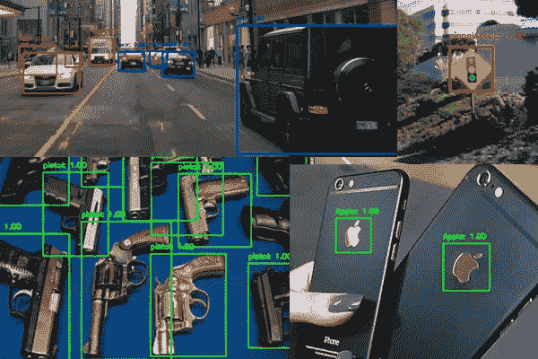**

**YOLO bounding boxes in action**

**每个边界框将有 5 个预测:x 坐标、y 坐标、宽度、高度和**置信度**。计算出的**置信度得分**表明模型认为在边界框内存在一个类的置信度，以及它认为该类适合该框的准确度，该框使用一种称为交集/并集的度量。**

****并集上的交集**用于对象检测，因为它将地面真实边界框与预测边界框进行比较。通过将重叠面积除以并集面积，我们得到一个函数，即**奖励严重重叠**而**惩罚不准确的边界框预测**。边界框的目标是最终尽可能精确地将对象限制在图像内，IoU 是确定这一点的一个很好的度量。**

******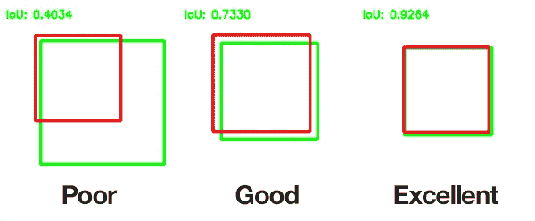**

**在图像通过 YOLO 后，它输出 S x S x (B * 5 + C)张量中的预测，其中**每个网格单元预测 C 个类别中 B 个边界框的位置和置信度得分**。最终，我们得到了很多边界框——其中大部分与**无关。****

**为了过滤出正确的框，具有满足特定置信度分数的预测类的边界框将被保留。这允许我们隔离图像中的所有相关对象。**

**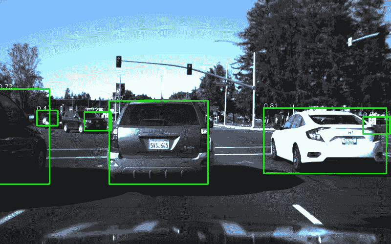**

**本质上，YOLO 定位和分类图像/视频中的对象。**像 YOLO 这样的物体检测**算法，结合像 Li-Dar 这样的自动驾驶汽车上的许多其他传感器，使我们能够建造完全自动驾驶的汽车，比任何人都更快、更安全、更好。如果你有兴趣深入研究自动驾驶汽车，我强烈推荐你阅读 [**这篇文章**](https://medium.com/@w.law/an-introduction-to-autonomous-vehicles-91d61ff81a40) 。**

**既然你已经理解了 YOLO 的工作，**让我们看看它是如何工作的**。**

# ****奔跑的 YOLO****

**要在您自己的计算机上试用 YOLO，**将我的 GitHub 库克隆到您的计算机上。****

 **[## 西吉尔-文/YOLO

### 用 YOLO 检测物体(你只看一次)。要跑 YOLO，首先，下载链接的预训练重量…

github.com](https://github.com/Sigil-Wen/YOLO)** 

**然后从这个 [**链接**](https://drive.google.com/file/d/1sbrSFwp4lAgVVDKijGf7hlIzcDbu7Eu_/view) 下载预先训练好的重量，并将重量移动到名为 **yolo-coco** 的文件夹中**

**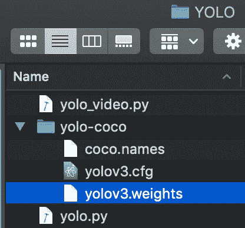**

**在您的命令终端中，找到克隆的存储库，导入所需的依赖项和库，并输入以下命令在任何视频上运行 YOLO。**

> **python yolo_video.py —输入 —输出
> 
> <output path="">— yolo yolo-coco</output>**

**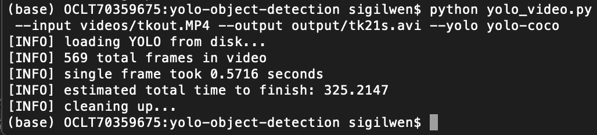**

**Terminal Window**

**运行该命令后，YOLO 将在输入视频上运行，最终产品将出现在输出路径中。下面是我在 YOLO 看到的一些东西:**

**[https://www.youtube.com/watch?v=AxhBu2uK86I&](https://www.youtube.com/watch?v=AxhBu2uK86I&)**

**这就对了。你理解并运行了一个物体检测算法！令人难以置信的是，我们距离一个由人工智能司机主导的世界有多近。**

*   **对跟随我的旅程感兴趣并想要更多这样的内容？跟着我上**媒**👇或者订阅我的 [**YouTube 频道**](https://www.youtube.com/channel/UC68dN9l5fEaefElL728K6bA?sub_confirmation=1)**
*   **你可以在 [**LinkedIn**](https://www.linkedin.com/in/sigil-wen-081774163/) 和我联系，或者在 sigil.w3n@gmail.com 给我发邮件**
*   **查看我的 [**个人网站**](https://sigilwen.ca) 和 [**作品集**](https://tks.life/profile/sigil.wen)**
*   **看看我对 YOLO 的恶搞吧:[https://www.youtube.com/watch?v=AxhBu2uK86I&](https://www.youtube.com/watch?v=AxhBu2uK86I&)**