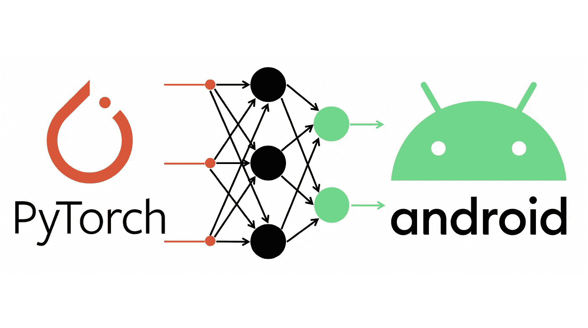
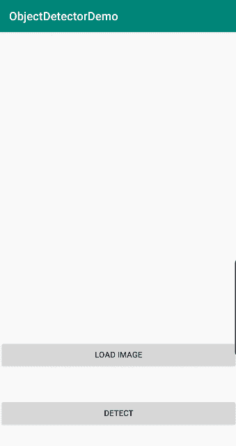
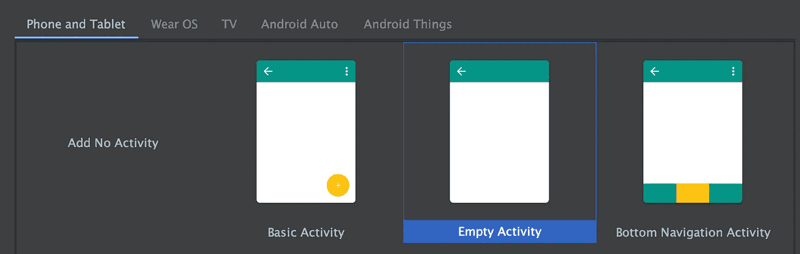
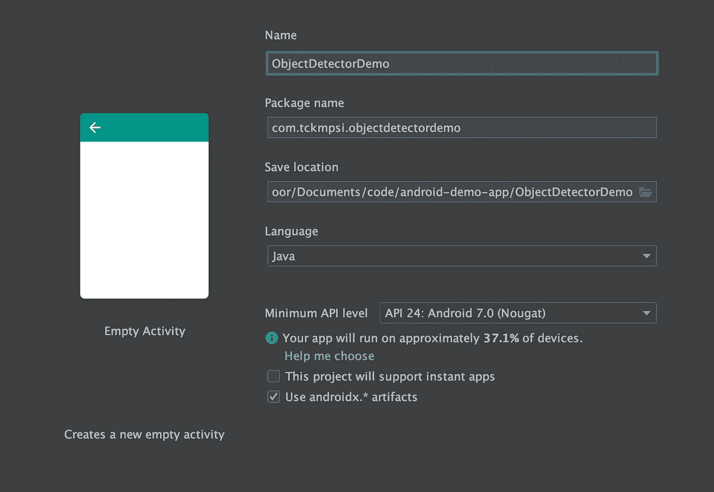
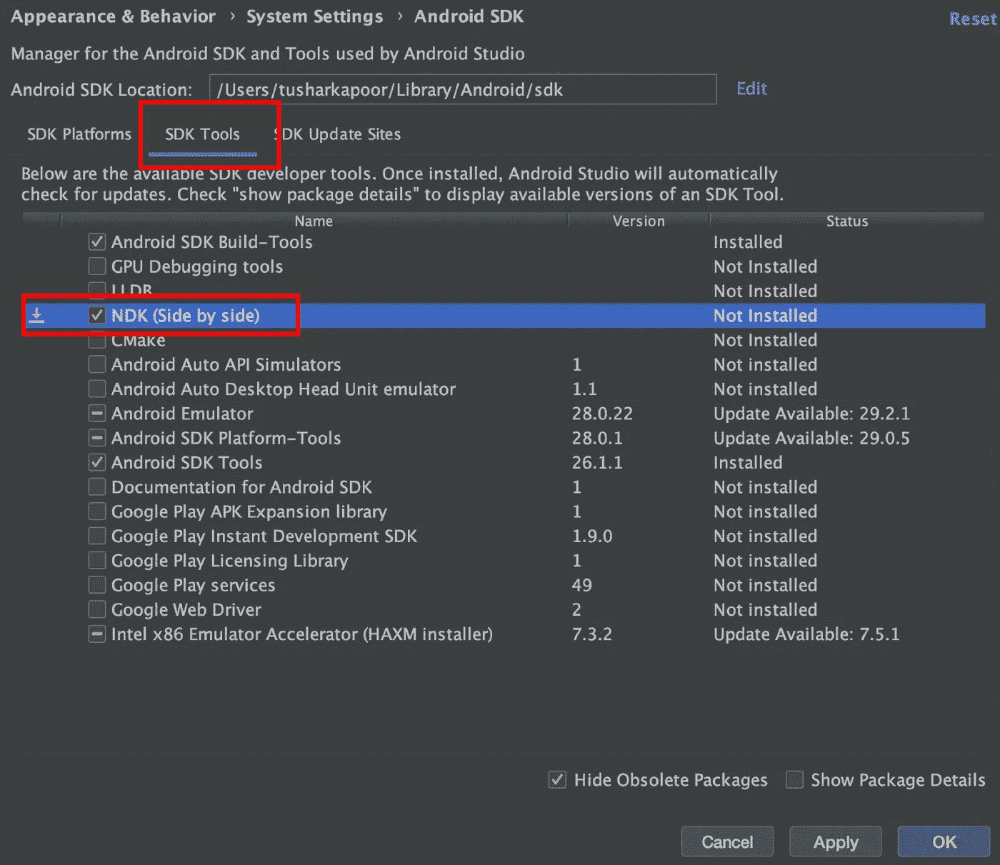
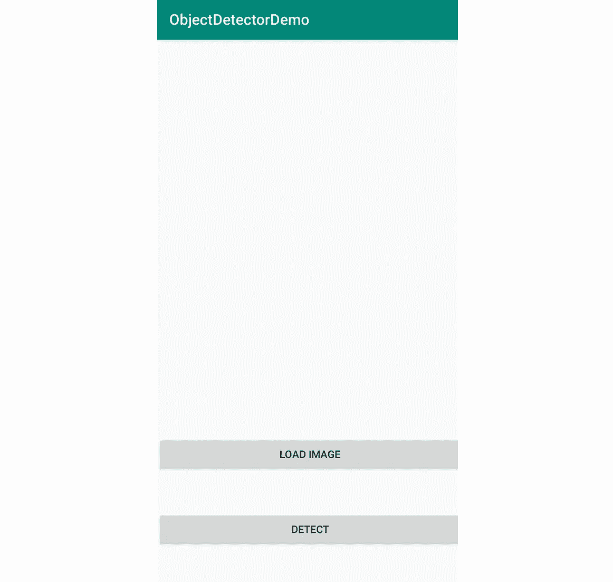
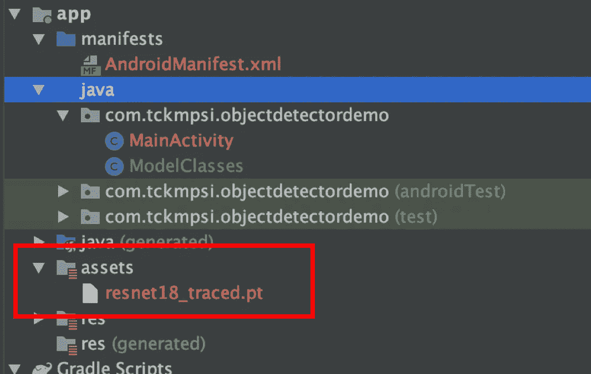

# 使用 PyTorch 移动神经网络的对象检测器 Android 应用程序

> 原文：<https://towardsdatascience.com/object-detector-android-app-using-pytorch-mobile-neural-network-407c419b56cd?source=collection_archive---------12----------------------->



[图沙尔·卡普尔](https://www.tusharck.com/):(【https://www.tusharck.com/】T2

在移动设备上运行机器学习代码是下一件大事。 [PyTorch](https://pytorch.org/) ，在最新发布的 [PyTorch 1.3](https://pytorch.org/blog/pytorch-1-dot-3-adds-mobile-privacy-quantization-and-named-tensors/) 中，增加了 [PyTorch Mobile](https://pytorch.org/mobile/home/) ，用于在 Android 和 iOS 设备上部署机器学习模型。

在这里，我们将研究创建一个 Android 应用程序，用于图像中的对象检测；比如下图的 GIF。



Demo Run of the application

# 步骤 1:准备模型

在本教程中，我们将使用预先训练好的 [ResNet18](https://arxiv.org/abs/1512.03385) 模型。ResNet18 是最先进的计算机视觉模型，有 1000 个分类类别。

1.  安装火炬视觉库

```
pip install torchvision
```

2.下载并追踪 ResNet18 模型。

我们[跟踪](https://pytorch.org/docs/stable/jit.html#torch.jit.trace)模型，因为我们需要一个可执行的 ScriptModule 来进行实时编译。

```
import torch
import torchvisionresnet18 = torchvision.models.resnet18(pretrained=True)
resnet18.eval()example_inputs = torch.rand(1, 3, 224, 224)resnet18_traced = torch.jit.trace(resnet18, example_inputs = example_inputs)resnet18_traced.save("resnet18_traced.pt")
```

***注:***

1.  将 resnet18_traced.pt 存储在一个已知的位置，我们将在本教程的后续步骤中用到它。
2.  在 torch.rand 中，我们采用了 224，224 的尺寸，因为 ResNet18 接受 224*224 的尺寸。

# 步骤 2:制作 Android 应用程序

1.  如果你还没有下载并安装 Android Studio，安装时说 **YES** 下载并安装 **SDK** 。
    链接:[https://developer.android.com/studio](https://developer.android.com/studio)
2.  打开 Android Studio，点击:
    **+开始一个新的 Android Studio 项目**
3.  选择空活动。



4.输入应用程序**名称:** ObjectDetectorDemo。然后按**完成**。



5.安装 NDK 在安卓内部运行原生代码:

*   转到**工具> SDK 管理器。**
*   点击 **SDK 工具**。
*   勾选 **NDK(并排)**旁边的复选框。



6.添加依赖项。

*   在 **build.gradle(模块:app)里面。在依赖项中添加以下内容。**

```
dependencies {
    implementation fileTree(dir: 'libs', include: ['*.jar'])
    implementation 'androidx.appcompat:appcompat:1.0.2'
    implementation 'androidx.constraintlayout:constraintlayout:1.1.3'**implementation 'org.pytorch:pytorch_android:1.3.0'
    implementation 'org.pytorch:pytorch_android_torchvision:1.3.0'**
}
```

7.添加一个基本布局来加载图像并显示结果。

*   转到**app>RES>layout>activity _ main . XML**并添加下面的代码。

```
<ImageView
    android:id="@+id/image"
    app:layout_constraintTop_toTopOf="parent"
    android:layout_width="match_parent"
    android:layout_height="400dp"
    android:layout_marginBottom="20dp"
    android:scaleType="fitCenter" />

<TextView
    android:id="@+id/result_text"
    android:layout_width="match_parent"
    android:layout_height="wrap_content"
    android:layout_gravity="top"
    android:text=""
    android:textSize="20dp"
    android:textStyle="bold"
    android:textAllCaps="true"
    android:textAlignment="center"
    app:layout_constraintTop_toTopOf="@id/button"
    app:layout_constraintBottom_toBottomOf="@+id/image" />

<Button
    android:id="@+id/button"
    android:layout_width="match_parent"
    android:layout_height="wrap_content"
    android:text="Load Image"
    app:layout_constraintBottom_toBottomOf="@+id/result_text"
    app:layout_constraintTop_toTopOf="@+id/detect" />

<Button
    android:id="@+id/detect"
    android:layout_width="match_parent"
    android:layout_height="wrap_content"
    android:text="Detect"
    android:layout_marginBottom="50dp"
    app:layout_constraintBottom_toBottomOf="parent" />
```

你的布局应该如下图所示。



8.我们需要设置权限来读取设备上存储的图像。

*   转到**app>manifest>androidmanifest . XML**并将下面的代码添加到 **manifest 标签**内。

```
<uses-permission android:name="android.permission.READ_EXTERNAL_STORAGE"/>
```

*   获取应用程序加载的权限(只有在您授予权限后才会询问)。

—进入**主活动** java。将下面的代码添加到 **onCreate()** 方法中。

```
if (Build.VERSION.*SDK_INT* >= Build.VERSION_CODES.*M*) {
    requestPermissions(new String[]  {android.Manifest.permission.*READ_EXTERNAL_STORAGE*}, 1);
}
```

9.复制模型。
现在我们复制使用 python 脚本创建的模型。

*   从**文件浏览器/查找器**中打开您的应用程序。
*   转到 **app > src > main。**
*   创建一个名为**资产**的文件夹
*   将您的模型复制到该文件夹中。
*   当你打开你的 Android 工作室时，你会看到如下图所示。(如果没有，右击应用程序文件夹并点击**同步应用程序**)。



10.我们需要列出模型的输出类。

*   转到 **app > java。**
*   在第一个文件夹中创建一个新的 Java 类名 **ModelClasses** 。
*   将类的列表定义为(完整的列表有 1000 个类，所以可以在这里复制所有的 check [Json](https://s3.amazonaws.com/outcome-blog/imagenet/labels.json) 或 [check Git](https://github.com/tusharck/Object-Detector-Android-App-Using-PyTorch-Mobile-Neural-Network/blob/master/ObjectDetectorDemo/app/src/main/java/com/tckmpsi/objectdetectordemo/ModelClasses.java) 。完整列表和下面列表中的副本):

```
public static String[] *MODEL_CLASSES* = new String[]{
        "tench, Tinca tinca",
        "goldfish, Carassius auratus"
        .
        .
        .
}
```

11.主活动 Java，这里将定义按钮动作，读取图像并调用 PyTorch 模型。参见代码中的注释以获得解释。

12.现在是测试应用程序的时候了。有两种方法:

*   [运行在仿真器上【点击此处】。](https://developer.android.com/studio/run/emulator)
*   使用安卓设备。([为此您需要启用 USB 调试](https://developer.android.com/studio/debug/dev-options) [ [点击此处](https://developer.android.com/studio/run/emulator))。
*   运行应用程序后，它应该看起来像页面顶部的 GIF。

链接到 Git 资源库:[https://github . com/tusharck/Object-Detector-Android-App-Using-py torch-Mobile-Neural-Network](https://github.com/tusharck/Object-Detector-Android-App-Using-PyTorch-Mobile-Neural-Network)

**免责声明:**

1.  “Android”名称、Android 徽标、“Google Play”品牌和其他 Google 商标是 Google LLC 的财产，不属于 Android 开源项目的资产。
2.  PyTorch、PyTorch、PyTorch 徽标以及与 PyTorch 或网站相关的所有其他商标、服务标志、图形和徽标是 PyTorch 或 PyTorch 许可方的商标或注册商标。