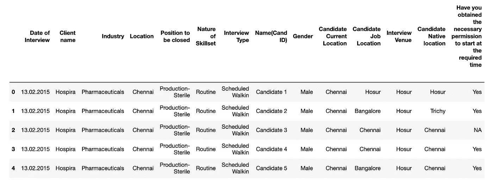

# 面向对象的机器学习流水线与熊猫和考拉数据框架的 mlflow

> 原文：<https://towardsdatascience.com/object-oriented-machine-learning-pipeline-with-mlflow-for-pandas-and-koalas-dataframes-ef8517d39a12?source=collection_archive---------12----------------------->

## 使用熊猫、考拉、scikit-learn 和 mlflow 在 Python 中开发支持 Spark 的机器学习管道的端到端流程


在文章 [Python 数据预处理使用熊猫数据帧、Spark 数据帧和考拉数据帧](/python-data-preprocessing-using-pandas-dataframe-spark-dataframe-and-koalas-dataframe-e44c42258a8f)中，我使用了一个公共数据集来评估和比较机器学习的典型数据预处理步骤中[熊猫](https://pandas.pydata.org/)、 [Spark](https://spark.apache.org/releases/spark-release-2-4-4.html) 和[考拉](https://github.com/databricks/koalas)数据帧的基本功能。考拉的主要优势是支持类似 Spark 上熊猫的易用 API。

在本文中，我使用一个更具挑战性的数据集，Kaggle 竞赛的[面试出席问题](https://www.kaggle.com/vishnusraghavan/the-interview-attendance-problem)来演示使用熊猫、考拉、 [scikit-learn](https://scikit-learn.org/stable/) 和 [mlflow](https://www.mlflow.org/docs/latest/tutorial.html) 用 Python 为熊猫和考拉数据帧开发面向对象的机器学习管道的端到端过程。这是通过以下方式实现的:

*   使用 Pandas DataFrame 和 scikit-learn pipeline API 开发数据预处理管道
*   结合 scikit-learn pipeline API 和 Koalas DataFrame 为 Spark 开发数据预处理管道
*   结合 scikit-learn 和 mlflow 开发机器学习流水线

端到端开发流程基于[数据挖掘的跨行业标准流程](https://en.wikipedia.org/wiki/Cross-industry_standard_process_for_data_mining)。如下图所示，它包括六个主要阶段:

*   商业理解
*   数据理解
*   数据准备
*   建模
*   估价
*   部署


**图 1:** CRISP-DM 流程图(参考维基百科中的[来源)](https://en.wikipedia.org/wiki/Cross-industry_standard_process_for_data_mining)

为方便讨论，假设在 Mac 等本地机器上安装了以下 Python 库:

*   Anaconda (conda 4.7.10)和 Python 3.6、Numpy、Pandas、Matplotlib 和 Scikit-Learn
*   [pyspark 2.4.4](https://spark.apache.org/releases/spark-release-2-4-4.html)
*   [考拉](https://github.com/databricks/koalas)
*   [mlflow](https://www.mlflow.org/docs/latest/index.html)

使用 Python 3.6 的原因是当前版本的 [mlflow](https://www.mlflow.org/docs/latest/index.html) 的某些功能(如部署)无法与 Python 3.7 兼容。

# 1.商业理解

第一阶段是业务理解。这个阶段的关键点是理解要解决的业务问题。作为一个例子，下面是对 Kaggle 面试出勤率问题的简要描述:

给定招聘人员在安排与候选人的面试时提出的一组问题，如何使用候选人对这些问题的回答来预测预期出席者是否会参加安排的面试(是、否或不确定)。

# 2.数据理解

一旦理解了业务问题，下一步就是确定在哪里(即数据源)以及我们应该如何收集数据，从这些数据中可以构建问题的机器学习解决方案。

研究人员在 2014 年 9 月至 2017 年 1 月的两年多时间里，从印度的招聘行业收集了 Kaggle 面试出勤问题的数据集。

这个数据集是用标签收集的(*观察到的出勤*的列保存标签)，因此它适用于监督机器学习。



以下代码为本文中的所有源代码导入必要的 Python 库，并将数据集加载到考拉数据帧中，并显示数据帧的前五行，如上表所示。

```
import numpy as np
import pandas as pd
import databricks.koalas as ks
import matplotlib.pyplot as plt
import matplotlib as mpl
from   datetime import datetime
import osfrom sklearn.base import BaseEstimator, TransformerMixin
from sklearn.pipeline import Pipeline
from sklearn.externals import joblibimport mlflow
import mlflow.sklearnfrom sklearn.model_selection import train_test_split
from sklearn.ensemble import RandomForestClassifier
from sklearn.model_selection import GridSearchCVfrom sklearn.metrics import make_scorer
from sklearn.metrics import accuracy_score
from sklearn.metrics import f1_score
from sklearn.metrics import mean_squared_error, mean_absolute_error, r2_score%matplotlib inlineks_df = ks.read_csv('Interview_Attendance_Data.csv')
ks_df.head()
```

# 3.数据准备

数据准备的主要目标是清理收集的原始数据集并将其转换为适当的格式，以便转换后的数据可以被目标机器学习模型有效地使用。

在面试考勤原始数据集中， *Name(Cand ID)* 列包含候选人的唯一标识符，该标识符没有太大的预测能力，因此可以删除。此外，所有列(即对于考拉数据帧从 *_c22* 到 *_c26* 的列，或者对于熊猫数据帧从*未命名:22* 到*未命名:26* 的列)都没有数据，因此也可以安全地删除。

除了采访日期，数据集中的所有其他列都有分类(文本)值。为了使用机器学习来解决问题，必须将这些分类值转换为数值，因为机器学习模型只能使用数值数据。

面试的*日期一栏应拆分为日、月、年，以提高预测能力，因为与作为整体的一串日期相比，个别日、月、年的信息往往与季节性工作更密切相关。*

技能组合的*性质*和*候选人籍贯*列有大量唯一条目。这些将在一键编码后引入大量新的衍生功能。在数据集不够大的情况下，太多的特征会导致[维数灾难](https://en.wikipedia.org/wiki/Curse_of_dimensionality)问题。为了缓解这一问题，这两列的值被重新划分到更少的存储桶中。

上述数据预处理/转换可以概括为以下步骤:

*   桶装技能组合
*   存储候选人本地位置
*   解析面试日期
*   将分类值改为大写并删除不太有用的特征
*   一次性编码分类值

这些步骤是通过将熊猫和考拉数据帧与 scikit-learn 管道 API(即 *BaseEstimator* 、 *TransformerMixin* 和*管道*)相结合，为熊猫和考拉数据帧开发面向对象的数据预处理管道来实现的。

## 3.1 转换列值

几个数据预处理步骤共享一个转换数据帧中特定列的值的通用操作。但是，如[考拉系列](https://koalas.readthedocs.io/en/latest/reference/api/databricks.koalas.Series.iloc.html#databricks.koalas.Series.iloc)所述，考拉系列不支持一些常见的熊猫数据帧和系列索引机制，如*df . iloc*【0】。因此，没有简单的方法来遍历和更改考拉数据帧中的列值。

另一个困难是，考拉不允许从头构建一个新的考拉系列对象，然后将它作为一个新列添加到现有的考拉数据框架中。它只允许从考拉数据帧的现有列构建新的考拉系列对象。

通过定义一个全局函数来调用考拉系列对象的 *apply* ()方法，可以避免上述困难。

```
def transformColumn(column_values, func, func_type): def transform_column(column_element) -> func_type:
        return func(column_element)

    cvalues = column_values
    cvalues = cvalues.apply(transform_column)
    return cvalues
```

## 3.2 铲斗技能组合

为了缓解维数灾难问题， *BucketSkillset* 转换类的*转换*()方法通过将出现次数少于 9 次的值更改为 *Others* 的一个相同字符串值，将 Skillset 列的唯一值划分为更小数量的桶。

```
class BucketSkillset(BaseEstimator, TransformerMixin):
    def __init__(self):
        self.skillset = ['JAVA/J2EE/Struts/Hibernate', 'Fresher', 'Accounting Operations', 'CDD KYC', 'Routine', 'Oracle', 
          'JAVA/SPRING/HIBERNATE/JSF', 'Java J2EE', 'SAS', 'Oracle Plsql', 'Java Developer', 
          'Lending and Liabilities', 'Banking Operations', 'Java', 'Core Java', 'Java J2ee', 'T-24 developer', 
          'Senior software engineer-Mednet', 'ALS Testing', 'SCCM', 'COTS Developer', 'Analytical R & D', 
          'Sr Automation Testing', 'Regulatory', 'Hadoop', 'testing', 'Java', 'ETL', 'Publishing']       

    def fit(self, X, y=None):
        return self

    def transform(self, X, y=None):  

        func = lambda x: x if x in self.skillset else 'Others'

        X1 = X.copy()
        cname = 'Nature of Skillset'
        cvalue = X1[cname]

        if type(X1) == ks.DataFrame:  
            cvalue = transformColumn(cvalue, func, str)
            X1[cname] = cvalue
        elif type(X1) == pd.DataFrame:
            X2 = map(func, cvalue)
            X1[cname] = pd.Series(X2)
        else:
            print('BucketSkillset: unsupported dataframe: {}'.format(type(X1)))
            pass

        return X1
```

## 3.3 存储候选人本地位置

与 bucketing skillset 类似，为了缓解维数灾难问题，*bucket location*transformer 类的 *transform* ()方法通过将那些出现次数少于 12 次的值更改为 *Others* 的一个相同值，将候选本地位置列的唯一值划分为更小数量的桶。

```
class BucketLocation(BaseEstimator, TransformerMixin):
    def __init__(self):
        self.candidate_locations = ['Chennai', 'Hyderabad', 'Bangalore', 'Gurgaon', 'Cuttack', 'Cochin', 
                          'Pune', 'Coimbatore', 'Allahabad', 'Noida', 'Visakapatinam', 'Nagercoil',
                          'Trivandrum', 'Kolkata', 'Trichy', 'Vellore']

    def fit(self, X, y=None):
        return self

    def transform(self, X, y=None):            
        X1 = X.copy()

        func = lambda x: x if x in self.candidate_locations else 'Others'

        cname = 'Candidate Native location'
        cvalue = X1[cname]
        if type(X1) == ks.DataFrame: 
            cvalue = transformColumn(cvalue, func, str)
            X1[cname] = cvalue
        elif type(X1) == pd.DataFrame:
            X2 = map(func, cvalue)
            X1[cname] = pd.Series(X2)
        else:
            print('BucketLocation: unsupported dataframe: {}'.format(type(X1)))
            pass

        return X1
```

## 3.4 解析面试日期

*采访日期*一栏的值很乱，因为使用了各种格式。例如，不仅使用不同的分隔符来分隔日、月和年，而且还遵循日、月和年的不同顺序。这由 *ParseInterviewDate* 转换器类的 _ *parseDate* ()和 *transform_date* ()方法来处理。 *transform* ()方法的总体功能是将采访日期字符串分成各个日、月和年的值。

```
class ParseInterviewDate(BaseEstimator, TransformerMixin):
    def __init__(self):
        pass   
    def __parseDate(self, string, delimit):
        try:
            if ('&' in string):
                subs = tuple(string.split('&'))
                string = subs[0]
        except:
            print ('TypeError: {}'.format(string))
            return None

        string = string.strip()

        try:
            d = datetime.strptime(string, '%d{0}%m{0}%Y'.format(delimit))
        except:
            try:
                d = datetime.strptime(string, '%d{0}%m{0}%y'.format(delimit))
            except:
                try:
                     d = datetime.strptime(string, '%d{0}%b{0}%Y'.format(delimit))
                except:
                    try:
                         d = datetime.strptime(string, '%d{0}%b{0}%y'.format(delimit))
                    except:
                        try:
                            d = datetime.strptime(string, '%b{0}%d{0}%Y'.format(delimit))
                        except:
                            try:
                                d = datetime.strptime(string, '%b{0}%d{0}%y'.format(delimit))
                            except:
                                d = None
        return d

    def fit(self, X, y=None):
        return self

    def transform(self, X, y=None):

        def transform_date(ditem):
            if (isinstance(ditem, str) and len(ditem) > 0):
                if ('.' in ditem):
                    d = self.__parseDate(ditem, '.')
                elif ('/' in ditem):
                    d = self.__parseDate(ditem, '/')
                elif ('-' in ditem):
                    d = self.__parseDate(ditem, '-')
                elif (' ' in ditem):
                    d = self.__parseDate(ditem, ' ')
                else:
                    d = None

                if (d is None):
                    return 0, 0, 0
                else:
                    return d.day, d.month, d.year

        def get_day(column_element) -> int:
            try:
                day, month, year = transform_date(column_element)
                return int(day)
            except:
                return 0

        def get_month(column_element) -> int:
            try:
                day, month, year = transform_date(column_element)
                return int(month)
            except:
                return 0

        def get_year(column_element) -> int:
            try:
                day, month, year = transform_date(column_element)
                return int(year)
            except:
                return 0

        def pandas_transform_date(X1):
            days = []
            months = []
            years = []
            ditems = X1['Date of Interview'].values
            for ditem in ditems:
                if (isinstance(ditem, str) and len(ditem) > 0):
                    if ('.' in ditem):
                        d = self.__parseDate(ditem, '.')
                    elif ('/' in ditem):
                        d = self.__parseDate(ditem, '/')
                    elif ('-' in ditem):
                        d = self.__parseDate(ditem, '-')
                    elif (' ' in ditem):
                        d = self.__parseDate(ditem, ' ')
                    else:
                        d = None

                    if (d is None):
                        # print("{}, invalid format of interview date!".format(ditem))
                        days.append(0) # 0 - NaN
                        months.append(0)
                        years.append(0)
                    else:
                        days.append(d.day) 
                        months.append(d.month)
                        years.append(d.year)
                else:
                    days.append(0)
                    months.append(0)
                    years.append(0)

            X1['Year'] = years
            X1['Month'] = months
            X1['Day'] = days

            return X1

        X1 = X.copy()

        if type(X1) == ks.DataFrame: 
            X1['Year'] = X1['Date of Interview']
            X1['Month'] = X1['Date of Interview']
            X1['Day'] = X1['Date of Interview']

            func_map = {'Year' : get_year, 'Month' : get_month, 'Day' : get_day}
            for cname in func_map:
                cvalue = X1[cname]
                cvalue = cvalue.apply(func_map[cname])
                X1[cname] = cvalue
        elif type(X1) == pd.DataFrame:
            X1 = pandas_transform_date(X1)
        else:
            print('ParseInterviewDate: unsupported dataframe: {}'.format(type(X1)))
            pass 

        return X1
```

## 3.5 将分类值改为大写，并删除不太有用的特性

*features super case*transformer 类的 *transform* ()方法是将分类特性的值改为大写，同时丢弃不太有用的特性。

```
class FeaturesUppercase(BaseEstimator, TransformerMixin):
    def __init__(self, feature_names, drop_feature_names):
        self.feature_names      = feature_names
        self.drop_feature_names = drop_feature_names

    def fit(self, X, y=None):
        return self

    def transform(self, X, y=None):

        func = lambda x: x.strip().upper()

        X1 = X.copy()

        for fname in self.feature_names:
            values = X1[fname]
            values = values.fillna('NaN')
            if type(X1) == ks.DataFrame: 
                values = transformColumn(values, func, str)
            elif type(X1) == pd.DataFrame:
                values = map(lambda x: x.strip().upper(), values)
            else:
                print('FeaturesUppercase: unsupported dataframe: {}'.format(type(X1)))   
            X1[fname] = values

        # drop less important features
        X1 = X1.drop(self.drop_feature_names, axis=1)

        return X1
```

## 3.6 一次性编码分类值

*onehotencodata*transformer 类的 *transform* ()方法调用 DataFrame 的 *get_dummies* ()方法对分类值的值进行一次性编码。

```
class OneHotEncodeData(BaseEstimator, TransformerMixin):
    def __init__(self):
        self.one_hot_feature_names = ['Client name', 
                        'Industry', 
                        'Location', 
                        'Position to be closed', 
                        'Nature of Skillset',
                        'Interview Type', 
                        'Gender', 
                        'Candidate Current Location',
                        'Candidate Job Location', 
                        'Interview Venue', 
                        'Candidate Native location',
                        'Have you obtained the necessary permission to start at the required time',
                        'Hope there will be no unscheduled meetings',
                        'Can I Call you three hours before the interview and follow up on your attendance for the interview',
                        'Can I have an alternative number/ desk number. I assure you that I will not trouble you too much',
                        'Have you taken a printout of your updated resume. Have you read the JD and understood the same',
                        'Are you clear with the venue details and the landmark.',
                        'Has the call letter been shared', 
                        'Marital Status']
        self.label_encoders   = None
        self.one_hot_encoders = None

    def fit(self, X, y=None):       
        return self

    def transform(self, X, y=None):  
        X1 = X.copy()
        if type(X1) == ks.DataFrame: 
            X1 = ks.get_dummies(X1)
        elif type(X1) == pd.DataFrame:
            X1 = pd.get_dummies(X1)
        else:
            print('OneHotEncodeData: unsupported dataframe: {}'.format(type(X1)))
            pass

        return X1
```

## 3.7 将变压器合并到管道中

在 *PredictInterview* 类的 *PreprocessData* ()方法中，所有的数据预处理转换器被组合成一个 scikit-learn 管道(详见第 4.3 节)。一旦调用管道对象的 *fit_transform* ()方法，这些变形器的 *fit* ()和 *transform* ()方法将被依次执行。

```
self.pipeline = Pipeline([
            ('bucket_skillset', BucketSkillset()),
            ('bucket_location', BucketLocation()),
            ('parse_interview_date', ParseInterviewDate()),
            ('features_to_uppercase', FeaturesUppercase(self.feature_names, self.drop_feature_names)),
            ('one_hot_encoder', self.oneHotEncoder)
        ])
```

# 4.建模

准备好数据集后，下一步是建模。建模的主要目标包括:

*   识别机器学习模型
*   训练机器学习模型
*   调整机器学习模型的超参数

## 4.1 识别机器学习模型

有三种主要的高级类型的机器学习和深度学习算法/模型:

*   监督机器学习和深度学习
*   无监督机器学习和深度学习
*   强化学习

有监督的机器学习和深度学习可以分为回归和分类等子类型。每个子类型包括各种机器学习和深度学习算法/模型。例如，监督机器学习分类模型包括决策树分类器、随机森林分类器、GBM 分类器等。

一般来说，给定一个业务问题，有许多不同类型的模型可以用作可能的解决方案。需要对这些不同的模型进行比较，以确定最有希望的模型作为目标业务问题的解决方案。因此，模型识别不能孤立地进行。它依赖于模型训练和模型性能度量的评估/比较。

在本文中，我们简单地选择 sci kit-learn*RandomForestClassifier*模型进行演示。

## 4.2 训练模型和调整超参数

一旦模型(例如， *RandomForestClassifier* )被识别，通常有多个超参数要被调整。超参数是在模型训练可以开始之前需要设置的参数，并且这种超参数值在模型训练期间不会改变。例如，随机森林分类器具有多个超参数，例如估计器的*数量*、*最大深度*等。

sciket-learn[GridSearchCV](https://scikit-learn.org/stable/modules/generated/sklearn.model_selection.GridSearchCV.html)是一个流行的库，通过多次自动执行模型的实例来搜索给定模型的超参数的最佳组合。每次执行对应于所选超参数值的唯一组合。 *GridSearch* 类将使用这个库来寻找估计器的*数量和*最大深度*的最佳组合:*

```
class GridSearch(object):
    def __init__(self, cv=10):
        self.grid_param = [
            {'n_estimators': range(68,69), # range(60, 70) 
             'max_depth'   : range(8,9)}   # range(5, 10)} 
        ]
        self.cv = cv
        self.scoring_function = make_scorer(f1_score, greater_is_better=True) 
        self.gridSearch = None

    def fit(self, X, y):
        rfc = RandomForestClassifier()
        self.gridSearchCV = GridSearchCV(rfc, self.grid_param, cv=self.cv, scoring=self.scoring_function)
        self.gridSearchCV.fit(X, y)
        return self.gridSearchCV.best_estimator_
```

## 4.3 跟踪模型超参数和性能指标

[mlflow](https://www.mlflow.org/docs/latest/tutorial.html) 的一个设计功能是跟踪和比较不同模型执行的超参数和性能指标。

*PredictInterview* 类的 *mlFlow* ()的方法是训练一个模型，使用训练好的模型预测结果，获得各种模型性能指标，然后调用 [mlflow](https://www.mlflow.org/docs/latest/tutorial.html) API 来跟踪超参数和性能指标，同时将训练好的模型记录到一个文件中，供以后使用，如部署。

```
def mlFlow(self):
        np.random.seed(40)
        with mlflow.start_run():
            self.loadData()
            self.PreprocessData()
            self.trainModel()
            self.predictClasses()
            accuracy_score, f1_score, rmse_score, mae_score, r2_score = self.getModelMetrics() best_params = self.gridSearch.gridSearchCV.best_params_ mlflow.log_param("n_estimators", best_params["n_estimators"])
            mlflow.log_param("max_depth", best_params["max_depth"])            
            mlflow.log_metric("rmse", rmse_score)
            mlflow.log_metric("r2", r2_score)
            mlflow.log_metric("mae", mae_score)
            mlflow.log_metric("accuracy", accuracy_score)
            mlflow.log_metric("f1", f1_score) mlflow.sklearn.log_model(self.rfc, "random_forest_model")
```

下面的 *PredictInterview* 类的 Jupyter 记事本和本文中的所有其他源代码都可以在 Github [6]中找到。

```
class PredictInterview(object):
    def __init__(self, use_koalas=True):
        self.use_koalas = use_koalas
        self.dataset_file_name = 'Interview_Attendance_Data.csv'
        self.feature_names = ['Date of Interview', 
                       'Client name', 
                       'Industry', 
                       'Location', 
                       'Position to be closed', 
                       'Nature of Skillset',
                       'Interview Type', 
                       'Gender', 
                       'Candidate Current Location',
                       'Candidate Job Location', 
                       'Interview Venue', 
                       'Candidate Native location',
                       'Have you obtained the necessary permission to start at the required time',
                       'Hope there will be no unscheduled meetings',
                       'Can I Call you three hours before the interview and follow up on your attendance for the interview',
                       'Can I have an alternative number/ desk number. I assure you that I will not trouble you too much',
                       'Have you taken a printout of your updated resume. Have you read the JD and understood the same',
                       'Are you clear with the venue details and the landmark.',
                       'Has the call letter been shared', 'Marital Status']

        if self.use_koalas:
            self.drop_feature_names = [
                'Name(Cand ID)',
                'Date of Interview', 
                '_c22',
                '_c23',
                '_c24',
                '_c25',
                '_c26']
        else: # use Pandas
            self.drop_feature_names = [
                'Unnamed: 22',
                'Unnamed: 23',
                'Unnamed: 24',
                'Unnamed: 25',
                'Unnamed: 26']

        self.dataset = None
        self.rfc     = None
        self.gridSearch = None
        self.X_train = None
        self.y_train = None
        self.X_test  = None
        self.y_test  = None
        self.y_pred  = None
        self.X_clean = None
        self.y_clean = None
        self.X_train_encoded = None
        self.X_test_encoded  = None
        self.y_train_encoded = None
        self.accuracy_score  = None 
        self.f1_score        = None
        self.oneHotEncoder   = None
        self.X_test_name_ids = None
        self.pipeline = None

    def loadData(self, path=None):
        if (path != None):
            path = os.path.join(path, self.dataset_file_name)
        else:
            path = self.dataset_file_name

        if self.use_koalas:
            dataset = ks.read_csv(path)  
        else:
            dataset = pd.read_csv(path)

        # shuffle data 
        self.dataset = dataset.sample(frac=1.0) 

        return self.dataset     

    def PreprocessData(self):
        y = self.dataset['Observed Attendance']      # extract labels y
        if self.use_koalas:
            X = self.dataset.drop('Observed Attendance') # extract features X
        else:
            X = self.dataset.drop(['Observed Attendance'], axis=1) 

        self.oneHotEncoder = OneHotEncodeData()

        self.pipeline = Pipeline([
            ('bucket_skillset', BucketSkillset()),
            ('bucket_location', BucketLocation()),
            ('parse_interview_date', ParseInterviewDate()),
            ('features_to_uppercase', FeaturesUppercase(self.feature_names, self.drop_feature_names)),
            ('one_hot_encoder', self.oneHotEncoder)
        ])

        X_1hot = self.pipeline.fit_transform(X)

        # fill up missing labels and then change labels to uppercase
        y = y.fillna('NaN')

        if self.use_koalas:
            func = lambda x: x.strip().upper()
            y_uppercase = transformColumn(y, func, str) 
        else:
            y_uppercase = map(lambda x: x.strip().upper(), y.values)
            y_uppercase = pd.Series(y_uppercase)

        # separate labeled records from unlabeled records
        self.X_train_encoded = X_1hot[y_uppercase != 'NAN']
        self.X_test_encoded  = X_1hot[y_uppercase == 'NAN']

        # save Names/ID for reporting later one
        self.X_test_name_ids = self.dataset['Name(Cand ID)'].loc[y_uppercase == 'NAN']

        y_train = y_uppercase.loc[y_uppercase != 'NAN']

        # encode labels as follows: 0 - NO, 1 - YES, NAN - NAN
        if self.use_koalas:
            func = lambda x: 1 if x == 'YES' else 0
            y = transformColumn(y_train, func, int)
        else:
            y = map(lambda x: 1 if x == 'YES' else 0, y_train)
            y = pd.Series(y)

        self.y_train_encoded = y

        self.X_clean = X_1hot
        self.y_clean = y_uppercase

        return None

    def __splitData(self):
        if self.use_koalas:
            X_train_encoded = self.X_train_encoded.to_numpy()
            y_train_encoded = self.y_train_encoded.to_numpy()
        else:
            X_train_encoded = self.X_train_encoded.values
            y_train_encoded = self.y_train_encoded.values

        self.X_train, self.X_test, self.y_train, self.y_test = train_test_split(X_train_encoded, 
                                                                                y_train_encoded, 
                                                                                test_size = 0.25, random_state = 0)
        return (self.X_train, self.X_test, self.y_train, self.y_test)

    def trainModel(self):
        X_train, X_test, y_train, y_test = self.__splitData()
        self.gridSearch = GridSearch()
        self.rfc = self.gridSearch.fit(X_train, y_train)
        return self.rfc

    def predictClasses(self):
        if (self.rfc is None):
            print("No trained model available, please train a model first!")
            return None

        self.y_pred = self.rfc.predict(self.X_test)
        return self.y_pred

    def getModelMetrics(self):
        if (self.y_test is None or self.y_pred is None):
            print('Failed to get model performance metrics because y_test is null or y_pred is null!')
            return None

        self.accuracy_score = accuracy_score(self.y_test, self.y_pred)
        self.f1_score = f1_score(self.y_test, self.y_pred)

        pred = self.predictAttendanceProbability(self.X_test)[:, 1]
        actual = self.y_test.astype(float)

        self.rmse_score = np.sqrt(mean_squared_error(actual, pred))
        self.mae_score = mean_absolute_error(actual, pred)
        self.r2_score = r2_score(actual, pred)

        return (self.accuracy_score, self.f1_score, self.rmse_score, self.mae_score, self.r2_score)

    def predictNullAttendanceProbability(self):
        y_pred = self.rfc.predict_proba(self.X_test_encoded.to_numpy())
        return y_pred

    def predictNullAttendanceClasses(self):
        y_pred = self.rfc.predict(self.X_test_encoded.to_numpy())
        return y_pred

    def predictAttendanceProbability(self, X):
        y_pred = self.rfc.predict_proba(X)
        return y_pred

    def predictAttendanceClass(self, X):
        y_pred = self.rfc.predict(X)
        return y_pred

    def mlFlow(self):
        np.random.seed(40)
        with mlflow.start_run():
            self.loadData()
            self.PreprocessData()
            self.trainModel()
            self.predictClasses()
            accuracy_score, f1_score, rmse_score, mae_score, r2_score = self.getModelMetrics() best_params = self.gridSearch.gridSearchCV.best_params_ mlflow.log_param("n_estimators", best_params["n_estimators"])
            mlflow.log_param("max_depth", best_params["max_depth"])            
            mlflow.log_metric("rmse", rmse_score)
            mlflow.log_metric("r2", r2_score)
            mlflow.log_metric("mae", mae_score)
            mlflow.log_metric("accuracy", accuracy_score)
            mlflow.log_metric("f1", f1_score) mlflow.sklearn.log_model(self.rfc, "random_forest_model")
```

下面的代码显示了如何实例化 *PredictInterview* 类的一个对象，然后调用它的 *mlFlow* ()方法。

```
predictInterview = PredictInterview(use_koalas=True)
predictInterview.mlFlow()
```

## 4.4 比较模型超参数和性能指标

一旦在 mlflow 中跟踪了模型的超参数和性能指标，我们可以使用终端或 Jupyter 笔记本启动如下的 [mlflow](https://www.mlflow.org/docs/latest/tutorial.html) UI(用户界面),查看模型执行的历史记录:

```
!mlflow ui # for jupyter notebook
```

假设 [mlflow](https://www.mlflow.org/docs/latest/tutorial.html) UI 在本地机器上启动，以下 IP 地址和端口号可用于在 Web 浏览器中查看结果:

```
http://127.0.0.1:5000
```

下图是 [mlflow](https://www.mlflow.org/docs/latest/tutorial.html) UI 中模型执行历史的快照:


**图 2:** 在 mlflow UI 中跟踪超参数和指标

# 5.估价

一旦机器学习模型被训练成具有预期的性能，下一步就是在受控的接近真实的设置中评估模型的预测结果，以获得模型有效、可靠并且满足部署的业务需求的信心。

例如，对于 Kaggle 面试出勤项目，一种可能的评估方法是使用 [mlflow](https://www.mlflow.org/docs/latest/tutorial.html) 将模型部署为 Web 服务，然后开发客户端程序来调用模型 Web 服务，以在经过数据准备后获得测试数据集的预测结果。然后，这些预测结果可用于生成报告(例如，表格或 *csv* 文件),供招聘行业领域专家审阅。

出于演示目的，下面的代码使用阈值为 0.5 的预测结果来为“观察到的出席率”列中缺少值的每个候选人生成概率和预测，并将结果形成为 Pandas 数据帧。

```
pred_probs   = predictInterview.predictNullAttendanceProbability()
pred_classes = predictInterview.predictNullAttendanceClasses()x = predictInterview.X_test_name_ids.to_numpy() 
z = zip(x, pred_probs, pred_classes)
answers = ('no', 'yes')result = [[x1, p1[1], answers[c]] for x1, p1, c in z]
result_df = pd.DataFrame(np.array(result), columns=['Names/ID', 'Probability', 'Yes/No'])
result_df.to_csv('interview_prediction.csv')
result_df.head(15)
```

以下是数据帧的前 15 行:


# 6.部署

一旦模型评估得出模型可以部署的结论，最后一步就是将评估后的模型部署到生产系统中。如[商业数据科学](http://data-science-for-biz.com/)一书中所述，部署的细节取决于目标生产系统。

以 Kaggle 面试考勤项目为例，一种可能的场景是将模型部署为服务器上的 Web 服务，可以被目标生产系统中的其他组件调用，以获得预测结果来辅助工作面试安排。在目标生产系统的开发基于不同于建模语言(例如，Python)的编程语言(例如，Java)的更复杂的情况下，模型有可能需要作为生产系统的组件在目标编程语言中重新实现。

## 6.1 将模型部署为 Web 服务

如前所述，在 [mlflow](https://www.mlflow.org/docs/latest/tutorial.html) 中跟踪模型执行的过程中，一个经过训练的模型已经被记录到一个文件中。以下屏幕快照显示了已记录模型的信息:


**图 3:**ml flow UI 中的测井训练模型

与 [mlflow 教程](https://www.mlflow.org/docs/latest/tutorial.html#serving-the-model)类似，下面的代码将使用 [mlflow](https://www.mlflow.org/docs/latest/tutorial.html) 内置功能来启动一个日志模型作为 Web 服务:

```
mlflow models serve -m /Users/xyz/machine-learning-spark/mlruns/0/258301f3ac5f42fb99e885968ff17c2a/artifacts/random_forest_model -p 1234
```

## 6.2 调用模型 Web 服务来预测结果

为简单起见，在本节中，假设 *test_df* 是只有一行测试数据的 Pandas 数据帧(面试出席特征向量):

```
test_df.head() 
```


以下代码可用于将测试数据行发送到模型 Web 服务，以获得预测的面试出席率(1 -是，0 -否):

```
import requests
import jsonheaders = {'Content-Type': 'application/json',
           'Format': 'pandas-split'}url = '[http://127.0.0.1:1234/invocations'](http://127.0.0.1:1234/invocations')headers_json_str = json.dumps(headers)
headers_json_obj = json.loads(headers_json_str)
data_json_obj = test_df.to_json(orient='split')response = requests.post(url, data=data_json_obj, headers = headers_json_obj)response.text
```

# 摘要

在本文中，我使用了一个接近真实的具有挑战性的数据集，即 Kaggle 竞赛的[面试出勤问题](https://www.kaggle.com/vishnusraghavan/the-interview-attendance-problem)，通过将熊猫和考拉数据帧与 scikit-learn pipeline API 和 mlflow 相结合，演示了一个用 Python 为熊猫和考拉数据帧开发面向对象的机器学习管道的端到端过程。这个端到端的开发过程遵循[数据挖掘的跨行业标准过程](https://en.wikipedia.org/wiki/Cross-industry_standard_process_for_data_mining)。为标准流程的每个阶段(除了第一阶段)提供了简短的描述和示例实现代码。Github [6]中提供了一个 Jupyter 笔记本和相应的 Python 源代码文件。

# 参考

[1]教务长，f .，福塞特，T. (2013)。业务数据科学，奥赖利，2013 年 7 月

[2]杰龙，A. (2017)。使用 Scikit-Learn & TensorFlow 进行动手机器学习，奥赖利，2017 年 3 月

[3] mlflow 1.3.0 教程:[https://www.mlflow.org/docs/latest/tutorial.html](https://www.mlflow.org/docs/latest/tutorial.html)

[4]面试考勤问题:[https://www . ka ggle . com/vishnusraghavan/The-Interview-Attendance-Problem/data](https://www.kaggle.com/vishnusraghavan/the-interview-attendance-problem/data)

[5]张，于(2019)。使用熊猫数据帧、Spark 数据帧和考拉数据帧的 Python 数据预处理:[https://towards Data science . com/python-Data-预处理-使用-熊猫-数据帧-Spark-数据帧-和-考拉-数据帧-e4c 42258 a8f](/python-data-preprocessing-using-pandas-dataframe-spark-dataframe-and-koalas-dataframe-e44c42258a8f)

[6]张，于(2019)。[Github 中的 Jupyter 笔记本](https://github.com/yzzhang/machine-learning/tree/master/Random_Forest/interview_attendance)

披露声明:2019 首创一。观点是作者个人的观点。除非本帖中另有说明，否则 Capital One 不隶属于所提及的任何公司，也不被这些公司认可。使用或展示的所有商标和其他知识产权是其各自所有者的财产。