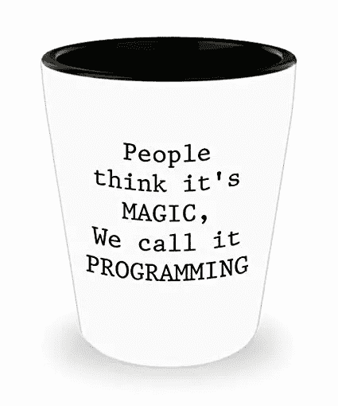
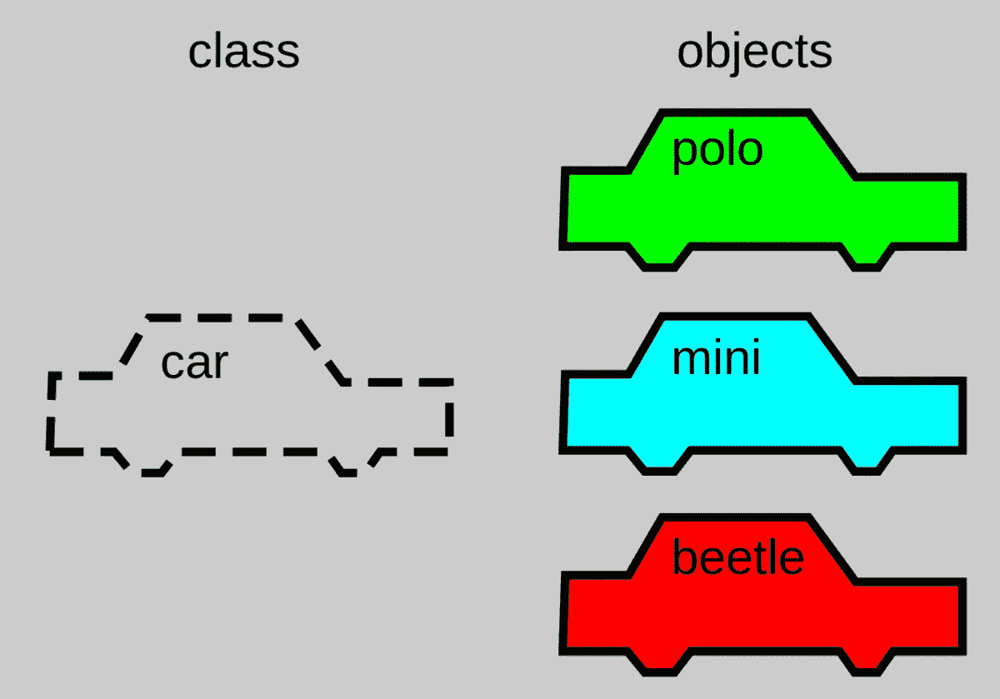
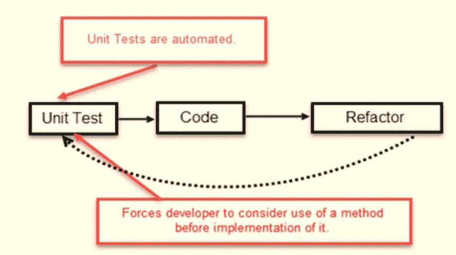

# 面向对象编程和测试驱动开发的魔力

> 原文：<https://towardsdatascience.com/object-oriented-programming-and-the-magic-of-test-driven-development-d377acae85fa?source=collection_archive---------14----------------------->

`[Python](https://www.python.org/)`是数据科学中最常用的编程语言之一。对于一些人来说，这是关于语言的灵活性和可读性，对于其他人来说，这是关于它相对较低的复杂性，对于大多数人来说，这是关于它的多面性。

我们称`[Python](https://www.python.org/)`为**多面语言**，因为它允许你以四种不同的风格编码:*功能性*、*命令性*、*面向对象*和*过程性*。这些编码风格在形式上被称为[编程范例](https://en.wikipedia.org/wiki/Programming_paradigm)，代表了一种基于语言特性对语言进行分类的方法。

自从我开始了我的数据科学之旅，我就一直想更深入地研究 [*【面向对象编程(OOP)*](https://en.wikipedia.org/wiki/Object-oriented_programming) ，所以我利用本周的博客帖子全力以赴。

# 什么是面向对象编程(OOP)？

正如我前面说过的，OOP 是一种建立在对象概念之上的编程范式。在计算机科学中，object 这个词可以指代不同的概念，但在最基本的层面上，它是由标识符引用的内存中的[值。](https://en.wikipedia.org/wiki/Object_(computer_science))

在面向对象的上下文中，对象是状态(变量)和行为(方法)的组合。面向对象方法的目标是通过[四原则](https://www.freecodecamp.org/news/object-oriented-programming-concepts-21bb035f7260/) : *封装*、*抽象*、*继承*和*多态*来创建更易于维护的可重用软件。

我们还可以在面向对象语言内部进一步区分，比如*基于类的*和*基于原型的*。

在基于类的 OOP 中，对象是一个类的实例。类是应该如何定义的蓝图，但它并不激活内容本身——它只是提供结构。

# 学习策略

学习和练习 OOP 的方法比我能想到的多得多，但我必须选择一种，所以我决定使用莎士比亚的《罗密欧与朱丽叶》的故事情节创建一个简单的基于文本的游戏。我的过程如下:

1.  写这个故事
2.  画出问题
3.  识别问题的实体——这些将是你的类
4.  创建实体层次结构
5.  确定实体的责任
6.  编写您的测试
7.  检查测试是否失败——最初会失败，因为您没有编写任何代码！
8.  写代码
9.  重复！重构！精炼！

这个过程不是一成不变的，我们也不应该成为它的奴隶。只是帮助我起步的一系列步骤。**面向对象不仅仅是一种编程范式，它还是一种解决问题的方法**，尽管它并非没有批评，但在构建复杂系统时，它是一个很好的选择。

# 兔子洞

请注意步骤 6:编写您的测试。现在，这不是我最初计划的一部分。我计划编码我的类，就是这样！但是在我研究 OOP 的时候，我遇到了测试驱动 [*开发*](https://www.guru99.com/test-driven-development.html) *(TDD)* 的概念。

TDD 是一种编程实践，它始于为程序的每个功能设计和开发测试。这种方式迫使你在开始写代码之前考虑规范、需求或设计。**换句话说，你写代码是为了在你写任何代码之前测试你的代码。**

**迷茫？我也是。但是做这个练习 100%值得。**

# 测试驱动的开发和单元测试

TDD 的过程非常简单:

[Image from Kanchan Kulkarni’s TDD Tutorial.](https://www.guru99.com/test-driven-development.html)

1.  写一个测试
2.  运行测试
3.  写一些代码
4.  运行测试
5.  重构代码
6.  重复

在我的例子中，我使用 [*单元测试*](http://softwaretestingfundamentals.com/unit-testing/) 进行 TDD。单元测试是软件测试的第一级，目的是验证程序中的每个单元都按照设计执行。有不同的框架来执行单元测试，我用的是`[unittest](https://docs.python.org/3/library/unittest.html#module-unittest)`。

当谈到 TDD 时，你会发现人们站在两边。我亲身经历的一些好处如下:

*   强迫你在开始毫无目的地输入代码之前思考你试图解决的问题。
*   在基于类的 OOP 的特殊情况下，它帮助你理解每个类的契约。他们的职责是什么？他们需要知道什么？—当您的目标是低耦合和高内聚时，这变得更加重要。
*   尽管一开始它可能会降低您的速度，但从长远来看，它通过最大限度地减少调试时间来节省您的时间。
*   它鼓励更好的设计，使代码更容易维护，更少冗余(保持干燥！)，并且在需要时可以安全地重构。
*   它可以作为活的文档——仅仅通过查看测试，您就可以理解每个单元应该做什么，使代码不言自明。

# 罗密欧与朱丽叶——代码和测试

在思考了游戏的故事之后，我决定有两条不同的故事线**经典**和**另类**。第一个是我们所知道的罗密欧与朱丽叶的故事，第二个，嗯，不是。

故事中的实体(我将用它作为创建不同类的参考)如下:

*   **场景:**假面舞会，阳台，决斗，编曲，药剂师，凯普莱特墓，另类结局。场景有两个主要的职责，为玩家描述场景，然后提示玩家一个是或否的问题，以获得他们的输入。
*   **Map:**Map 作为 [*有限状态机*](https://en.wikipedia.org/wiki/Deterministic_finite_automaton) 工作。它有有限数量的状态(场景)，一个转换函数(从一个场景移动到另一个场景)，和一个开始状态(第一个场景)。
*   **故事情节:**为故事情节定义两个唯一的常量值。

从场景的定义可以看出，所有场景的职责都是一样的，只有它们的内容发生了变化(场景的描述和提示)。这就是为什么我们将使用`[inheritance](https://docs.python.org/3/tutorial/classes.html)`的概念。这个概念允许我们**定义一个从另一个类**继承所有方法和属性的类；在这种情况下，最重要的是**保持代码干燥**。

对于故事情节类，我用了`[Python’s](https://www.python.org/) [enumeration type](https://docs.python.org/3/library/enum.html)`或者`[enum](https://docs.python.org/3/library/enum.html)`。在文档中，它们被定义为“*”一组绑定到唯一的常量值的符号名(成员)。在枚举中，成员可以通过标识进行比较，并且枚举本身可以被迭代。*”

接下来，我们有了`Scene class`和`TestScene class`。测试代码中两个值得注意的特征:1 .一个`MockMap class`的使用；2.创造一个`TestScene class`来测试这个`Scene class`。在单元测试级别，您将创建一个`Test class`来为您的每个类编写测试。

最后，但同样重要的是，让我们看看`Map class`和`TestMap class`。就像之前一样，我们为`Scene class`创建了一个 mock，但在本例中是用`MockScene class`创建的。

# 结论

首先编写测试，然后编写程序代码的练习并不是没有困难的。

我不否认我曾经想过放弃整个测试的想法，但是当我在这个过程中坚持下来的时候，我发现自己更像一个程序员，花更多的时间思考设计，并且在某种程度上，**从脚本升级到编码**。

我邀请你来测试一下(**双关语！**)。并且**请**，如果你在学习 TDD 的时候有不同的感受或者有其他的经历，请一定要伸出手来谈论它。