# 面向数据科学家的面向对象编程:构建您的 ML 估计器

> 原文：<https://towardsdatascience.com/object-oriented-programming-for-data-scientists-build-your-ml-estimator-7da416751f64?source=collection_archive---------2----------------------->

## 逐步指南

## 通过构建您自己的 Scikit-learn-like 估计器，在机器学习环境中实现一些核心的 OOP 原则，并使其变得更好。


**更新**:在这里 你总能找到最新的 Python 脚本(带有线性回归类定义和方法) [**。用它来进一步构建或实验。**](https://github.com/tirthajyoti/Machine-Learning-with-Python/blob/master/OOP_in_ML/Class_MyLinearRegression.py)

# 有什么问题？

数据科学家的背景通常与传统的计算机科学/软件工程相去甚远——物理学、生物学、统计学、经济学、电子工程等。

[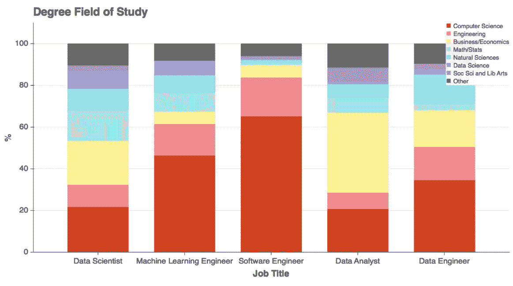](https://medium.com/indeed-engineering/where-do-data-scientists-come-from-fc526023ace)

**Source**: [“Where do Data Scientists Come From?”](https://medium.com/indeed-engineering/where-do-data-scientists-come-from-fc526023ace)

但是最终，他们被期望获得足够数量的编程/软件工程，以对他们的组织和业务产生真正的影响。

[](/being-a-data-scientist-does-not-make-you-a-software-engineer-c64081526372) [## 成为数据科学家并不能让你成为软件工程师！

### 如何构建可扩展的机器学习系统——第 1/2 部分

towardsdatascience.com](/being-a-data-scientist-does-not-make-you-a-software-engineer-c64081526372) 

大多数现代编程语言和软件工程范例的核心是什么？

[面向对象编程。](https://www.webopedia.com/TERM/O/object_oriented_programming_OOP.html)

但是对于外行人来说，OOP 的[原则起初可能感觉有点陌生，甚至有点吓人。因此，数据科学家，其背景不包括计算机编程的正式培训，可能会发现 OOP 的概念在他们的日常工作中有些难以接受。](https://realpython.com/python3-object-oriented-programming/)

流行的 MOOCs 和数据科学/人工智能/人工智能训练营也没有帮助。

他们试图给初露头角的数据科学家一种混合汤的味道，包括统计学、数值分析、科学编程、机器学习(ML)算法、可视化，甚至可能还有一点 web 框架来部署这些 ML 模型。

几乎所有这些都可以学习和实践，即使没有严格遵守 OOP 的原则。事实上，年轻的数据科学家渴望学习最新的神经网络架构或最酷的数据可视化技术，如果被 OOP 编程范式的所有细节轰炸，他们甚至会感到窒息。因此，MOOCs 通常不会在他们的数据科学课程中混合或强调它。

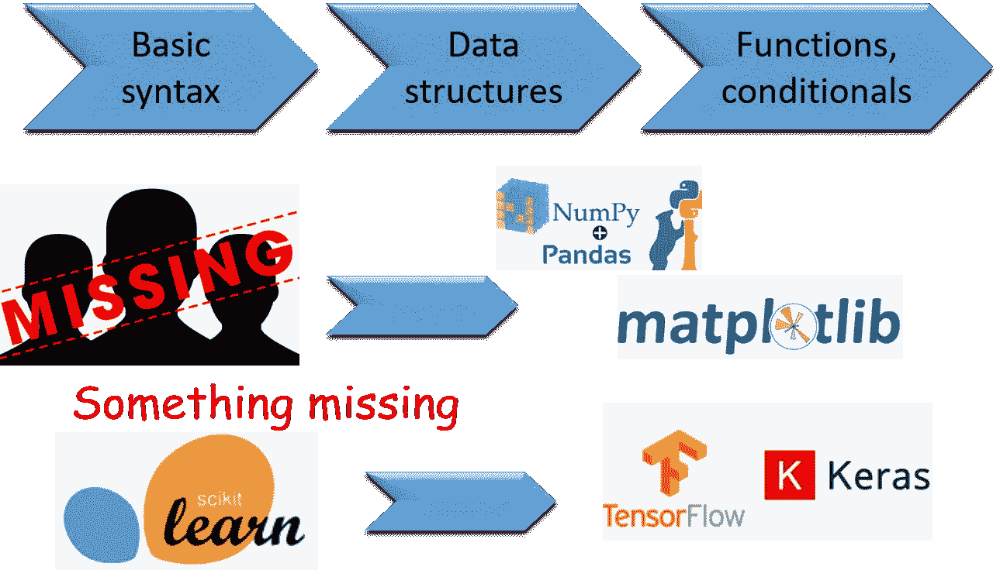

# 一个简单的例子(还有更多…)

让我用 Python 来举例说明这个问题，因为它是数据科学和机器学习任务发展最快的语言。

## 算术示例

如果让你写一个程序来实现涉及两个数`a`和`b`的加、减、乘、除，你最有可能做什么？

你很可能会打开一个 Jupyter 笔记本，在一个单元格中键入以下内容，点击 *shift-enter* 并获得结果。

```
a+b
a-b
a*b
a/b
```

如果你喜欢用函数来整理东西，那么你可以这样做，

```
def add(a,b):
    return a+b
...
```

但是你会定义一个 Calc ***类*** 并把这些函数作为 ***方法*** 放在那个类里面吗？这些都是性质相似的操作，它们处理相似的数据。那么为什么不把它们封装在一个更高阶的对象中呢？为什么不是下面的代码？

```
class Calc:
    def __init__(self,a,b):
        self.a = a
        self.b = b
    def add(self):
        return self.a+self.b
    def sub(self):
        return self.a-self.b
    def mult(self):
        return self.a*self.b
    def div(self):
        return self.a/self.b
```

不，你不会这么做的。对于这个特殊的问题，这样做可能也没有意义。但是这个想法是有效的— *如果你有数据和函数(在 OOP 的说法中称为方法),它们可以逻辑地组合，那么它们应该封装在一个类中*。

但是对于一些简单的数值计算来说，快速得到答案看起来太麻烦了。那么，有什么意义呢？数据科学家的价值通常在于他们能否得到数据问题的正确答案，而不是他们在代码中使用了什么样的复杂对象。

## 数据科学家的例子

如果数据科学家不是以这种方式编码，难道不是吗，他们真的不需要使用这些精心设计的编程结构？

**错了。**

在没有意识到的情况下，数据科学家大量使用了 OOP 范例的好处。**无时无刻**。

还记得`import matplotlib.pyplot as plt`后的`plt.plot`吗？

那些**。**符号。你有一点面向对象编程的知识。就在那里。

或者，你还记得在 Jupyter 笔记本上学习很酷的技巧——在放一个点(.)，从而显示可以与一个*对象*关联的所有功能？像这样，

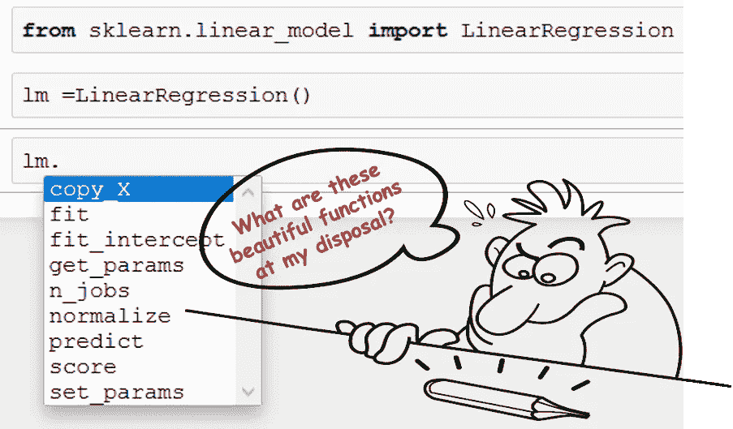

## 这个例子说明了什么？

这个例子显示了对逻辑一致性的坚持。

如果没有 OOP 范例，我们将不得不把这些函数命名为`linear_model_linear_regression_fit`、`linear_model_linear_regression_predict`等等。它们不会被归入一个共同的逻辑单元。

为什么？因为它们是不同的函数，处理不同的数据集。当`fit`函数期望训练特征和目标时，`predict`只需要一个测试数据集。`fit`函数不会返回任何结果，而`predict`会返回一组预测。

**那么，为什么它们在同一个下拉菜单**下可见呢？尽管有所不同，但它们有一个共同点，即*它们都可以被想象为整个线性回归过程的重要组成部分* —我们希望线性回归能够拟合一些训练数据，然后能够预测未来的未知数据。我们还希望线性回归模型能为我们提供一些关于拟合程度的指示，通常是以一个称为回归系数或 R 的单一数字量或分数的形式。正如我们所料，我们看到一个函数`score`，它确切地返回 R 数，也在`fit`和`predict`附近。

整洁干净，不是吗？

> 数据、函数和参数共存于单个逻辑单元中。

[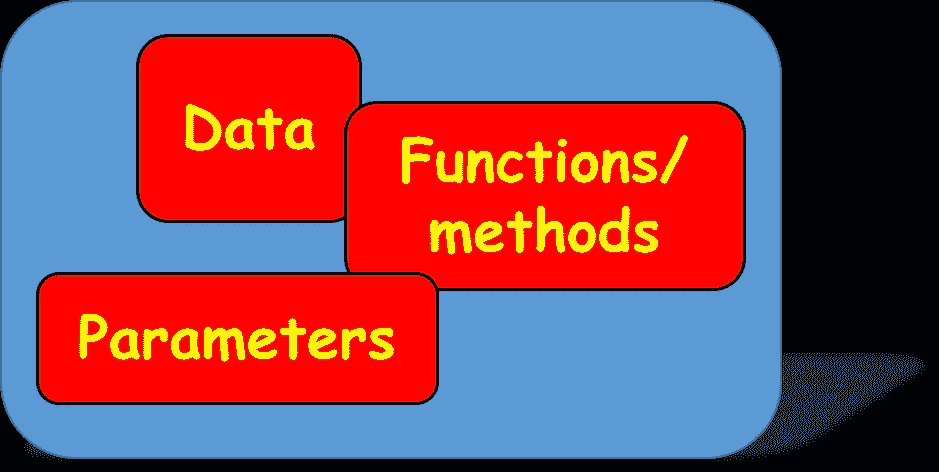](https://python.swaroopch.com/oop.html)

## 这是如何实现的？

这是可能的，因为**我们超越了个体差异，将线性回归视为一个高层次的过程**，并决定它应该服务于什么样的基本操作以及它应该告知用户什么样的关键参数。

我们创建了一个名为`LinearRegression`的高级类，在这个类下，所有那些明显不同的功能可以被组合在一起，以便于记账和增强可用性。

一旦我们从库中导入了这个类，我们只需要创建这个类的一个实例——我们称之为`lm`。就是这样。我们可以通过新定义的实例`lm`访问该类下的所有函数。

如果我们对函数的一些内部实现不满意，我们可以对它们进行处理，并在修改后将其重新附加到主类。只有内部函数的代码会改变，其他都不会改变。

看，这听起来多有逻辑性和可伸缩性？

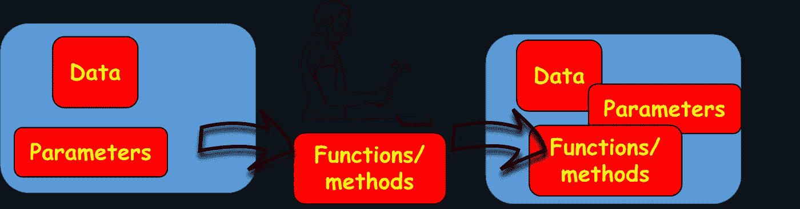

# 创建您自己的 ML 估计器

传统的 OOP 入门会有很多使用类的例子，比如动物、运动、几何形状。

但是对于数据科学家来说，**为什么不使用他们每天在代码中使用的一个对象的例子来说明这些概念呢——机器学习估计器**。就像 Scikit-learn 库中的`lm`对象，如上图所示。

## 一个很好的、古老的线性回归估计器——有所改变

[**在这个 Github repo**](https://github.com/tirthajyoti/Machine-Learning-with-Python/tree/master/OOP_in_ML) 中，我一步一步地展示了如何遵循 OOP 范例构建一个简单的线性回归(单变量或多变量)估计器类。

没错，就是好老的线性回归类。它有 Scikit-learn 的`LinearRegression`类中常见的`fit`和`predict`方法。但是它有更多的功能。这里先睹为快…


是的，这个估计器比 Scikit-learn 估计器更丰富，因为除了标准的`fit`、`predict`和 R `score`函数之外，**它还有许多其他实用程序，这些实用程序对于线性回归建模任务**是必不可少的。

尤其是对于数据科学家和统计建模人员来说，他们不仅想预测，而且也想

*   测量[拟合优度](https://blog.minitab.com/blog/adventures-in-statistics-2/regression-analysis-how-do-i-interpret-r-squared-and-assess-the-goodness-of-fit)，
*   验证线性回归的[假设](https://statisticsbyjim.com/regression/ols-linear-regression-assumptions/)，
*   检查数据中的多重共线性，或
*   检测[异常值](https://stattrek.com/regression/influential-points.aspx)。

[](/how-do-you-check-the-quality-of-your-regression-model-in-python-fa61759ff685) [## 如何在 Python 中检查你的回归模型的质量？

### 线性回归在统计学习中根深蒂固，因此必须检查模型的“良好性”

towardsdatascience.com](/how-do-you-check-the-quality-of-your-regression-model-in-python-fa61759ff685) 

## 你如何开始构建类？

我们从一个简单的代码片段开始定义这个类。我们把它命名为——`MyLinearRegression`。

这里，`self`表示对象本身，`__init__`是一个[特殊函数，当在代码中的某个地方创建了一个类的实例](https://micropyramid.com/blog/understand-self-and-__init__-method-in-python-class/)时，就会调用这个函数。顾名思义，`__init__`可以用来初始化带有必要参数(如果有的话)的类。

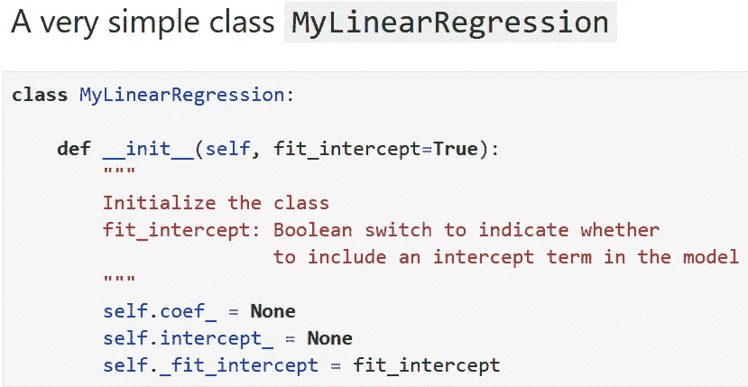

我们可以添加一个简单的描述字符串来保持它的真实性:-)

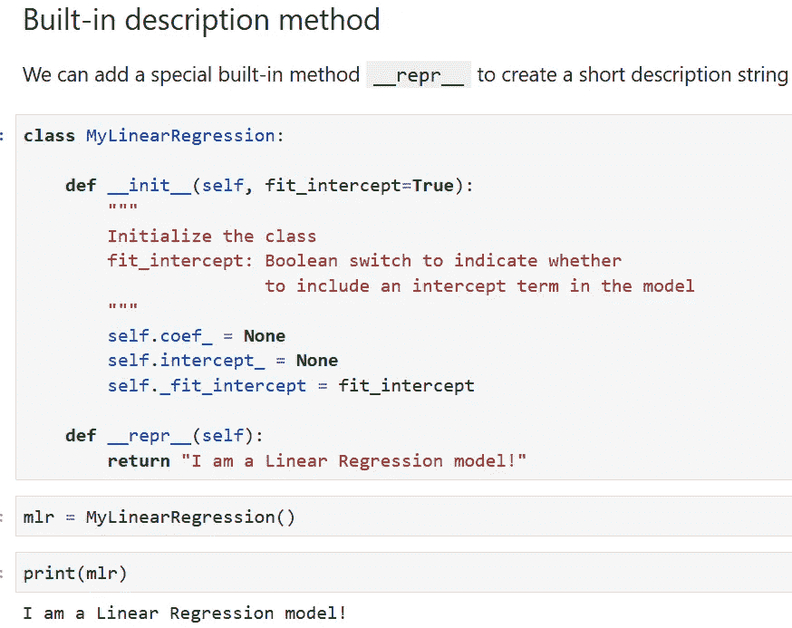

接下来我们添加核心的`fit`方法。注意 [**docstring**](https://www.geeksforgeeks.org/python-docstrings/) 描述了该方法的用途、它做什么以及它期望什么类型的数据。所有这些都是好的面向对象原则的一部分。

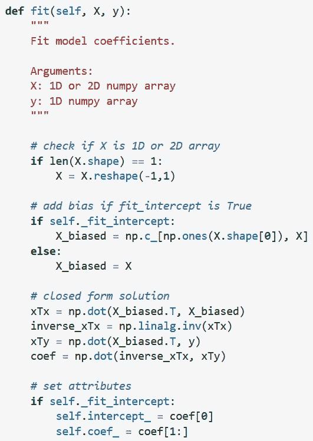

我们可以生成一些随机数据来测试我们的代码。我们创建一个两个变量的线性函数。这是数据的散点图。

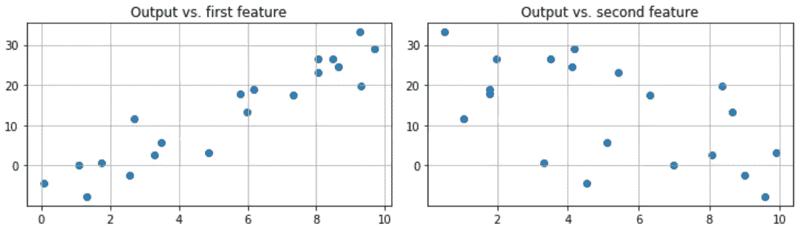

现在，我们可以创建一个名为`mlr`的类`MyLinearRegression`的实例。如果我们试图打印回归参数会发生什么？

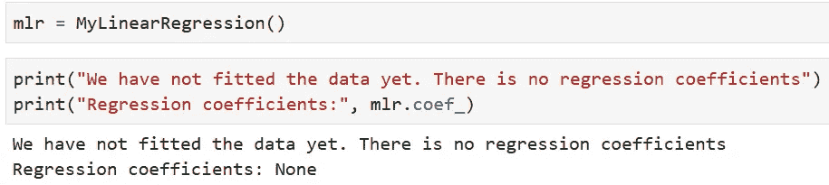

因为`self.coef_`被设置为`None`，我们在试图打印`mlr.coef_`时得到相同的结果。请注意，self 一旦被创建，就变成了类实例的同义词。

但是`fit`的定义包括在拟合完成后设置属性。所以，我们可以直接调用`mlr.fit()`，打印出拟合的回归参数。

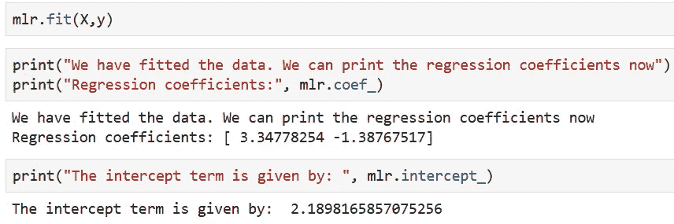

## 最典型的`Predict`方法

拟合之后，就是预测。我们可以很容易地将该方法添加到我们的回归类中。

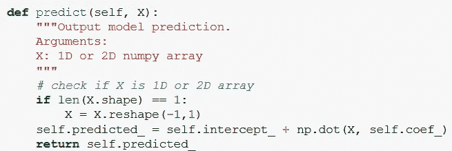

## 如果我们想添加一个(或几个)绘图实用函数呢？

在这一点上，我们开始扩展我们的回归类，并且**添加了标准 scikit-learn 类中没有的东西！**例如，我们总是希望看到拟合值与地面真实值相比如何。为此创建一个函数很容易。我们就叫它`plot_fitted`。

注意，[方法类似于普通函数](https://stackoverflow.com/questions/155609/whats-the-difference-between-a-method-and-a-function/29379748)。它可以接受额外的参数。这里，我们有一个参数`reference_line`(默认设置为`False`)，它在拟合与真实曲线上绘制了一条 45 度参考线。另外，请注意 docstring 描述。

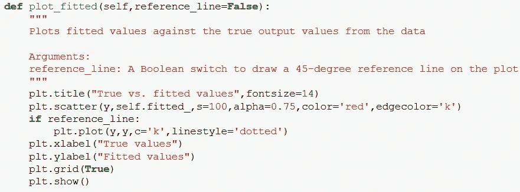

我们可以通过简单地执行以下操作来测试方法`plot_fitted`,

```
m = MyLinearRegression()
m.fit(X,y)
m.plot_fitted()
```

或者，我们可以选择画一条参考线，

```
m.plot_fitted(reference_line=True)
```

我们得到以下情节！

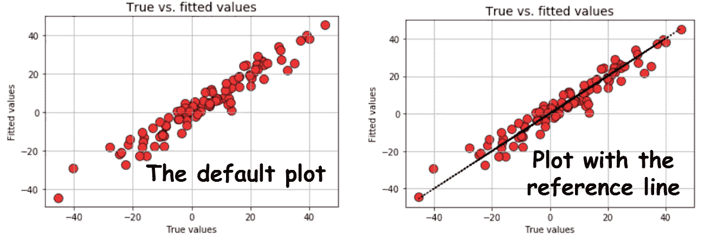

一旦我们明白我们可以添加任何有用的方法来处理相同的数据(一个训练集)，与相同的目的(线性回归)相关，就没有束缚我们的想象力了！我们把下面的情节加到我们班怎么样？

*   **Pairplots** (绘制所有特性和输出之间的成对关系，很像 R 中的`pairs`函数)
*   **拟合与残差**图(这属于线性回归的诊断图，即检查基本假设的有效性)
*   **直方图**和**分位数-分位数(Q-Q)** 残差图(检查误差分布的正态假设)

## 继承——不要让你的主类负担过重

当我们热情地计划将实用方法添加到类中时，我们认识到这种方法可能会使主类的代码非常长，并且难以调试。为了解决这个难题，我们可以利用 OOP 的另一个美丽的原则— [**继承**](https://www.geeksforgeeks.org/inheritance-in-python/) 。

[](https://www.geeksforgeeks.org/inheritance-in-python/) [## Python 中的继承- GeeksforGeeks

### 继承是一个类从另一个类派生或继承属性的能力。…的好处

www.geeksforgeeks.org](https://www.geeksforgeeks.org/inheritance-in-python/) 

我们进一步认识到**并非所有的图都属于同一类型**。配对图和拟合与真实数据图具有相似的性质，因为它们只能从数据中获得。其他图与拟合优度和残差相关。

因此，我们可以用这些绘图函数创建两个独立的类— `Data_plots`和`Diagnostic_plots`。

你猜怎么着！我们可以根据这些实用程序类 来定义我们的主`MyLinearRegression`类 ***。那是继承的一个例子。***

注意:这看起来和标准的父类-子类继承实践有点不同，但是语言的相同特性在这里被用来保持主类的整洁和紧凑，同时从其他类似构造的类继承有用的方法。

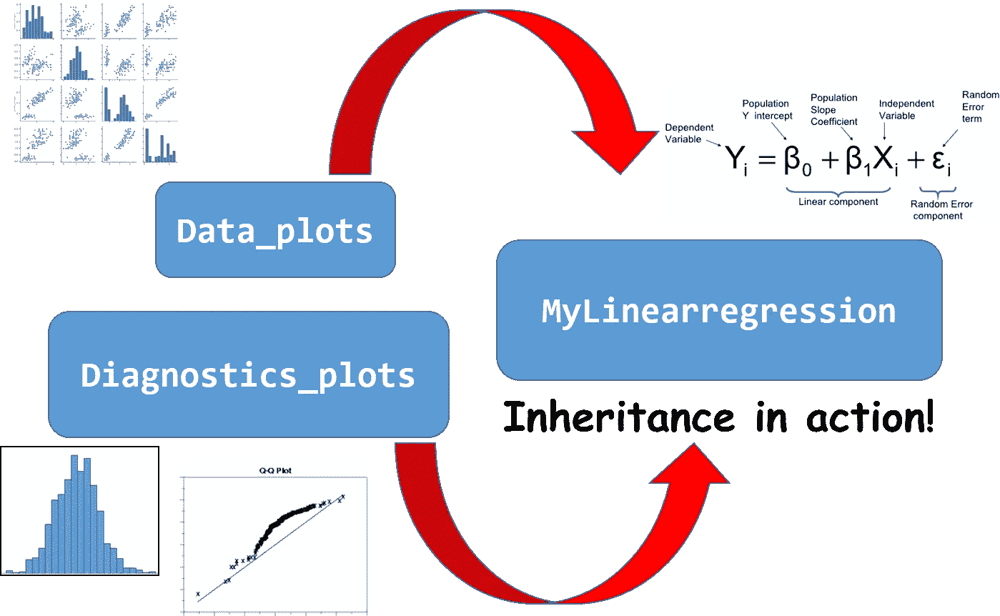

注意以下代码片段仅用于说明。请使用上面的 Github 链接查看实际代码。

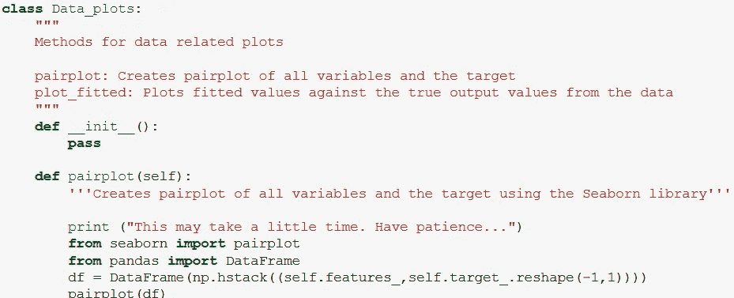

`Data_plots` class

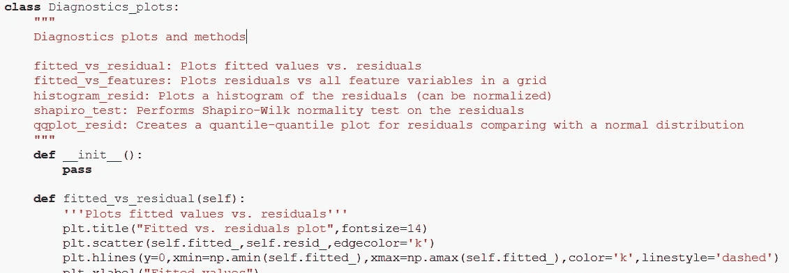

Diagnostics_plots class

而`MyLinearregression`的定义只是略有改变，

```
**class MyLinearRegression(Diagnostics_plots,Data_plots**):

    def __init__(self, fit_intercept=True):
        self.coef_ = None
        self.intercept_ = None
        self._fit_intercept = fit_intercept
...
```

通过简单地将`Data_plots`和`Diagnostics_plots`的引用传递给`MyLinearRgression`类的定义，我们继承了这些类的所有方法和属性。

现在，为了检查误差项的正态假设，我们可以简单地拟合模型并运行这些方法。

```
m = MyLinearRegression() # A brand new model instance
m.fit(X,y) # Fit the model with some data**m.histogram_resid()** # Plot histogram of the residuals
**m.qqplot_resid()** # Q-Q plot of the residuals
```

我们得到，

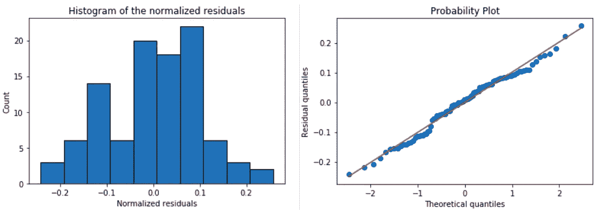

同样，代码分离在这里起作用。您可以修改和改进核心绘图实用程序，而无需触及主类。高度灵活且不易出错的方法！

# 利用 OOP 的强大功能做更多事情

我们不会进一步详述我们可以添加到`MyLinearRegression`中的各种实用程序类和方法。可以 [**查看 Github 回购**](https://github.com/tirthajyoti/Machine-Learning-with-Python/tree/master/OOP_in_ML) 。

## 添加了其他类别

为了完整起见，我们补充说，

*   用于计算各种回归指标的类`Metrics`——SSE、SST、MSE、 *R* 和调整后的 *R* 。
*   一个类`Outliers`来绘制库克的距离、杠杆和影响图
*   计算方差膨胀因子的类`Multicollinearity`(VIF)

总而言之，这个宏伟的计划看起来如下:

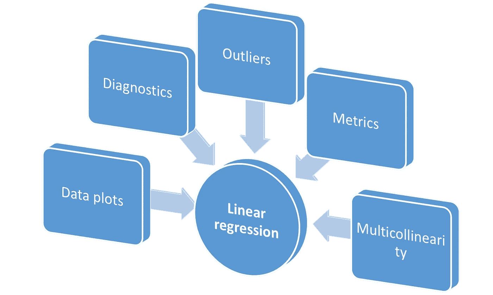

这个类比 Scikit-learn 的 LinearRegression 类丰富吗？你决定吧。

## 通过创建分组实用程序来添加语法糖

一旦你继承了其他类，它们的行为就像你熟悉的 Python 模块一样。因此，您可以向主类添加实用方法，以便一起执行子类中的多个方法。

例如，以下方法一次运行所有常规诊断检查。注意我们是如何通过放置一个简单的**来访问绘图方法的。点号**即`Diagnostics_plot.histogram_resid`。就像从熊猫或 NumPy 库中访问一个函数一样！

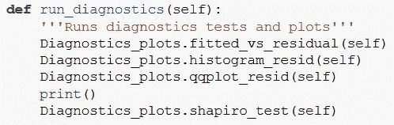

run_diagnostics method in the main class

这样，我们可以在拟合数据后用一行代码运行所有的诊断。

```
m = MyLinearRegression() # A brand new model instance
m.fit(X,y) # Fit the model with some data**m.run_diagnostics()**
```

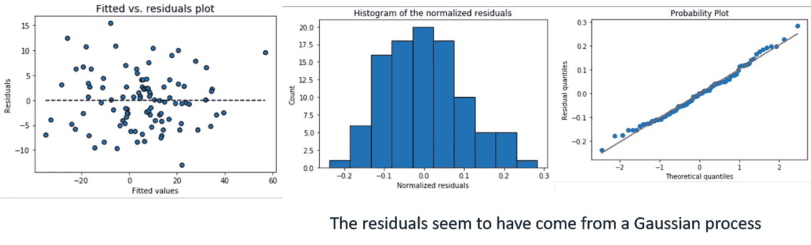

类似地，您可以在一个实用程序方法中添加所有异常值图。

# 模块化—将类作为模块导入

虽然这不是一个规范的 OOP 原则，但是遵循 OOP 范例的本质优势是 [**能够模块化你的代码**](https://atomicobject.com/resources/oo-programming/encapsulation-modularity) 。

您可以在一个标准的 Jupyter 笔记本上试验和开发所有这些代码。但是为了实现最大的模块化，可以考虑将笔记本转换成独立的可执行 Python 脚本(扩展名为. py)。一个好的做法是，从这个文件中删除所有不必要的注释和测试代码，只保留在一起的类。

[**这里是我为这篇文章整理的脚本**](https://github.com/tirthajyoti/Machine-Learning-with-Python/blob/master/OOP_in_ML/Class_MyLinearRegression.py) 的链接。

一旦你这样做了，你就可以从一个完全不同的笔记本中导入`MyLinearRgression`类。这通常是**测试代码的首选方式**，因为这不会触及核心模型，而只是用各种数据样本和功能参数来测试它。

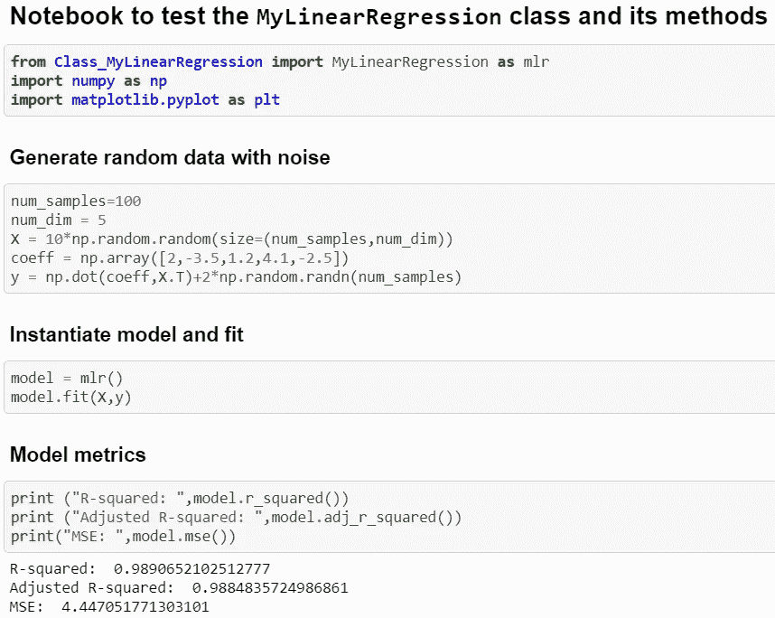

此时，您可以考虑将这个 Python 脚本放在 Github 上，创建一个 Setup.py 文件，创建适当的目录结构，并将其作为独立的线性回归包发布，该包可以进行拟合、预测、绘图、诊断等工作。

当然，你必须添加许多[文档串描述](https://www.geeksforgeeks.org/python-docstrings/)，函数用法的例子，[断言检查](https://airbrake.io/blog/python-exception-handling/python-assertionerror)，和[单元测试](http://softwaretestingfundamentals.com/unit-testing/)来使它成为一个好的包。

> 但是作为一名数据科学家，现在你已经增加了一项重要的技能——遵循 OOP 原则的软件开发。

这并不困难，是吗？

# 收场白

## 动机和相关文章

为了写这篇文章，我受到了[这篇精彩文章](https://dziganto.github.io/classes/data%20science/linear%20regression/machine%20learning/object-oriented%20programming/python/Understanding-Object-Oriented-Programming-Through-Machine-Learning/)的启发，这篇文章在机器学习的背景下更详细地探讨了 Python 中 OOP 的概念。

[](https://dziganto.github.io/classes/data%20science/linear%20regression/machine%20learning/object-oriented%20programming/python/Understanding-Object-Oriented-Programming-Through-Machine-Learning/) [## 通过机器学习理解面向对象编程

### 面向对象编程(OOP)并不容易理解。你可以一个接一个的看教程，筛选…

dziganto.github.io](https://dziganto.github.io/classes/data%20science/linear%20regression/machine%20learning/object-oriented%20programming/python/Understanding-Object-Oriented-Programming-Through-Machine-Learning/) 

我写过一篇类似的文章，在深度学习的背景下，触及了更基本的方法。看看这里，

[](/how-a-simple-mix-of-object-oriented-programming-can-sharpen-your-deep-learning-prototype-19893bd969bd) [## 面向对象编程的简单混合如何增强你的深度学习原型

### 通过混合面向对象编程的简单概念，如函数化和类继承，您可以添加…

towardsdatascience.com](/how-a-simple-mix-of-object-oriented-programming-can-sharpen-your-deep-learning-prototype-19893bd969bd) 

## 课程？

我试着寻找相关课程，发现如果你正在使用 Python，就很少。大多数软件工程课程都是用 Java 教授的。这里有两个可能会有帮助，

*   [Python 中数据科学家的软件工程](https://www.datacamp.com/courses/software-engineering-for-data-scientists-in-python)
*   [Python 类和继承](https://www.coursera.org/learn/python-classes-inheritance/)

如果您有任何问题或想法要分享，请联系作者在[**tirthajyoti【AT】Gmail . com**](mailto:tirthajyoti@gmail.com)。此外，您可以查看作者的 GitHub 资源库中其他有趣的 Python、R 或 MATLAB 代码片段和机器学习资源。如果你像我一样，对机器学习/数据科学充满热情，请随时[在 LinkedIn 上添加我](https://www.linkedin.com/in/tirthajyoti-sarkar-2127aa7/)或[在 Twitter 上关注我。](https://twitter.com/tirthajyotiS)

[](https://www.linkedin.com/in/tirthajyoti-sarkar-2127aa7/) [## Tirthajyoti Sarkar - Sr .首席工程师-半导体、人工智能、机器学习- ON…

www.linkedin.com](https://www.linkedin.com/in/tirthajyoti-sarkar-2127aa7/)