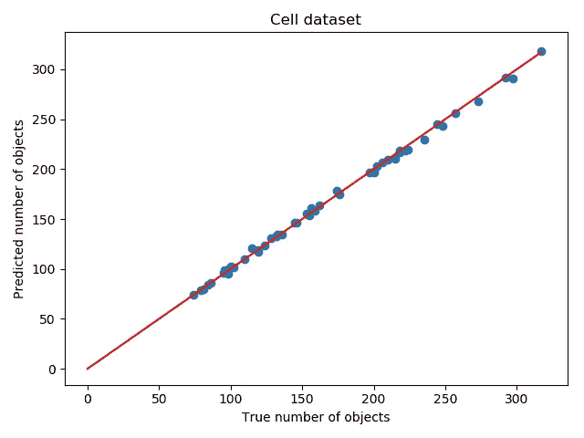

# 用卷积神经网络估计密度图进行目标计数

> 原文：<https://towardsdatascience.com/objects-counting-by-estimating-a-density-map-with-convolutional-neural-networks-c01086f3b3ec?source=collection_archive---------5----------------------->

*由* [撰写*托马什加成*](/@t.bonus) *和* [*托马什戈兰*](/@t.golan) *。*


# 介绍

对图像中的物体进行计数是计算机视觉的基本任务之一。它有很多应用，特别是在:

*   微生物学(如在培养皿中计数细菌菌落)；
*   监视(如清点人数)；
*   农业(如统计水果或蔬菜)；
*   医学(如组织病理学图像中肿瘤细胞的计数)；
*   野生动物保护(如清点动物)。

对我们人类来说，计数对象的任务相对容易，但对计算机视觉算法来说，这可能是一个挑战，特别是当一个对象的不同实例在形状、颜色、纹理或大小方面有很大差异时。如果一个问题从算法的角度来看很复杂，但从人类的角度来看很简单，那么机器学习方法可以成为一个答案。

目前，深度学习(DL)方法在数字图像处理中提供了最先进的性能。然而，它们需要收集大量带注释的数据，这通常很耗时，并且容易出现标注错误。

使用 DL 计数对象的常见方式是首先使用卷积神经网络(如 GCNet [1])检测它们，然后计数所有找到的实例。这是有效的，但需要边界框注释，如图 1(左)所示，这是很难获得的。为了克服这个问题，替代方法利用了对象位置的点状注释(见图 1 右侧)，收集起来便宜得多。


Fig. 1: Example annotated images from COCO [2] (left) and Mall [3–6] (right) datasets.

在这篇文章中，我们描述了我们的研究计数图像中的对象与全卷积网络(FCN)，训练数据与点状注释。在接下来的部分中，我们将详细介绍我们使用的模型，以及实现、考虑的数据集和我们获得的结果。

# 方法

我们从[7]中描述的方法开始。主要思想是通过估计密度图来间接计数对象。第一步是准备训练样本，以便每个图像都有相应的密度图。让我们考虑图 2 所示的例子。


Fig. 2: An example image (left) and its annotation (right) from Mall dataset.

图 2(左)中呈现的图像用行人头部位置的点来标注(图 2 右)。密度图是通过应用与高斯核的卷积而获得的(并被归一化，以便对其积分来给出对象的数量)。上述示例的密度图如图 3 所示。


Fig. 3: The visualization of a density map generated with a Gaussian filter.

现在，目标是训练一个完全卷积的网络，将图像映射到密度图，稍后可以集成该密度图以获得对象的数量。到目前为止，我们已经考虑了两种 FCN 架构:U-Net [8]和全卷积回归网络(FCRN) [7]。

## 优信网

U-Net 是一种广泛用于图像分割的 FCN，经常应用于生物医学数据。它具有类似自动编码器的结构(见图 4)。输入图像由卷积层块处理，之后是汇集层(下采样)。这一过程在随后的模块输出上重复几次，如图 4 的左侧所示。这样，网络对输入图像的关键特征进行编码(和压缩)。U-Net 的第二部分是对称的，但是池层被上采样所取代，因此输出尺寸与输入图像的尺寸相匹配。来自下采样部分中的较高分辨率层的信息被传递到上采样部分中的相应层，这允许重新使用所学习的较高级特征来更精确地解码收缩层。


Fig. 4: U-Net architecture.

## FCRN

全卷积回归网络(FCRN)是在[7]中提出的。架构与 U-Net 非常相似。主要区别在于，来自下采样部分的较高分辨率层的信息没有被直接传递到上采样部分中的相应层。在该论文中提出了两种网络:FCRN-A 和 FCRN-B，它们在下采样强度方面不同。FCRN-A 在每个卷积层执行池化，而 FCRN-B 每隔一层执行一次池化。

# 履行

我们的实现可以在[这里找到。它基于狄威·Xi 的 GitHub 的代码，但是用 PyTorch 代替了 Keras。](https://github.com/NeuroSYS-pl/objects_counting_dmap)

目前，U-Net 和 FCRN-A 已经实施。它们都使用固定滤波器大小为 3×3 的三个下采样和三个上采样卷积块。默认情况下，U-Net 的每个块中有两个卷积层，FCRN-A 有一个。对于 U-Net，我们为所有卷积层保持恒定数量的滤波器，而对于 FCRN-A，我们在每个后续层增加该数量，以补偿池化(不像 U-Net 那样直接传递)导致的更高分辨率信息的损失。

## 卷积块

构建 U-Net 和 FCRN 的基础是一个卷积模块，由卷积层、批量归一化和激活函数组成:

`conv_block`函数创建`N`个卷积层，每层使用`ReLU`激活函数和批量标准化的`OUT`个滤波器。

## FCRN——一座建筑

通过堆叠多个这样的块，然后是下采样(最大池)或上采样层，获得 FCRN-A 架构:

## U-Net 架构

U-Net 还要求将下采样路径的输出与上采样部分中相应层的输入连接起来，这由 ConvCat 类执行:

U-Net 下采样部分的构建方式与 FCRN 的情况相同:

然而，如上所述，上采样利用了`ConvCat`类:

# 数据

我们在研究中考虑了三个数据集。它们都标注了点状物体的位置，因此我们可以直接使用它们来生成所有图像的密度图，并测试上述方法。

## 数据预处理

我们提供了`[get_data.py](https://github.com/NeuroSYS-pl/objects_counting_dmap/blob/master/get_data.py)`脚本，将所有考虑的数据集预处理成存储在 HDF5 文件中的通用格式。每个条目由一幅图像和一个用`generate_label`函数生成的相应标签(密度图)组成；

请注意，在应用高斯滤波器之前，我们为每个对象位置设置了值 100，因此在整合密度图以获得图像上存在的对象数量时，结果必须正确归一化。

*出于可视化目的，我们对图像上呈现的密度图使用了比我们实际应用于训练数据集的密度图更高的标准偏差值。*

## 荧光细胞数据集

荧光细胞(FC)数据集由视觉几何组(VGG)使用[9]的计算框架生成。可以从 [VGG 网站](http://www.robots.ox.ac.uk/~vgg/research/counting/index_org.html)下载。图 5 中呈现了示例图像以及生成的密度图。


Fig. 5: An example image and corresponding density map (FC dataset).

## UCSD 行人数据集

UCSD 数据集[10]包含在加州大学圣地亚哥分校的人行道上记录的行人视频。它广泛应用于各种问题，如计数、运动分割和行人行为分析。可以从[统计可视化计算实验室网站](http://www.svcl.ucsd.edu/projects/peoplecnt/)下载。图 6 中呈现了示例图像以及生成的密度图。


Fig. 6: An example image and corresponding density map (UCSD dataset).

## 商城数据集

购物中心数据集[3–6]是为人群计数和分析而创建的。它包含一段由公开的网络摄像头录制的视频。每一帧都标注了每个行人的头部位置。可以从[这里](http://personal.ie.cuhk.edu.hk/~ccloy/downloads_mall_dataset.html)下载。图 3 中呈现了示例图像以及生成的密度图。

通过整合估计的密度图对图像中的对象进行计数的方法已经应用于荧光细胞和 UCSD 数据集[11]。我们选择 mall 数据集作为该方法的测试数据集。

# 结果

如上所述，测试了两个模型，即 U-Net 和 FCRN。使用 U-Net，我们能够获得更准确的结果，因此下面我们将展示使用该架构获得的结果。

在下面的表格中，我们的结果的总结是针对每个数据集呈现的，具有验证集中对象的最小和最大数量以及我们获得的平均绝对误差(MAE)。

我们使用 MAE 的标准定义:


其中 *ti* 为真， *pi* 为第 *i* 个样本的预测对象数。

```
 Dataset      | Min. #objects | Max. #objects | MAE  
 -------------------|---------------|---------------|------ 
  Fluorescent cells |            74 |           317 | 1.89 
  UCSD              |            20 |            47 | 2.27 
  Mall              |            20 |            48 | 2.86
```

图 7-9 显示了每个验证样品的真实( *ti* )与预测( *pi* )数量的散点图。正如预期的那样，尽管在单个图像中有大量的对象，该模型也能很好地处理相对简单的荧光细胞数据集。然而，在计算行人时，偏差要高得多。这可能是由于这样一个事实，即使是人类贴标机也很难决定站在植物后面的人还是从角落后面勉强可见的人应该被计算在内。

这只是我们研究对象计数的开始。我们期待进行更多的实验，包括尝试不同的架构和方法。



Fig 7\. True vs predicted counts on fluorescent cells validation dataset.


Fig 8\. True vs predicted counts on UCSD validation dataset.


Fig 9\. True vs predicted counts on mall validation dataset.

# 参考

[1]曹，杨，徐，张，林，魏，胡海红(2019)。GCNet:非局域网络满足压缩激励网络及其他。 *arXiv 预印本 arXiv:1904.11492* 。

[2]林、T. Y .、梅尔、m .、贝隆吉、s .、海斯、j .、p .、拉马南、d .……、齐特尼克、C. L. (2014 年 9 月)。微软 coco:上下文中的公共对象。在*欧洲计算机视觉会议*(第 740–755 页)。斯普林格，查姆。

[3]钱来，龚，s .，&项，T. (2013).从半监督到转移人群计数。IEEE 计算机视觉国际会议论文集(第 2256–2263 页)。

[4]陈，龚，s，向，t .，&钱乐昌(2013)。年龄和人群密度估计的累积属性空间。在*IEEE 计算机视觉和模式识别会议论文集*(第 2467-2474 页)。

[5]罗正昌，陈，龚，龚，向，唐(2013)。人群计数和分析:方法和评估。在*人群的建模、模拟和视觉分析*(第 347–382 页)。纽约州纽约市斯普林格。

[6]陈，李，陈春春，龚，向，唐(2012 年 9 月)。用于局部人群计数的特征挖掘。在 *BMVC* (第 1 卷，№2，第 3 页)。

[7]x .狄威、J. A .诺布尔和 a .齐塞曼(2015 年)。用完全卷积回归网络进行显微细胞计数。在*第一届深度学习研讨会上，医学图像计算和计算机辅助介入(MICCAI)* 。

[8] Ronneberger，o .，Fischer，p .，& Brox，T. (2015 年 10 月)。生物医学图像分割的卷积网络。在*国际医学图像计算和计算机辅助介入会议*(第 234-241 页)。斯普林格，查姆。

[9] Lehmussola，a .，Ruusuvuori，p .，Selinummi，j .，Huttunen，h .，& Yli-Harja，O. (2007 年)。用细胞群模拟荧光显微镜图像的计算框架。 *IEEE 医学影像汇刊*， *26* (7)，1010–1016。

[10]陈亚波，梁，张淑珍，，N. (2008 年 6 月).保护隐私的人群监控:计数没有人模型或跟踪的人。在 2008 年 IEEE 计算机视觉和模式识别会议上(第 1-7 页)。IEEE。

[11] Lempitsky，v .，& Zisserman，A. (2010 年)。学习计数图像中的物体。在*神经信息处理系统的进展*(第 1324-1332 页)。