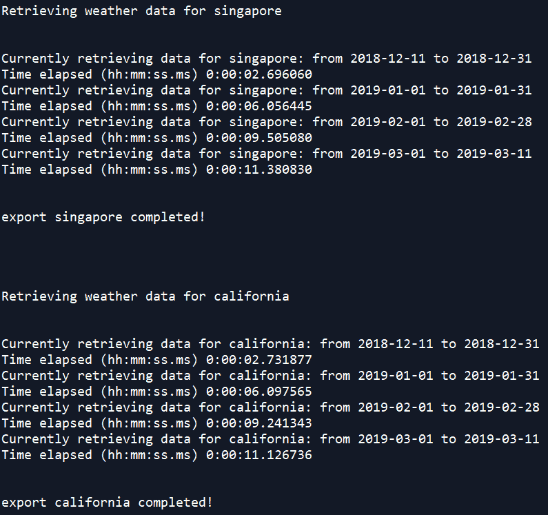
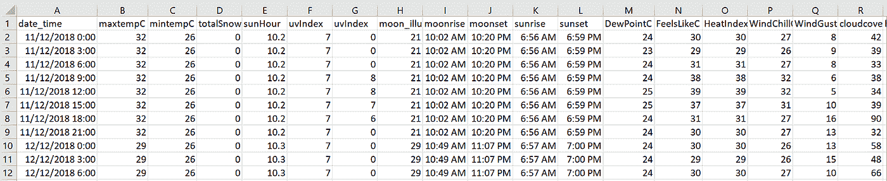

# 使用 Python 获取 CSV 格式的历史天气预报数据

> 原文：<https://towardsdatascience.com/obtain-historical-weather-forecast-data-in-csv-format-using-python-5a6c090fc828?source=collection_archive---------4----------------------->


credit: [https://www.pexels.com/photo/black-windmill-33493/](https://www.pexels.com/photo/black-windmill-33493/)

最近在做一个机器学习项目，需要多个城市的**历史天气预报数据。尽管进行了大量的研究，我还是很难找到好的数据源。大多数网站只允许访问过去两周的历史数据。如果需要更多，需要付费。在我的例子中，我需要五年的数据——每小时的历史预测，这可能很昂贵。**

# **概述……**

**1。免费—至少在试用期内**

不需要提供信用卡信息。

**2。灵活**

灵活改变预测时间间隔，时间段，地点。

**3。可重复**

易于在生产阶段复制和实施。

最后，我决定使用来自世界天气在线的数据。这花了我不到两分钟的时间订阅免费试用高级 API——无需填写信用卡信息。(截至 2019 年 5 月 30 日，60 天内每天 500 次免费请求)。


[https://www.worldweatheronline.com/developer/signup.aspx](https://www.worldweatheronline.com/developer/signup.aspx)

您可以在这里尝试 JSON 或 XML 格式的请求。结果是嵌套的 JSON，在输入 ML 模型之前需要做一些预处理工作。因此，我写了一些[脚本](https://github.com/ekapope/WorldWeatherOnline)来将它们解析成熊猫数据帧，并保存为 CSV 以备后用。

# 介绍 wwo-hist 包

该 [wwo-hist 包](https://pypi.org/project/wwo-hist/)用于从[世界天气在线](https://www.worldweatheronline.com/developer/api/historical-weather-api.aspx)中检索历史天气数据并解析成 pandas DataFrame 和 CSV 文件。

输入: api_key，location_list，start_date，end_date，frequency

**输出:**位置名称. csv

**输出列名:** date_time，maxtempC，mintempC，totalSnow_cm，sunHour，uvIndex，uvIndex，moon_illumination，moonrise，moonset，sunrise，sunset，DewPointC，FeelsLikeC，HeatIndexC，WindChillC，WindGustKmph，cloudcover，湿度，precipMM，气压，tempC，能见度，winddirDegree，windspeedKmph

## 安装软件包:

```
pip install **wwo-hist**
```

[](https://pypi.org/project/wwo-hist/) [## 世界历史

### 这个软件包是用来检索和转换历史天气数据从 www.worldweatheronline.com 到熊猫…

pypi.org](https://pypi.org/project/wwo-hist/) 

## 导入包:

```
from **wwo_hist** import **retrieve_hist_data**
```

## 设置工作目录以存储输出 csv 文件:

```
import os
os.chdir(".\YOUR_PATH")
```

## **示例代码:**

指定输入参数并调用***retrieve _ hist _ data()****。*有关参数设置的更多信息，请访问 [my github repo](https://github.com/ekapope/WorldWeatherOnline) 。

这将从 2018 年 12 月 11 日到 2019 年 3 月 11 日**检索**新加坡**和**加州**的 **3 小时间隔**历史天气预报数据，并将输出保存到 hist_weather_data 变量和 **CSV** 文件中。**

```
frequency = 3
start_date = '11-DEC-2018'
end_date = '11-MAR-2019'
api_key = 'YOUR_API_KEY'
location_list = ['singapore','california']hist_weather_data = **retrieve_hist_data**(api_key,
                                location_list,
                                start_date,
                                end_date,
                                frequency,
                                location_label = False,
                                export_csv = True,
                                store_df = True)
```

****

**This is what you will see in your console.**

****

**Result CSV(s) exported to your working directory.**

****

**Check the CSV output.**

**你有它！详细的脚本也记录在 GitHub 上。**

**感谢您的阅读。请尝试一下，并让我知道你的反馈！**

**考虑在 [GitHub](https://github.com/ekapope) 、 [Medium](https://medium.com/@ekapope.v) 和 [Twitter](https://twitter.com/EkapopeV) 上关注我，在你的 feed 上获取更多文章和教程。如果你喜欢我做的，不要只按一次拍手按钮。击中它 50 次:D**