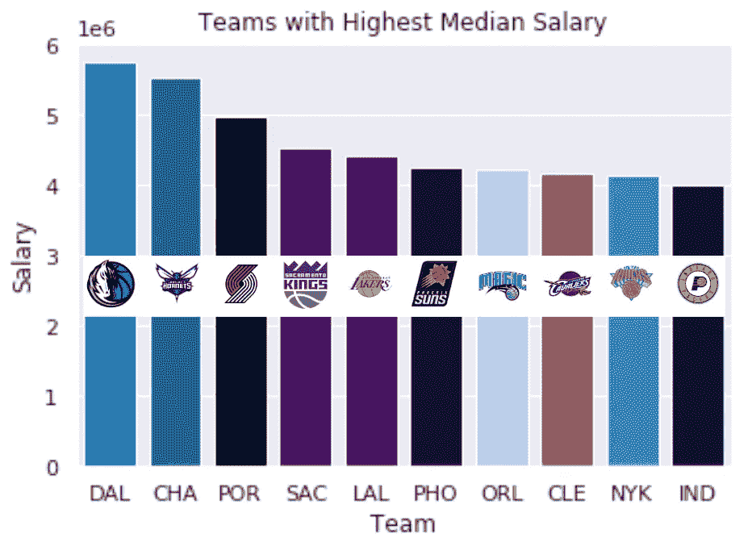
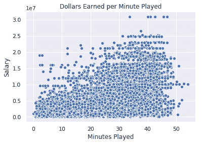
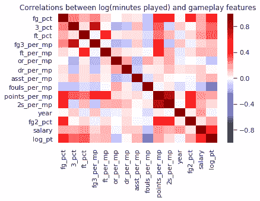

# 从数据中获得洞察力:优化 NBA 职业生涯

> 原文：<https://towardsdatascience.com/obtaining-insights-from-data-optimizing-an-nba-career-6605c9f07119?source=collection_archive---------18----------------------->

自从《Moneyball》出版以来，人们开始用更多的统计数据来审视体育，所以作为一个热衷于统计数据的体育迷，我想解决一个非典型的篮球问题:我们如何才能优化一个典型的篮球运动员在 NBA 的职业生涯？这个问题本身似乎是开放式的，所以为了更好地确定这个努力的范围，我将用赚到的钱来衡量成功。这篇文章的所有代码都可以在 https://github . com/aaronfredrick/B-Tier-Basketball-Career-Modeling 找到，作为参考和附加的上下文。

为了回答如何随着时间的推移使收入最大化的问题，我们必须知道哪支球队的工资中位数最高，并推荐我们的球员去那支球队。幸运的是，data.world 上的一位好心用户已经为每个球员的年薪和过去 30 年的球队策划了一个 csv。这使我们能够获得第一手信息——如下图所示的工资中位数最高的团队。

```
money_group = pay_df[[‘team’,’salary’]].groupby(by=[‘team’]).median()top10 = money_group.sort_values(by=’salary’, ascending=**False**).head(10)top10[‘Team’] = top10.index
top10[‘Salary’] = top10.salarycolor_order = [‘xkcd:cerulean’, ‘xkcd:ocean’, ’xkcd:black’, ’xkcd:royal purple’, ’xkcd:royal purple’, ‘xkcd:navy blue’, ’xkcd:powder blue’, ‘xkcd:light maroon’, ‘xkcd:lightish blue’, ’xkcd:navy’]sns.barplot(x=top10.Team, y=top10.Salary, palette=color_order).set_title(‘Teams with Highest Median Salary’)plt.ticklabel_format(style=’sci’, axis=’y’, scilimits=(0,0))
```

上面的代码让我们可以通过中值工资来可视化我们的高薪团队，加上一点点工作添加徽标，我们的最终图表如下所示:



很明显，我们的球员所在的球队并不是决定薪水的唯一因素，所以我们将探索盒子得分统计数据，看看什么有助于获得最高的收入。既然我们已经回答了第一个问题，是时候继续讨论篮球运动员更容易控制的事情了:他们可以提高哪些技能来获得更高的薪水。在探索了过去 20 年左右的拳击分数后，我将展示一种趋势，这种趋势会导致一个结论，即我们应该以最大限度地增加我们的比赛时间为目标，因为这给了我们的球员最大的潜力来获得更高的收入，并且在所述球员的控制下得多。



Dollars earned per average minutes played in the NBA

我获得的盒子分数是用 github 上的代码从 basketball-reference.com 刮来的。我发现了一种比以前更新的更有效的方式来抓取盒子分数，我强烈推荐使用熊猫图书馆的 read_html 函数。在下面的代码中，我将获取一个任意的框分数，并对其进行清理，以便与类似的数据帧一起使用和聚合:

```
url = 'https://www.basketball-reference.com/boxscores/200905240ORL.html'df_list = pd.read_html(url)
cavs = df_list[0]#Strip Multi-Indexed Column Headers
cavs = pd.DataFrame(cavs.values)#Drop Null Columns
cavs = cavs.dropna(axis=1)#Get New Column Headers from 'Reserves' row
colnames = cavs.values[5]
colnames[0] = 'Name'
cavs.columns = colnames
```

只需几行代码，我们就可以从一个网站(html 中有表格)获取基本的方框分数，并转换成一个干净的、ml 友好的数据框架。在收集了几百个盒子分数、执行了一些特征工程(将盒子分数统计数据转换成比率)以及 z-score 缩放数据之后，我们准备好检查每个指标对播放时间的影响。下面是一个热图，显示了各种功能之间的相互关系，我们的目标行在底部:



红色的阴影并没有告诉我们相关性的大小，而是一种关系的证据。这意味着一个框的颜色越深，行和列特征之间的相关性(任何数量级)就越明显。

我们可以从最下面一行(也是最后一列)的红色中看到，大多数统计数据显示与上场时间呈正相关，主要的例外是三分球尝试，篮板，抢断，盖帽和失误(都是每分钟的上场时间)没有明显的相关性，犯规和进攻篮板显示与上场时间呈负相关。在这里结束我们的分析是很好的，但我们可以更具体地告诉我们的篮球运动员提高他们的 2 分命中率，3 分命中率，命中率，罚球命中率和助攻率。通过对这些数据进行线性回归，我们可以了解这些统计数据中哪些是最重要的，以便玩得更多，并通过代理赚得更多。

用 Scikit-Learn 的 ElasticNetCV 类拟合线性回归模型后，我们可以获得对线性拟合有贡献的系数的值:

```
lambdas = [0.01,0.1,0,1, 10, 100, 1000, 10000, 100000]
score = 0
**for** ratio **in** range(11):
    model = ElasticNetCV(alphas=lambdas,l1_ratio=ratio/10)
    model.fit(X_train,y_train)
    **if** model.score(X_test,y_test) > score:
        score = model.score(X_test,y_test)
        optimal_model = model
        optimal_ratio = ratio

print(score)
print(optimal_ratio)
```

通过检查 optimal_model.coef_ 的输出，我们可以看到输入矩阵中指定的每个特性的系数数组。因为输入矩阵是 z 缩放的(平均值为 0，标准偏差为 1)，所以系数可以从高到低排序，以指示在实现更多播放时间方面的重要性。

从我们前面的列表中，我们可以将最重要的技能缩小到 3 个:投篮命中率，三分球命中率和罚球命中率。

总之，我们希望我们的职业篮球运动员提高他们的投篮命中率。通过改善他们的投篮，我们的模型预测他们将增加他们的上场时间。通过增加他们的上场时间，我们的球员正在增加他们的工资潜力。当我们的球员在球场上培养他们的技能时，代理人应该如上所示向前十名球队投球，以最大限度地增加场外收入。