# 使用 Google 的 AutoML Vision 对扫描的数字进行 OCR

> 原文：<https://towardsdatascience.com/ocr-for-scanned-numbers-using-googles-automl-vision-29d193070c64?source=collection_archive---------14----------------------->

## AutoML —易用性展示

# 介绍

在之前的一篇博客文章**，中，我详细介绍了我用来为扫描的数字创建 OCR 的步骤，如下图所示，通过使用**梯度方向直方图(HOG)对从图像(数字)中提取的一组特征训练**k-近邻(k-NN)** 机器学习模型。****

**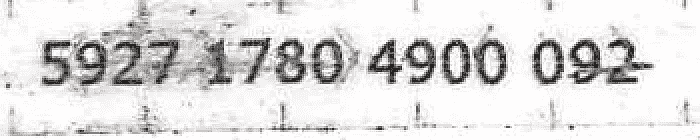**

**Figure 1\. Scanned numbers to OCR**

**概括来说，实现 OCR 的步骤以及每个任务或阶段中涉及的相应工作可以概括为:**

1.  ****图像处理寻找数字周围的边界框(25%)****
2.  ****从数字中提取数字，并创建一个训练/测试集(10%)****
3.  ****识别并应用合适的特征提取(梯度方向直方图)(35%)****
4.  ****实验并应用不同的机器学习算法(KNN vs SVM) (20%)****
5.  ****以有意义的方式展示数据(10%)****

# **自动视觉**

**在这篇博客中，我将详细介绍使用 **AutoML** 为同一问题创建 OCR 的步骤。如下图所示， **AutoML** 消除了我工作中的一项繁琐任务，即寻找并应用合适的特征提取和机器学习技术。该模型达到了 98%的准确率，略好于之前博客中的解决方案。**

**本项目使用的数据集可下载:[https://drive . Google . com/file/d/1 irpqo _ r V8 ygvz-hquq 0 hlpay 4 ed 7 wxfz/view？usp =分享](https://drive.google.com/file/d/1IRPQo_Rv8ygvz-hQuQ0HLpaY4ed7wXfZ/view?usp=sharing)**

**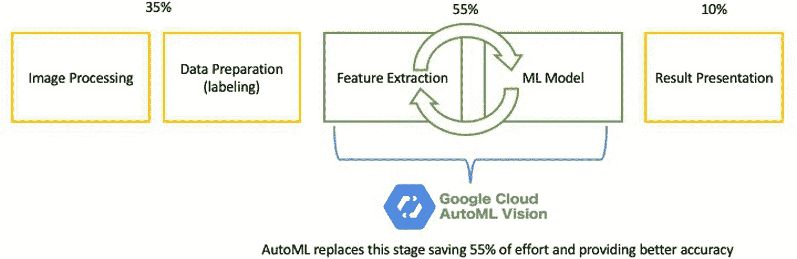**

**Figure 2\. Stages replaced by AutoML**

## **1 —图像处理:训练/测试数据集准备**

**概括一下我以前的博客，我的训练/测试集包括如下所示的数字(0、2、5、6 和 8 数据集的例子)。这些数字是从图 1 所示的扫描数字中提取的。**

**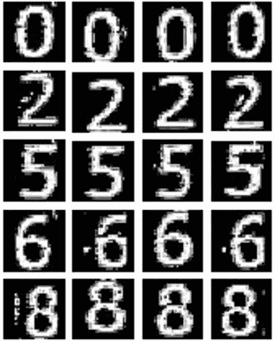**

**Figure 3\. Splitting numbers into single digits**

**然后，训练/测试数据集被组织在文件夹中，其中每个文件夹的名称代表存储在该文件夹中的数字的标签。**

**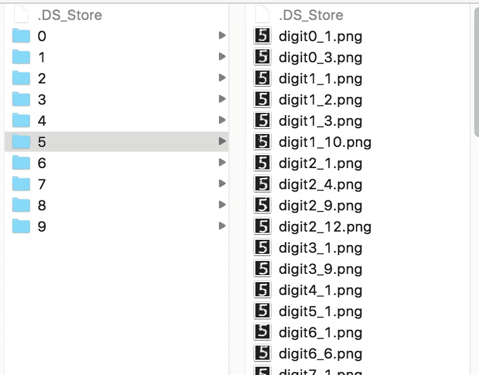****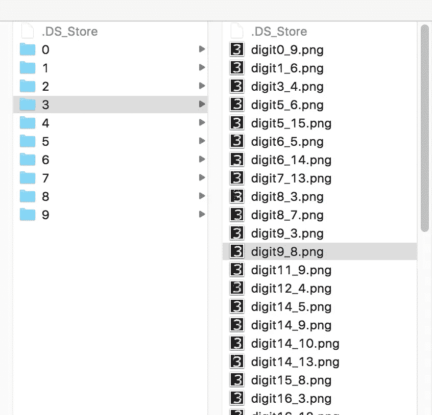**

**Figure 4\. Train / Test dataset sorted in folders**

## **2-训练/测试数据集上传**

**Google AutoML 提供了两个上传训练/测试数据集的选项。**

****选项 1** :上传数字并存储在 Google cloud 上，并提供一个 CSV 文件，列出每个数字的 URL 及其对应的标签。**

****选项 2** (我博客里用的):压缩包含数据集的文件夹，上传压缩文件。Google ML 假设每个文件夹的名称是存储在其中的数字的标签。**

**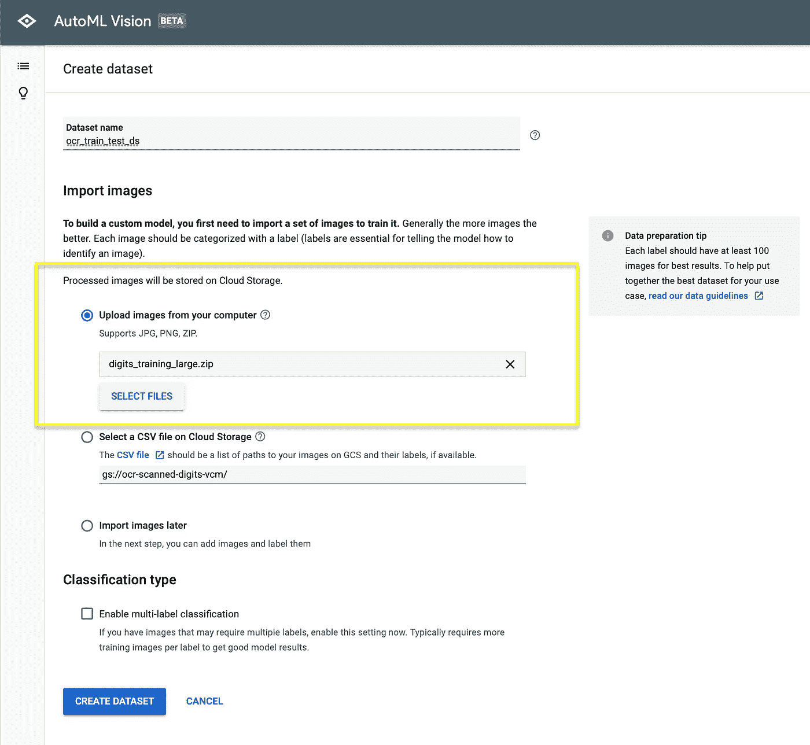**

**Figure 5\. Uploading train/test dataset to Google ML**

**AutoML 正确地识别了每个数字的标签(图 6)并提供了基本的数据集分析(图 7)，并准备好创建 ML 模型(或模型？)点击“开始训练”。**

**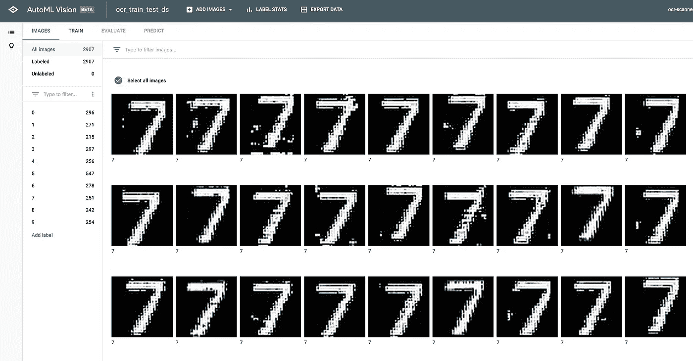**

**Figure 6\. Dataset uploaded and label identified**

**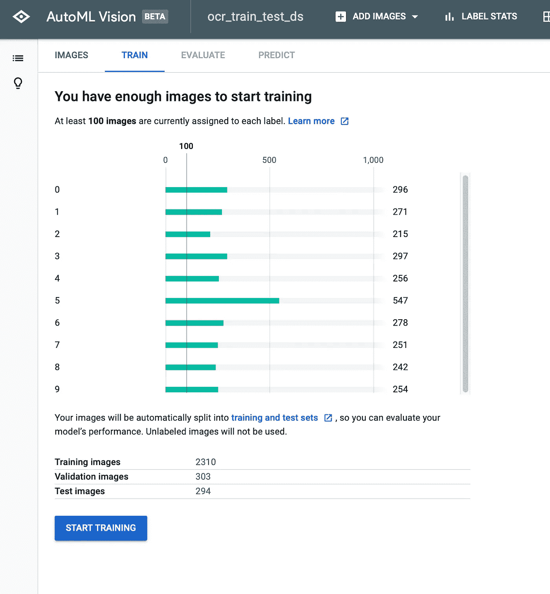**

**Figure 7\. Basic dataset analysis**

## **4 —模型精度**

**训练模型花了 15 分钟。ML 模型准确度/精度和混淆矩阵如下所示。**

**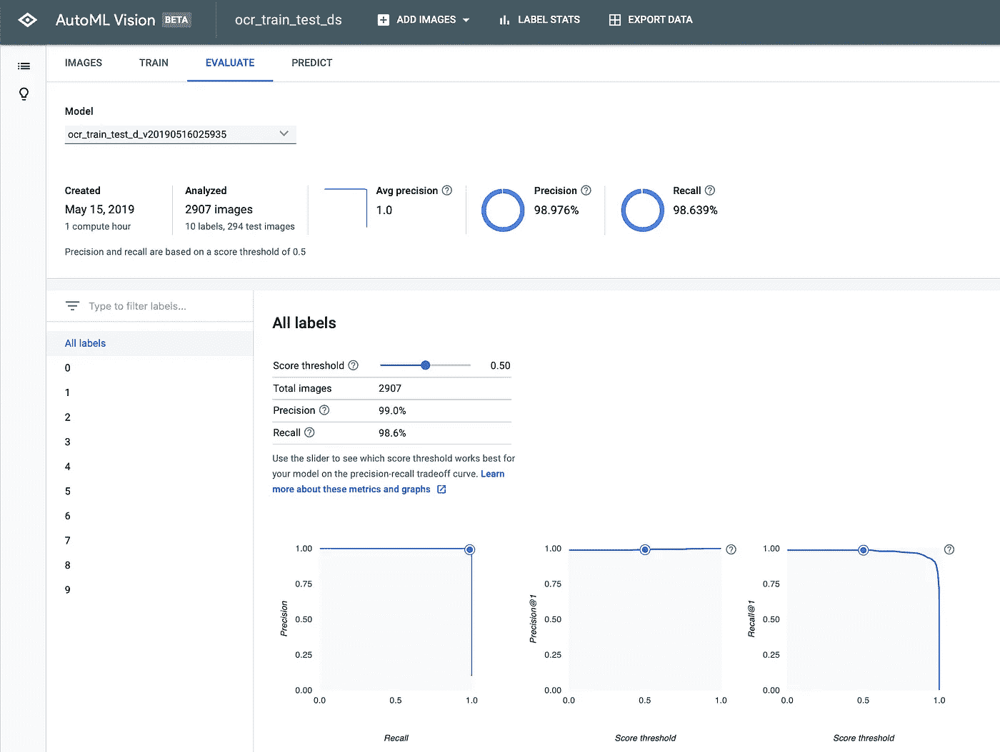**

**Figure 7\. Model accuracy**

## **5-混淆矩阵**

**混淆矩阵如下:**

*   **该模型能够以 100%的准确度(基于训练/测试数据集)预测数字(4、9、0、1、2 和 7)。**
*   **有 8.7%的几率会把 8 混淆为 6。**
*   **1.8%的几率会把 5 误认为 3。**
*   **有 2.9%的几率将 3 混淆为 5。**

**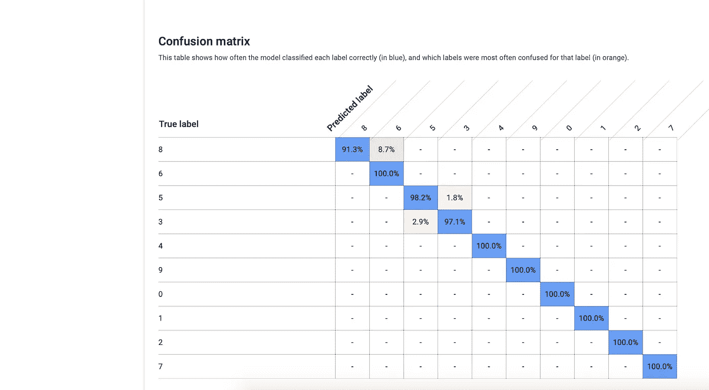**

**Figure 8\. Confusion matrix**

## **6 —预测**

**要测试模型，只需上传数字来运行预测，或者使用 Google 提供的 API(图 8)。**

**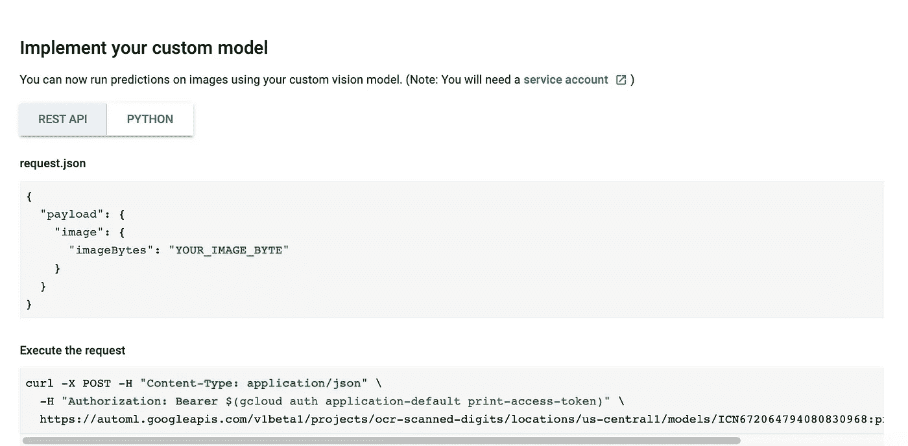**

**Figure 8\. ML model is exposed as an API and hosted on Google Cloud**

****正确预测:例 1****

**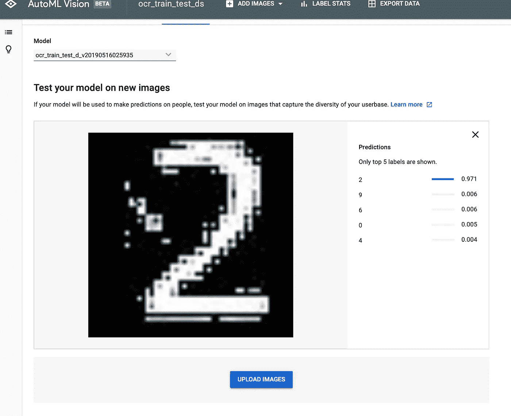**

**Figure 9\. Accurate prediction**

****正确预测:例二****

**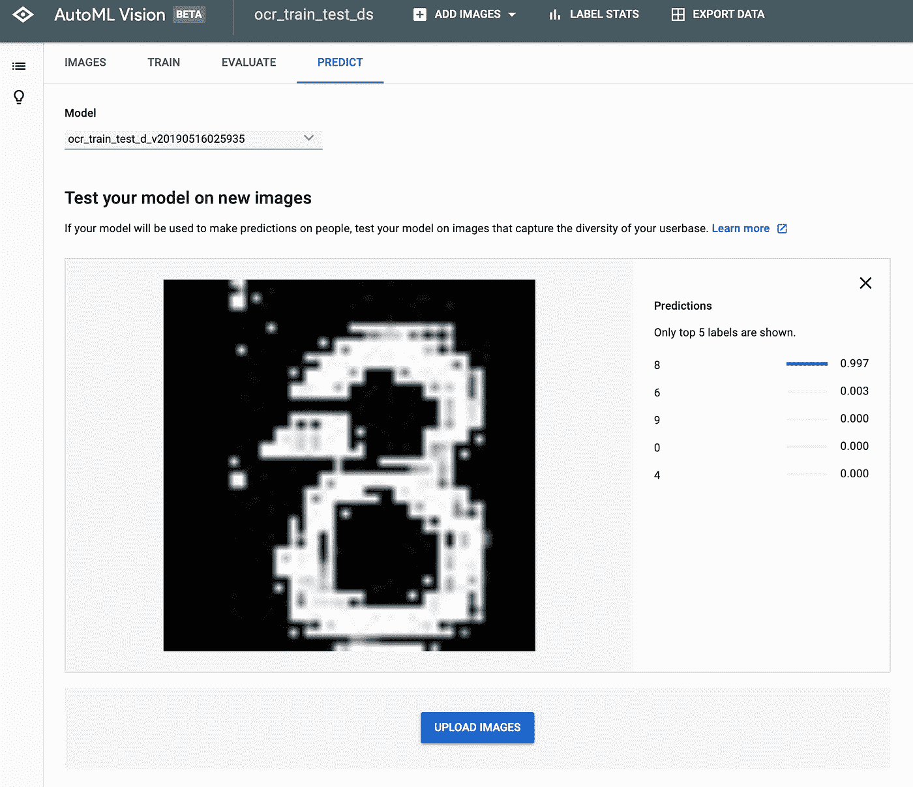**

**Figure 10\. Accurate prediction**

****错误预测:例 3****

**这是出乎意料的，该模型将 a 6 混淆为 A8，尽管混淆矩阵显示它可以 100%准确地预测 a 6。**

**作为未来的工作，我可能会训练第二个或更多的机器学习模型，每个模型都是为一对与第一个模型混淆的数字(即 6 和 8)量身定制的。我可能还会提供部分图像来训练模型，例如，只提供 6 位和 8 位数字的上半部分，因为这些数字在上象限大部分是不同的。**

****

**Figure 11\. Wrong prediction**

# **结束语**

**有趣的是看到 Google ML 如何自动化数据科学家的乏味工作，即寻找合适的特征提取技术和调整机器学习模型。然而，我认为数据科学家工作的困难部分实际上是确定可以使用机器学习解决的问题，最重要的是能够提取适合使用机器学习解决的数据集。后者需要扎实的编程技能和对不同机器学习技术如何工作的深刻理解。**