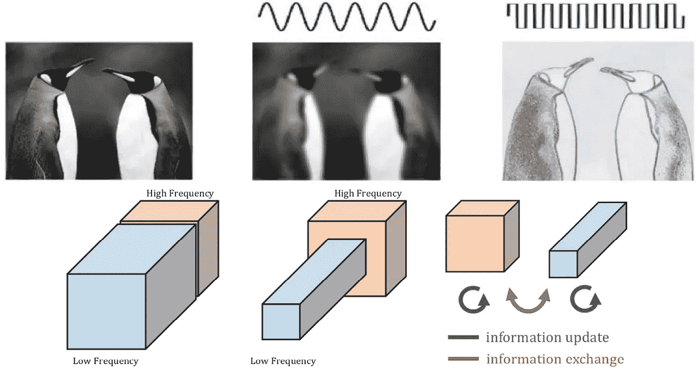
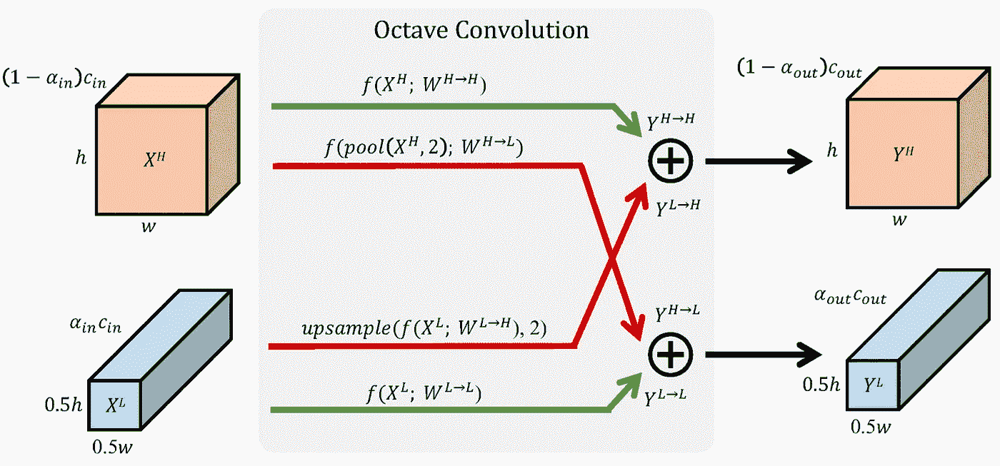

# 八度卷积:退一步看输入？

> 原文：<https://towardsdatascience.com/octave-convolution-taking-a-step-back-and-at-looking-inputs-235c313a362c?source=collection_archive---------19----------------------->

## 倍频程卷积的介绍、简要说明和详细 PyTorch 实现。

Figure from [here](https://arxiv.org/pdf/1904.05049.pdf)

卷积神经网络(CNN)已经主导了计算机视觉领域。在这篇文章中，我们将看看最近从这篇文章中提出的倍频程卷积:降低一个倍频程:[使用倍频程卷积](https://arxiv.org/pdf/1904.05049.pdf)减少卷积神经网络中的空间冗余。

倍频程卷积可以用来替代普通卷积。作者已经证明，使用倍频程卷积可以实现类似(有时更好)的精度，同时节省大量所需的触发器。八度和香草卷积的模型大小是相同的。

普通卷积在所有输入通道中执行高频卷积。另一方面，倍频程卷积将所有声道分为两部分:高频和低频。低频通道比高频卷积小一个倍频程(高度和宽度)。此外，在发送输出之前，高频和低频通道相互组合。

从图中可以看出，每个倍频程卷积模块内部最多可以有 4 个分支，每个分支执行普通卷积。绿色路径不会改变从输入到输出的空间维度。然而，红色路径会增加(从低到高)或减少(从高到低)从输入到输出的空间维度。

当从高频输入到低频输出(HtoL 路径)时，执行 2x2 合并操作，以获得用于卷积的缩减输入。所以，HtoL 路径是**conv _ 香草(pool(in_high))**

类似地，当从低频输入到高频输出(LtoH 路径)时，普通卷积以双线性插值为顶，以对低分辨率 conv 输出进行上采样。所以，LtoH 路径是**bilenear _ interpolation(vanilla _ convolution(in _ low))**。

Figure from [here](https://arxiv.org/pdf/1904.05049.pdf)

八度卷积的核心是α的概念(低频卷积使用的总通道的比率)。对于第一个卷积层，没有低频输入通道，所以α_{in} = 0。同样，对于最后一个卷积层，没有低频输出通道，α_{out} = 0。对于所有其他层，作者假设α_{in} = α_{out} = 0.5。

作者在论文中展示了大量结果。我觉得最有趣的一个如下图所示。如您所见，对于一小部分低频成分(0.125 或 0.25)，网络性能优于所有高频通道的基线模型。

Figure from [here](https://arxiv.org/pdf/1904.05049.pdf)

下面是 Pytorch 的实现。

完整的实现可以在我的 [git repo](https://github.com/amohant4/OctConv) 中找到。为了测试这个实现，我在 CIFAR10 上训练了一个 2 层的普通 CNN 大约 20 个时期。然后我把所有卷积都换成了八度卷积。网络表现稍好(2–3%)。我觉得，对于更大的网络，这种差异可能会更好。